# GCMC-KAJ Digital Transformation Platform - Architecture Documentation

> **Version:** 1.2.0
> **Last Updated:** 2025-11-19
> **Status:** Production Ready

This document provides comprehensive architectural documentation for the GCMC-KAJ Digital Transformation Platform, including system design, migration workflows, and technical implementation details.

---

## 📚 Table of Contents

- [System Overview](#system-overview)
- [Architecture Patterns](#architecture-patterns)
- [Core Infrastructure](#core-infrastructure)
- [Hybrid Migration Architecture](#hybrid-migration-architecture)
- [GRA/NIS Integration Architecture](#grinis-integration-architecture)
- [Dynamic Service Management](#dynamic-service-management)
- [Security Architecture](#security-architecture)
- [Data Architecture](#data-architecture)
- [Deployment Architecture](#deployment-architecture)
- [Scalability Considerations](#scalability-considerations)
- [Performance Optimizations](#performance-optimizations)

---

## 🏗 System Overview

### Digital Transformation Vision

The GCMC-KAJ platform represents a complete transformation from traditional file-based accounting practices to a modern digital ecosystem that seamlessly integrates with Guyana's government services while maintaining the flexibility to support both digital and traditional workflows during migration.

### High-Level Architecture

```mermaid
graph TB
    subgraph "Client Applications"
        WEB[Web Dashboard<br/>Next.js]
        PORTAL[Client Portal<br/>Next.js]
        MOBILE[Mobile App<br/>"Padna"]
    end

    subgraph "API Gateway & Services"
        API[API Server<br/>Hono + tRPC]
        WORKER[Background Worker<br/>BullMQ]
        FILEPROC[File Processing<br/>Document OCR]
    end

    subgraph "Core Data Layer"
        DB[(PostgreSQL<br/>Multi-tenant)]
        REDIS[(Redis<br/>Cache & Queues)]
        MINIO[(MinIO<br/>Document Storage)]
    end

    subgraph "Government Integration"
        GRA[GRA OPTIMAL<br/>eservices.gra.gov.gy]
        NIS[NIS eSchedule<br/>esched.nis.org.gy]
        DCRA[DCRA Registry]
        OTHERGOV[Other Agencies<br/>29 Total]
    end

    subgraph "External Services"
        EMAIL[Email Service]
        SMS[SMS Gateway]
        BACKUP[Backup Storage]
    end

    WEB --> API
    PORTAL --> API
    MOBILE --> API

    API --> DB
    API --> REDIS
    API --> MINIO
    API --> GRA
    API --> NIS
    API --> DCRA

    WORKER --> DB
    WORKER --> REDIS
    WORKER --> MINIO
    WORKER --> EMAIL
    WORKER --> SMS

    FILEPROC --> MINIO
    FILEPROC --> API

    style GRA fill:#e1f5fe
    style NIS fill:#e8f5e8
    style DCRA fill:#fff3e0
```

### Core Architecture Principles

1. **Hybrid-First Design**: Support both digital and traditional workflows
2. **Government Integration**: Direct connectivity to GRA/NIS systems
3. **Multi-Tenant Isolation**: Complete data separation between practices
4. **Event-Driven Architecture**: Real-time updates and notifications
5. **Microservices Pattern**: Modular, scalable service design
6. **Security by Design**: Enterprise-grade security throughout

---

## 🔄 Architecture Patterns

### 1. Hybrid Physical-Digital Pattern

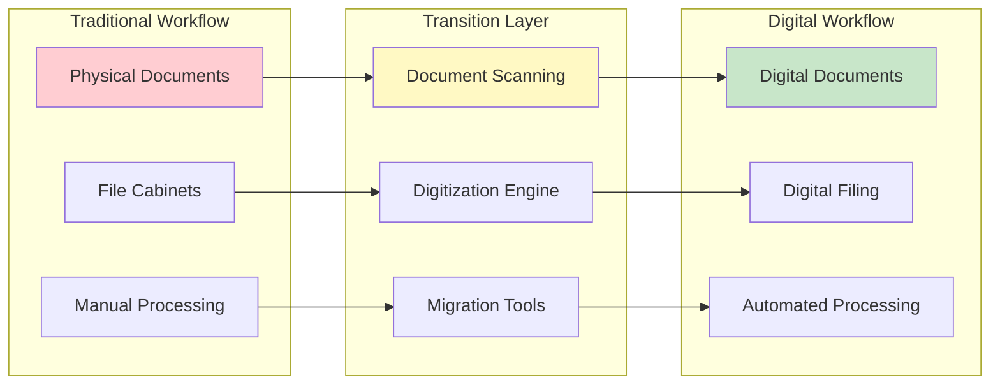

### 2. Multi-Tenant Architecture Pattern

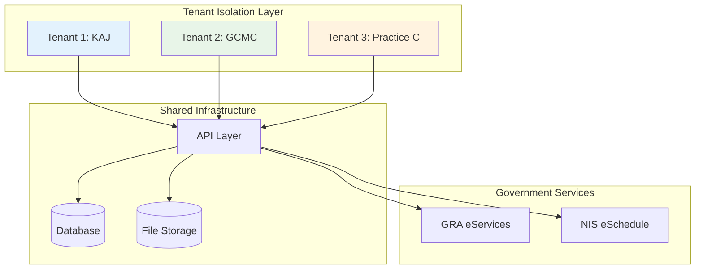

---

## 🏗 Core Infrastructure

### Application Services Architecture

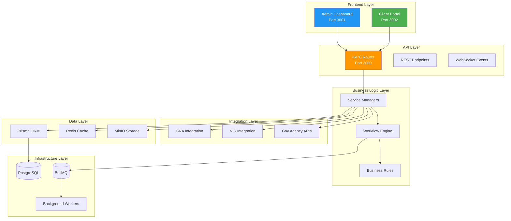

### Container Architecture

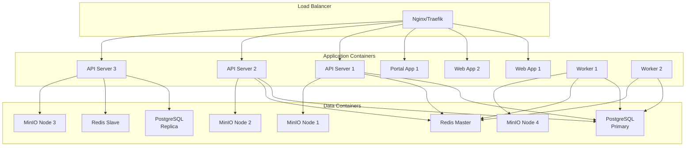

---

## 🔄 Hybrid Migration Architecture

### Migration Workflow Engine

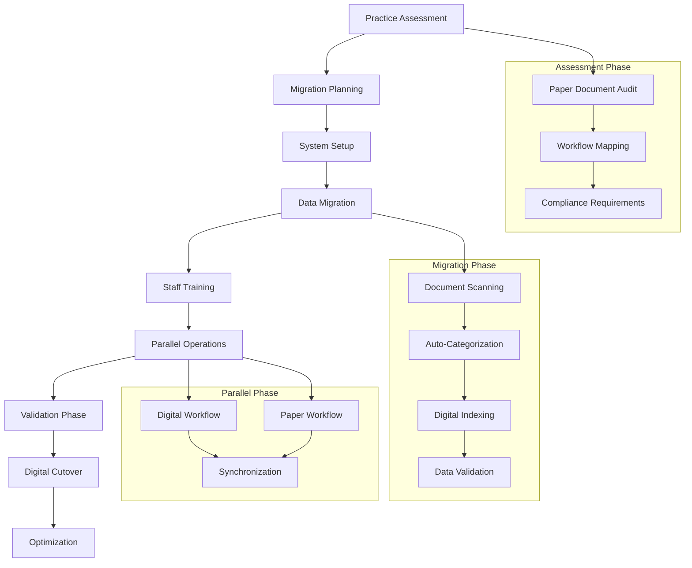

### Digital File Cabinet Organization

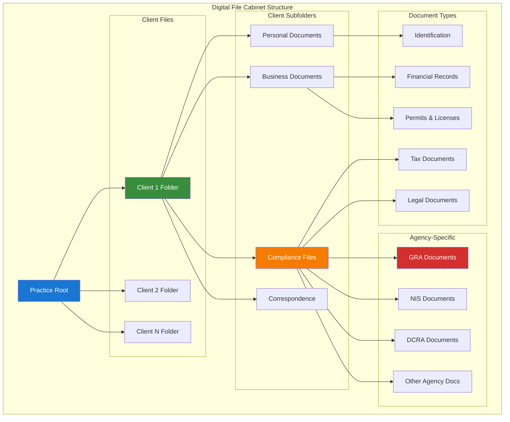

---

## 🏛 GRA/NIS Integration Architecture

### Government API Integration Flow

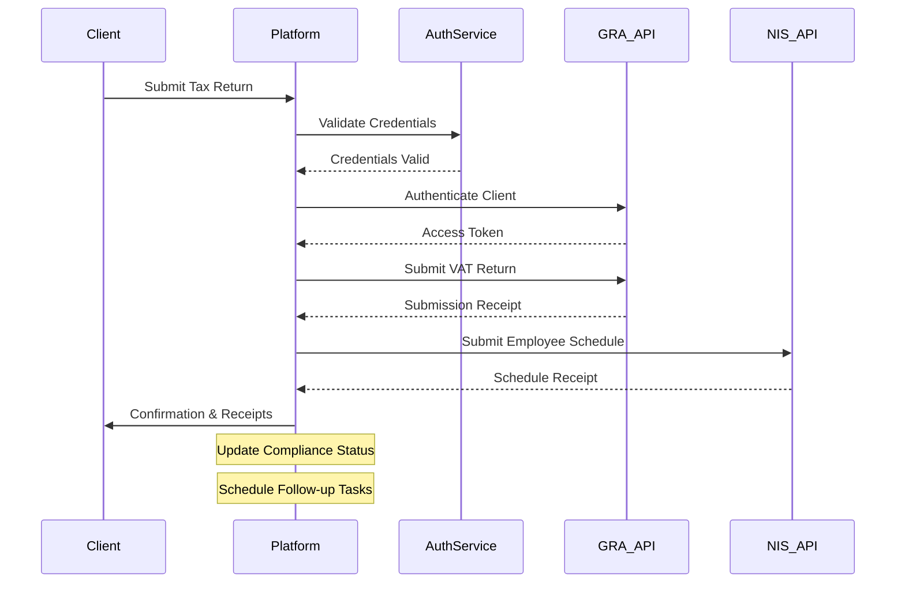

### Integration Security Model

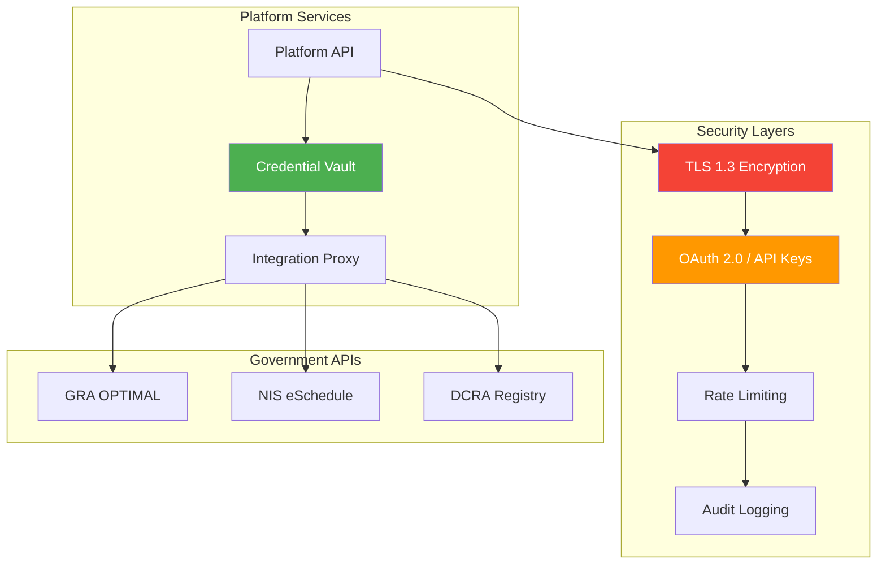

---

## 📦 Dynamic Service Management

### Service Package Architecture

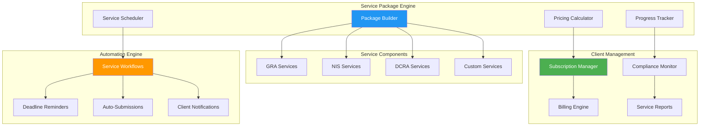

### Service Delivery Pipeline

```mermaid
flowchart LR
    subgraph "Service Request"
        REQUEST[Client Request]
        VALIDATE[Validation]
        ASSIGN[Assignment]
    end

    subgraph "Service Execution"
        PREP[Preparation]
        EXECUTE[Execution]
        REVIEW[Quality Review]
    end

    subgraph "Government Submission"
        FORMAT[Format Data]
        SUBMIT[Submit to Agency]
        TRACK[Track Status]
    end

    subgraph "Completion"
        NOTIFY[Notify Client]
        ARCHIVE[Archive Documents]
        INVOICE[Generate Invoice]
    end

    REQUEST --> VALIDATE
    VALIDATE --> ASSIGN
    ASSIGN --> PREP
    PREP --> EXECUTE
    EXECUTE --> REVIEW
    REVIEW --> FORMAT
    FORMAT --> SUBMIT
    SUBMIT --> TRACK
    TRACK --> NOTIFY
    NOTIFY --> ARCHIVE
    ARCHIVE --> INVOICE

    style REQUEST fill:#e3f2fd
    style SUBMIT fill:#ffebee
    style NOTIFY fill:#e8f5e8
```

---

## 🔐 Security Architecture

### Multi-Layer Security Model

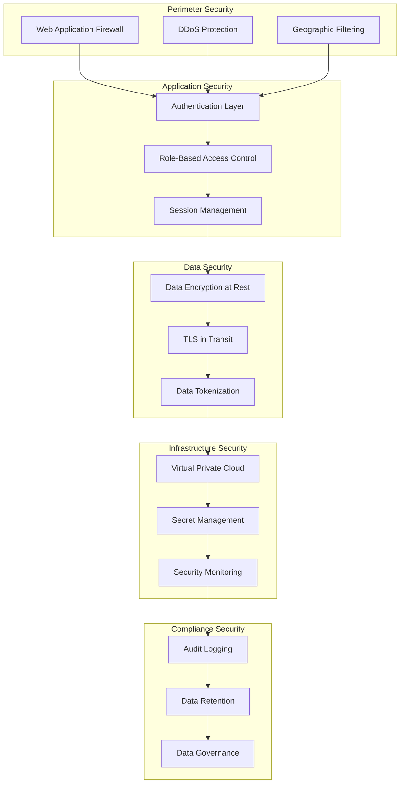

### RBAC Security Matrix

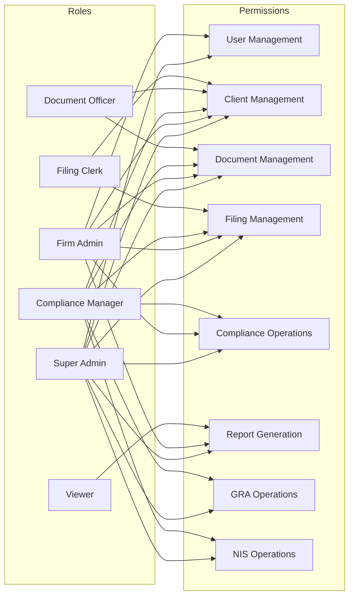

---

## 🗄 Data Architecture

### Multi-Tenant Database Design

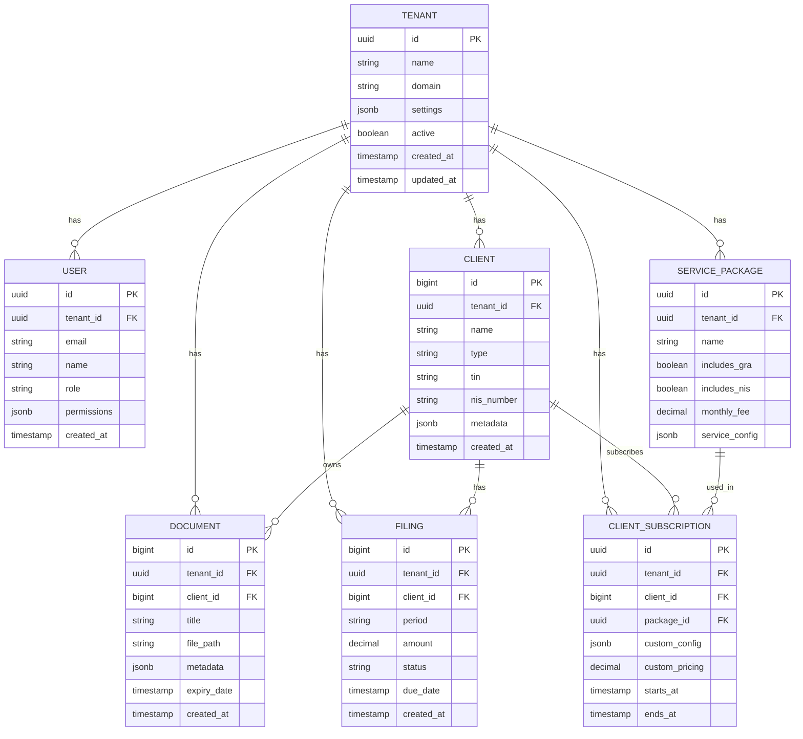

### Data Flow Architecture

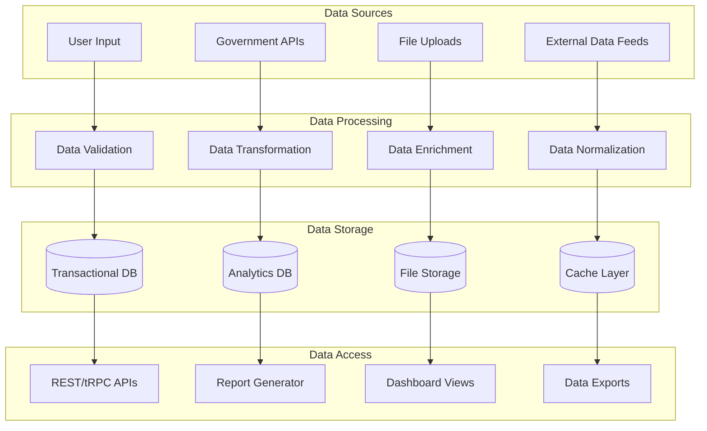

---

## 🚀 Deployment Architecture

### Production Deployment Topology

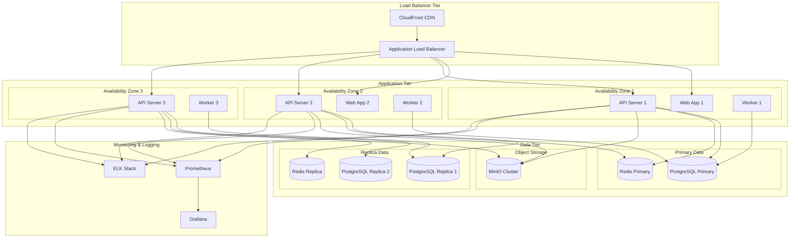

### Kubernetes Deployment Model

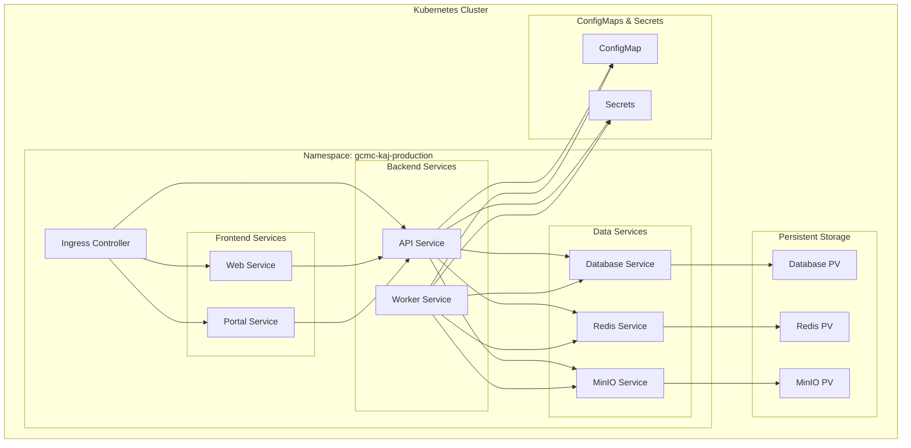

---

## 📈 Scalability Considerations

### Horizontal Scaling Strategy

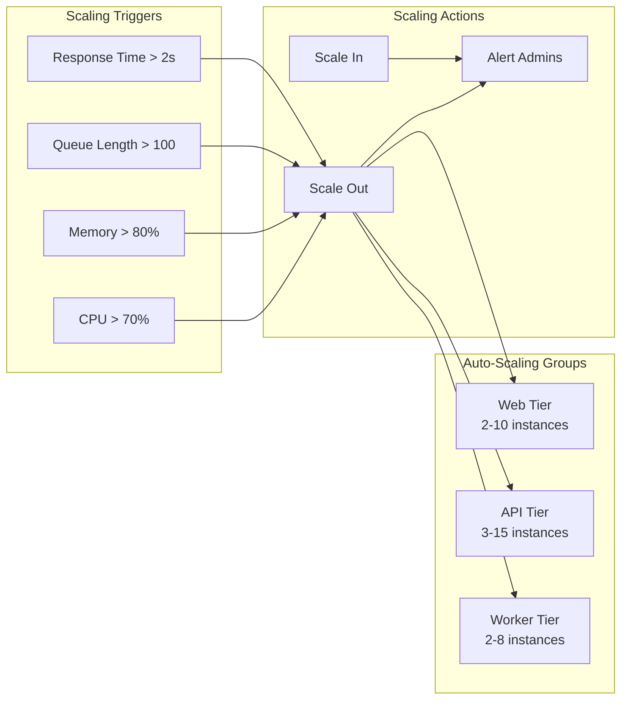

### Database Scaling Architecture

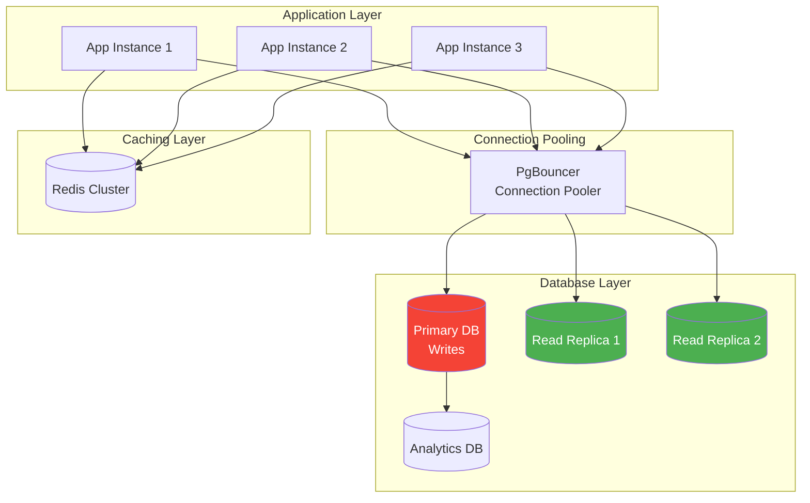

---

## ⚡ Performance Optimizations

### Caching Strategy

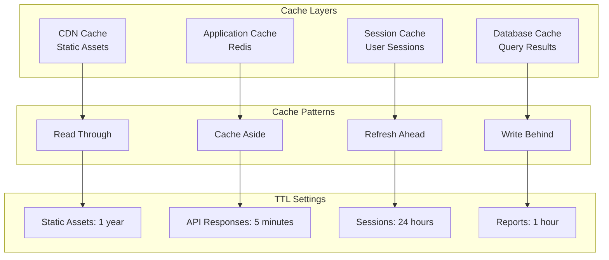

### Query Optimization Strategy

```mermaid
graph TB
    subgraph "Query Optimization"
        INDEX_STRATEGY[Index Strategy]
        QUERY_PLAN[Query Plan Analysis]
        PAGINATION[Efficient Pagination]
        BATCH_OPERATIONS[Batch Operations]
    end

    subgraph "Database Optimizations"
        PARTITIONING[Table Partitioning]
        MATERIALIZED_VIEWS[Materialized Views]
        CONNECTION_POOLING[Connection Pooling]
        VACUUM_STRATEGY[Auto Vacuum Strategy]
    end

    subgraph "Application Optimizations"
        EAGER_LOADING[Eager Loading]
        LAZY_LOADING[Lazy Loading]
        QUERY_BATCHING[Query Batching]
        RESULT_CACHING[Result Caching]
    end

    INDEX_STRATEGY --> PARTITIONING
    QUERY_PLAN --> MATERIALIZED_VIEWS
    PAGINATION --> CONNECTION_POOLING
    BATCH_OPERATIONS --> VACUUM_STRATEGY

    PARTITIONING --> EAGER_LOADING
    MATERIALIZED_VIEWS --> LAZY_LOADING
    CONNECTION_POOLING --> QUERY_BATCHING
    VACUUM_STRATEGY --> RESULT_CACHING
```

---

## 📊 Monitoring and Observability

### Comprehensive Monitoring Stack

```mermaid
graph TB
    subgraph "Metrics Collection"
        PROMETHEUS[Prometheus]
        APP_METRICS[Application Metrics]
        SYS_METRICS[System Metrics]
        BIZ_METRICS[Business Metrics]
    end

    subgraph "Visualization"
        GRAFANA[Grafana Dashboards]
        ALERTS[Alert Manager]
        REPORTS[Automated Reports]
    end

    subgraph "Log Aggregation"
        ELASTICSEARCH[Elasticsearch]
        LOGSTASH[Logstash]
        KIBANA[Kibana]
        FILEBEAT[Filebeat]
    end

    subgraph "Tracing"
        JAEGER[Jaeger Tracing]
        SPAN_COLLECTION[Span Collection]
        TRACE_ANALYSIS[Trace Analysis]
    end

    APP_METRICS --> PROMETHEUS
    SYS_METRICS --> PROMETHEUS
    BIZ_METRICS --> PROMETHEUS

    PROMETHEUS --> GRAFANA
    PROMETHEUS --> ALERTS
    GRAFANA --> REPORTS

    FILEBEAT --> LOGSTASH
    LOGSTASH --> ELASTICSEARCH
    ELASTICSEARCH --> KIBANA

    SPAN_COLLECTION --> JAEGER
    JAEGER --> TRACE_ANALYSIS
```

---

## 📋 Technical Specifications

### Technology Stack Summary

| Component | Technology | Version | Purpose |
|-----------|------------|---------|---------|
| **Runtime** | Bun | 1.0+ | JavaScript runtime and package manager |
| **Frontend** | Next.js | 14+ | React framework for web applications |
| **Backend** | Hono | 4+ | Web framework for API server |
| **API** | tRPC | 10+ | End-to-end typesafe APIs |
| **Database** | PostgreSQL | 16+ | Primary database |
| **ORM** | Prisma | 5+ | Database ORM and migrations |
| **Cache/Queue** | Redis | 7+ | Caching and job queues |
| **Storage** | MinIO | Latest | S3-compatible object storage |
| **Authentication** | Better-Auth | 1+ | Authentication and session management |
| **Background Jobs** | BullMQ | 4+ | Job queue and processing |
| **Monitoring** | Prometheus/Grafana | Latest | Metrics and monitoring |
| **Logging** | ELK Stack | Latest | Log aggregation and analysis |
| **Containerization** | Docker | 24+ | Application containerization |
| **Orchestration** | Kubernetes | 1.28+ | Container orchestration |

### Performance Targets

| Metric | Target | Measurement |
|--------|--------|-------------|
| **Response Time** | < 200ms | 95th percentile API responses |
| **Page Load** | < 2s | First contentful paint |
| **Throughput** | 1000+ req/s | Sustained API requests |
| **Availability** | 99.9% | Monthly uptime target |
| **Error Rate** | < 0.1% | Failed requests percentage |
| **Database Query** | < 50ms | 95th percentile query time |
| **File Upload** | < 10s | 100MB file upload time |
| **Report Generation** | < 30s | Complex PDF report generation |

---

## 🔍 Architecture Decision Records

### ADR-001: Hybrid Migration Architecture
- **Decision**: Implement dual-mode system supporting both digital and traditional workflows
- **Rationale**: Smooth transition for accounting practices with varying digital maturity
- **Consequences**: Increased complexity but better adoption rates

### ADR-002: Multi-Tenant Database Design
- **Decision**: Single database with tenant isolation via row-level security
- **Rationale**: Better resource utilization and easier maintenance than database-per-tenant
- **Consequences**: Requires careful security implementation but scales better

### ADR-003: tRPC for API Layer
- **Decision**: Use tRPC instead of REST for internal APIs
- **Rationale**: End-to-end type safety and better developer experience
- **Consequences**: Learning curve but significant productivity gains

### ADR-004: Event-Driven Architecture
- **Decision**: Implement event-driven patterns for compliance workflows
- **Rationale**: Better scalability and loose coupling between services
- **Consequences**: Increased complexity but improved reliability

---

**Architecture Documentation Version:** 1.2.0
**Last Updated:** 2025-11-19
**Status:** ✅ Production Ready

For technical questions or architecture discussions, contact: [architecture@gcmc-kaj.com](mailto:architecture@gcmc-kaj.com)