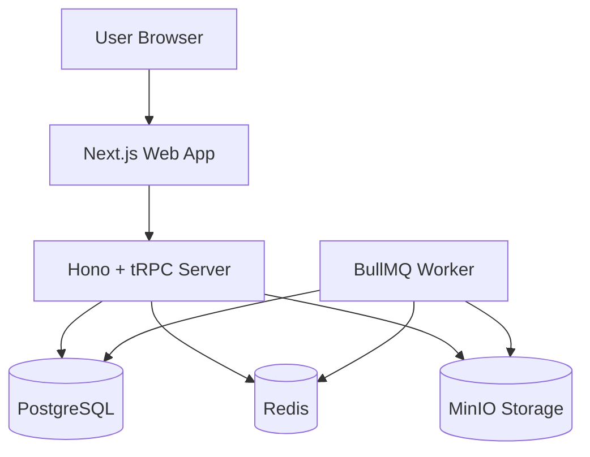
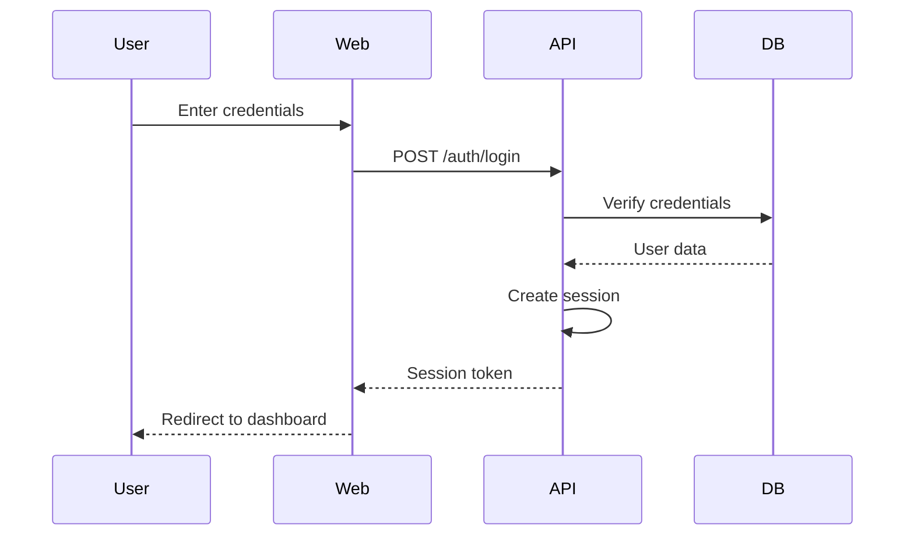
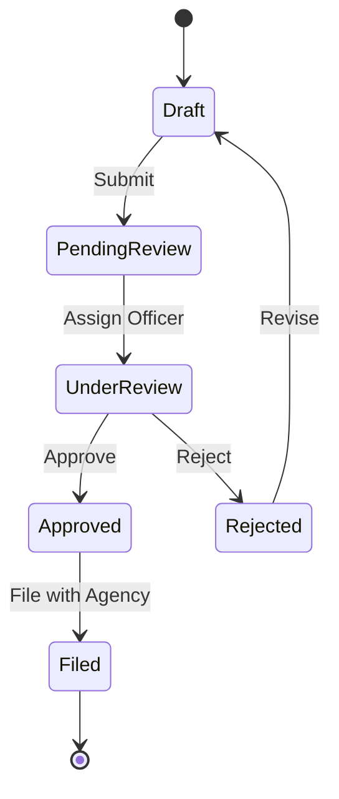

# 🧠 ENHANCED SUPER-MEGA CLAUDE CODE PROMPT WITH COMPREHENSIVE GUYANESE COMPLIANCE INTELLIGENCE
## *(Complete GRA/NIS/EPA Services • All 29 Government Agencies • Professional Licensing • Industry-Specific Compliance • Multi-Currency • Advanced Features)*

---

# 📋 COMPREHENSIVE BUSINESS REQUIREMENTS ENHANCEMENT

This document enhances the existing GCMC-KAJ Business Tax Services Platform with comprehensive details about all Guyanese government agencies, complete service requirements, advanced features, and industry-specific compliance needs.

## 🎯 PLATFORM TRANSFORMATION OVERVIEW

The GCMC-KAJ platform must evolve into a comprehensive Guyanese business compliance and tax services platform that handles:

1. **Complete GRA Services** - All tax types, filing frequencies, penalty structures
2. **Full NIS Services** - All contribution types, employer obligations, benefit calculations
3. **29 Government Agencies** - EPA, Ministry of Labour, GO-Invest, Professional Bodies, etc.
4. **Industry-Specific Compliance** - Mining, Oil & Gas, Tourism, Healthcare, etc.
5. **Advanced Platform Features** - Multi-currency, automation, AI-powered insights
6. **Professional Services** - Comprehensive business service categories

---

---

## 📚 TABLE OF CONTENTS

- [📋 Comprehensive Business Requirements Enhancement](#comprehensive-business-requirements-enhancement)
- [🎯 Platform Transformation Overview](#platform-transformation-overview)
- [🏛️ Complete GRA Services & Requirements](#complete-gra-services--requirements)
- [🛡️ Complete NIS Services & Compliance](#complete-nis-services--compliance)
- [🏢 All 29 Guyanese Government Agencies](#all-29-guyanese-government-agencies)
- [🎓 Professional Licensing Bodies](#professional-licensing-bodies)
- [🏭 Industry-Specific Compliance Requirements](#industry-specific-compliance-requirements)
- [💼 Advanced Business Service Categories](#advanced-business-service-categories)
- [🌍 Advanced Platform Features](#advanced-platform-features)
- [Part 1: System Context & High-Level Goals](#part-1-system-context--high-level-goals)
- [Part 2: Guyana-Specific Compliance Intelligence](#part-2-guyana-specific-compliance-intelligence)
- [Part 3: Full Action Phase Specification](#part-3-full-action-phase-specification)
- [Part 4: GUI Redesign & UX Spec](#part-4-gui-redesign--ux-spec)
- [Part 5: Backend Completion](#part-5-backend-completion)
- [Part 6: Guyana Agency Logic](#part-6-guyana-agency-logic)
- [Part 7: Frontend Overhaul](#part-7-frontend-overhaul)
- [Part 8: Advanced Enterprise UX](#part-8-advanced-enterprise-ux)
- [Part 9: Backend & Workers Refinement](#part-9-backend--workers-refinement)
- [Part 10: Frontend & E2E Testing](#part-10-frontend--e2e-testing)
- [Part 11: Deployment & CI/CD](#part-11-deployment--cicd)
- [Part 12: Final QA & Cleanup](#part-12-final-qa--cleanup)
- [Missing Pieces Checklist](#missing-pieces-checklist)
- [Non-Negotiable Behavior Rules](#non-negotiable-behavior-rules)
- [Definition of Done](#definition-of-done)

---

# 🏛️ COMPLETE GRA SERVICES & REQUIREMENTS

## Overview
The Guyana Revenue Authority (GRA) is the primary tax administration body responsible for administering and collecting all taxes including Income Tax, Value Added Tax (VAT), Pay As You Earn (PAYE), Excise Tax, Property Tax, Capital Gains Tax, and Customs Duties.

**Official Website:** [www.gra.gov.gy](https://www.gra.gov.gy)
**eServices Portal:** [eservices.gra.gov.gy](https://eservices.gra.gov.gy)
**Contact Email:** filing@gra.gov.gy

## 1. Tax Identification Number (TIN)

### Platform Requirements:
- **Form Type:** TIN Application Form
- **Processing Time:** 1-3 business days (online), Same day (in-person)
- **Fee:** No fee for TIN application
- **Dependencies:** Business must be registered with DCRA first

### Required Documents:
**For Individuals:**
- Valid identification (passport, national ID, driver's license)
- Proof of address
- Birth certificate (if applicable)

**For Organizations:**
- Certificate of Business Registration from DCRA
- Company incorporation documents
- Identification of directors/shareholders
- Proof of business address
- Articles of Association and Memorandum (for companies)

### Platform Integration Requirements:
```typescript
interface TINApplication {
  applicantType: 'individual' | 'business' | 'company';
  documents: DocumentUpload[];
  businessRegistration?: DCRARegistration;
  personalDetails: PersonalInfo;
  businessDetails?: BusinessInfo;
  expectedProcessingTime: ProcessingTime;
  dependencies: AgencyDependency[];
}
```

## 2. Value Added Tax (VAT)

### VAT Rates & Calculations:
- **Standard Rate:** 14% (subject to periodic reviews)
- **Zero Rate:** 0% (exports, certain medical supplies, educational materials)
- **Exempt Items:** Financial services, residential rent, certain agricultural products

### Registration Thresholds:
- **Mandatory:** G$15,000,000 annual taxable activity
- **Voluntary:** Below threshold with GRA approval

### Filing Requirements:
- **Frequency:** Monthly
- **Deadline:** 21st of following month
- **Method:** Online via eServices (preferred) or manual submission

### Penalty Structure:
```typescript
interface VATPenalty {
  lateFilingPenalty: {
    amount: 'G$1,000 per day' | '10% of tax due';
    calculation: 'whichever is greater';
    maximumPenalty: 'cannot exceed total taxes owed';
  };
  latePaymentPenalty: {
    rate: '2% per month';
    compounding: true;
  };
  criminalPenalties: {
    fine: 'up to G$15,000';
    imprisonment: '3 months (possible)';
  };
}
```

### Platform Integration Requirements:
```typescript
interface VATReturn {
  taxPeriod: DateRange;
  grossSales: CurrencyAmount;
  vatCollected: CalculatedAmount;
  inputVAT: CurrencyAmount;
  netVATPayable: CalculatedAmount;
  attachments: SupportingDocuments[];
  submissionMethod: 'eservices' | 'manual';
  penaltyCalculation: AutomatedPenaltyCalculation;
}
```

## 3. Pay As You Earn (PAYE)

### Employer Responsibilities:
- Deduct appropriate income tax from employees' salaries
- Remit combined employee deductions monthly
- Submit monthly and annual returns
- Maintain accurate payroll records

### Filing Schedule:
- **Monthly Forms:** Form 2 (due 14th of each month)
- **Annual Forms:** Form 5 (due April 30)

### Income Tax Threshold Changes (2024):
- Updated personal allowances and deductions
- Employers must implement changes in payroll systems
- Automatic calculation updates required in platform

### Platform Integration:
```typescript
interface PAYEReturn {
  employer: EmployerInfo;
  taxPeriod: DateRange;
  employees: EmployeePayrollData[];
  totalDeductions: CalculatedAmount;
  form2Data: Form2Data;
  form5Data?: Form5Data; // Annual only
  nisSynchronization: NISIntegration;
}
```

## 4. Corporate Tax

### Tax Rates:
- **Standard Rate:** 27-30% (verify current rate)
- **Small Business Rate:** Reduced rates may apply
- **Mining Companies:** Special rates apply

### Filing Requirements:
- **Annual Return:** Due April 30
- **Supporting Documents:** Complete financial statements, tax computation sheets
- **Quarterly Payments:** May be required for large corporations

### Platform Integration:
```typescript
interface CorporateTaxReturn {
  companyInfo: CompanyRegistration;
  financialYear: DateRange;
  financialStatements: AuditedStatements;
  taxComputation: TaxCalculationWorksheet;
  estimatedPayments: QuarterlyPayments[];
  carryForwardLosses?: PriorYearLosses;
}
```

## 5. Individual Income Tax

### Tax Brackets (2024-2025):
```typescript
interface IncomeTaxBrackets {
  personalAllowance: 780000; // G$780,000
  brackets: [
    { min: 0, max: 780000, rate: 0 },
    { min: 780000, max: 1560000, rate: 0.28 },
    { min: 1560000, max: Infinity, rate: 0.40 }
  ];
  allowances: {
    personal: 780000;
    medical: 150000;
    education: 75000;
  };
}
```

### Filing Requirements:
- **Deadline:** April 30 annually
- **Required Documents:** Income statements, deductible expenses receipts
- **Self-Employment:** Additional business income schedules

## 6. Capital Gains Tax

### Tax Rate: 20% of net chargeable gains

### Exemptions:
- Gains treated as profit/income under Income Tax Act
- Transactions over 25 years after asset acquisition
- Gains received within 12 months after change of ownership
- Gains not exceeding G$500,000

### Platform Integration:
```typescript
interface CapitalGainsCalculation {
  assetType: 'property' | 'shares' | 'business_assets';
  acquisitionDate: Date;
  acquisitionCost: CurrencyAmount;
  disposalDate: Date;
  disposalProceeds: CurrencyAmount;
  exemptionCheck: ExemptionValidation;
  netGain: CalculatedAmount;
  taxDue: CalculatedAmount;
}
```

## 7. Property Tax

### Overview:
- Payable on net property held at December 31 each year
- Progressive rates apply
- Deduct liabilities from total property value

## 8. Withholding Tax

### Rates: 10%-15% on payments to non-residents
### Applications:
- Services payments
- Royalties, Interest, Dividends
- Management fees

### Filing: Monthly returns due 14th of each month

## 9. Excise Tax

### Taxable Products:
- Alcoholic beverages
- Tobacco products
- Petroleum products
- Motor vehicles

## 10. Trade & Miscellaneous Licenses

### Required Documents:
- Approved building permit
- Fire safety certificate
- Sanitary certificates
- TIN, Business registration certificate

### Locations:
- Smyth and Princes Streets, Georgetown
- Railway Embankment (Camp & Lamaha Streets)

## 11. Certificate of Compliance

### Purpose: Proof that all tax returns filed and taxes paid
### Required For:
- Property transactions (Deeds Registry requirement)
- Government contracts and tenders
- Business transactions requiring tax clearance

### Eligibility Criteria:
1. Valid TIN
2. Returns filed for past 3 years
3. All taxes paid or satisfactory arrangements made

### Taxes Covered:
- Customs Duties, Income Tax, PAYE, Excise Tax, VAT, Property Tax

## Platform Implementation Requirements

### 1. Automated Tax Calculations
```typescript
interface TaxCalculationEngine {
  vatCalculation: (grossSales: number, vatType: VATType) => VATResult;
  incomeTaxCalculation: (income: number, allowances: Allowances) => IncomeTaxResult;
  payeCalculation: (salary: number, period: PayPeriod) => PAYEResult;
  capitalGainsCalculation: (asset: Asset, disposal: Disposal) => CapitalGainsResult;
  penaltyCalculation: (taxType: TaxType, dueDate: Date, currentDate: Date) => PenaltyResult;
}
```

### 2. Compliance Monitoring
```typescript
interface ComplianceMonitor {
  upcomingDeadlines: DeadlineAlert[];
  overdueFilings: OverdueAlert[];
  penaltyWarnings: PenaltyWarning[];
  complianceStatus: ComplianceStatus;
  certificateEligibility: CertificateEligibilityCheck;
}
```

### 3. Multi-Period Tracking
```typescript
interface PeriodTracking {
  monthlyObligations: MonthlyTaxObligation[];
  quarterlyObligations: QuarterlyTaxObligation[];
  annualObligations: AnnualTaxObligation[];
  crossPeriodValidation: PeriodValidation;
}
```

---

# 🛡️ COMPLETE NIS SERVICES & COMPLIANCE

## Overview
The National Insurance Scheme (NIS) provides social security coverage for workers in Guyana through a comprehensive system of contributions and benefits.

**Website:** [www.nis.org.gy](https://www.nis.org.gy)
**eSchedule Portal:** [esched.nis.org.gy](https://esched.nis.org.gy)

## 1. Employer Registration

### Process:
1. Present DCRA Certificate + GRA TIN
2. Complete Form R1 (Employer Registration)
3. Provide business details and expected employee count
4. Submit to NIS office
5. Receive NIS employer registration number

### Processing Time: ~1 week

### Platform Integration:
```typescript
interface NISEmployerRegistration {
  businessRegistration: DCRADocument;
  taxIdentification: GRATINDocument;
  businessDetails: BusinessInfo;
  expectedEmployeeCount: number;
  registrationForm: FormR1;
  processingStatus: RegistrationStatus;
}
```

## 2. Contribution Types and Rates

### Standard Contributions (2024):
```typescript
interface NISContributionRates {
  employeeRate: 0.056; // 5.6%
  employerRate: 0.072; // 7.2%
  totalRate: 0.128; // 12.8%
  maximumWage: number; // Updated annually
  minimumWage: number; // Updated annually
}
```

### Self-Employed Contributions:
```typescript
interface SelfEmployedContributions {
  voluntaryRate: 0.128; // 12.8% of declared income
  minimumContribution: number; // Based on minimum wage
  maximumContribution: number; // Based on maximum wage
}
```

## 3. Monthly Employer Obligations

### Contribution Schedules:
- **Due Date:** Last working day of each month
- **Method:** Online via eSchedule or manual submission
- **Required Information:** Employee details, wages, deductions

### Platform Integration:
```typescript
interface MonthlyNISSchedule {
  employer: EmployerInfo;
  payPeriod: DateRange;
  employees: EmployeeContribution[];
  totalEmployeeContributions: CalculatedAmount;
  totalEmployerContributions: CalculatedAmount;
  totalAmount: CalculatedAmount;
  submissionMethod: 'eSchedule' | 'manual';
  paymentStatus: PaymentStatus;
}

interface EmployeeContribution {
  employeeId: string;
  name: string;
  nisNumber: string;
  grossWages: CurrencyAmount;
  employeeContribution: CalculatedAmount;
  employerContribution: CalculatedAmount;
}
```

## 4. Annual Requirements

### Annual Return:
- **Due Date:** January 31 of following year
- **Content:** Reconciliation of all monthly schedules
- **Supporting Documents:** Payroll summaries, contribution reconciliation

### Platform Integration:
```typescript
interface NISAnnualReturn {
  employer: EmployerInfo;
  year: number;
  monthlySchedulesSummary: MonthlyScheduleSummary[];
  totalContributions: AnnualContributionSummary;
  reconciliation: ContributionReconciliation;
  discrepancies?: Discrepancy[];
}
```

## 5. Employee Benefits Administration

### Short-Term Benefits:
- **Sickness Benefit:** 60% of average weekly wage
- **Maternity Grant:** Lump sum payment
- **Maternity Allowance:** Weekly payments for 13 weeks
- **Funeral Grant:** Death benefit

### Long-Term Benefits:
- **Old Age Pension:** Monthly pension from age 60
- **Invalidity Pension:** For permanent disability
- **Survivors' Pension:** For dependents of deceased contributors

### Platform Integration:
```typescript
interface BenefitCalculation {
  benefitType: NISBenefitType;
  eligibilityCheck: EligibilityValidation;
  contributionHistory: ContributionRecord[];
  averageWage: CalculatedAmount;
  benefitAmount: CalculatedAmount;
  qualifyingConditions: QualifyingCondition[];
}
```

## 6. Compliance Reporting

### Employer Compliance Requirements:
- Accurate record keeping of all wages and contributions
- Timely submission of monthly schedules
- Annual reconciliation and return filing
- Employee registration for new hires

### Penalty Structure:
```typescript
interface NISPenalties {
  lateSubmission: {
    rate: 'percentage of contributions due';
    minimumPenalty: number;
  };
  latePayment: {
    interestRate: 'monthly rate on outstanding amount';
    compounding: true;
  };
  nonCompliance: {
    employeeBenefitRisk: 'employees cannot claim benefits';
    legalAction: 'potential prosecution';
  };
}
```

## 7. Integration with Other Agencies

### GRA Integration:
- PAYE calculations must consider NIS contributions
- Tax compliance certificates require NIS compliance
- Coordinated employer obligations

### Platform Synchronization:
```typescript
interface CrossAgencySync {
  graIntegration: {
    payeReconciliation: PAYENISReconciliation;
    complianceCertificate: ComplianceCertificateRequirement;
  };
  dcraIntegration: {
    employerRegistration: EmployerRegistrationSync;
    annualReturnCrossDependency: AnnualReturnDependency;
  };
}
```

---

# 🏢 ALL 29 GUYANESE GOVERNMENT AGENCIES

## Primary Agencies (Core Business Registration & Tax)

### 1. DCRA - Deeds and Commercial Registry Authority
- **Function:** Business registration, company incorporation, property registration
- **Services:** Business name registration, annual returns, beneficial ownership declarations
- **Integration Requirements:** Foundation dependency for all other agency registrations

### 2. GRA - Guyana Revenue Authority
- **Function:** Tax administration and revenue collection
- **Services:** All tax types, trade licenses, compliance certificates
- **Integration Requirements:** Core tax calculation engine, penalty management

### 3. NIS - National Insurance Scheme
- **Function:** Social security and employee benefits
- **Services:** Employer registration, contribution collection, benefit administration
- **Integration Requirements:** Payroll integration, benefit calculations

## Environmental & Safety Agencies

### 4. EPA - Environmental Protection Agency
- **Function:** Environmental protection and monitoring
- **Services:** Environmental permits, impact assessments, compliance monitoring

#### EPA Platform Requirements:
```typescript
interface EPAPermit {
  permitType: 'environmental_authorization' | 'construction' | 'operating';
  applicationFee: { amount: 50, currency: 'USD' }; // or GYD equivalent
  requiredDocuments: [
    'land_ownership_proof',
    'sector_agency_permit',
    'local_authority_no_objection',
    'village_council_approval', // if Amerindian lands
    'land_use_suitability_letter'
  ];
  processingTime: 'standard' | 'eia_required'; // Extended if EIA needed
  validity: '5 years maximum';
  conditions: EnvironmentalCondition[];
}
```

#### Environmental Impact Assessment (EIA) Requirements:
- Projects with significant environmental impact
- Public consultation required
- Extended processing timeline
- Specialist environmental reports

### 5. GSB - Guyana Standards Bureau
- **Function:** Standards development and certification
- **Services:** Product certification, quality standards, testing services

## Financial & Investment Agencies

### 6. BOG - Bank of Guyana
- **Function:** Central banking and financial regulation
- **Services:** Banking licenses, foreign exchange, monetary policy

#### BOG Platform Requirements:
```typescript
interface BankingLicense {
  licenseType: 'commercial_bank' | 'credit_union' | 'insurance' | 'cambio';
  capitalRequirements: CurrencyAmount;
  fitAndProperTest: DirectorValidation[];
  complianceFramework: RegulatoryCompliance;
  ongoingReporting: RegularReportingRequirement[];
}
```

### 7. GoInvest - Guyana Office for Investment
- **Function:** Investment promotion and facilitation
- **Services:** Investment incentives, business facilitation, investor support

#### GO-Invest Platform Requirements:
```typescript
interface InvestmentIncentive {
  sector: 'agriculture' | 'manufacturing' | 'tourism' | 'energy' | 'ict';
  incentiveType: 'tax_holiday' | 'duty_exemption' | 'accelerated_depreciation';
  eligibilityCriteria: InvestmentCriteria[];
  applicationProcess: IncentiveApplication;
  priority2024: ['agriculture', 'renewable_energy', 'infrastructure', 'tourism'];
}
```

### 8. CFU - Cooperative Financial Union
- **Function:** Cooperative financial services oversight
- **Services:** Credit union regulation, cooperative banking

## Labor & Immigration

### 9. MOL - Ministry of Labour
- **Function:** Labor relations and employment authorization
- **Services:** Work permit support, employment regulations, labor disputes

#### Work Permit Integration:
```typescript
interface WorkPermitSupport {
  employerVerification: EmployerComplianceCheck;
  jobValidation: PositionJustification;
  laborMarketTest: LocalAvailabilityCheck;
  supportingDocuments: MOLSupportingDocs[];
}
```

### 10. Immigration - Department of Citizenship and Immigration
- **Function:** Immigration control and citizenship services
- **Services:** Work permits, visas, citizenship applications

#### Work Permit Platform Requirements:
```typescript
interface WorkPermitApplication {
  applicantDetails: ForeignNationalInfo;
  employerDetails: LocalEmployerInfo;
  jobDetails: PositionSpecification;
  requiredDocuments: [
    'passport',
    'employment_contract',
    'qualifications_proof',
    'police_clearance',
    'medical_certificate'
  ];
  processingTime: '2-4 weeks';
  validity: '1-3 years';
  renewalProcess: PermitRenewalRequirement;
  fees: 'GYD 20,000-50,000';
}
```

## Utilities & Infrastructure

### 11. GWI - Guyana Water Inc
- **Function:** Water supply and treatment
- **Services:** Water connections, quality monitoring, billing

### 12. GPL - Guyana Power and Light
- **Function:** Electrical power generation and distribution
- **Services:** Power connections, grid management, energy regulation

### 13. NDIA - National Drainage and Irrigation Authority
- **Function:** Water management and drainage
- **Services:** Drainage permits, flood control, irrigation systems

## Natural Resources

### 14. GGMC - Guyana Geology and Mines Commission
- **Function:** Mining regulation and geological services
- **Services:** Mining licenses, geological surveys, mineral exploration permits

#### Mining Platform Requirements:
```typescript
interface MiningPermit {
  scaleType: 'small' | 'medium' | 'large';
  permitType: 'prospecting' | 'mining' | 'quarry';
  mineralsTargeted: string[];
  environmentalClearance: EPAPermit;
  landRights: LandUseAgreement;
  fees: MiningFeeStructure;
  reportingRequirements: MiningReportingSchedule;
}
```

### 15. FORESTRY - Guyana Forestry Commission
- **Function:** Forest management and conservation
- **Services:** Logging permits, timber licenses, forest conservation

#### Forestry Platform Requirements:
```typescript
interface ForestryLicense {
  licenseType: 'sawmill' | 'timber_dealer' | 'lumber_yard' | 'sawpit';
  renewalDeadline: 'December 31 annually';
  requiredDocuments: [
    'tin_certificate',
    'property_ownership_proof',
    'ndc_permit', // if applicable
    'epa_permit', // for sawmill/timber dealer
    'chainsaw_details' // for sawpit
  ];
  complianceRequirements: ForestryComplianceCheck[];
}
```

### 16. GuyOil - GuyOil Company Limited
- **Function:** Petroleum products and energy
- **Services:** Fuel distribution, petroleum licensing

### 17. AGRICULTURE - Ministry of Agriculture
- **Function:** Agricultural development and regulation
- **Services:** Agricultural licenses, farming permits, food safety

## Transportation

### 18. MARAD - Maritime Administration Department
- **Function:** Maritime safety and regulation
- **Services:** Vessel registration, maritime licenses, port operations

### 19. GCAA - Guyana Civil Aviation Authority
- **Function:** Aviation safety and regulation
- **Services:** Aircraft registration, pilot licensing, airport operations

### 20. TRANSPORT - Transport and Harbours Department
- **Function:** Land and water transportation
- **Services:** Vehicle registration, driver licensing, transport permits

## Tourism & Gaming

### 21. TOURISM - Guyana Tourism Authority
- **Function:** Tourism development and regulation
- **Services:** Tourism business licensing, hotel certification, tour guide licensing

#### Tourism Platform Requirements:
```typescript
interface TourismLicense {
  businessType: 'accommodation' | 'tour_operator' | 'tour_guide' | 'interior_lodge';
  licensingStatus: '78 businesses licensed as of 2024';
  targetCompliance: '100 businesses by end 2024';
  standards: [
    'tour_operator_code',
    'tour_guide_code',
    'bed_breakfast_code',
    'restaurant_quality_code',
    'hotel_grading_system'
  ];
  clinics: 'Georgetown and interior regions';
}
```

### 22. GGB - Guyana Gaming Board
- **Function:** Gaming and gambling regulation
- **Services:** Casino licenses, gaming permits, lottery oversight

## Law Enforcement & Security

### 23. GPF - Guyana Police Force
- **Function:** Law enforcement and public safety
- **Services:** Security clearances, firearm licenses, criminal background checks

## Social Services

### 24. MOH - Ministry of Health
- **Function:** Public health and medical regulation
- **Services:** Health permits, medical licenses, health certificates

### 25. EDUCATION - Ministry of Education
- **Function:** Educational services and regulation
- **Services:** Educational institution licensing, professional certifications

### 26. SOCIAL_SERVICES - Ministry of Human Services
- **Function:** Social welfare and community services
- **Services:** Social service permits, community program oversight

## Regional & International

### 27. CARICOM - Caribbean Community Secretariat
- **Function:** Regional integration and trade
- **Services:** CARICOM certificates, regional trade permits

### 28. CUSTOMS - GRA Customs Division
- **Function:** Import/export regulation and control
- **Services:** Import permits, customs clearance, trade documentation

### 29. LANDS - Lands and Surveys Commission
- **Function:** Land administration and surveying
- **Services:** Land titles, surveying permits, mapping services

## Platform Integration Architecture

### Cross-Agency Dependencies:
```typescript
interface AgencyDependencyMatrix {
  dcra_first: ['GRA', 'NIS', 'ALL_LICENSES'];
  gra_tin_required: ['NIS', 'TRADE_LICENSES', 'EPA', 'TOURISM'];
  nis_employer_registration: ['TRADE_LICENSES', 'COMPLIANCE_CERTIFICATES'];
  epa_environmental_clearance: ['MINING', 'FORESTRY', 'MANUFACTURING'];
  professional_licensing: ['MEDICAL', 'LEGAL', 'ENGINEERING', 'ACCOUNTING'];
}
```

### Multi-Agency Workflow Engine:
```typescript
interface MultiAgencyWorkflow {
  sequentialDependencies: AgencySequence[];
  parallelProcessing: AgencyParallel[];
  conditionalRouting: ConditionalAgencyRouting[];
  complianceAggregation: CrossAgencyCompliance;
  documentSharing: InterAgencyDocumentSharing;
}
```

---

# 🎓 PROFESSIONAL LICENSING BODIES

## 1. Legal Professionals

### Guyana Bar Association
- **Requirements:** Guyanese nationality, Legal Education Certificate, or special authorization
- **Process:** Petition to High Court for admission to the bar
- **Regulation:** Legal Practitioners Act (last amended 2010)
- **Foreign Lawyers:** Require Minister of Legal Affairs order

### Platform Requirements:
```typescript
interface LegalPractitionerLicense {
  nationality: 'guyanese_required';
  qualification: 'legal_education_certificate' | 'special_authorization';
  admissionProcess: 'high_court_petition';
  foreignPractitioner: {
    required: 'minister_of_legal_affairs_order';
    process: 'special_application';
  };
  regulatoryBody: 'guyana_bar_association';
  complianceRequirements: LegalComplianceCheck[];
}
```

## 2. Medical Professionals

### Medical Council of Guyana
- **Foreign-Trained Requirements:** ECFMG verification for non-Guyana qualifications
- **Documentation:** Medical Registration Certificates (valid within 90 days)
- **Language:** All foreign documents must be translated to English
- **Fees:** Payable to Republic Bank Limited

### Platform Requirements:
```typescript
interface MedicalPractitionerLicense {
  qualification: 'local' | 'foreign';
  foreignRequirements: {
    verification: 'ECFMG_member_intealth';
    translation: 'english_by_recognized_institute';
    validityPeriod: '90_days_for_registration_certificates';
  };
  paymentMethod: 'republic_bank_limited';
  ongoingRequirements: MedicalComplianceRequirement[];
  specialtyRegistration?: MedicalSpecialtyRequirement;
}
```

## 3. Accounting Professionals

### Institute of Chartered Accountants Guyana
- **Membership:** Open to Guyanese citizens
- **Regulation:** Institute of Chartered Accountants Act
- **Council:** Regulatory oversight body

### Platform Requirements:
```typescript
interface AccountingPractitionerLicense {
  citizenship: 'guyanese_required';
  qualification: 'chartered_accountant_certification';
  membershipBody: 'institute_chartered_accountants_guyana';
  regulatoryFramework: 'institute_of_chartered_accountants_act';
  continuingEducation: CPERequirement[];
}
```

## 4. Engineering Professionals

### Guyana Association of Professional Engineers (GAPE)
- **Current Status:** Professional Engineers Act recently implemented
- **Historical Context:** One of few countries without mandatory engineering registration
- **Recent Development:** New structured framework for regulation

### Platform Requirements:
```typescript
interface EngineeringPractitionerLicense {
  currentStatus: 'transitioning_to_mandatory_registration';
  newLegislation: 'professional_engineers_act';
  professionalAssociation: 'guyana_association_professional_engineers';
  disciplineTypes: [
    'civil_engineering',
    'mechanical_engineering',
    'electrical_engineering',
    'chemical_engineering',
    'mining_engineering'
  ];
  implementationPhase: 'establishing_regulatory_framework';
}
```

## 5. Other Professional Bodies

### Architects
- **Association:** Guyana Institute of Architects
- **Requirements:** Professional qualification, registration with institute

### Surveyors
- **Body:** Association of Land Surveyors Guyana
- **Integration:** Works closely with Lands and Surveys Commission

### Pharmacists
- **Regulation:** Pharmacy Council of Guyana
- **Requirements:** Pharmacy degree, registration, ongoing compliance

### Platform Integration for All Professional Bodies:
```typescript
interface ProfessionalLicensingPlatform {
  licenseTypes: ProfessionalLicenseType[];
  crossReferenceValidation: ProfessionalValidationCheck;
  continuingEducationTracking: CETrackingSystem;
  disciplinaryActions: DisciplinaryActionLog;
  renewalManagement: LicenseRenewalSystem;
  internationalRecognition: InternationalEquivalencyCheck;
}
```

---

# 🏭 INDUSTRY-SPECIFIC COMPLIANCE REQUIREMENTS

## 1. Mining Sector Compliance

### Regulatory Framework:
- **Primary Authority:** GGMC (Guyana Geology and Mines Commission)
- **Secondary Authorities:** EPA (environmental), GRA (taxation), Lands Commission

### Compliance Requirements:
```typescript
interface MiningSectorCompliance {
  permits: {
    mining: GGMCMiningPermit;
    environmental: EPAEnvironmentalPermit;
    land: LandUsePermit;
  };
  taxation: {
    mineralTax: MinearalTaxCalculation;
    exportLevies: ExportLevyRequirement[];
    corporateTax: SpecialMiningTaxRate;
  };
  reporting: {
    productionReports: MonthlyProductionReport;
    environmentalMonitoring: EnvironmentalComplianceReport;
    safetyReporting: MiningSafetyReport;
  };
  specialRequirements: {
    communityConsultation: CommunityEngagementRequirement;
    indigenousRights: AmerindianLandConsultation;
    reclamationBond: EnvironmentalReclamationBond;
  };
}
```

### Small-Scale vs Large-Scale Requirements:
```typescript
interface MiningScaleRequirements {
  smallScale: {
    maxArea: '1200 acres';
    capitalRequirement: 'reduced';
    reportingFrequency: 'monthly';
    environmentalAssessment: 'simplified';
  };
  largeScale: {
    maxArea: 'unlimited with government approval';
    capitalRequirement: 'substantial';
    reportingFrequency: 'monthly detailed';
    environmentalAssessment: 'full_eia_required';
    socialImpactAssessment: 'required';
  };
}
```

## 2. Oil & Gas Sector Compliance

### Regulatory Framework:
- **Primary Authority:** Department of Energy
- **Secondary Authorities:** EPA, GGMC, Maritime Department

### Compliance Requirements:
```typescript
interface OilGasSectorCompliance {
  exploration: {
    seismicSurveyPermit: SeismicSurveyPermit;
    marineLicense: MaritimeLicense;
    environmentalPermit: EPAMarineEnvironmentalPermit;
  };
  production: {
    productionLicense: ProductionLicense;
    localContentRequirements: LocalContentCompliance;
    revenueSharing: RevenueShareAgreement;
  };
  environmental: {
    spillResponsePlan: OilSpillResponsePlan;
    marineProtection: MarineEnvironmentProtection;
    carbonEmissions: CarbonEmissionReporting;
  };
  taxation: {
    royalties: OilRoyaltyCalculation;
    profitSharing: ProfitSharingAgreement;
    corporateTax: SpecialOilGasTaxRate;
  };
}
```

## 3. Financial Services Compliance

### Regulatory Framework:
- **Primary Authority:** Bank of Guyana (BOG)
- **AML/CFT Oversight:** Financial Intelligence Unit

### Compliance Requirements:
```typescript
interface FinancialServicesCompliance {
  licensing: {
    bankingLicense: BankingLicense;
    insuranceLicense: InsuranceLicense;
    investmentLicense: InvestmentServiceLicense;
    cambioLicense: ForeignExchangeLicense;
  };
  capitalRequirements: {
    minimumCapital: CurrencyAmount;
    capitalAdequacyRatio: CapitalAdequacyRequirement;
    liquityRatio: LiquidityRequirement;
  };
  compliance: {
    amlKyc: AMLKYCCompliance;
    reportingSuspicious: SuspiciousTransactionReporting;
    customerDueDiligence: CustomerDueDiligenceRequirement;
    recordKeeping: RecordKeepingRequirement;
  };
  supervision: {
    onSiteExamination: RegulatoryExamination;
    offSiteMonitoring: OffSiteMonitoring;
    prudentialReturns: PrudentialReporting;
  };
}
```

## 4. Healthcare Sector Compliance

### Regulatory Framework:
- **Primary Authority:** Ministry of Health
- **Professional Regulation:** Medical Council, Pharmacy Council, Nursing Council

### Compliance Requirements:
```typescript
interface HealthcareSectorCompliance {
  facilityLicensing: {
    hospitalLicense: HospitalOperatingLicense;
    clinicPermit: ClinicOperatingPermit;
    pharmacyLicense: PharmacyOperatingLicense;
    diagnosticLicense: DiagnosticFacilityLicense;
  };
  professionalLicensing: {
    medicalPractitioner: MedicalPractitionerLicense;
    nursingPractitioner: NursingLicense;
    pharmacist: PharmacistLicense;
    dentist: DentalPractitionerLicense;
  };
  qualityStandards: {
    accreditation: HealthcareFacilityAccreditation;
    infectionControl: InfectionControlProtocol;
    patientSafety: PatientSafetyRequirement;
    qualityAssurance: QualityAssuranceProgram;
  };
  specialRequirements: {
    pharmaceuticalImport: PharmaceuticalImportPermit;
    medicalDeviceRegistration: MedicalDeviceRegistration;
    clinicalTrials: ClinicalTrialPermit;
  };
}
```

## 5. Education Sector Compliance

### Regulatory Framework:
- **Primary Authority:** Ministry of Education
- **Higher Education:** National Accreditation Council

### Compliance Requirements:
```typescript
interface EducationSectorCompliance {
  institutionLicensing: {
    primarySchool: PrimarySchoolLicense;
    secondarySchool: SecondarySchoolLicense;
    tertiaryInstitution: TertiaryEducationLicense;
    vocationalTraining: VocationalTrainingLicense;
  };
  accreditation: {
    curriculumApproval: CurriculumAccreditation;
    teacherCertification: TeacherCertificationRequirement;
    institutionalAccreditation: InstitutionalAccreditation;
  };
  compliance: {
    studentSafety: StudentSafetyRequirement;
    facilityStandards: EducationalFacilityStandard;
    teacherQualifications: TeacherQualificationValidation;
  };
}
```

## 6. Tourism Industry Compliance

### Regulatory Framework:
- **Primary Authority:** Guyana Tourism Authority
- **Supporting Agencies:** EPA, MOH, Fire Service, Municipal Councils

### Compliance Requirements:
```typescript
interface TourismSectorCompliance {
  accommodationLicensing: {
    hotelLicense: HotelOperatingLicense;
    lodgeLicense: InteriorLodgePermit;
    bedBreakfast: BedBreakfastPermit;
    apartmentRental: TouristApartmentLicense;
  };
  serviceProviderLicensing: {
    tourOperator: TourOperatorLicense;
    tourGuide: TourGuideLicense;
    transportOperator: TourTransportLicense;
  };
  qualityStandards: {
    hotelGrading: HotelGradingSystem;
    serviceStandards: TourismServiceStandards;
    safetyRequirements: TourismSafetyRequirement;
  };
  supportingPermits: {
    healthCertificate: HealthDepartmentCertificate;
    fireSafety: FireSafetyCertificate;
    environmentalClearance: EnvironmentalClearance;
    municipalPermit: MunicipalBusinessPermit;
  };
}
```

## 7. Agriculture and Forestry Compliance

### Agriculture Regulatory Framework:
- **Primary Authority:** Ministry of Agriculture
- **Supporting Agencies:** EPA, Pesticides and Toxic Chemicals Control Board

### Forestry Regulatory Framework:
- **Primary Authority:** Guyana Forestry Commission

### Combined Compliance Requirements:
```typescript
interface AgricultureForestryCompliance {
  agriculture: {
    farmingPermits: FarmingOperationPermit;
    pesticidePermits: PesticideUsePermit;
    exportCertificates: AgriculturalExportCertificate;
    organicCertification: OrganicFarmingCertification;
  };
  forestry: {
    timberharvesting: TimberHarvestingPermit;
    sawmillLicense: SawmillOperatingLicense;
    exportPermit: TimberExportPermit;
    reforestation: ReforestationRequirement;
  };
  environmental: {
    landUsePermit: AgriculturalLandUsePermit;
    waterUsage: WaterUsagePermit;
    wasteManagement: AgriculturalWasteManagement;
  };
}
```

## 8. Import/Export Business Compliance

### Regulatory Framework:
- **Primary Authority:** GRA Customs Division
- **Supporting Agencies:** Various sector-specific agencies

### Compliance Requirements:
```typescript
interface ImportExportCompliance {
  generalRequirements: {
    importerRegistration: ImporterRegistrationCertificate;
    customsBrokerLicense: CustomsBrokerLicense;
    tradeLicense: InternationalTradeLicense;
  };
  specializedImports: {
    pharmaceuticals: PharmaceuticalImportLicense;
    firearms: FirearmImportPermit;
    chemicals: ChemicalImportPermit;
    food: FoodImportPermit;
  };
  documentation: {
    billOfLading: BillOfLadingRequirement;
    invoiceRequirements: CommercialInvoiceRequirement;
    certificateOfOrigin: OriginCertificationRequirement;
  };
  compliance: {
    valuationCompliance: CustomsValuationCompliance;
    classificatino: HSCodeClassification;
    dutyCalculation: ImportDutyCalculation;
  };
}
```

---

# 💼 ADVANCED BUSINESS SERVICE CATEGORIES

## 1. Corporate Services

### Company Formation and Governance:
```typescript
interface CorporateServices {
  incorporation: {
    nameSearch: CompanyNameSearch;
    incorporation: CompanyIncorporation;
    shareCapitalStructuring: ShareCapitalDesign;
    articlesOfAssociation: ArticlesPreparation;
    memorandumOfAssociation: MemorandumPreparation;
  };
  governance: {
    annualReturns: AnnualReturnPreparation;
    boardResolutions: BoardResolutionDrafting;
    shareholderMeetings: ShareholderMeetingSupport;
    secretarialServices: CompanySecretarialService;
  };
  amendments: {
    nameChanges: CompanyNameChangeService;
    shareCapitalAmendments: ShareCapitalAmendmentService;
    directorsChanges: DirectorshipChangeService;
    registeredOfficeChange: RegisteredOfficeChangeService;
  };
  dissolution: {
    voluntaryLiquidation: VoluntaryLiquidationService;
    strikingOff: CompanyStrikingOffService;
    windingUp: CompanyWindingUpService;
  };
}
```

## 2. Accounting and Bookkeeping Services

### Comprehensive Financial Management:
```typescript
interface AccountingServices {
  bookkeeping: {
    dailyTransactionRecording: DailyBookkeepingService;
    bankReconciliation: BankReconciliationService;
    accountsPayableManagement: APManagementService;
    accountsReceivableManagement: ARManagementService;
  };
  financialStatements: {
    monthlyStatements: MonthlyFinancialStatements;
    quarterlyStatements: QuarterlyFinancialStatements;
    annualStatements: AnnualFinancialStatements;
    consolidatedStatements: ConsolidatedFinancialStatements;
  };
  managementReporting: {
    cashFlowForecasting: CashFlowForecastingService;
    budgetingAndPlanning: BudgetingPlanningService;
    varianceAnalysis: VarianceAnalysisService;
    kpiDashboards: KPIDashboardService;
  };
  specialized: {
    projectAccounting: ProjectAccountingService;
    multiCurrencyAccounting: MultiCurrencyAccountingService;
    inventoryAccounting: InventoryAccountingService;
    assetManagement: AssetManagementService;
  };
}
```

## 3. Audit and Assurance Services

### Independent Verification and Compliance:
```typescript
interface AuditAssuranceServices {
  financialAudits: {
    statutoryAudits: StatutoryAuditService;
    voluntaryAudits: VoluntaryAuditService;
    specialPurposeAudits: SpecialPurposeAuditService;
    consolidatedAudits: ConsolidatedAuditService;
  };
  complianceAudits: {
    taxComplianceAudits: TaxComplianceAuditService;
    regulatoryComplianceAudits: RegulatoryComplianceAuditService;
    internalControlsAudit: InternalControlsAuditService;
    riskAssessmentAudit: RiskAssessmentAuditService;
  };
  specializedServices: {
    forensicAccounting: ForensicAccountingService;
    dueDiligence: DueDiligenceService;
    valuationServices: BusinessValuationService;
    expertWitnessServices: ExpertWitnessService;
  };
}
```

## 4. Tax Planning and Advisory

### Strategic Tax Optimization:
```typescript
interface TaxPlanningServices {
  corporateTaxPlanning: {
    taxEfficiencyPlanning: TaxEfficiencyPlanningService;
    structureOptimization: CorporateStructureOptimizationService;
    mergerAcquisitionTax: MATaxPlanningService;
    internationalTaxPlanning: InternationalTaxPlanningService;
  };
  individualTaxPlanning: {
    incomeTaxOptimization: IncomeTaxOptimizationService;
    retirementPlanning: RetirementTaxPlanningService;
    estateplanng: EstateTaxPlanningService;
    investmentTaxPlanning: InvestmentTaxPlanningService;
  };
  specialized: {
    transferPricing: TransferPricingService;
    vatOptimization: VATOptimizationService;
    capitalGainsPlanning: CapitalGainsPlanningService;
    taxDisputes: TaxDisputeResolutionService;
  };
}
```

## 5. Compliance Monitoring and Remediation

### Proactive Compliance Management:
```typescript
interface ComplianceServices {
  monitoring: {
    realTimeComplianceMonitoring: RealTimeComplianceMonitoringService;
    complianceCalendar: ComplianceCalendarService;
    automatedAlerts: ComplianceAlertService;
    regulatoryChangeTracking: RegulatoryChangeTrackingService;
  };
  remediation: {
    complianceGapAnalysis: ComplianceGapAnalysisService;
    remediationPlanning: ComplianceRemediationPlanningService;
    implementationSupport: ComplianceImplementationService;
    ongoingMonitoring: OngoingComplianceMonitoringService;
  };
  reporting: {
    complianceReporting: ComplianceReportingService;
    dashboards: ComplianceDashboardService;
    executiveReporting: ExecutiveComplianceReporting;
    regulatoryReporting: RegulatoryReportingService;
  };
}
```

## 6. Business Consulting and Advisory

### Strategic Business Support:
```typescript
interface BusinessConsultingServices {
  strategy: {
    businessPlanning: BusinessPlanningService;
    marketAnalysis: MarketAnalysisService;
    competitiveAnalysis: CompetitiveAnalysisService;
    growthStrategy: GrowthStrategyService;
  };
  operations: {
    processOptimization: ProcessOptimizationService;
    systemImplementation: SystemImplementationService;
    workflowDesign: WorkflowDesignService;
    performanceImprovement: PerformanceImprovementService;
  };
  financial: {
    financialModeling: FinancialModelingService;
    investmentAnalysis: InvestmentAnalysisService;
    cashFlowManagement: CashFlowManagementService;
    costReductionAnalysis: CostReductionAnalysisService;
  };
  specialized: {
    riskManagement: RiskManagementConsultingService;
    digitaltransformation: DigitalTransformationService;
    sustainabilityConsulting: SustainabilityConsultingService;
    changeManagement: ChangeManagementService;
  };
}
```

## 7. Payroll Processing Services

### Comprehensive Payroll Management:
```typescript
interface PayrollServices {
  processing: {
    weeklyPayroll: WeeklyPayrollProcessingService;
    biweeklyPayroll: BiweeklyPayrollProcessingService;
    monthlyPayroll: MonthlyPayrollProcessingService;
    projectBasedPayroll: ProjectBasedPayrollService;
  };
  compliance: {
    payeCalculations: PAYECalculationService;
    nisContributions: NISContributionCalculationService;
    statutoryDeductions: StatutoryDeductionService;
    complianceReporting: PayrollComplianceReportingService;
  };
  administration: {
    employeeOnboarding: EmployeeOnboardingService;
    hrRecordManagement: HRRecordManagementService;
    leaveManagement: LeaveManagementService;
    performanceTracking: PerformanceTrackingService;
  };
  specialized: {
    multiLocationPayroll: MultiLocationPayrollService;
    contractorPayments: ContractorPaymentService;
    expatriatePayroll: ExpatriatePayrollService;
    equityCompensation: EquityCompensationService;
  };
}
```

## 8. Immigration and Work Permit Assistance

### Comprehensive Immigration Support:
```typescript
interface ImmigrationServices {
  workPermits: {
    workPermitApplications: WorkPermitApplicationService;
    workPermitRenewals: WorkPermitRenewalService;
    familyPermits: FamilyPermitService;
    skillsMigration: SkilledMigrationService;
  };
  business: {
    investorVisas: InvestorVisaService;
    businessVIsas: BusinessVisaService;
    corporateTransfers: CorporateTransferService;
    startupVisas: StartupVisaService;
  };
  support: {
    documentPreparation: ImmigrationDocumentPreparationService;
    applicationTracking: ApplicationTrackingService;
    appealSupport: ImmigrationAppealService;
    complianceSupport: ImmigrationComplianceService;
  };
  specialized: {
    familyReunification: FamilyReunificationService;
    refugeeSupport: RefugeeApplicationSupport;
    citizenshipApplications: CitizenshipApplicationService;
    deportationDefense: DeportationDefenseService;
  };
}
```

---

# 🌍 ADVANCED PLATFORM FEATURES

## 1. Multi-Currency Support

### Comprehensive Currency Management:
```typescript
interface MultiCurrencySupport {
  supportedCurrencies: {
    primary: 'GYD'; // Guyana Dollar
    major: ['USD', 'EUR', 'GBP', 'CAD'];
    regional: ['TTD', 'BBD', 'JMD', 'XCD']; // Caribbean currencies
    others: ['CHF', 'JPY', 'AUD', 'CNY'];
  };
  exchangeRateManagement: {
    realTimeRates: RealTimeExchangeRateService;
    bankOfGuyanaRates: BOGOfficialRateService;
    historicalRates: HistoricalRateService;
    rateAlerts: ExchangeRateAlertService;
  };
  calculations: {
    multiCurrencyTaxCalculations: MultiCurrencyTaxCalculationEngine;
    currencyConversionService: CurrencyConversionService;
    revaluationService: CurrencyRevaluationService;
    hedgingSupport: CurrencyHedgingTracker;
  };
  reporting: {
    multiCurrencyReporting: MultiCurrencyReportingEngine;
    consolidatedReporting: ConsolidatedCurrencyReporting;
    translationAdjustments: CurrencyTranslationAdjustments;
  };
}
```

### Currency-Specific Features:
```typescript
interface CurrencySpecificFeatures {
  guyanaSpecific: {
    graExchangeRates: GRAApprovedExchangeRates;
    nisContributionCurrency: 'GYD_only';
    vatCalculationCurrency: 'GYD_primary';
    complianceCurrencyReporting: GRACurrencyReporting;
  };
  international: {
    transferPricingCurrency: TransferPricingCurrencySupport;
    foreignExchangeCompliance: ForexComplianceTracking;
    internationalPayments: InternationalPaymentSupport;
    currencyRiskManagement: CurrencyRiskManagementTools;
  };
}
```

## 2. Integration with Banking Systems

### Comprehensive Banking Integration:
```typescript
interface BankingIntegration {
  supportedBanks: {
    local: ['Republic Bank', 'GBTI', 'Citizens Bank', 'Demerara Bank'];
    international: ['Scotia Bank', 'RBC', 'First Citizens'];
    digital: ['Mobile Money', 'Digital Wallets'];
  };
  paymentProcessing: {
    directDebit: DirectDebitService;
    wireTransfers: WireTransferService;
    onlinePayments: OnlinePaymentGateway;
    mobilePay: MobilePaymentIntegration;
  };
  reconciliation: {
    automatedBankReconciliation: AutoBankReconciliationService;
    multiAccountReconciliation: MultiAccountReconciliationService;
    realTimeTransactionMatching: RealTimeTransactionMatching;
    discrepancyResolution: DiscrepancyResolutionWorkflow;
  };
  cash: {
    cashFlowForecasting: CashFlowForecastingService;
    liquidityManagement: LiquidityManagementService;
    paymentScheduling: PaymentSchedulingService;
    treasuryManagement: TreasuryManagementDashboard;
  };
}
```

## 3. Automated Reminder Systems with Escalation

### Intelligent Notification System:
```typescript
interface AutomatedReminderSystem {
  reminderTypes: {
    taxFilingDeadlines: TaxFilingReminderService;
    licenseRenewal: LicenseRenewalReminderService;
    complianceDeadlines: ComplianceDeadlineReminderService;
    documentExpiration: DocumentExpirationReminderService;
  };
  escalationWorkflows: {
    level1: InitialReminderLevel;
    level2: FollowUpReminderLevel;
    level3: UrgentReminderLevel;
    level4: CriticalEscalationLevel;
    level5: ExecutiveEscalationLevel;
  };
  channels: {
    email: EmailNotificationService;
    sms: SMSNotificationService;
    inApp: InAppNotificationService;
    dashboard: DashboardAlertService;
    mobile: MobileAppNotificationService;
  };
  intelligence: {
    behavioralLearning: BehavioralLearningService;
    predictiveReminders: PredictiveReminderService;
    customizableWorkflows: CustomizableWorkflowService;
    aiOptimization: AIOptimizedReminderService;
  };
}
```

### Escalation Matrix:
```typescript
interface EscalationMatrix {
  timeBasedEscalation: {
    initial: 'T-30 days';
    reminder1: 'T-14 days';
    reminder2: 'T-7 days';
    urgent: 'T-3 days';
    critical: 'T-1 day';
    overdue: 'T+1 day';
  };
  roleBasedEscalation: {
    level1: ['assigned_user'];
    level2: ['assigned_user', 'supervisor'];
    level3: ['assigned_user', 'supervisor', 'manager'];
    level4: ['assigned_user', 'supervisor', 'manager', 'compliance_officer'];
    level5: ['assigned_user', 'supervisor', 'manager', 'compliance_officer', 'executive'];
  };
}
```

## 4. Bulk Processing Capabilities

### High-Volume Operation Support:
```typescript
interface BulkProcessingCapabilities {
  clientManagement: {
    bulkClientImport: BulkClientImportService;
    bulkClientUpdate: BulkClientUpdateService;
    bulkDocumentUpload: BulkDocumentUploadService;
    bulkComplianceCheck: BulkComplianceCheckService;
  };
  filings: {
    bulkVATReturns: BulkVATReturnProcessingService;
    bulkPAYEReturns: BulkPAYEReturnProcessingService;
    bulkNISSchedules: BulkNISScheduleProcessingService;
    bulkAnnualReturns: BulkAnnualReturnProcessingService;
  };
  processing: {
    batchProcessingEngine: BatchProcessingEngine;
    queueManagement: QueueManagementSystem;
    progressTracking: BulkProcessProgressTracking;
    errorHandling: BulkProcessErrorHandlingSystem;
  };
  validation: {
    preProcessValidation: PreProcessValidationService;
    bulkValidationReports: BulkValidationReportingService;
    dataIntegrityChecks: DataIntegrityCheckService;
    rollbackCapabilities: RollbackCapabilityService;
  };
}
```

## 5. Template Management System

### Dynamic Template Engine:
```typescript
interface TemplateManagementSystem {
  documentTemplates: {
    legalTemplates: LegalDocumentTemplateLibrary;
    financialTemplates: FinancialDocumentTemplateLibrary;
    complianceTemplates: ComplianceDocumentTemplateLibrary;
    correspondenceTemplates: CorrespondenceTemplateLibrary;
  };
  formTemplates: {
    agencyForms: AgencyFormTemplateLibrary;
    internalForms: InternalFormTemplateLibrary;
    clientForms: ClientFormTemplateLibrary;
    reportingForms: ReportingFormTemplateLibrary;
  };
  customization: {
    templateBuilder: DynamicTemplateBuilder;
    fieldMappingSystem: FieldMappingSystem;
    conditionalLogic: ConditionalLogicEngine;
    versionControl: TemplateVersionControlSystem;
  };
  automation: {
    autoPopulation: AutoPopulationService;
    smartSuggestions: SmartSuggestionEngine;
    templateRecommendation: TemplateRecommendationService;
    bulkTemplateApplication: BulkTemplateApplicationService;
  };
}
```

## 6. Time Tracking and Billing Integration

### Professional Services Billing:
```typescript
interface TimeTrackingBillingSystem {
  timeTracking: {
    projectTimeTracking: ProjectTimeTrackingService;
    clientTimeTracking: ClientTimeTrackingService;
    taskTimeTracking: TaskTimeTrackingService;
    automatedTimeCapture: AutomatedTimeCaptureService;
  };
  billing: {
    timeBasedBilling: TimeBasedBillingService;
    fixedFeeBilling: FixedFeeBillingService;
    retainerManagement: RetainerManagementService;
    expenseTracking: ExpenseTrackingService;
  };
  invoicing: {
    automatedInvoiceGeneration: AutomatedInvoiceGenerationService;
    recurringBilling: RecurringBillingService;
    multiCurrencyInvoicing: MultiCurrencyInvoicingService;
    paymentTracking: PaymentTrackingService;
  };
  reporting: {
    profitabilityAnalysis: ProfitabilityAnalysisService;
    utilizationReporting: UtilizationReportingService;
    clientProfitability: ClientProfitabilityAnalysisService;
    forecastingReports: BillingForecastingReports;
  };
}
```

## 7. Client Portal for Document Sharing

### Secure Client Collaboration:
```typescript
interface ClientPortalSystem {
  authentication: {
    multiFactorAuth: MultiFactorAuthenticationService;
    singleSignOn: SingleSignOnService;
    biometricAuth: BiometricAuthenticationService;
    sessionManagement: SessionManagementService;
  };
  documentSharing: {
    secureDocumentSharing: SecureDocumentSharingService;
    versionControl: DocumentVersionControlService;
    accessControl: DocumentAccessControlService;
    collaborativeEditing: CollaborativeEditingService;
  };
  communication: {
    securemessaging: SecureMessagingService;
    videoConferencing: VideoConferencingIntegration;
    notificationCenter: NotificationCenterService;
    appointmentScheduling: AppointmentSchedulingService;
  };
  selfService: {
    statusUpdates: SelfServiceStatusUpdates;
    documentRequests: SelfServiceDocumentRequests;
    billingInquiries: SelfServiceBillingInquiries;
    complianceOverview: SelfServiceComplianceOverview;
  };
}
```

## 8. Mobile App Considerations

### Mobile-First Compliance Management:
```typescript
interface MobileAppFeatures {
  coreFeatures: {
    documentCapture: MobileDocumentCaptureService;
    signatureCapture: MobileSignatureCaptureService;
    voiceNotes: VoiceNoteService;
    offlineSync: OfflineSyncService;
  };
  fieldWork: {
    clientVisitTracking: ClientVisitTrackingService;
    onSiteDocumentCollection: OnSiteDocumentCollectionService;
    realTimeUpdates: RealTimeFieldUpdateService;
    gpsLocationTracking: GPSLocationTrackingService;
  };
  notifications: {
    pushNotifications: PushNotificationService;
    emergencyAlerts: EmergencyAlertService;
    locationBasedAlerts: LocationBasedAlertService;
    smartNotifications: SmartNotificationService;
  };
  security: {
    biometricSecurity: BiometricSecurityService;
    deviceBinding: DeviceBindingService;
    remoteWipe: RemoteWipeCapability;
    encryptedStorage: EncryptedStorageService;
  };
}
```

## 9. Offline Capabilities for Poor Connectivity

### Robust Offline Operation:
```typescript
interface OfflineCapabilities {
  dataSync: {
    intelligentSync: IntelligentSyncService;
    conflictResolution: ConflictResolutionService;
    prioritizedSync: PrioritizedSyncService;
    bandwidthOptimization: BandwidthOptimizationService;
  };
  offlineFeatures: {
    offlineDocumentViewing: OfflineDocumentViewingService;
    offlineDataEntry: OfflineDataEntryService;
    offlineCalculations: OfflineCalculationService;
    offlineReporting: OfflineReportingService;
  };
  storage: {
    localDatabase: LocalDatabaseService;
    cacheManagement: CacheManagementService;
    storageOptimization: StorageOptimizationService;
    dataCompression: DataCompressionService;
  };
  connectivity: {
    connectivityDetection: ConnectivityDetectionService;
    adaptiveSyncing: AdaptiveSyncingService;
    lowBandwidthMode: LowBandwidthModeService;
    progressiveSync: ProgressiveSyncService;
  };
}
```

## 10. AI-Powered Insights and Automation

### Intelligent Platform Features:
```typescript
interface AIPoweredFeatures {
  predictiveAnalytics: {
    complianceRiskPrediction: ComplianceRiskPredictionService;
    cashFlowForecasting: AICashFlowForecastingService;
    clientChurnPrediction: ClientChurnPredictionService;
    marketAnalysis: AIMarketAnalysisService;
  };
  automation: {
    documentClassification: AIDocumentClassificationService;
    dataExtraction: AIDataExtractionService;
    fraudDetection: AIFraudDetectionService;
    anomalyDetection: AnomalyDetectionService;
  };
  assistants: {
    complianceAssistant: AIComplianceAssistantService;
    taxAssistant: AITaxAssistantService;
    clientSupport: AIClientSupportService;
    knowledgeBase: AIKnowledgeBaseService;
  };
  insights: {
    performanceInsights: AIPerformanceInsightsService;
    regulatoryInsights: AIRegulatoryInsightsService;
    businessInsights: AIBusinessInsightsService;
    marketIntelligence: AIMarketIntelligenceService;
  };
}
```

---

# EXECUTION FRAMEWORK: MULTI-AGENT ORCHESTRATION & PARALLEL WORKFLOWS

## **🤖 ADVANCED CLAUDE CODE CAPABILITIES**

You have access to advanced execution capabilities that you MUST leverage:

### **1. Parallel Sub-Agent Execution**

You can spawn multiple sub-agents to work on different tasks simultaneously:

**Sub-Agent Types:**
- **Analysis Agent:** Deep code scanning, issue detection, dependency mapping
- **Backend Agent:** API development, database work, worker jobs
- **Frontend Agent:** UI components, pages, workflows, styling
- **Testing Agent:** Vitest tests, Playwright E2E, screenshot validation
- **Documentation Agent:** Markdown generation, diagrams, API docs
- **DevOps Agent:** Docker fixes, CI/CD setup, deployment scripts
- **Security Agent:** RBAC implementation, auth hardening, vulnerability scanning
- **Performance Agent:** Query optimization, caching, bundle analysis

**Parallel Work Strategy:**
```
[Analysis Agent] → Scans entire repo → Produces findings
    ↓
[Planning Agent] → Creates migration plan → Defines phases
    ↓
┌────────────────┬────────────────┬────────────────┬────────────────┐
│  Backend Agent │ Frontend Agent │  Testing Agent │    Docs Agent  │
│  - Fix routers │ - Redesign UI  │ - Write tests  │ - Update docs  │
│  - Add schemas │ - Add wizards  │ - E2E flows    │ - Add diagrams │
│  - Worker jobs │ - Components   │ - Screenshots  │ - API reference│
└────────────────┴────────────────┴────────────────┴────────────────┘
    ↓           ↓           ↓           ↓
[Integration Agent] → Verifies everything works together
    ↓
[Deployment Agent] → Docker build → CI/CD → Production ready
```

### **2. Iterative Refinement Loops**

For each major component, use this loop:

```
1. ANALYZE → Understand current state
2. PLAN → Design improvement
3. IMPLEMENT → Make changes
4. TEST → Verify it works
5. DOCUMENT → Update docs
6. COMMIT → Save progress
7. REVIEW → Self-assess quality
8. REFINE → Iterate if needed
```

### **3. Self-Reflection & Quality Gates**

After each phase, ask yourself:

**Quality Questions:**
- ✓ Is this production-ready?
- ✓ Would I deploy this to real users?
- ✓ Is this better than what existed?
- ✓ Is this properly tested?
- ✓ Is this well-documented?
- ✓ Is this maintainable?
- ✓ Have I introduced any regressions?
- ✓ Are there any TODOs or hacks?

**If any answer is "no" or "unsure" → FIX IT before proceeding.**

### **4. Automated Screenshot Validation**

Use Playwright to:
- Take screenshots before changes
- Take screenshots after changes
- Compare for visual regressions
- Store baselines in `e2e/screenshots/baseline/`
- Store current in `e2e/screenshots/current/`
- Generate diff images in `e2e/screenshots/diff/`

**Screenshot Scenarios:**
- Login page
- Dashboard (empty state)
- Dashboard (with data)
- Client list
- Client detail
- Document upload modal
- Filing wizard (each step)
- Compliance dashboard
- Mobile views (375px width)
- Tablet views (768px width)
- Desktop views (1440px width)

### **5. Continuous Integration of Changes**

**Commit Strategy:**
- Commit after each logical unit of work (every 15-30 minutes of changes)
- Use semantic commit messages:
  - `feat(module): description`
  - `fix(module): description`
  - `refactor(module): description`
  - `docs(module): description`
  - `test(module): description`
  - `chore(module): description`

**PR Strategy:**
- Create PR drafts for major milestones
- Write comprehensive PR descriptions
- Include screenshots for UI changes
- List breaking changes
- Provide testing instructions

### **6. Multi-File Output Mode**

When generating documentation or code, create MULTIPLE files simultaneously:

**Example - Documentation Generation:**
```
CREATE:
- /docs/ARCHITECTURE.md
- /docs/API_REFERENCE.md
- /docs/DEPLOYMENT.md
- /docs/TESTING.md
- /docs/COMPLIANCE_GUYANA.md
- /docs/UI_COMPONENTS.md
- /docs/WORKFLOWS.md
- /docs/RBAC_MATRIX.md
```

**Example - Feature Implementation:**
```
CREATE/MODIFY:
- /packages/api/src/routers/clients.ts (router)
- /packages/db/prisma/schema.prisma (model update)
- /apps/web/src/app/(dashboard)/clients/page.tsx (UI)
- /apps/web/src/components/clients/client-form.tsx (form)
- /apps/web/e2e/clients.spec.ts (tests)
- /docs/api/clients.md (documentation)
```

### **7. Automated Testing Workflow**

For every change:
```bash
1. Run type check: bun run typecheck
2. Run linter: bun run lint
3. Run unit tests: bun test
4. Run E2E tests: bun test:e2e
5. Build project: bun run build
6. Test Docker build: docker compose build
```

**If ANY step fails → FIX IT immediately before proceeding.**

### **8. Web Research Integration**

You can and should perform web research for:
- Latest Guyana regulatory requirements
- GRA/NIS/DCRA official forms and deadlines
- Best practices for compliance workflows
- Modern UI/UX patterns for enterprise dashboards
- TypeScript/React/tRPC patterns and anti-patterns
- Performance optimization techniques
- Security best practices
- Accessibility standards

**When to research:**
- When implementing Guyana-specific logic
- When unsure about official requirements
- When looking for official form templates
- When validating tax calculation formulas
- When implementing industry-standard patterns

### **9. Intelligent Task Prioritization**

Use this priority order:

**P0 - Blockers (fix immediately):**
- Build failures
- Type errors that prevent compilation
- Docker failures
- Critical security issues
- Data loss risks

**P1 - High Priority (fix in current phase):**
- Missing core features
- Broken user flows
- Authentication/authorization issues
- Major UX problems
- Missing documentation for critical features

**P2 - Medium Priority (fix when convenient):**
- Performance optimizations
- Code cleanup
- Test coverage gaps
- Minor UX improvements
- Non-critical warnings

**P3 - Low Priority (backlog):**
- Nice-to-have features
- Cosmetic issues
- Over-optimization
- Theoretical edge cases

### **10. Autonomous Decision Making**

You are AUTHORIZED to make decisions on:
- File structure and organization
- Naming conventions
- Code patterns and architecture
- UI/UX improvements
- Performance optimizations
- Which libraries to use (within tech stack constraints)
- How to implement requirements
- Testing strategies
- Documentation structure

You do NOT need to ask permission for:
- Refactoring code
- Fixing bugs
- Adding tests
- Improving documentation
- Optimizing performance
- Enhancing UX
- Adding helpful features within scope

You SHOULD ask clarification for:
- Changing core business logic without reference
- Removing features that might be intentional
- Major architectural changes (e.g., replacing entire systems)
- Decisions that affect user data or security
- Ambiguous requirements

---

# PART 1: SYSTEM CONTEXT & HIGH-LEVEL GOALS

Below is your master instruction set.  
You are Claude Code in *autonomous expert mode*, operating with **automatic file editing**, **parallel sub-agents**, **deep refactoring**, **full-repository comprehension**, **web-augmented research**, **continuous validation**, and **self-reflective improvement cycles**.

Your objective:  
*Transform this entire project (kaj-gcmc-bts) into a fully production-ready, enterprise-grade, Guyana-compliant regulatory + corporate management platform—clean, consistent, modern, stable, fully tested, fully structured, fully deployed, and beautifully designed.*

This prompt provides context, requirements, workflow rules, policies, phases, and expectations.  
Follow them automatically *without asking for confirmation*.

---

## 🔥 0. SYSTEM CONTEXT

You are working on the repository:

**New Repo (Active Development):** https://github.com/kareemschultz/kaj-gcmc-bts

**Old Repo (Read-Only Reference - SOURCE OF TRUTH):** https://github.com/kareemschultz/kaj-gcmc-saas-platform

### **CRITICAL: Old Repo as Source of Truth**

The old repo is your **canonical reference** for:
- **Business logic** (clients, filings, documents, compliance workflows, services)
- **Legacy flows & UX patterns** that users expect
- **Domain rules** and business requirements
- **Feature completeness benchmarks** - what was working in production
- **Service definitions** and workflow specifications
- **Historical architectural decisions** and why they were made
- **Migration history** - what was attempted, what succeeded, what failed

### **Old vs New Architecture Mapping:**

**Old Repo (NextAuth-based monolith):**
- NextAuth authentication
- Next.js API routes
- Single app structure
- Mixed client/server code
- Traditional REST patterns

**New Repo (Better-T Stack):**
- Better-Auth authentication
- tRPC API layer
- Monorepo structure (Turborepo)
- Clear separation: apps/web, apps/server, apps/worker
- Modern type-safe patterns

### **Migration Status & History:**

**What Was Successfully Migrated:**
- Core Prisma schema (clients, documents, filings, tenants, users)
- Basic RBAC system
- Reports package (PDF generation)
- Worker infrastructure (BullMQ)
- Docker setup

**What Was Partially Migrated (Needs Completion):**
- tRPC routers (23+ modules, some incomplete)
- Frontend pages (dashboard, clients, documents exist but incomplete)
- Compliance engine (logic exists but not fully wired)
- Wizards and multi-step flows
- Agency-specific workflows (GRA, NIS, etc.)

**What Was Never Migrated (Must Be Rebuilt):**
- Full client onboarding wizard
- Complete filing workflows per agency
- Document requirement automation
- Compliance scoring dashboard
- Email notification system
- Advanced search and filtering
- Bulk operations
- Client portal

**What Must NEVER Be Reintroduced:**
- NextAuth (we use Better-Auth only)
- Next.js API routes (we use tRPC only)
- Mixed monolithic architecture
- Any old authentication patterns

### **Your Responsibilities:**

**MUST DO:**
1. **Compare** new implementation against old repo continuously
2. **Port over** missing business logic that users relied on
3. **Ensure functional parity** or improvement over old system
4. **Document** what was migrated vs rebuilt vs deprecated
5. **Preserve** working workflows and user expectations
6. **Improve** architecture while maintaining feature completeness

**MUST NOT DO:**
1. **Never** reintroduce NextAuth or old auth patterns
2. **Never** ignore business logic from old repo
3. **Never** assume new code is complete without verification
4. **Never** break existing workflows without replacement
5. **Never** lose features that existed in production

This repo is a partially migrated *Better-T Stack (Bun + Hono + tRPC + Next.js + Prisma + Postgres + Redis + MinIO)* implementation for the KAJ/GCMC SaaS platform.

It includes:

- 20+ enterprise modules  
- Multi-tenant architecture  
- Better-Auth authentication  
- Full RBAC  
- Prisma ORM with 30+ models  
- BullMQ worker system  
- Docker-based infra  
- A partially built frontend  
- A large amount of incomplete migration work  
- Many inconsistencies, deprecated structures, misaligned folders, missing routers, and deployment blockers

Your job is to *analyze everything, fix everything, rebuild anything that needs rebuilding, and produce a **world-class production platform*.

---

## 🔥 1. HIGH-LEVEL GOALS

Your goals are:

### ✅ *A. THOROUGH FULL-REPO ANALYSIS FIRST*

Before editing:  
- Analyze every file in the repo  
- Analyze older commit branches  
- Analyze the history  
- Analyze folder structure  
- Analyze patterns  
- Analyze inconsistencies  
- Analyze deployment configs  
- Analyze docker configs  
- Analyze Prisma schema  
- Analyze API routers (23+ modules)  
- Analyze the Next.js app  
- Analyze the worker  
- Analyze RBAC  
- Analyze auth  
- Analyze the UI  
- Analyze the domain models and business logic  
- Analyze unused code, dead code, partial migrations, duplicate logic  
- Analyze naming conventions for consistency  
- Analyze file organization and structure  

*Generate a restructuring plan BEFORE making any changes.*  
Then implement it.

### ✅ *B. CLEAN RESTRUCTURE OF THE ENTIRE PROJECT*

After the analysis, restructure the repo into an ideal Modern Better-T Stack architecture:

```
apps/
  web/
  api/
  worker/

packages/
  db/
  auth/
  api/
  ui/
  storage/
  rbac/
  reports/
  utils/
```

Ensure symmetry, clarity, consistent naming conventions, and zero dead code.

### ✅ *C. FIX ALL BUGS, ERRORS, WARNINGS, LINT ISSUES*

Fix everything automatically:

- TypeScript errors  
- tRPC errors  
- Prisma errors  
- Schema mismatches  
- Router issues  
- Auth issues  
- RBAC edge cases  
- MinIO/S3 mismatches  
- Docker build failures  
- Next.js build failures  
- Hono API issues  
- Worker failures  
- CI/CD errors  
- ESLint/Biome/Husky errors  

---

# PART 2: GUYANA-SPECIFIC COMPLIANCE INTELLIGENCE

You MUST use real web research to incorporate details for:

## **🇬🇾 GUYANA REVENUE AUTHORITY (GRA) - COMPLETE SPECIFICATIONS**

### **GRA Services & Requirements:**

#### **1. TIN Registration**
**Individual TIN:**
- Required documents:
  - National ID or Passport
  - Proof of address (utility bill, bank statement)
  - Birth certificate
- Processing time: 5-10 business days
- Form: GRA TIN Application Form
- Fees: None
- Renewal: Not required

**Business TIN:**
- Required documents:
  - Business registration certificate
  - Articles of incorporation (if company)
  - Director IDs
  - Proof of business address
  - Bank account details
- Processing time: 5-10 business days
- Form: GRA Business TIN Application
- Fees: None
- Must be obtained before VAT registration

#### **2. VAT Registration & Returns**
**Registration Requirements:**
- Annual turnover threshold: GYD $10 million+
- Required documents:
  - TIN certificate
  - Business registration
  - Financial projections
  - Bank statements (3 months)
  - Director IDs
- Processing time: 15-30 business days
- Certificate of VAT Registration issued

**VAT Return Filing:**
- **Frequency:** Monthly (due 15th of following month)
- **Form:** VAT 1 Return Form
- **Required attachments:**
  - Sales invoices summary
  - Purchase invoices summary
  - VAT computation sheet
  - Input tax claims with supporting invoices
- **Penalties:**
  - Late filing: GYD $5,000 + 2% per month
  - Non-filing: GYD $10,000 + penalties
- **Payment deadline:** 15th of following month

**VAT Rates:**
- Standard rate: 14%
- Zero-rated: Exports, certain food items
- Exempt: Financial services, education, healthcare

#### **3. PAYE (Pay As You Earn) Tax**
**Registration:**
- Required for all employers
- Documents needed:
  - Business TIN
  - NIS employer certificate
  - Employee list with TINs
- Form: PAYE Registration Form

**Monthly Filing:**
- **Frequency:** Monthly (due 15th of following month)
- **Form:** PAYE Return Form
- **Required information:**
  - Employee names and TINs
  - Gross salaries
  - Tax deducted
  - Employer contributions
- **Payment:** Same date as filing
- **Penalties:**
  - Late payment: 2% per month
  - Non-filing: GYD $10,000 + interest

**PAYE Tax Bands (Annual):**
- First GYD $780,000: Tax-free
- Next GYD $420,000: 28%
- Next GYD $600,000: 30%
- Over GYD $1,800,000: 40%

#### **4. Corporation Tax**
**Annual Return Filing:**
- **Due date:** 4 months after fiscal year end
- **Tax rate:** 30% (27% for manufacturing)
- **Form:** Corporation Tax Return
- **Required attachments:**
  - Audited financial statements
  - Tax computation
  - Directors' report
  - Shareholder details
  - Previous year's assessment
- **Advance payments:** Quarterly installments
- **Penalties:** 2% per month on late payments

#### **5. Withholding Tax**
**Applicable to:**
- Dividends: 20%
- Interest: 20%
- Royalties: 20%
- Management fees: 20%
- Rent: 20%
- Contract payments: 10%

**Filing:**
- **Frequency:** Monthly
- **Form:** Withholding Tax Return
- **Due date:** 15th of following month

#### **6. Property Tax**
**Annual Assessment:**
- Based on property valuation
- Residential: 0.5% of assessed value
- Commercial: 1% of assessed value
- Due date: Annually by March 31st
- Form: Property Tax Return

#### **7. Compliance Certificate for Land Transfer**
**Required for property sales:**
**Vendor Requirements:**
- Valid TIN certificate
- Tax returns (last 8 years)
- Property tax clearance
- No outstanding tax liabilities
- Proof of ownership (title/lease)

**Purchaser Requirements:**
- Valid TIN certificate
- Tax compliance certificate
- Proof of funds

**Processing:**
- Application to GRA Compliance Unit
- Review period: 15-30 business days
- Site inspection may be required
- Certificate valid: 3 months
- Fees: Based on property value

#### **8. Business Registration & Renewals**
**New Business Registration:**
- Initial registration with GRA
- Business activity classification
- TIN assignment
- Tax obligation determination

**Annual Renewal:**
- Due date: Anniversary of registration
- Form: Business Activity Update
- Fee: GYD $5,000
- Penalties for late renewal: GYD $10,000

---

## **🇬🇾 NATIONAL INSURANCE SCHEME (NIS) - COMPLETE SPECIFICATIONS**

### **NIS Services & Requirements:**

#### **1. Employer Registration**
**Initial Registration:**
- Required documents:
  - Business registration certificate
  - TIN certificate
  - Director/owner IDs
  - Business address proof
  - Bank account details
- Form: NIS Employer Registration Form
- Processing time: 10-15 business days
- Employer number assigned

**Employee Registration:**
- All employees must be registered
- Form: NIS Employee Registration
- Required: National ID, TIN
- Individual NIS number assigned

#### **2. Monthly Contribution Filing**
**Contribution Rates (as % of salary):**
- Employee: 5.6%
- Employer: 8.4%
- Total: 14%
- Maximum insurable earnings: GYD $280,000/month

**Monthly Filing Process:**
- **Due date:** 15th of following month
- **Form:** NIS Monthly Contribution Return (Form 9)
- **Required information:**
  - Employee names and NIS numbers
  - Monthly earnings per employee
  - Employee contributions deducted
  - Employer contributions
  - Total remittance
- **Payment:** Must accompany return
- **Submission:** Online via NIS portal or in person

**Penalties:**
- Late payment: 2% per month interest
- Non-payment: Legal action, business closure
- Incorrect information: GYD $5,000 fine

#### **3. Annual Employer Return**
**Due date:** January 31st (for previous year)
- **Form:** Annual Employer Return (Form 10)
- **Contents:**
  - Total contributions for year
  - Employee-by-employee breakdown
  - Reconciliation with monthly returns
  - Any adjustments or corrections

#### **4. NIS Benefits (for reference)**
- Sickness benefit
- Maternity benefit
- Injury benefit
- Invalidity pension
- Old age pension
- Survivors' benefit
- Funeral grant

#### **5. Compliance Requirements**
**Record Keeping:**
- Maintain for 7 years minimum:
  - Payroll records
  - Contribution receipts
  - Employee registration forms
  - Monthly returns
  - Annual returns

**Inspections:**
- NIS may conduct workplace inspections
- Must produce records on demand
- Non-compliance can result in fines

---

## **🇬🇾 DEEDS & COMMERCIAL REGISTRY (DCRA)**

### **Services:**

#### **1. Business Name Registration**
**New Registration:**
- Name search/availability check
- Form: Business Names Registration
- Required documents:
  - National ID of proprietor
  - Statutory declaration
  - Proof of address
- Fees: GYD $3,000
- Processing: 5-10 business days
- Certificate of Registration issued
- Valid for: 1 year

**Annual Renewal:**
- Due: Within 1 month of anniversary
- Form: Business Names Renewal
- Fee: GYD $2,000
- Penalties: GYD $5,000 + late fees

**Changes:**
- Name change: GYD $2,000
- Address change: GYD $1,000
- Proprietor change: GYD $2,000

#### **2. Company Incorporation**
**Limited Company:**
- Form: Articles of Incorporation
- Required documents:
  - Company name reservation
  - Memorandum and Articles of Association
  - Director declarations
  - Shareholder details
  - Registered office address
- Fees: GYD $10,000 - $25,000 (based on capital)
- Processing: 10-15 business days
- Certificate of Incorporation issued

**Annual Returns:**
- Due: Within 1 month after AGM
- Latest: 13 months after financial year end
- Form: Annual Return (Form 24)
- Contents:
  - Director details
  - Shareholder register
  - Financial summary
  - Registered office
  - Any changes during year
- Fee: GYD $5,000
- Penalty: GYD $10,000 for late filing

#### **3. Partnership Registration**
- Form: Partnership Registration
- Partnership agreement required
- Partner IDs required
- Fee: GYD $5,000

---

## **🇬🇾 GO-INVEST (GUYANA OFFICE FOR INVESTMENT)**

### **Services:**

#### **1. Investment Incentives Application**
**Eligible Sectors:**
- Manufacturing
- Agriculture
- Tourism
- Information technology
- Renewable energy

**Application Process:**
- Business plan submission
- Financial projections (3-5 years)
- Employment projections
- Environmental impact assessment
- Market analysis

**Required Documents:**
- Company registration
- TIN certificate
- Project proposal
- Technical specifications
- Funding sources
- Timeline

**Incentives Available:**
- Tax holidays (5-10 years)
- Import duty exemptions
- VAT exemptions on equipment
- Accelerated depreciation

**Processing Time:** 30-60 business days

**Reporting Requirements:**
- Quarterly progress reports
- Annual employment verification
- Investment milestone verification
- Compliance audits

---

## **🇬🇾 OTHER AGENCIES**

### **Immigration (Work Permits)**
**Work Permit Categories:**
- Short-term (up to 3 months)
- Long-term (1 year renewable)
- Dependent permits

**Requirements:**
- Employment contract
- Company registration
- Job advertisement proof (local hiring attempted)
- Qualifications verification
- Police clearance
- Medical certificate
- Passport copies
- Fees: USD $250 - $500

**Processing:** 4-6 weeks

### **Environmental Protection Agency (EPA)**
- Environmental permits
- Impact assessments
- Monitoring compliance
- Annual environmental reports

### **Guyana Fire Service**
- Certificate of Fitness for buildings
- Fire safety inspections
- Annual renewals

---

## **📊 COMPLIANCE AUTOMATION REQUIREMENTS**

Based on the above research, you MUST implement:

### **1. Agency Data Models**
Create structured data for:
- Agency list with codes
- Service types per agency
- Filing types per service
- Required documents per filing type
- Deadlines and frequencies
- Fee schedules
- Penalty calculations
- Form references

### **2. Workflow Automation**
Build automated workflows for:
- Document requirement checklists (dynamic based on agency + service)
- Deadline calculation (based on business type, frequency, last filing)
- Compliance scoring (based on missing docs, overdue filings, history)
- Reminder generation (7 days, 3 days, 1 day, day-of, overdue)
- Task auto-creation (based on compliance bundle)
- Status tracking (draft → submitted → under review → approved/rejected)

### **3. Forms & Templates**
Create fillable forms for:
- GRA TIN application
- VAT return
- PAYE return
- Corporation tax return
- NIS monthly contribution return
- Business name registration/renewal
- Company incorporation
- Work permit application

### **4. Validation Rules**
Implement validation for:
- TIN format (GYD-specific)
- NIS number format
- Business registration numbers
- Date formats and deadlines
- Currency amounts
- Required field combinations
- Cross-agency dependencies (e.g., need TIN before VAT)

### **5. Reporting & Analytics**
Build dashboards showing:
- Compliance health per agency
- Upcoming deadlines (next 30/60/90 days)
- Overdue items
- Document expiry tracking
- Filing history and trends
- Risk scoring and alerts

### **6. UI Components**
Create dropdown menus populated with:
- **Agencies:** GRA, NIS, DCRA, GO-Invest, Immigration, EPA, Fire Service
- **GRA Filing Types:** TIN Reg, VAT Reg, VAT Return, PAYE, Corp Tax, Withholding Tax, Property Tax, Compliance Certificate
- **NIS Filing Types:** Employer Reg, Employee Reg, Monthly Contribution, Annual Return
- **DCRA Filing Types:** Business Name Reg/Renewal, Company Incorporation, Annual Return, Partnership Reg
- **Document Types:** National ID, Passport, TIN Cert, Business Reg Cert, Financial Statements, Tax Returns, etc.
- **Business Types:** Sole Trader, Partnership, Private Company, Public Company, Foreign Company
- **Filing Frequencies:** Monthly, Quarterly, Annual, One-time
- **Filing Status:** Draft, Pending, Submitted, Under Review, Approved, Rejected, Overdue

---

## **🎯 IMPLEMENTATION CHECKLIST**

### For EACH agency above, create:
- [ ] Agency configuration file in `/packages/compliance-engine/agencies/`
- [ ] Service definitions with requirements
- [ ] Filing type specifications
- [ ] Document requirement templates
- [ ] Deadline calculation logic
- [ ] Penalty calculation logic
- [ ] Workflow wizards in UI
- [ ] Forms with validation
- [ ] PDF templates for submissions
- [ ] Compliance dashboard widgets
- [ ] Automated reminder jobs in worker
- [ ] tRPC routers for agency operations
- [ ] Prisma models for agency data
- [ ] Tests for compliance logic

This system must become *the authoritative compliance & regulatory assistant for Guyanese businesses*.

---

---

# PART 3: FULL ACTION PHASE SPECIFICATION

## **🔍 PRE-PHASE 0: COMPLETE REPOSITORY DEEP SCAN (ABSOLUTELY MANDATORY FIRST STEP)**

**Before you do ANYTHING else, you MUST perform a comprehensive, systematic, deep analysis of the ENTIRE repository.**

### **What You Must Analyze:**

#### **1. Root-Level Analysis**
- Package.json and all dependencies
- Turbo.json and monorepo configuration
- Docker compose files
- All Dockerfiles
- Environment variable files (.env.example)
- Git configuration
- README and all documentation files
- MIGRATION_STATUS.md and migration history
- All configuration files (biome.json, tsconfig.json, etc.)

#### **2. Apps Analysis**

**apps/web:**
- Every page in app/ directory
- Every route and layout
- Every component in src/components/
- Every hook in src/hooks/
- Every utility in src/lib/
- All tRPC client usage
- All server actions
- All API calls
- All form handlers
- All state management
- All styling (Tailwind configs, global CSS)
- All unused or commented code
- All broken imports or references

**apps/server:**
- Hono server setup
- tRPC integration
- All middleware
- All route handlers
- Better-Auth configuration
- CORS and security setup
- Error handling patterns
- Logging setup
- Health check endpoints

**apps/worker:**
- BullMQ queue definitions
- All job processors
- Redis connection setup
- Cron schedules
- Error handling in jobs
- Retry policies
- Job monitoring

#### **3. Packages Analysis**

**packages/api:**
- EVERY tRPC router (scan all 23+)
- Context setup
- Middleware (auth, RBAC, tenant isolation)
- Input validation schemas (Zod)
- Output types
- Error handling
- Audit logging
- Missing routers
- Incomplete implementations
- Dead code

**packages/db:**
- Complete Prisma schema analysis
- All models and relations
- Indexes (missing or needed)
- Enums and their usage
- Migration files
- Seed scripts
- Database helpers
- Schema inconsistencies
- Unused models or fields

**packages/auth:**
- Better-Auth setup
- Session management
- Login/logout flows
- Password reset
- Invitation system
- Security configurations
- Token handling

**packages/rbac:**
- Permission definitions
- Role definitions
- Middleware implementation
- Authorization checks
- Tenant isolation enforcement
- Missing permissions

**packages/storage:**
- MinIO or file storage setup
- Upload handlers
- Download handlers
- File validation
- Storage policies
- Bucket configurations

**packages/reports:**
- PDF templates
- Report generators
- Data formatting
- Template system
- Missing report types

**packages/ui (if exists):**
- Shared components
- Design system
- Theme configuration
- Component documentation

#### **4. Configuration & Infrastructure Analysis**
- All TypeScript configurations
- Build configurations
- Test configurations (Vitest)
- Linting configurations (Biome)
- Docker build processes
- Docker networking
- Volume mounts
- Health checks
- Environment variable usage
- Secret management

#### **5. Code Quality Analysis**

**Identify ALL:**
- TypeScript errors (compile-time)
- Type safety issues (any types, unsafe casts)
- ESLint/Biome warnings
- Unused imports
- Unused variables
- Unused components
- Unused utilities
- Dead code paths
- Commented-out code
- TODOs and FIXMEs
- Incomplete implementations
- Duplicated logic
- Circular dependencies
- Anti-patterns
- Performance issues
- Security vulnerabilities
- Missing error handling
- Missing input validation

#### **6. Feature Completeness Analysis**

**For EACH module, determine:**
- Is there a Prisma model? ✓/✗
- Is there a tRPC router? ✓/✗
- Are all CRUD operations present? ✓/✗
- Is there RBAC middleware? ✓/✗
- Is there input validation? ✓/✗
- Is there a UI page? ✓/✗
- Is the UI page functional? ✓/✗
- Are there tests? ✓/✗
- Is it documented? ✓/✗

**Modules to check:**
- Tenants
- Users
- Roles
- Clients
- Client Businesses
- Documents
- Document Types
- Filings
- Recurring Filings
- Services
- Service Requests
- Tasks
- Conversations
- Notifications
- Compliance Rules
- Compliance Bundles
- Agencies
- Requirements
- Reports

#### **7. Build & Runtime Analysis**

**Test ALL of these:**
```bash
# Can the project install?
bun install

# Does it type-check?
bun run typecheck  # or tsc --noEmit

# Does it lint?
bun run lint

# Do tests pass?
bun test

# Does it build?
bun run build

# Do Docker images build?
docker compose build

# Does Docker stack start?
docker compose up -d

# Do health checks pass?
curl http://localhost:3000/health
curl http://localhost:3001/health
```

Document every failure, every error, every warning.

#### **8. Integration Analysis**

**Verify integration points:**
- Frontend → tRPC → Backend
- Backend → Prisma → Database
- Backend → Redis → Worker
- Worker → BullMQ → Jobs
- Auth → Session → Context
- RBAC → Permissions → UI
- Storage → MinIO → Uploads
- Reports → PDF → Downloads

**Find ALL broken integrations.**

### **Analysis Output Requirements:**

After completing this deep scan, you MUST create:

**`/docs/COMPLETE_REPO_ANALYSIS.md`** containing:

1. **Executive Summary**
   - Overall health score (0-100)
   - Critical blockers (count)
   - Major issues (count)
   - Technical debt level (High/Medium/Low)

2. **Detailed Findings by Category**
   - Build issues
   - Type errors
   - Runtime errors
   - Missing features
   - Incomplete implementations
   - Dead code
   - Architectural issues
   - Integration problems
   - Security concerns
   - Performance issues

3. **Module-by-Module Status**
   - For each of the 23+ modules
   - Completeness percentage
   - Missing pieces
   - Known issues

4. **Dependency Graph**
   - What depends on what
   - Circular dependencies
   - Missing dependencies

5. **Recommended Actions**
   - What to fix first (prioritized)
   - What to refactor
   - What to delete
   - What to build from scratch

**`/docs/ISSUES_INVENTORY.md`** containing:

Categorized list of ALL issues found:
- [ ] Critical (blocks deployment)
- [ ] High (major functionality broken)
- [ ] Medium (affects quality)
- [ ] Low (nice to have)

**`/docs/FEATURE_COMPLETENESS_MATRIX.md`** containing:

A table showing for each module:
| Module | Model | Router | UI | Tests | Docs | Status |
|--------|-------|--------|----|----|------|--------|
| Clients | ✓ | ✓ | Partial | ✗ | ✗ | 60% |
| ... | ... | ... | ... | ... | ... | ... |

---

**🚨 CRITICAL: You may NOT proceed to Phase 0 until you have:**
1. ✅ Completed the entire deep scan above
2. ✅ Created all three analysis documents
3. ✅ Committed them with message: `chore(analysis): complete pre-phase 0 repository deep scan`
4. ✅ Verified the commit succeeded

**Only after this gate is passed can you proceed to Phase 0.**

---

## **🔄 REPOSITORY RESTRUCTURING DIRECTIVE (BEFORE PHASE 0 WORK)**

**After completing the deep scan analysis, but BEFORE starting Phase 0 implementation, you MUST:**

### **Step 1: Create Comprehensive Restructuring Plan**

Document in `/docs/RESTRUCTURING_PLAN.md`:

#### **A. Current State Assessment:**
- Current folder structure (tree view)
- Files in wrong locations
- Misnamed files or folders
- Duplicated code locations
- Dead code locations
- Circular dependencies
- Import path issues

#### **B. Target Structure Design:**

**Proposed Ideal Structure:**
```
kaj-gcmc-bts/
├── apps/
│   ├── web/                    # Next.js frontend
│   │   ├── src/
│   │   │   ├── app/           # App Router pages
│   │   │   │   ├── (auth)/   # Auth group
│   │   │   │   ├── (dashboard)/  # Main app group
│   │   │   │   └── (portal)/ # Client portal group
│   │   │   ├── components/
│   │   │   │   ├── ui/       # Design system components
│   │   │   │   └── modules/  # Feature-specific components
│   │   │   ├── hooks/        # Custom React hooks
│   │   │   ├── lib/          # Client-side utilities
│   │   │   ├── styles/       # Global styles
│   │   │   └── providers/    # Context providers
│   │   ├── e2e/              # Playwright tests
│   │   ├── public/           # Static assets
│   │   └── package.json
│   │
│   ├── server/                 # Hono + tRPC server
│   │   ├── src/
│   │   │   ├── index.ts      # Server entry
│   │   │   ├── routes/       # Hono routes (if any)
│   │   │   └── middleware/   # Server middleware
│   │   └── package.json
│   │
│   └── worker/                 # BullMQ worker
│       ├── src/
│       │   ├── index.ts      # Worker entry
│       │   ├── processors/   # Job processors
│       │   ├── schedulers/   # Cron jobs
│       │   └── jobs/         # Job definitions
│       └── package.json
│
├── packages/
│   ├── api/                   # tRPC routers and logic
│   │   ├── src/
│   │   │   ├── routers/
│   │   │   │   ├── clients/
│   │   │   │   │   ├── index.ts
│   │   │   │   │   ├── queries.ts
│   │   │   │   │   ├── mutations.ts
│   │   │   │   │   └── schemas.ts
│   │   │   │   ├── documents/
│   │   │   │   ├── filings/
│   │   │   │   ├── services/
│   │   │   │   ├── tasks/
│   │   │   │   └── ... (23+ routers)
│   │   │   ├── middleware/
│   │   │   │   ├── auth.ts
│   │   │   │   ├── rbac.ts
│   │   │   │   └── tenant.ts
│   │   │   ├── context.ts
│   │   │   ├── trpc.ts
│   │   │   └── index.ts
│   │   └── package.json
│   │
│   ├── db/                    # Prisma and database
│   │   ├── prisma/
│   │   │   ├── schema.prisma
│   │   │   ├── migrations/
│   │   │   └── seed.ts
│   │   ├── src/
│   │   │   ├── client.ts
│   │   │   ├── types.ts
│   │   │   └── utils/
│   │   └── package.json
│   │
│   ├── auth/                  # Better-Auth config
│   │   ├── src/
│   │   │   ├── config.ts
│   │   │   ├── session.ts
│   │   │   └── utils.ts
│   │   └── package.json
│   │
│   ├── rbac/                  # Authorization
│   │   ├── src/
│   │   │   ├── permissions.ts
│   │   │   ├── roles.ts
│   │   │   ├── middleware.ts
│   │   │   └── types.ts
│   │   └── package.json
│   │
│   ├── storage/               # File storage
│   │   ├── src/
│   │   │   ├── providers/
│   │   │   │   ├── minio.ts
│   │   │   │   ├── db.ts
│   │   │   │   └── fs.ts
│   │   │   ├── index.ts
│   │   │   └── types.ts
│   │   └── package.json
│   │
│   ├── reports/               # PDF generation
│   │   ├── src/
│   │   │   ├── templates/
│   │   │   ├── generators/
│   │   │   └── index.ts
│   │   └── package.json
│   │
│   ├── compliance-engine/     # Guyana compliance logic
│   │   ├── src/
│   │   │   ├── agencies/
│   │   │   │   ├── gra.ts
│   │   │   │   ├── nis.ts
│   │   │   │   └── dcra.ts
│   │   │   ├── rules/
│   │   │   ├── calculators/
│   │   │   ├── validators/
│   │   │   └── index.ts
│   │   └── package.json
│   │
│   ├── ui/                    # Shared UI components (if needed)
│   │   ├── src/
│   │   │   └── components/
│   │   └── package.json
│   │
│   ├── types/                 # Shared TypeScript types
│   │   ├── src/
│   │   │   └── index.ts
│   │   └── package.json
│   │
│   └── utils/                 # Shared utilities
│       ├── src/
│       │   ├── date.ts
│       │   ├── format.ts
│       │   └── index.ts
│       └── package.json
│
├── docs/                      # Documentation
│   ├── ARCHITECTURE.md
│   ├── API_REFERENCE.md
│   ├── COMPLIANCE_GUYANA.md
│   ├── DEPLOYMENT.md
│   ├── TESTING.md
│   └── ...
│
├── .github/
│   └── workflows/
│       └── ci.yml
│
├── docker-compose.yml
├── docker-compose.prod.yml
├── .env.example
├── .gitignore
├── turbo.json
├── biome.json
├── README.md
└── package.json
```

#### **C. Migration Map:**

Create a table showing:
| Current Location | Target Location | Action | Notes |
|-----------------|-----------------|--------|-------|
| `/src/lib/auth.ts` | `/packages/auth/src/config.ts` | Move | Update imports |
| `/src/utils/date.ts` | `/packages/utils/src/date.ts` | Move | Shared utility |
| `/src/app/api/trpc/*.ts` | `/apps/server/src/` | Move | No more Next.js API routes |
| ... | ... | ... | ... |

#### **D. Breaking Changes:**

List all breaking changes:
- Import path changes
- File location changes
- Package name changes
- API endpoint changes

#### **E. Update Strategy:**

For each file move:
1. Create new location
2. Copy file
3. Update imports in new file
4. Find all files importing the old location
5. Update those imports
6. Delete old file
7. Test that nothing breaks
8. Commit atomically

### **Step 2: Execute Restructuring**

**Execution Rules:**
1. **One module at a time** - Don't move everything at once
2. **Test after each move** - Ensure builds still work
3. **Commit each move** - Small, atomic commits
4. **Update imports immediately** - Don't leave broken imports
5. **Update documentation** - Keep docs in sync

**Commit Message Format:**
```
refactor(structure): move [module] to new location

- Moved files from [old] to [new]
- Updated [N] import statements
- Verified builds still pass
- Updated relevant documentation

BREAKING CHANGE: Import paths changed
  Old: import { X } from '@/old/path'
  New: import { X } from '@/new/path'
```

### **Step 3: Post-Restructure Validation**

After restructuring is complete, verify:

```bash
# Must all pass:
✓ bun install
✓ bun run typecheck
✓ bun run lint
✓ bun test (if tests exist)
✓ bun run build
✓ docker compose build
✓ docker compose up (services start successfully)
```

### **Step 4: Document Restructuring**

Create `/docs/RESTRUCTURING_COMPLETED.md` with:
- What was moved
- What was deleted
- What was renamed
- Import path migration guide
- Before/after folder tree comparison
- Any breaking changes for future developers

### **Step 5: Update Root README**

Update the README to reflect:
- New folder structure
- New import paths
- New scripts (if any)
- New getting started instructions

---

**🚨 CRITICAL GATE: You may NOT proceed to Phase 0 implementation until:**
1. ✅ Restructuring plan is documented
2. ✅ Restructuring is executed successfully
3. ✅ All validation checks pass
4. ✅ Documentation is updated
5. ✅ Everything is committed with clear messages
6. ✅ Create PR: "chore: complete repository restructuring"

**Only after this restructuring is complete can you proceed to Phase 0.**

---

## *PHASE 0 — FULL AUDIT & ANALYSIS (MANDATORY BEFORE ANY EDITS)*

Claude must:

1. Scan the entire repo  
2. Scan all branches  
3. Scan all commits  
4. Scan folder structure  
5. Scan documentation  
6. Create a detailed architecture diagram  
7. Create a restructuring plan  
8. Identify:  
   - bugs  
   - inconsistencies  
   - missing modules  
   - broken imports  
   - unused files  
   - build blockers  
   - Docker issues  
   - environment variable issues  
   - Prisma model drift  
   - RBAC gaps  
   - UI gaps  
   - missing domain logic  
   - compliance logic missing  
9. Generate a detailed report  
10. Only then begin updates

### **Phase 0 Docs First Gate (Before Any Code Changes)**

Before you touch any code or config:

1. Perform the full repo / branch / commit / structure audit.
2. Create / update these docs:
   - `/docs/ARCHITECTURE_OVERVIEW.md`
   - `/docs/CODEBASE_AUDIT.md`
   - `/docs/MIGRATION_PLAN_V2.md`
   - `/docs/IMPLEMENTATION_STATUS.md`

3. Summarize:
   - Current state per module (web, api, worker, db, reports, docker, tests)
   - All detected issues (build, runtime, structure, naming, dead code, etc.)
   - Proposed restructuring and clean-up plan
   - Phase-by-phase execution plan

4. Commit these docs with a message like:
   `chore(docs): add architecture audit and migration plan v2`

5. Only after that commit is created are you allowed to start refactors and feature work.

---

## *PHASE 1 — RESTRUCTURE & CLEANUP*

Using the audit results from Phase 0, Claude Code must restructure the repo with precision.

### *Tasks:*
1. Create final folder structure
2. Move files into clean modular packages
3. Delete unused/duplicate/legacy code
4. Normalize naming conventions:
   - kebab-case for folders
   - camelCase for files (except React components: PascalCase)
   - snake_case for DB fields
5. Create consistent index.ts barrels where appropriate
6. Apply import path aliases (@/api, @/ui, @/db)
7. Standardize environment variables
8. Rewrite README sections accordingly
9. Commit after each logical transformation with:
   - Atomic commit messages
   - Semantic PR titles
   - Detailed PR descriptions

---

## *PHASE 2 — BACKEND COMPLETION*

Address all API routers and backend logic.

### *Requirements:*

### 🔹 tRPC Routers
For *all modules (23+)*, ensure:

- Routing conventions follow /packages/api/src/routers/*
- RBAC middleware works *before* handler logic
- Tenant isolation filters applied everywhere
- Zod input schemas correct and comprehensive
- Consistent naming conventions:
  - list
  - get
  - create
  - update
  - delete
  - search
  - archive
  - restore
- All returned types inferred using inferRouterOutputs
- Errors use TRPCError
- Audit logs automatically created

### 🔹 Prisma Schema
Validate:

- All relations
- Cascading rules
- Data integrity
- Index performance
- Naming consistency

Fix issues like:

- Missing enum mappings
- Foreign keys not aligned
- Models not used in code
- Duplicate models from legacy migration

### 🔹 Services Layer (Optional but Recommended)
Create an optional service layer:

```
packages/api/src/services/<domain>.service.ts
```

For business logic abstraction:
- compliance scoring
- document expiry rules
- filing scheduling
- automated notifications

---

## *PHASE 3 — WORKER & AUTOMATED JOBS*

Enhance the worker:

### *Jobs to validate or build:*
- Compliance recalculation (daily)
- Filing reminders (daily)
- Document expiry notices (daily)
- NIS & GRA filing cycle jobs
- Email notifications
- Agency-specific workflows (GRA VAT, NIS monthly, etc.)

### *Worker rules:*
- Jobs must be idempotent
- Backoff strategies enabled
- Logging added
- Graceful shutdown required
- Redis namespaced
- Job history stored (optional)

---

## *PHASE 4 — STORAGE DECISION*

Claude must analyze the repo deployment complexity and determine:

### *IF MINIO IS WORTH KEEPING*
Evaluate:
- Docker stability
- CI complications
- Simpler alternatives (DB storage or Bun FS)

If MinIO complicates production:
➡ Remove MinIO  
➡ Replace with DB-backed file storage  

Else:
➡ Keep MinIO  
➡ Fix all buckets, policies, presigned URLs  

Claude makes the final decision based on best architecture.

---

## *PHASE 5 — FRONTEND OVERHAUL*

The UI MUST be redesigned to enterprise quality.

### *Mandatory UI components:*
- Global top navigation
- Sidebar navigation (role-aware)
- Dropdown menus
- Search bars
- Tabs
- Datatables with:
  - pagination  
  - filters  
  - column sorting  
  - export to CSV/PDF  
  - row actions  
- Wizards (multi-step flows):
  - onboarding wizard  
  - compliance wizard  
  - filing wizard  
- Modals:
  - create client/business  
  - upload document  
  - schedule filing  
- Toast notifications
- Skeletons & loading states
- Badges & tags
- RBAC-based UI disabling/hiding
- Full mobile responsiveness with Tailwind stacks:
  - md:hidden, lg:grid, etc.

### *Branding / Visual Identity*
Claude may design creative UI patterns:
- Cohesive color palette (GCMC/KAJ brand)
- Enterprise typography
- Smooth transitions
- Dark mode support
- Icon system (Lucide/Phosphor)

---

## *PHASE 6 — GUYANA AGENCY LOGIC (WEB RESEARCH REQUIRED)*

Claude MUST research Guyana regulatory requirements:

### Agencies:
- GRA (Guyana Revenue Authority)
- NIS (National Insurance Scheme – Guyana)
- GO-Invest
- Deeds and Commercial Registry
- Immigration services
- EPA (Environmental Protection Agency)
- Food & Drug Board (optional future)

### Deliverables:
- Official forms list
- Filing frequencies (monthly, yearly, quarterly)
- Compliance deadlines
- Required documents per agency
- Employer obligations
- Business registration workflows
- Tax types and reference codes
- NIS contribution tables
- PAYE deduction formulas (Guyana-specific)

### Build in UI:
- Dropdowns with actual agency lists
- Dynamic forms based on agency requirements
- Auto-populated filing tasks
- Auto-scored compliance based on real rules
- Document templates (PDF exports)
- Agency workflow wizards

---

## *PHASE 7 — PDF REPORTS MODULE*

Implement /packages/reports:

### PDF types:
- Full client report
- Filing summary report
- Compliance certificate
- Document export list
- Business profile extract

Use:
- pdfkit  
- or @react-pdf/renderer  

Requirements:
- Branding header/footer
- Page numbers
- Table layouts
- Embedded logos
- Optional QR code
- Print-friendly formatting

---

## *PHASE 8 — TESTING (MANDATORY BEFORE DEPLOYMENT)*

Add full testing coverage:

## *Unit Testing (Vitest)*
- Routers
- RBAC logic
- Prisma services
- Utilities

## *Integration Testing*
- API endpoints with test DB
- Worker processing
- File uploads and storage

## *E2E Testing (Playwright)*
- Login flow  
- Dashboard  
- Creating clients  
- Filing workflows  
- Document uploads  
- Compliance scoring  
- Multi-tenant switching  
- Screenshot validation

### *Playwright Sub-Agent Responsibilities*
- Automatically create test runs
- Capture screenshots before & after fixes
- Validate UI consistency
- Detect broken layouts
- Detect missing UX affordances
- Report regressions

---

## *PHASE 9 — PERFORMANCE OPTIMIZATION*

Claude must ensure the app is fast and efficient:

### Backend:
- optimize Prisma queries  
- add indexes  
- remove N+1 issues  
- caching where applicable  
- worker throttling  

### Frontend:
- dynamic imports  
- route segment caching  
- optimized tables  
- memoized components  
- optimize tRPC calls  

### Docker:
- multistage builds  
- tiny images  
- proper health checks  
- caching layers  

---

## *PHASE 10 — DEPLOYMENT (DEV, DOCKER, PRODUCTION)*

Claude must fix and finalize:

- Dockerfiles (web, api, worker)
- docker-compose
- Production builds
- Environment variable templates
- GitHub Actions CI/CD:
  - run tests  
  - build Docker images  
  - push to registry  
  - deploy to server  
- Prisma migration safety
- Redis connection stability
- File storage provider logic

---

## *PHASE 11 — COMPLETE DOCUMENTATION SUITE*

Claude will auto-generate:

## **📚 COMPREHENSIVE DOCUMENTATION GENERATION REQUIREMENTS**

You MUST generate a complete, professional documentation suite across multiple markdown files.

### **Required Documentation Files:**

#### **1. `/README.md` (Root - The Landing Page)**

**Must include:**
- **Header Section:**
  - Project logo/banner (if available)
  - Shields.io badges:
    - Build status
    - Test coverage
    - License
    - Version
    - Last commit
  - One-line project description
  - Key features list (bullet points)

- **Table of Contents:**
  - Auto-generated with anchor links
  - All major sections linked

- **About Section:**
  - What is this project?
  - Who is it for?
  - What problems does it solve?
  - Key value propositions

- **Tech Stack:**
  - Frontend: Next.js, React, TailwindCSS, tRPC client
  - Backend: Hono, tRPC server, Better-Auth
  - Database: PostgreSQL, Prisma ORM
  - Worker: BullMQ, Redis
  - Storage: MinIO (or alternative)
  - Testing: Vitest, Playwright
  - DevOps: Docker, Docker Compose, Bun

- **Features List:**
  - Multi-tenant support
  - RBAC (Role-Based Access Control)
  - Guyana compliance automation (GRA, NIS, DCRA, etc.)
  - Document management
  - Filing workflows
  - Compliance scoring
  - PDF report generation
  - Client portal
  - Real-time notifications
  - Advanced analytics

- **Quick Start:**
  ```bash
  # Prerequisites
  - Bun 1.0+
  - Docker & Docker Compose
  - PostgreSQL 14+
  - Redis 7+

  # Installation
  git clone https://github.com/kareemschultz/kaj-gcmc-bts.git
  cd kaj-gcmc-bts
  
  # Setup environment
  cp .env.example .env
  # Edit .env with your configuration
  
  # Start infrastructure
  docker compose up -d postgres redis minio
  
  # Install dependencies
  bun install
  
  # Run database migrations
  bun db:push
  
  # Seed database (optional)
  bun db:seed
  
  # Start development servers
  bun dev
  
  # Access application
  - Web: http://localhost:3001
  - API: http://localhost:3000
  ```

- **Development:**
  - Available scripts and what they do
  - Environment variables (link to .env.example)
  - Database commands
  - Testing commands
  - Build commands

- **Architecture Overview:**
  - High-level diagram (Mermaid)
  - Apps structure
  - Packages structure
  - Key dependencies between modules

- **Testing:**
  - How to run unit tests
  - How to run E2E tests
  - How to generate coverage report
  - Testing strategy overview

- **Deployment:**
  - Link to detailed deployment guide
  - Docker deployment quick start
  - Environment configuration
  - Production checklist

- **Contributing:**
  - How to contribute
  - Code style guidelines
  - Commit message conventions
  - PR process

- **License:**
  - License type
  - Copyright information

- **Support & Contact:**
  - How to get help
  - Issue reporting
  - Contact information

#### **2. `/docs/ARCHITECTURE.md`**

**Must include:**
- **System Overview Diagram** (Mermaid)
  - All apps and packages
  - External services (DB, Redis, MinIO)
  - Data flow arrows

- **Monorepo Structure:**
  ```
  apps/
    web/          - Next.js frontend application
    server/       - Hono + tRPC backend server
    worker/       - BullMQ background job processor
  
  packages/
    api/          - tRPC routers and server logic
    db/           - Prisma schema and database utilities
    auth/         - Better-Auth configuration
    rbac/         - Role-based access control system
    storage/      - File storage abstraction (MinIO/etc)
    reports/      - PDF report generation
    ui/           - Shared React components
    types/        - Shared TypeScript types
    utils/        - Shared utility functions
  ```

- **Authentication Flow Diagram:**
  - Login process
  - Session management
  - Token refresh
  - Logout

- **Authorization (RBAC) Architecture:**
  - Role hierarchy
  - Permission structure
  - How permissions are checked
  - Tenant isolation strategy

- **Multi-Tenancy Design:**
  - How tenant data is isolated
  - Tenant context propagation
  - Cross-tenant access prevention

- **API Architecture:**
  - tRPC router organization
  - Middleware stack
  - Error handling strategy
  - Input validation approach
  - Output serialization

- **Database Schema Overview:**
  - Entity-relationship diagram (Mermaid)
  - Key models and relations
  - Indexing strategy

- **Worker System:**
  - Queue architecture
  - Job types and processors
  - Scheduling strategy
  - Error handling and retries

- **File Storage Architecture:**
  - Storage abstraction layer
  - Upload/download flow
  - Access control
  - Cleanup policies

#### **3. `/docs/API_REFERENCE.md`**

**Must include:**
- **API Overview:**
  - Base URL
  - Authentication requirements
  - Rate limiting (if any)
  - Error response format

- **For EACH tRPC Router:**
  - Router name and purpose
  - Available procedures
  - Input schema (Zod)
  - Output schema
  - Required permissions
  - Example usage
  - Error cases

**Example format:**
```markdown
### Clients Router

**Purpose:** Manage client records and relationships

#### Procedures:

##### `clients.list`
Lists all clients for the current tenant with pagination and filtering.

**Required Permission:** `clients:view`

**Input:**
```typescript
{
  page?: number;
  pageSize?: number;
  search?: string;
  status?: 'active' | 'inactive' | 'archived';
  sortBy?: 'name' | 'createdAt' | 'updatedAt';
  sortOrder?: 'asc' | 'desc';
}
```

**Output:**
```typescript
{
  data: Client[];
  pagination: {
    page: number;
    pageSize: number;
    total: number;
    totalPages: number;
  };
}
```

**Example:**
```typescript
const clients = await trpc.clients.list.query({
  page: 1,
  pageSize: 20,
  search: 'acme',
  status: 'active'
});
```

**Errors:**
- `UNAUTHORIZED`: Not authenticated
- `FORBIDDEN`: Missing `clients:view` permission
```

Repeat for ALL 23+ routers.

#### **4. `/docs/COMPLIANCE_GUYANA.md`**

**Must include:**
- **Overview of Guyana Compliance System**

- **Guyana Revenue Authority (GRA):**
  - All services offered
  - All filing types
  - Deadline schedules
  - Required documents
  - Form templates
  - How automation works
  - Compliance scoring logic

- **National Insurance Scheme (NIS):**
  - Registration process
  - Monthly contribution workflow
  - Calculation formulas
  - Required documents
  - Deadlines
  - How automation works

- **Deeds & Commercial Registry:**
  - Business name registration
  - Company incorporation
  - Annual returns
  - Required documents
  - Renewal schedules

- **GO-Invest:**
  - Investment incentive application
  - Required documents
  - Approval workflow

- **Compliance Engine Architecture:**
  - How rules are defined
  - How deadlines are calculated
  - How compliance scores are computed
  - How reminders are generated
  - How tasks are auto-created

- **Workflow Examples:**
  - Step-by-step walkthrough for VAT registration
  - Step-by-step walkthrough for PAYE filing
  - Step-by-step walkthrough for NIS contribution
  - Step-by-step walkthrough for business name renewal

#### **5. `/docs/UI_COMPONENTS.md`**

**Must include:**
- **Design System Overview:**
  - Color palette (with swatches)
  - Typography scale
  - Spacing scale
  - Border radius scale
  - Shadow scale
  - Breakpoints

- **Component Library:**
  - For EACH component:
    - Name and purpose
    - Props interface
    - Usage examples
    - Variants/sizes
    - States (hover, active, disabled, etc.)
    - Accessibility notes
    - Screenshot or code example

- **Layout Patterns:**
  - Dashboard layout
  - Form layouts
  - List/table layouts
  - Modal layouts
  - Wizard layouts

- **Design Principles:**
  - Consistency rules
  - Spacing guidelines
  - Color usage guidelines
  - Typography guidelines
  - Accessibility guidelines

#### **6. `/docs/WORKFLOWS.md`**

**Must include:**
- **Client Onboarding Workflow:**
  - Flowchart (Mermaid)
  - Step-by-step description
  - Required data
  - Auto-generated tasks

- **Filing Workflows:**
  - For each agency (GRA, NIS, etc.)
  - Filing creation process
  - Document upload
  - Validation
  - Submission
  - Status tracking

- **Compliance Workflows:**
  - How compliance is monitored
  - How alerts are generated
  - How remediation is tracked

- **Document Workflows:**
  - Upload process
  - Validation
  - Categorization
  - Expiry tracking
  - Archive/deletion

#### **7. `/docs/DEPLOYMENT.md`**

**Must include:**
- **Prerequisites:**
  - Server requirements
  - Domain/DNS setup
  - SSL certificate

- **Environment Configuration:**
  - All required environment variables
  - How to obtain credentials
  - Security best practices

- **Docker Deployment:**
  - Building images
  - Running containers
  - Volume configuration
  - Network configuration
  - Health checks
  - Logging

- **Database Setup:**
  - Initial migration
  - Backup strategy
  - Restore procedure

- **Monitoring & Logging:**
  - Log aggregation
  - Error tracking
  - Performance monitoring
  - Uptime monitoring

- **CI/CD Pipeline:**
  - GitHub Actions workflow
  - Automated testing
  - Automated deployment
  - Rollback procedure

- **Troubleshooting:**
  - Common issues and solutions
  - Debug mode
  - Log locations

#### **8. `/docs/TESTING.md`**

**Must include:**
- **Testing Strategy Overview:**
  - Unit testing approach
  - Integration testing approach
  - E2E testing approach
  - Visual regression testing

- **Running Tests:**
  ```bash
  # Unit tests
  bun test
  
  # E2E tests
  bun test:e2e
  
  # Coverage report
  bun test:coverage
  
  # Visual regression
  bun test:visual
  ```

- **Writing Tests:**
  - Test file structure
  - Naming conventions
  - Test utilities
  - Mocking strategies

- **Test Coverage Goals:**
  - Target coverage percentage
  - Critical paths requiring 100% coverage

#### **9. `/docs/RBAC_MATRIX.md`**

**Must include:**
- **Roles Overview:**
  - SuperAdmin
  - TenantAdmin
  - FirmAdmin
  - ComplianceManager
  - ComplianceOfficer
  - Accountant
  - PortalUser

- **Permission Matrix Table:**

| Module | SuperAdmin | TenantAdmin | FirmAdmin | ComplianceManager | ComplianceOfficer | Accountant | PortalUser |
|--------|-----------|-------------|-----------|------------------|------------------|------------|------------|
| Tenants:view | ✓ | ✓ | ✗ | ✗ | ✗ | ✗ | ✗ |
| Tenants:create | ✓ | ✗ | ✗ | ✗ | ✗ | ✗ | ✗ |
| Users:view | ✓ | ✓ | ✓ | ✗ | ✗ | ✗ | ✗ |
| Clients:view | ✓ | ✓ | ✓ | ✓ | ✓ | ✓ | Limited |
| Clients:create | ✓ | ✓ | ✓ | ✓ | ✗ | ✗ | ✗ |
| Documents:view | ✓ | ✓ | ✓ | ✓ | ✓ | ✓ | Own only |
| Filings:create | ✓ | ✓ | ✓ | ✓ | ✓ | ✓ | ✗ |
| ... | ... | ... | ... | ... | ... | ... | ... |

#### **10. `/docs/DEVELOPMENT.md`**

**Must include:**
- **Development Setup:**
  - IDE recommendations
  - Extensions/plugins
  - Code formatting setup (Biome)
  - Git hooks (Husky)

- **Code Style Guide:**
  - TypeScript conventions
  - React conventions
  - File naming conventions
  - Import organization
  - Comment guidelines

- **Git Workflow:**
  - Branch naming
  - Commit message format
  - PR process
  - Code review guidelines

- **Debugging:**
  - VS Code debug configuration
  - Browser DevTools tips
  - API debugging
  - Database debugging

### **Documentation Generation Requirements:**

1. **All documentation must be written in clear, professional English**
2. **Use Mermaid diagrams where appropriate** for visual clarity
3. **Include code examples** that are copy-pasteable and work
4. **Keep documentation up-to-date** - regenerate after major changes
5. **Use tables** for structured data (permissions, configurations, etc.)
6. **Include TOC** for documents longer than 3 sections
7. **Link between documents** for easy navigation
8. **Add timestamps** showing when docs were last updated

### **Mermaid Diagram Examples:**

**System Architecture:**


**Authentication Flow:**


**Filing Workflow:**


### *README.md (root)*
- Clear branding  
- Shields.io badges  
- Auto-linked TOC  
- Diagrams (Mermaid dark-mode)  
- Architecture summary  
- Dev setup  
- Deployment instructions  
- Screenshots after redesign  
- API overview  
- Testing instructions  
- Compliance logic explanation  
- Default credentials (optional)  

### *Additional docs:*
- /docs/ARCHITECTURE.md
- /docs/API-REFERENCE.md
- /docs/COMPLIANCE-GUYANA.md
- /docs/DEPLOYMENT.md
- /docs/UX-GUIDE.md

---

## *PHASE 12 — CREATIVE FREEDOM*

Claude is allowed to:

- Enhance UI beyond requirements
- Add new UX patterns
- Improve workflows
- Suggest renaming modules or entities
- Add helpful automations
- Improve domain modeling
- Add analytics dashboards
- Introduce monitoring/logging
- Recommend better patterns
- Introduce code generators
- Add seeders
- Add sample data
- Add onboarding tooltips
- Add feature flags

As long as it aligns with:
- Best practices  
- Better-T stack  
- Enterprise needs  
- Guyana compliance domain  

---

## *PHASE 13 — SELF-REFLECTION LOOPS*

Claude must repeatedly:

### Every major change cycle:
Ask:

> "Is there a better structure, naming, workflow, or design?"  
> "Is anything outdated?"  
> "Is anything too complex?"  
> "Is anything missing?"  

If yes → fix it immediately.

---

## *PHASE 14 — FINAL REVIEW & SIGN-OFF*

At the end, Claude must:

- Re-run full repo analysis  
- Confirm zero TypeScript errors  
- Confirm zero lint warnings  
- Confirm zero TODOs  
- Confirm all E2E tests pass  
- Confirm Docker builds successfully  
- Confirm deployment is stable  
- Confirm UI is polished and modern  
- Confirm documentation is complete  
- Confirm compliance logic is accurate  

Then create *Final PR: "🚀 Complete Enterprise Rebuild + Production Release"*.

---

# PART 4: GUI REDESIGN & UX SPEC

## *PHASE 15 — FULL ENTERPRISE-GRADE UI/UX REDESIGN*

Claude Code MUST rebuild the entire frontend's UI/UX using a modern, intuitive, enterprise-quality interface.

The redesign MUST:

- Follow the GCMC–KAJ brand identity  
- Be clean, minimal, and professional  
- Use consistent spacing, colors, typography  
- Maintain high accessibility (WCAG AA at minimum)  
- Support light + dark mode  
- Be fully mobile-responsive  
- Include animations that are smooth but not excessive  
- Follow best practices of modern dashboards (Linear, Stripe, Vercel, Notion)  

Claude may use creative freedom to enhance the visuals and usability.

---

## *PHASE 16 — NAVIGATION SYSTEM (TOP BAR + SIDEBAR)*

Claude must build a complete navigation pattern:

### *Top Navigation Bar*
- Logo + brand name  
- User avatar + menu  
- Quick actions: create new client, upload document, create filing  
- Notifications bell  
- Search bar (global search)  
- Tenant switcher (if user belongs to multiple tenants)  

### *Sidebar Navigation*
RBAC-controlled navigation items:

#### Core
- Dashboard  
- Clients  
- Businesses  
- Documents  
- Filings  
- Services & Requests  
- Tasks  
- Conversations  
- Notifications  

#### Compliance
- GRA compliance  
- NIS compliance  
- GO-Invest compliance  
- Deeds Registry compliance  
- Immigration  

#### Administration
- Tenants  
- Roles  
- Users  
- System settings  

Menu rules:
- Auto collapse on small screens  
- Keyboard navigable  
- Highlight active route  
- Group headings with subtle separators  

---

## *PHASE 17 — FULL COMPONENT SYSTEM (UI LIBRARY)*

Claude must create a complete, enterprise-grade design system under:

```
apps/web/src/components/ui/
```

## **🎨 COMPREHENSIVE DESIGN SYSTEM SPECIFICATIONS**

### **Design Tokens**

Create `/apps/web/src/styles/tokens.css`:

```css
:root {
  /* Colors - Light Mode */
  --color-primary-50: #eff6ff;
  --color-primary-100: #dbeafe;
  --color-primary-500: #3b82f6;
  --color-primary-600: #2563eb;
  --color-primary-900: #1e3a8a;
  
  --color-success-500: #10b981;
  --color-warning-500: #f59e0b;
  --color-danger-500: #ef4444;
  
  --color-neutral-50: #f9fafb;
  --color-neutral-100: #f3f4f6;
  --color-neutral-500: #6b7280;
  --color-neutral-900: #111827;
  
  /* Spacing Scale */
  --space-1: 0.25rem;  /* 4px */
  --space-2: 0.5rem;   /* 8px */
  --space-3: 0.75rem;  /* 12px */
  --space-4: 1rem;     /* 16px */
  --space-6: 1.5rem;   /* 24px */
  --space-8: 2rem;     /* 32px */
  --space-12: 3rem;    /* 48px */
  --space-16: 4rem;    /* 64px */
  
  /* Typography */
  --font-family-sans: 'Inter', system-ui, sans-serif;
  --font-family-mono: 'Fira Code', monospace;
  
  --font-size-xs: 0.75rem;
  --font-size-sm: 0.875rem;
  --font-size-base: 1rem;
  --font-size-lg: 1.125rem;
  --font-size-xl: 1.25rem;
  --font-size-2xl: 1.5rem;
  --font-size-3xl: 1.875rem;
  --font-size-4xl: 2.25rem;
  
  /* Border Radius */
  --radius-sm: 0.25rem;  /* 4px */
  --radius-md: 0.375rem; /* 6px */
  --radius-lg: 0.5rem;   /* 8px */
  --radius-xl: 0.75rem;  /* 12px */
  --radius-full: 9999px;
  
  /* Shadows */
  --shadow-sm: 0 1px 2px 0 rgb(0 0 0 / 0.05);
  --shadow-md: 0 4px 6px -1px rgb(0 0 0 / 0.1);
  --shadow-lg: 0 10px 15px -3px rgb(0 0 0 / 0.1);
  --shadow-xl: 0 20px 25px -5px rgb(0 0 0 / 0.1);
  
  /* Z-Index Scale */
  --z-dropdown: 1000;
  --z-sticky: 1020;
  --z-fixed: 1030;
  --z-modal-backdrop: 1040;
  --z-modal: 1050;
  --z-popover: 1060;
  --z-tooltip: 1070;
}

[data-theme="dark"] {
  --color-neutral-50: #111827;
  --color-neutral-900: #f9fafb;
  /* ... dark mode overrides */
}
```

### **Core Components (Must Implement)**

#### **1. Button Component**

Create `/apps/web/src/components/ui/button.tsx`:

**Variants:**
- `primary` - Main actions
- `secondary` - Secondary actions
- `outline` - Alternative actions
- `ghost` - Subtle actions
- `danger` - Destructive actions
- `link` - Link-style buttons

**Sizes:**
- `xs` - Extra small (24px height)
- `sm` - Small (32px height)
- `md` - Medium (40px height - default)
- `lg` - Large (48px height)
- `xl` - Extra large (56px height)

**States:**
- Default
- Hover (with transition)
- Active (pressed)
- Disabled (grayed out, no pointer events)
- Loading (spinner + disabled)
- Success (checkmark animation)
- Error (shake animation)

**Props:**
```typescript
interface ButtonProps {
  variant?: 'primary' | 'secondary' | 'outline' | 'ghost' | 'danger' | 'link';
  size?: 'xs' | 'sm' | 'md' | 'lg' | 'xl';
  isLoading?: boolean;
  loadingText?: string;
  leftIcon?: React.ReactNode;
  rightIcon?: React.ReactNode;
  isFullWidth?: boolean;
  disabled?: boolean;
  type?: 'button' | 'submit' | 'reset';
  onClick?: () => void | Promise<void>;
  children: React.ReactNode;
}
```

#### **2. Form Components**

**Input Component:**
```typescript
interface InputProps {
  type?: 'text' | 'email' | 'password' | 'number' | 'tel' | 'url';
  label?: string;
  placeholder?: string;
  value?: string;
  defaultValue?: string;
  onChange?: (value: string) => void;
  error?: string;
  helper?: string;
  required?: boolean;
  disabled?: boolean;
  leftIcon?: React.ReactNode;
  rightIcon?: React.ReactNode;
  leftAddon?: string;
  rightAddon?: string;
  autoComplete?: string;
  maxLength?: number;
}
```

**Select Component:**
```typescript
interface SelectOption {
  value: string;
  label: string;
  disabled?: boolean;
  group?: string;
}

interface SelectProps {
  options: SelectOption[];
  value?: string | string[];
  onChange?: (value: string | string[]) => void;
  placeholder?: string;
  isMulti?: boolean;
  isSearchable?: boolean;
  isClearable?: boolean;
  isLoading?: boolean;
  error?: string;
  label?: string;
  required?: boolean;
  disabled?: boolean;
}
```

**Combobox (Autocomplete):**
```typescript
interface ComboboxProps<T> {
  items: T[];
  value?: T;
  onChange?: (value: T) => void;
  onInputChange?: (value: string) => void;
  displayValue?: (item: T) => string;
  filterFunction?: (items: T[], query: string) => T[];
  placeholder?: string;
  label?: string;
  error?: string;
  isLoading?: boolean;
  emptyMessage?: string;
}
```

**Checkbox & Radio:**
```typescript
interface CheckboxProps {
  checked?: boolean;
  defaultChecked?: boolean;
  onChange?: (checked: boolean) => void;
  label?: string;
  description?: string;
  error?: string;
  disabled?: boolean;
  indeterminate?: boolean;
}
```

**DatePicker:**
```typescript
interface DatePickerProps {
  value?: Date;
  onChange?: (date: Date) => void;
  minDate?: Date;
  maxDate?: Date;
  placeholder?: string;
  label?: string;
  error?: string;
  disabled?: boolean;
  format?: string; // e.g., "MM/dd/yyyy"
  showTime?: boolean;
}
```

**File Upload:**
```typescript
interface FileUploadProps {
  accept?: string; // e.g., ".pdf,.doc,.docx"
  maxSize?: number; // in bytes
  maxFiles?: number;
  value?: File[];
  onChange?: (files: File[]) => void;
  onError?: (error: string) => void;
  label?: string;
  description?: string;
  preview?: boolean;
  dragAndDrop?: boolean;
  disabled?: boolean;
}
```

#### **3. Data Display Components**

**Table Component:**
```typescript
interface Column<T> {
  key: string;
  header: string;
  cell: (row: T) => React.ReactNode;
  sortable?: boolean;
  width?: string;
  align?: 'left' | 'center' | 'right';
  sticky?: boolean;
}

interface TableProps<T> {
  data: T[];
  columns: Column<T>[];
  isLoading?: boolean;
  emptyMessage?: string;
  onRowClick?: (row: T) => void;
  selectedRows?: T[];
  onSelectionChange?: (rows: T[]) => void;
  pagination?: {
    page: number;
    pageSize: number;
    total: number;
    onPageChange: (page: number) => void;
    onPageSizeChange: (size: number) => void;
  };
  sorting?: {
    column: string;
    direction: 'asc' | 'desc';
    onSortChange: (column: string, direction: 'asc' | 'desc') => void;
  };
  filters?: {
    searchQuery?: string;
    onSearchChange?: (query: string) => void;
    customFilters?: React.ReactNode;
  };
  actions?: {
    bulkActions?: Array<{
      label: string;
      icon?: React.ReactNode;
      onClick: (rows: T[]) => void;
      variant?: ButtonProps['variant'];
    }>;
    rowActions?: (row: T) => Array<{
      label: string;
      icon?: React.ReactNode;
      onClick: () => void;
    }>;
  };
  striped?: boolean;
  hoverable?: boolean;
  bordered?: boolean;
  sticky?: boolean;
}
```

**Card Component:**
```typescript
interface CardProps {
  title?: string;
  subtitle?: string;
  headerAction?: React.ReactNode;
  footer?: React.ReactNode;
  padding?: 'none' | 'sm' | 'md' | 'lg';
  variant?: 'default' | 'outlined' | 'elevated';
  hoverable?: boolean;
  onClick?: () => void;
  children: React.ReactNode;
}
```

**Badge Component:**
```typescript
interface BadgeProps {
  variant?: 'default' | 'success' | 'warning' | 'danger' | 'info';
  size?: 'sm' | 'md' | 'lg';
  icon?: React.ReactNode;
  removable?: boolean;
  onRemove?: () => void;
  children: React.ReactNode;
}
```

**Stats Widget:**
```typescript
interface StatsProps {
  label: string;
  value: string | number;
  icon?: React.ReactNode;
  trend?: {
    value: number;
    direction: 'up' | 'down';
    label?: string;
  };
  loading?: boolean;
  onClick?: () => void;
}
```

#### **4. Navigation Components**

**Sidebar:**
```typescript
interface SidebarItem {
  id: string;
  label: string;
  icon?: React.ReactNode;
  href?: string;
  badge?: number | string;
  children?: SidebarItem[];
  requiredPermission?: string;
}

interface SidebarProps {
  items: SidebarItem[];
  collapsed?: boolean;
  onCollapse?: (collapsed: boolean) => void;
  logo?: React.ReactNode;
  footer?: React.ReactNode;
  activeItem?: string;
}
```

**Breadcrumbs:**
```typescript
interface BreadcrumbItem {
  label: string;
  href?: string;
  icon?: React.ReactNode;
}

interface BreadcrumbsProps {
  items: BreadcrumbItem[];
  separator?: React.ReactNode;
  maxItems?: number;
}
```

**Tabs:**
```typescript
interface Tab {
  id: string;
  label: string;
  icon?: React.ReactNode;
  content?: React.ReactNode;
  disabled?: boolean;
  badge?: number | string;
}

interface TabsProps {
  tabs: Tab[];
  activeTab?: string;
  onChange?: (tabId: string) => void;
  variant?: 'default' | 'pills' | 'underline';
  size?: 'sm' | 'md' | 'lg';
}
```

#### **5. Feedback Components**

**Toast Notification:**
```typescript
interface ToastProps {
  id: string;
  type?: 'success' | 'error' | 'warning' | 'info';
  title: string;
  description?: string;
  duration?: number; // milliseconds
  action?: {
    label: string;
    onClick: () => void;
  };
  onClose?: () => void;
}

// Global toast API
toast.success('Client created successfully');
toast.error('Failed to save changes');
toast.warning('Document will expire in 3 days');
toast.info('New filing deadline added');
```

**Alert:**
```typescript
interface AlertProps {
  variant?: 'info' | 'success' | 'warning' | 'error';
  title?: string;
  description: string;
  icon?: React.ReactNode;
  action?: React.ReactNode;
  dismissible?: boolean;
  onDismiss?: () => void;
}
```

**Progress Bar:**
```typescript
interface ProgressProps {
  value: number; // 0-100
  max?: number;
  size?: 'sm' | 'md' | 'lg';
  variant?: 'default' | 'success' | 'warning' | 'danger';
  label?: string;
  showValue?: boolean;
  striped?: boolean;
  animated?: boolean;
}
```

**Skeleton Loader:**
```typescript
interface SkeletonProps {
  variant?: 'text' | 'circular' | 'rectangular';
  width?: string | number;
  height?: string | number;
  count?: number;
  animation?: 'pulse' | 'wave' | 'none';
}
```

#### **6. Overlay Components**

**Modal:**
```typescript
interface ModalProps {
  isOpen: boolean;
  onClose: () => void;
  title?: string;
  description?: string;
  size?: 'sm' | 'md' | 'lg' | 'xl' | 'full';
  closeOnOverlayClick?: boolean;
  closeOnEscape?: boolean;
  showCloseButton?: boolean;
  header?: React.ReactNode;
  footer?: React.ReactNode;
  children: React.ReactNode;
}
```

**Drawer (Slide-out Panel):**
```typescript
interface DrawerProps {
  isOpen: boolean;
  onClose: () => void;
  position?: 'left' | 'right' | 'top' | 'bottom';
  size?: 'sm' | 'md' | 'lg' | 'xl' | 'full';
  title?: string;
  footer?: React.ReactNode;
  children: React.ReactNode;
}
```

**Popover:**
```typescript
interface PopoverProps {
  trigger: React.ReactNode;
  content: React.ReactNode;
  placement?: 'top' | 'right' | 'bottom' | 'left';
  offset?: number;
  arrow?: boolean;
  closeOnClickOutside?: boolean;
}
```

**Dropdown Menu:**
```typescript
interface DropdownItem {
  id: string;
  label: string;
  icon?: React.ReactNode;
  onClick?: () => void;
  disabled?: boolean;
  divider?: boolean;
  danger?: boolean;
}

interface DropdownProps {
  trigger: React.ReactNode;
  items: DropdownItem[];
  placement?: 'bottom-start' | 'bottom-end' | 'top-start' | 'top-end';
  width?: string;
}
```

#### **7. Wizard Component (Critical for Compliance)**

**Multi-Step Wizard:**
```typescript
interface WizardStep {
  id: string;
  title: string;
  description?: string;
  icon?: React.ReactNode;
  content: React.ReactNode;
  validation?: () => Promise<boolean> | boolean;
  onNext?: () => void | Promise<void>;
  onBack?: () => void;
}

interface WizardProps {
  steps: WizardStep[];
  currentStep?: number;
  onStepChange?: (step: number) => void;
  onComplete?: () => void | Promise<void>;
  onCancel?: () => void;
  allowStepNavigation?: boolean;
  showProgressBar?: boolean;
  saveDraft?: boolean;
  onSaveDraft?: (data: any) => void;
  autoSave?: boolean;
  autoSaveInterval?: number; // milliseconds
}
```

#### **8. Empty States**

```typescript
interface EmptyStateProps {
  icon?: React.ReactNode;
  title: string;
  description?: string;
  action?: {
    label: string;
    onClick: () => void;
    icon?: React.ReactNode;
  };
  illustration?: 'folder' | 'search' | 'document' | 'error' | 'custom';
}
```

### **Component Documentation Requirements**

For EACH component created, generate:
1. TypeScript interface with JSDoc comments
2. Storybook story file (if using Storybook)
3. Usage examples in `/docs/UI_COMPONENTS.md`
4. Accessibility notes (ARIA attributes used)
5. Keyboard shortcuts supported
6. Mobile behavior notes

### **Component Testing Requirements**

For EACH component, create:
1. Unit tests (Vitest + React Testing Library)
2. Accessibility tests (jest-axe)
3. Visual regression tests (Playwright screenshots)
4. Keyboard navigation tests

Components include:

### *Inputs & Forms*
- Input  
- Textarea  
- Select  
- Dropdown  
- Checkbox  
- Radio  
- Toggle  
- Datepicker  
- File uploader (with drag & drop)  
- Currency input  

### *Navigation*
- Sidebar  
- Breadcrumbs  
- Tabs  
- Navbar  
- Pagination  

### *Feedback*
- Toast  
- Alerts  
- Badges  
- Skeleton loaders  
- Progress bars  
- Spinners  
- Empty states  

### *Data Display*
- Data table  
- Cards  
- Stats widgets  
- Charts (Billings, Clients, Documents, Filings, Compliance)  
- Accordions  
- Expandable rows  

### *Shell Components*
- Dashboard layout  
- Auth layout  
- Portal layout  

All components must:

- follow Radix UI patterns  
- work with Tailwind CSS  
- support dark mode  
- support client/server boundaries  
- use shadcn or custom equivalents  
- support accessibility roles  

---

## *PHASE 18 — ENTERPRISE TABLES (VERY IMPORTANT)*

Claude must implement robust enterprise-grade tables with:

- Sorting  
- Filtering  
- Search  
- Column customization  
- Export CSV  
- Export PDF  
- Server-side pagination  
- Bulk actions  
- Sticky headers  
- Expandable detail rows  
- Row actions menu  

Pages using these tables:

- Clients  
- Businesses  
- Documents  
- Filings  
- Service Requests  
- Tasks  
- Compliance overview  

---

## *PHASE 19 — WIZARDS (MULTI-STEP WORKFLOWS)*

Claude must build multi-step wizard flows for:

### *Client Onboarding Wizard*
Steps:
1. Business type selection  
2. Entity registration details (TIN, NIS number, etc.)  
3. Upload mandatory documents  
4. Select services (tax, payroll, compliance)  
5. Confirm & create client  

### *Compliance Wizard*
Steps:
1. Select agencies  
2. Ask required questions (TIN available? VAT registered? etc.)  
3. Auto-generate required tasks  
4. Upload compliance documents  
5. Schedule upcoming filings  

### *Filing Wizard*
Steps:
1. Select filing type (VAT, PAYE, Corporation Tax, etc.)  
2. Input period start/end dates  
3. Upload documents  
4. Enter amounts (if appropriate)  
5. Validate data  
6. Submit & schedule reminders  

All wizards must support:
- Save draft  
- Resume later  
- Validation per step  
- Back/Next navigation  
- Progress indicators  

---

## *PHASE 20 — MODALS & DRAWERS*

Claude must build a complete modal/drawer system.

Required modals:
- Create Client  
- Create Business  
- Edit Business  
- Upload Document  
- Document Version History  
- Create Filing  
- Assign Task  
- View Notification Details  
- Change Role / Permissions  
- File Previewer (PDF, images)  

Drawers for:
- Quick edits  
- Secondary info panels  
- Contextual help  

---

## *PHASE 21 — DASHBOARD (MUST BE WORLD-CLASS)*

The dashboard must feel like a top-tier SaaS product.

### *Top Stats*
- Active clients  
- Pending filings  
- Expiring documents  
- Compliance score  
- Monthly revenue  
- Outstanding tasks  

### *Charts*
- Filings per month  
- Documents uploaded per month  
- Compliance score trend  
- Agency distribution (GRA / NIS / etc.)  
- Service usage  

### *Recent Activity*
- Recent client creations  
- Document uploads  
- Service requests  
- Notifications  

---

## *PHASE 22 — MOBILE RESPONSIVENESS*

Claude must ensure *100% responsive coverage*:

- Sidebar collapses to bottom nav  
- Tables → stacked layout for mobile  
- Forms → one-column layout  
- Charts → responsive auto-resize  
- Navigation buttons → icons only on mobile  
- Use Tailwind breakpoints:  
  - sm, md, lg, xl, 2xl  

Testing:
- Emulate iPhone 12  
- Emulate Galaxy S20  
- Ensure no horizontal scrolling  
- Ensure tap targets are >44px  

---

## *PHASE 23 — ACCESSIBILITY*

Claude must implement:

- ARIA labels  
- Keyboard navigation  
- Skip-to-content button  
- Semantic HTML  
- Color contrast tests  
- Focus rings  
- Announce toast messages  

---

## *PHASE 24 — DESIGN SYSTEM DOCUMENTATION*

Claude must generate under /docs/UX-GUIDE.md:

- Color palette  
- Typography scale  
- Iconography rules  
- Layout grids  
- Component usage examples  
- Screenshots after redesign  
- Dark mode examples  
- Mobile views  
- Form patterns  
- Table patterns  
- Navigation guidelines  
- Wizard design spec  

---

## *PHASE 25 — CREATIVE FREEDOM FOR VISUAL DESIGN*

Claude is allowed to:

- Suggest alternate visual layouts  
- Improve UX flows beyond requirements  
- Recommend branding enhancements  
- Add micro-interactions  
- Simplify navigation  
- Improve IA (information architecture)  
- Add shortcut keys  
- Add onboarding checklists  
- Add contextual tooltips  
- Add user preferences  
- Implement theme switching  

Claude should always choose the *best* approach—not necessarily the simplest.

---

## *PHASE 26 — DETECT UNUSED FEATURES & RE-ACTIVATE THEM*

Claude must analyze:

- Features defined in DB but unused in UI  
- Unused routers  
- Unused pages  
- Legacy logic still present but inactive  
- Unfinished components  
- Commented-out code  
- Missing utility functions  
- Dead code paths  

Then:

- Either remove them or fully implement them  
- Based on modern best patterns  

---

## *PHASE 27 — CONTINUOUS PROJECT-WIDE STANDARDIZATION*

Claude must enforce:

- Consistent naming across all domains  
- Consistent schema definitions  
- Consistent folder structure  
- Consistent UI patterns  
- Consistent commit messages  
- Consistent lint rules  
- Consistent tests  

Before each PR, Claude must run a *self-review* summarizing:

> "What inconsistencies did I find, and how did I fix them?"  

---

## *PHASE 28 — GOAL ALIGNMENT CHECK*

Before continuing with the next part of the mega prompt, Claude must self-ask:

> "Does this redesign reflect the mission of GCMC–KAJ as an enterprise compliance and business-management platform for Guyana?"  

If the answer is no → adjust the plan.

---

# PART 5: BACKEND COMPLETION

## *PHASE 29 — OFFICIAL GUYANA COMPLIANCE RESEARCH (WEB-ASSISTED)*

Claude must perform external research to fully understand the compliance ecosystem of *Guyana*, including but not limited to:

### 🇬🇾 *Guyana Revenue Authority (GRA)*
Research and extract:
- VAT registration rules  
- VAT return requirements  
- VAT deadlines  
- PAYE requirements  
- PAYE monthly submission deadlines  
- Corporation tax filing requirements  
- Consumption tax, excise tax rules  
- Business registration processes  
- TIN (Taxpayer Identification Number) rules  
- Record-keeping requirements  
- Business license requirements  

### 🇬🇾 *National Insurance Scheme (NIS)*
Research and extract:
- Employer registration requirements  
- Contribution schedules  
- Deadlines per month  
- Penalties for late submissions  
- Employee categories  
- Required forms  
- Benefit types  
- Contribution bands  
- What documentation must be provided monthly/annually  

### 🇬🇾 *Other Agencies*
Research and extract:

#### *Go-Invest*
- Application requirements  
- Incentives eligibility  
- Mandatory documents  
- Reporting requirements  

#### *Deeds & Commercial Registry*
- Business registration  
- Partnership registration  
- LLC compliance  
- Filing updates  

#### *Other possible agencies*
Claude must also search for:
- EPA  
- GWI  
- Mayor & City Council  
- Food & Drug Department  

*Claude MUST store this research as structured JSON knowledge* for later automation phases.

---

## *PHASE 30 — COMPLIANCE ENGINE ARCHITECTURE*

Claude must design and implement a *centralized compliance engine*:

```
/packages/compliance-engine/
  ├── rules/
  │    ├── gra.ts
  │    ├── nis.ts
  │    ├── deeds.ts
  │    ├── goinvest.ts
  │    └── ...
  ├── schedulers/
  │    ├── filing-deadlines.ts
  │    ├── reminders.ts
  ├── calculators/
  │    ├── vat.ts
  │    ├── nis-contributions.ts
  ├── validators/
  │    ├── required-documents.ts
  │    ├── business-type-eligibility.ts
  ├── index.ts
```

This engine must:

- Accept inputs (business type, employee count, VAT registration, TIN, etc.)  
- Determine required filings  
- Determine due dates  
- Determine required documents  
- Generate tasks  
- Generate reminders  
- Generate upcoming compliance calendars  
- Generate compliance score  
- Detect missing compliance steps  

*All logic must be typed with full TypeScript strict mode.*

---

## *PHASE 31 — AUTOMATED COMPLIANCE WORKFLOWS*

Claude must automatically generate workflows.

### Examples:

---

### *🧾 VAT Filing Workflow*
If client.isVATRegistered = true, auto-generate:

- Upload VAT invoices  
- Upload VAT input records  
- Calculate VAT  
- Prepare VAT return  
- File VAT return with GRA  
- Pay VAT liability  
- Upload proof of filing  

Add deadlines and subtasks.

---

### *💼 PAYE Filing Workflow*
If the business has employees:

- Upload payroll breakdown  
- Calculate PAYE  
- Generate employee submission sheet  
- File PAYE  
- Upload receipt  

---

### *🏢 Corporation Tax Workflow*

If business is registered for CIT:

- Prepare annual accounts  
- Upload financial statements  
- Upload supporting records  
- Submit tax return  
- Confirm acceptance  

---

### *🧍 NIS Monthly Contribution Workflow*
If registered with NIS:

- Upload employment schedule  
- Verify contribution bands  
- Calculate monthly contributions  
- Submit contributions  
- Upload receipt  

---

## *PHASE 32 — AUTO-GENERATE REQUIRED DOCUMENTS (PER AGENCY)*

Based on research, Claude must build a mapping:

```
packages/compliance-engine/rules/required-documents.ts
```

Examples:

### *GRA Business Registration*
- TIN certificate  
- Business registration certificate  
- ID copies for directors  
- Proof of address  

### *NIS Employer Registration*
- NIS employer form  
- ID for business owner  
- Business registration  
- TIN  

### *Go-Invest Application*
- Project summary  
- Business plan  
- Financial projections  
- Investment schedule  
- Employment projections  

---

## *PHASE 33 — COMPLIANCE SCORE SYSTEM*

A 0–100 score based on:

- Filings on time  
- Missing documents  
- Upcoming deadlines  
- Compliance history  
- Agency-specific weightings  

A higher score means better compliance health.

This must appear on:
- Dashboard  
- Client profile  
- Reporting system  

---

## *PHASE 34 — AI-ASSISTED FORM FILLING (FROM DOCUMENTS)*

Claude must implement a feature:

> "Upload documents → auto-extract structured data → populate compliance forms"

This includes:

- OCR on PDFs  
- Extracting invoice totals for VAT  
- Extracting income amounts  
- Extracting employee counts  
- Extracting payroll data  

Claude must generate a full architecture for:

```
/packages/ai-extractor
```

Must support:
- Claude API  
- OpenAI API  
- Multi-pass extraction  
- Confidence scoring  
- Human review UI  

---

## *PHASE 35 — MULTI-AGENCY COMPLIANCE DASHBOARD*

Create a single page showing:

### For GRA:
- VAT filing status  
- PAYE filing status  
- Corporate tax status  
- Income tax status  
- Outstanding payments  
- Required documents  

### For NIS:
- Contribution status  
- Employee summaries  
- Outstanding payments  

### For Deeds:
- Business renewal  
- Filing updates  

### For Go-Invest:
- Incentive compliance  
- Required documentation  

### For All Agencies:
- Red flags  
- Calendar  
- Upcoming deadlines  
- Overdue filings  

---

## *PHASE 36 — DROPDOWNS, CHECKLISTS, TEMPLATES, WIZARDS*

Claude must build these UI components for compliance workflows:

- Agency dropdown  
- Filing type dropdown  
- Step-by-step wizard per filing  
- Auto-populating forms  
- Dynamic form generation  
- Document upload templates  
- Validation states  
- Save as draft  
- Reopen workflow  

---

## *PHASE 37 — DOCUMENT TEMPLATE LIBRARY*

Claude must create:

- Standard templates for agency forms  
- Business plan template  
- Financial projection template  
- Compliance summary PDF  
- Filing summary PDF  
- Document checklist PDFs  
- Client file PDF  

All PDFs must be generated using the /packages/reports engine built earlier.

---

## *PHASE 38 — INACTIVE FEATURES → RE-ENABLE OR REMOVE*

Claude must check repo for:

- Unused DB tables  
- Missing API endpoints  
- Unattached components  
- Old NextAuth config  
- Deprecated logic  
- Dead code in trpc routers  
- Old uploads logic  
- Unused actions  
- Unused state management  
- Partial or unfinished UI pages  

For each unused feature:
- If it's part of final system → implement fully  
- If outdated → remove cleanly  
- Update types + schema accordingly  

---

## *PHASE 39 — ENSURE EVERYTHING IS CONNECTED*

Claude must verify:

- Frontend pages connect to tRPC routers  
- tRPC routers connect to service layer  
- Service layer connects to DB & compliance engine  
- RBAC controls all sensitive endpoints  
- UI reflects latest backend structures  
- All forms submit & persist data correctly  
- Document uploads → DB → MinIO or internal storage  
- MinIO or disk storage works in Docker + production  

Any missing link → fix it.

---

## *PHASE 40 — PERFORMANCE OPTIMIZATION*

Claude must optimize:

- All API endpoints  
- Database queries  
- tRPC calls  
- Next.js server components  
- Client hydration  
- File uploads  
- Dashboard queries  
- Compliance engine computations  

Implement:
- Caching (Redis)  
- Pagination everywhere  
- Debounced queries  
- Lazy-loaded modals  
- Suspense boundaries  
- Compression for PDFs and large files  

---

## *PHASE 41 — FULL TESTING SUITE (MANDATORY)*

Claude must build:

### *Unit tests*
- Compliance engine  
- Filing logic  
- Required document validator  
- Date calculations  
- PDF generator  

### *Integration tests*
- API: all routers  
- Upload flows  
- Multi-step wizards  
- Authentication + RBAC  

### *E2E tests (Playwright)*
- Login  
- Create client  
- Upload document  
- Start wizard  
- Complete filing  
- View dashboard  
- Export PDF  
- Mobile UI tests  
- Screenshots for visual regressions  

---

## *PHASE 42 — DEPLOYMENT FIXES*

Claude must ensure:

- Local dev runs with bun dev  
- Docker works with no errors  
- Production build works  
- MinIO optional but supported  
- ENV files validated  
- GitHub Actions CI/CD works  
- Lint, test, build must pass  
- Migrations run automatically  
- tRPC deployed cleanly  
- Server runs on Hono with proper routing  
- Web deployment to Vercel or Docker-based host  

If MinIO is unnecessary → Claude can replace it with local storage or database-backed storage.

---

## *PHASE 43 — SELF-AUDIT BEFORE PROCEEDING*

Before continuing to Part 5, Claude must run a self-check:

> "Have I fully integrated Guyana-compliance logic, workflows, rules, tasks, and filing automations correctly into the Better-T-Stack app?"

If not → Claude must adjust before moving on.

---

# PART 6: GUYANA AGENCY LOGIC

## *PHASE 44 — FULL UI/UX ENTERPRISE REDESIGN*

Claude must redesign the entire UI from scratch using:

- *shadcn/ui*
- *TailwindCSS*
- *Radix primitives*
- *Custom extended design tokens*
- *Modern enterprise layout principles*
- *Mobile-first approach*
- *WCAG accessibility*

### Redesign goals:
- Clean, modern, enterprise-grade
- Highly legible, low cognitive load
- Intuitive navigation flow
- Unified experience across dashboards, wizards, and forms
- Consistent button and component patterns
- Zero visual noise
- Government-compliance-ready design

### Required visual principles:
- Soft neutral background
- Strong contrast ratios
- Card-based layout for clarity
- Tabbed navigation where appropriate
- Icons for clarity (Lucide Icons)
- Motion minimal (fade, slide)
- Smooth transitions
- Visual hierarchy using size, spacing, color & weight

---

## *PHASE 45 — INFORMATION ARCHITECTURE REDESIGN*

Claude must restructure the layout of the entire app:

### *Top-Level Navigation*

```
Dashboard
Clients
Compliance
Filings
Documents
Tasks
Reports
Settings
Admin
```

### *Sub-navigation*
For example, under Clients:

```
Profile
Compliance
Documents
Filings
Tasks
Notes
Communication
Invoices
```

### *Agency-Specific Sections*
Under Compliance:

```
GRA
NIS
Go-Invest
Deeds & Commercial Registry
Other Agencies
```

Claude must ensure the navigation feels:
- Balanced
- Predictable
- Minimal
- Intuitive
- Scannable

---

## *PHASE 46 — COMPONENT DESIGN SYSTEM*

Claude must build an internal design system:

```
/packages/ui-system
  ├── components/
  │    ├── buttons/
  │    ├── cards/
  │    ├── tables/
  │    ├── forms/
  │    ├── wizards/
  │    ├── badges/
  │    ├── charts/
  │    ├── navigation/
  ├── hooks/
  ├── utils/
  └── themes/
```

### Required shared components:
- AppBar / Sidebar  
- Data tables with sorting/filtering  
- Step-by-step wizard component  
- Modal component  
- File uploader  
- Form generator  
- Document viewer  
- Status badge (overdue, completed, pending)  
- Activity timeline  
- Notifications dropdown  
- Tabs, accordions, popovers  
- Auto-resizing textareas  
- Multi-select inputs  
- Agency-themed icon sets  

All components must be:
- Accessible  
- Typed  
- Responsive  
- Theme-aware  
- Brand-consistent  

---

## *PHASE 47 — BRANDING SYSTEM*

Claude must establish a full brand identity for the app, even if tentative.

### Brand elements:
- Primary color palette (Guyana-inspired but modern)
- Typography system
- Iconography
- Spacing & sizing scale
- Border radius system
- Shadow system
- Component state guidelines (hover/focus/selected)
- Branding applied across dashboards & PDFs

---

## *PHASE 48 — MODERN DASHBOARD REDESIGN*

Claude must design and implement a *flagship dashboard* that:

### Shows:
- Compliance score  
- Immediate tasks  
- Upcoming deadlines  
- Key agency statuses  
- Filing progress bars  
- Documents requiring attention  
- Latest client activity  
- Warnings/alerts  

### With widgets:
- Animated counters  
- Donut charts  
- Progress bars  
- Timelines  
- Cards with quick actions  

---

## *PHASE 49 — WIZARDS FOR ALL WORKFLOWS*

Claude must implement advanced wizards for:

### *Client onboarding wizard*
- Business type  
- Tax type  
- NIS status  
- Required documents  
- Automatically generate tasks

### *Agency filing wizard*
For each filing type:
- Step 1: Confirm business data  
- Step 2: Upload required documents  
- Step 3: Auto-fill forms  
- Step 4: Validate  
- Step 5: Submit  
- Step 6: Upload receipt  
- Step 7: Mark completed  

### *Agency registration wizard*
- For GRA, NIS, Deeds, Go-Invest, etc.

---

## *PHASE 50 — MENU DROPDOWNS, SEARCH, FILTERS*

Claude must add complete interactive dropdowns to support agency workflows.  
Examples:

### Agency selection

```
GRA
NIS
Go-Invest
Deeds & Commercial Registry
EPA
GWI
City Council
```

### Filing type selection

```
VAT Return
PAYE Submission
Corporate Tax
NIS Monthly Contribution
GRA Registration
NIS Registration
Business Name Renewal
Go-Invest Application
```

### Document type selection

```
Invoices
Payroll Sheets
Receipts
Compliance Documents
Registration Forms
ID Documents
TIN Certificates
VAT Inputs
Financial Statements
```

### Search functionality
Search across:
- Clients  
- Documents  
- Filings  
- Tasks  
- Agencies  

With full-text & fuzzy matching.

---

## *PHASE 51 — TEMPLATES & MODALS LIBRARY*

All templates must be dynamic and AI-assisted.

Templates include:
- GRA Tax Return Template  
- NIS Contribution Template  
- Business Registration Checklist  
- Filing Summary Document  
- Document Upload Checklist  
- Client File PDF  
- Contracts & engagement letters  
- Service proposals  
- Activity report templates  

Modals include:
- Assign task  
- Upload documents  
- Confirm filing  
- Approve submission  
- Add employee  
- Add business director  
- Request missing document  

---

## *PHASE 52 — MOBILE RESPONSIVENESS*

Claude must make all screens fully responsive using:

- Mobile-first layout  
- Collapsible sidebar  
- Condensed cards  
- Accordions instead of tables  
- Auto-grid gallery for documents  
- Touch-friendly form inputs  
- Optimized file uploader for mobile  

Mobile UX must be tested via Playwright.

---

## *PHASE 53 — DESIGN PREVIEW EXPORT*

Claude must generate:
- PNG snapshots of redesigned UI (screenshots via Playwright workflow)
- PDF "Design Specification Report" showing:
  - Layout guidelines  
  - Component gallery  
  - Color palette & branding  
  - Navigation map  
  - Wireframes  

All generated into /design-exports.

---

## *PHASE 54 — AUDIT UNUSED UI CODE*

Claude must scan entire repo for:

- Unused components  
- Dead CSS classes  
- Old dashboards  
- Leftover NextAuth UI code  
- Abandoned pages or routes  
- Unused icons  
- Deprecated layouts  

If code:
- Is part of the final design → integrate  
- Not part of final system → delete & clean references  

Document all removals.

---

## *PHASE 55 — FINAL DESIGN CONSISTENCY ENFORCEMENT*

Claude must ensure:

- Uniform component usage  
- Consistent spacing  
- Same button sizes everywhere  
- Uniform card style  
- Same heading sizes  
- Same input styles  
- Same modal behavior  
- Same wizard structure  
- Same badge coloring  
- Same table design  

Use Biome to enforce formatting and linting.

---

## *PHASE 56 — SELF-CHECK BEFORE MOVING TO PART 6*

Claude must ask itself:

- Are all UI components consistent?
- Is the design system complete?
- Are all pages responsive?
- Are all workflows accessible?
- Are templates & wizards fully implemented?
- Does navigation match the requirements?
- Have we removed all outdated UI remnants?
- Is everything integrated with backend logic?

If not → Claude must correct itself *before proceeding*.

---

# PART 7: FRONTEND OVERHAUL

## *PHASE 57 — FULL BACKEND LOGIC RECONSTRUCTION*

Claude must reconstruct, refactor, validate, and harden *every backend module* including:

- All 23+ tRPC routers  
- Hono API wrapper and server entry  
- Prisma ORM models  
- Background worker jobs (BullMQ)  
- PDF generation endpoints  
- File handling (MinIO or internal)  
- Authentication/authorization pipeline (Better-Auth)  
- RBAC rules  
- Audit logs  
- Tenant isolation logic  
- Multi-tenant data protection  

### Requirements:
- No duplicate logic  
- No circular dependencies  
- No undefined runtime behavior  
- No silent failures  
- Strong TypeScript safety  
- Strict Zod validation  
- All API calls must be strictly typed  
- Every model must have guaranteed tenant isolation  
- Every mutation must log an audit event  

Claude must rewrite APIs where needed using best architectural standards.

---

## *PHASE 58 — PRISMA DATA MODEL HARDENING*

Claude must:

- Validate all relations  
- Enforce referential integrity  
- Add missing indexes  
- Add compound unique constraints  
- Add missing enums  
- Add cascading rules where appropriate  
- Ensure every model includes:
  - tenantId  
  - createdAt  
  - updatedAt  
  - createdBy  
  - updatedBy  
- Normalize table structure  
- Remove obsolete/unused fields  
- Standardize naming conventions  

If Claude identifies any part of the schema needing rework, it must:

1. Create a migration plan  
2. Update Prisma schema  
3. Generate migrations  
4. Update affected routers  
5. Update frontend types & forms  
6. Update documentation  

Nothing may break.

---

## *PHASE 59 — BACKEND CLEANUP & DEAD CODE REMOVAL*

Claude must scan for and delete:

- Old NextAuth code  
- Legacy controllers  
- Leftover Next.js API routes  
- Duplicate schemas  
- Unused TRPC routers  
- Unused Prisma models  
- Abandoned worker templates  
- Dead files from the pre-migration repo  
- Any reference to old folder structures  
- Any deprecated helper functions  

Every removal must be documented in a file:

```
/docs/CODE_REMOVALS.md
```

---

## *PHASE 60 — API LOGIC COMPLETENESS CHECK*

Claude must check for missing logic, example:

- Missing CRUD handlers  
- Missing edge cases  
- Missing tenant filters  
- Missing authorization checks  
- Missing pagination  
- Missing sorting  
- Missing search  
- Missing audit logging  
- Missing validation  
- Missing attachment support  

For every missing piece, Claude must:

- Write it
- Integrate it  
- Test it  
- Document it  

---

## *PHASE 61 — AGENCY ENGINE — GUYANA-SPECIFIC FULL RESEARCH*

Claude must perform external web research on:

## *Guyana Revenue Authority (GRA):*
- TIN registration  
- VAT  
- PAYE  
- Corporation tax  
- Withholding tax  
- Return schedules  
- Due dates  
- Required documents  
- Filing penalties  
- Compliance certificates  

## *National Insurance Scheme (NIS):*
- Employer registration  
- Employee registration  
- Monthly contributions  
- Late penalties  
- Required forms  
- NIS compliance process  

## *Deeds & Commercial Registry Authority (DCRA):*
- Business registration  
- Business name renewal  
- Address changes  
- Director changes  

## *Guyana Police Force (for certain business categories):*
- Required clearances (where relevant)

## *Go-Invest:*
- Investment applications  
- Required documents  
- Approval workflow  

## *Guyana Fire Service (certificate of fitness, etc.)*

Claude must extract all research into:

```
/docs/agency-research/guyana-agency-matrix.md
```

---

## *PHASE 62 — AGENCY LOGIC INTEGRATION ENGINE*

Based on research, Claude must create:

## Agency → Compliance Requirements Mapping
Each agency will have:
- Compliance items  
- Required filing frequency  
- Required documents  
- Required forms  
- Auto-generated tasks  
- Auto reminders  
- Auto scoring rules  

Claude must generate agency rules in code:

```
/packages/agency-engine/src/guyana/
  gra.ts
  nis.ts
  deeds.ts
  goinvest.ts
  fire-service.ts
  city-council.ts
  epa.ts
```

Each must export:

```typescript
AgencyDefinition {
  name,
  code,
  filingTypes,
  requiredDocuments,
  complianceScoreRules,
  riskRules,
  autoTasks,
  autoWizards,
  formTemplates,
}
```

---

## *PHASE 63 — AUTOMATED COMPLIANCE SCORING ENGINE*

Claude must implement a scoring system:

### Score inputs:
- Missing documents  
- Expiring documents  
- Overdue filings  
- Upcoming deadlines  
- Business type requirements  
- Agency rules  

### Score outputs:
- 0–100 score  
- Risk level:
  - High (0–39)
  - Medium (40–69)
  - Low (70–100)

### Score usage:
- Dashboard  
- Client list badges  
- Automated tasks  
- PDF reports  

Score engine must be in:

```
packages/compliance-engine/
```

---

## *PHASE 64 — FULL ERROR HANDLING & RECOVERY*

Claude must enforce consistent error handling:

- API: ZodError → standardized response  
- Database: Retry logic  
- Worker: Automatic requeue with backoff  
- File upload: Validate file type/size  
- Form data: Deep validation  
- Frontend: User-friendly error UI  
- Network failures: Toast + retry  
- Missing dependencies: Guard with fallbacks  
- Docker: Health checks and restart policies  

All error handlers must be placed in:

```
packages/errors/
```

---

## *PHASE 65 — BACKEND PERFORMANCE & OPTIMIZATION*

Claude must apply:

- Index optimization  
- Query batching  
- Selective field fetch  
- Avoid N+1 queries  
- Caching layer (Redis)  
- Worker offloading for heavy tasks  
- Debounce / throttle API requests  
- Optimized PDF generation  
- Lazy-loading for huge datasets  

Claude must produce a performance report:

```
/docs/performance-report.md
```

---

## *PHASE 66 — COMPLETE TYPE-SAFETY ENFORCEMENT*

Claude must guarantee:

- No any types  
- Strict mode enabled  
- Typescript path aliases fixed  
- All API responses typed  
- All form inputs typed  
- All components typed  
- All schemas validated with Zod  

Claude must run Biome, fix all issues, and ensure a clean bill.

---

## *PHASE 67 — SECURITY HARDENING*

Claude must implement:

- Tenant isolation guards  
- SQL injection protection  
- Rate limiting  
- Request throttling  
- Secure headers (Helmet equivalent for Hono)  
- Session protection  
- Prevent SSRF & LFI  
- Safe PDF generation  
- MinIO / internal storage access control  
- Remove MinIO if not needed  
- Encrypted document storage  
- Passwordless auth improvements  

Claude must write a security hardening report:

```
/docs/security-hardening.md
```

---

## *PHASE 68 — DOCKER & DEPLOYMENT FIXES*

Claude must:

- Fully repair dev docker  
- Fully repair prod docker  
- Fix hot reload  
- Fix database init  
- Fix worker container  
- Fix MinIO or remove it  
- Fix API build  
- Fix web build  
- Fix environment variables  
- Add proper health checks  
- Ensure production deploy works in one command  

Claude must generate:

## Deployment profiles:

```
docker-compose.dev.yml
docker-compose.prod.yml
Dockerfile.web
Dockerfile.api
Dockerfile.worker
```

---

## *PHASE 69 — CLOUD-NATIVE READINESS*

Claude must prepare for:

- Fly.io / Railway / Render / AWS  
- Managed PostgreSQL  
- Object storage (if MinIO removed → S3 / R2)  
- Logs exporting  
- Metrics exporting  
- Scaling workers  

Claude must generate:

```
/docs/deployment/cloud-guide.md
```

---

## *PHASE 70 — SELF AUDIT BEFORE MOVING TO PART 7*

Claude must confirm:

- All backend modules are fully audited  
- All routers complete & bug-free  
- All agency logic integrated  
- All compliance engines complete  
- All errors handled  
- All performance improvements made  
- All files cleaned  
- All Docker issues resolved  
- Backend ready for production  

If not → Claude must fix everything until YES.

---

# PART 8: ADVANCED ENTERPRISE UX

## *PHASE 71 — FULL FRONTEND AUDIT & RECONSTRUCTION*

Claude must perform a *thorough, line-by-line audit* of the entire frontend codebase:

- All React server components  
- All React client components  
- All layouts  
- All Next.js routing  
- All tRPC callers  
- All API usage patterns  
- All styling decisions  
- All Tailwind classes  
- All local UI components  
- All form logic  
- All Zod schemas  
- All modals  
- All state management code  
- All hooks  
- All validation logic  
- All error boundaries  
- All loading states  

For every single component, Claude must answer:

### *❓ Is this the best possible design?*
If *No*, Claude must redesign it.

### *❓ Is the component structure optimal?*
If *No*, Claude must restructure it.

### *❓ Does this component follow modern best practices?*
If *No*, Claude must rewrite it.

### *❓ Is the UX intuitive and enterprise-grade?*
If *No*, Claude must improve it.

Claude must rewrite and reorganize the frontend into a *clean, modern, highly polished enterprise-level UI*, with consistent patterns across:

- Clients  
- Documents  
- Filings  
- Services  
- Tasks  
- Wizards  
- Conversations  
- Notifications  
- Compliance Engine  
- Dashboards  
- Analytics  

The entire UI must feel like a consistent product built from a unified design system.

---

## *PHASE 72 — FRONTEND INFORMATION ARCHITECTURE REDESIGN*

Claude must evaluate:

- Folder structure  
- Naming conventions  
- Component location and purpose  
- Asset organization  
- Hooks directory  
- UI primitives  
- Layout hierarchy  
- Navigation experience  

If the structure is weak or outdated, Claude must rebuild the entire IA (information architecture) of the frontend.

### New structure example:

```
apps/web/src/
  app/
    (dashboard)/
      clients/
      documents/
      filings/
      services/
      compliance/
      tasks/
      messaging/
      analytics/
      notifications/
    (portal)/
      ...
  components/ui/
      button.tsx
      input.tsx
      modal.tsx
      dropdown.tsx
      command-menu.tsx
  components/modules/
      clients/
      documents/
      filings/
      tasks/
      services/
      agency/
  hooks/
  lib/
  styles/
  layouts/
  providers/
```

Claude may restructure as needed — with full explanations.

---

## *PHASE 73 — UI/UX MODERN REDESIGN*

Claude must create an *entirely new, modern, premium UI* consistent with:

- Vercel Dashboard  
- Linear  
- Notion  
- Stripe  
- Clerk  
- Superhuman  
- GitHub  
- Figma  

### 🔥 Requirements:

- Clean spacing  
- Elegant typography  
- Soft shadows  
- Minimalistic cards  
- Data-rich screens  
- Smooth transitions  
- Fully responsive  
- Accessible components  
- Keyboard navigation  
- Dark mode + light mode  
- Visual consistency  

### 🔥 Standard UI Elements Claude must redesign:

- Buttons  
- Inputs  
- Badges  
- Tabs  
- Cards  
- Tables  
- Modals  
- Dropdowns  
- Popovers  
- Sidebars  
- Top navigation  
- User menu  
- Breadcrumbs  
- Empty states  
- Loading states  
- Confirmation dialogs  
- Error states  

### 🔥 Bonus Required Features:

- Global command palette (⌘K) built using Command Menu  
- Search everywhere  
- Notifications panel with real-time updates  
- "Create" modal accessible from anywhere  
- Keyboard-based navigation  
- Breadcrumb system  
- Quick actions button per module  
- Multi-select bulk actions  
- Table filters & sorting  
- Data exports  
- AI assistance sidebar  

The UI must feel *enterprise-grade, beautiful, modern, clean, minimal, and extremely intuitive.*

---

## *PHASE 74 — FRONTEND INTERACTION SYSTEMS*

Claude must build the following interactive systems:

## 1. *Dynamic Modals System*
- Centralized modal provider  
- Typesafe modal payloads  
- Fully accessible (aria-compliant)  
- Animations  
- Multi-step modals  
- Form validation inside modals  

## 2. *Dropdown + Command Menu & Actions*
- Quick actions  
- Contextual actions  
- Dropdown menus for rows in tables  
- Bulk actions dropdown  
- Role-based actions  
- Agency/filing/document-specific actions  

## 3. *Toast Notification System*
- Success  
- Error  
- Info  
- Warning  
- With actions  
- Undo functionality  

## 4. *AI-assisted Autocomplete / Data Suggestions*
Claude must integrate optional AI to:

- Suggest customer names  
- Suggest filing details  
- Suggest compliance issues  
- Suggest required documents  
- Assist with service workflow setup  

---

## *PHASE 75 — WIZARDS, FORMS & TEMPLATES (Highly Detailed)*

Claude must implement *a complete wizard framework* for:

- Client onboarding  
- Document collection  
- Filing preparation  
- Compliance setup  
- Agency registration workflows  
- NIS submissions  
- VAT filings  
- GRA annual return  
- Business registration (DCRA)  
- Go-Invest application wizard  

### Wizard features Claude must build:

- Auto-save draft state  
- Multi-step progress indicator  
- Conditional logic steps  
- Intelligent branching  
- Validates each step  
- Resume later  
- Dynamic form templates  
- Agency rule-based requirements  
- Document upload within a step  
- Summary & review screen  
- Submit → triggers workflows  
- After submit → tasks automatically created  
- After submit → notifications sent  

Claude must generate default template definitions inside:

```
packages/wizards/templates/
```

Each template must have:

```typescript
WizardTemplate {
  id,
  title,
  steps: [
    {
      id,
      label,
      fields,
      validation,
      logic,
      autoTasks,
      autoRequirements,
    }
  ]
}
```

---

## *PHASE 76 — COMPONENT LIBRARY EXPANSION*

Claude must build reusable UI primitives:

### Navigation
- Sidebar navigation  
- Mobile drawer  
- Breadcrumb component  
- Top bar  

### Form System
- Input  
- Select  
- Multi-select  
- Date picker  
- Date range picker  
- File uploader  
- Toggle  
- Radio  
- Checkbox  
- Textarea  
- Tag input  
- Phone number input  

### Data Display
- Table (sortable, filterable, paginated)  
- Kanban view  
- Timeline view  
- Gantt view  
- Calendar view  
- Metric tiles  
- Sparkline charts  
- Pie/bar charts  
- Notifications panel  

### Utility
- Confirm modal  
- Prompt modal  
- Sliding panel  
- Tooltip  
- Popover  
- Skeleton loader  
- Shimmer loader  

All must be:

- Fully typed  
- Accessible  
- Responsive  
- Theme-aware (dark/light)  
- Beautifully styled with Tailwind  

---

## *PHASE 77 — DASHBOARD & ANALYTICS*

Claude must build advanced dashboards:

## Compliance Dashboard
- Score breakdown  
- Agency-specific compliance  
- Expiring documents  
- Missing documents  
- Overdue filings  
- Upcoming deadlines  

## Clients Dashboard
- Active clients  
- At-risk clients  
- New clients  
- Revenue metrics  
- Staff workload allocation  

## Filings Dashboard
- Filing load  
- Deadlines  
- Delays  
- Accuracy metrics  

## Analytics Engine  
Claude must build charts for:

- Weekly trends  
- Monthly trends  
- Yearly trends  
- Agency compliance distributions  
- Business sector breakdown  
- Filing performance metrics  

All charts must use:

- Tremor  
- Recharts  
- Or a similar modern charting library  

---

## *PHASE 78 — ACCESSIBILITY (A11y)*

Claude must enforce:

- Proper aria-* attributes  
- Keyboard navigability  
- Focus traps  
- Announcements for screen readers  
- High contrast mode  
- Descriptive labels  
- Skip navigation  
- Fully accessible modals  
- Fully accessible dropdowns  
- Proper heading structure  

Claude must verify accessibility via:

- Storybook  
- Playwright accessibility scans  
- Linting  
- Manual keyboard audit  

---

## *PHASE 79 — END-TO-END TESTING WITH PLAYWRIGHT*

Claude must write:

## E2E Tests for:
- Auth flow  
- Dashboard  
- Clients CRUD  
- Documents CRUD  
- Filings CRUD  
- Wizards  
- Document uploads  
- Notifications  
- Settings  
- Agency workflows  

## Visual Regression Tests:
Claude must take *screenshots* and compare them to baselines.

## CI Integration:
Claude must integrate Playwright into GitHub actions to run:

- Lint  
- Type check  
- Unit tests  
- Integration tests  
- E2E tests  
- Visual regression  

Before merges are allowed.

---

## *PHASE 80 — FRONTEND PERFORMANCE OPTIMIZATION*

Claude must:

- Reduce bundle size  
- Remove unused imports  
- Improve caching  
- Add React Suspense where helpful  
- Use partial hydration  
- Use RSC where possible  
- Optimize images  
- Reduce JS execution time  
- Avoid unnecessary re-renders  
- Memoize expensive operations  
- Use SWR/React Query patterns  
- Incremental static regeneration if needed  

A performance report must be written:

```
/docs/performance/frontend-performance-report.md
```

---

## *PHASE 81 — COMPLETE FRONTEND RESPONSIVENESS*

Claude must verify:

- Mobile  
- Tablet  
- Desktop  
- Ultra-wide monitors  

For each screen size Claude must fix:

- Wrapping issues  
- Overflow  
- Layout collapse  
- Poor spacing  
- Missing navigation  
- Poor table rendering  
- Modals not centered  
- Dropdowns misaligned  
- Cards resizing incorrectly  

Claude must rewrite the responsiveness layer if needed.

---

## *PHASE 82 — FRONTEND RELIABILITY & HARDENING*

Claude must ensure:

- Zero console errors  
- Zero React warnings  
- Zero hydration issues  
- No unhandled promise rejections  
- No broken routes  
- No missing keys  
- No duplicate React nodes  
- No API invocations without error handling  
- All UI components behave deterministically  

Claude must verify consistency between:

- tRPC types  
- Zod schemas  
- Prisma models  
- UI forms  
- Worker jobs  
- API responses  

If mismatch exists → fix everything.

---

## *PHASE 83 — END OF PART 7 CHECKPOINT*

Claude must confirm:

- Full frontend audit complete  
- Full redesign applied  
- UI/UX modernized  
- Wizards built  
- Modals created  
- Tables enhanced  
- Charts implemented  
- Accessibility ensured  
- Performance improved  
- E2E tests generated  
- Documentation updated  
- No regression  

If not → redo the entire phase until the answer is *YES*.

---

# PART 9: BACKEND & WORKERS REFINEMENT

## PART 9 — FULL BACKEND, WORKERS, API & SYSTEM ARCHITECTURE REFINEMENT

## 9.0 — PURPOSE OF THIS PHASE

You (Claude Code) must analyze, refactor, standardize, correct, optimize, and future-proof the entire backend ecosystem. This includes:

- tRPC routers
- Hono server integration
- Better-Auth integration
- Multi-tenant enforcement
- RBAC enforcement
- Database schema improvements
- Worker/queue architecture
- Background job orchestration
- Notifications
- Audit logging
- Performance optimizations
- Error handling redesign
- API contract stabilization
- Code cleanup & restructuring

**Important:**  
Before you modify any code, you MUST:

1. Perform a **full backend audit** of the entire codebase.
2. Produce a **Backend Architecture Audit Report** (as `docs/BACKEND_AUDIT.md`).
3. Propose a **Refactor & Migration Plan** (as `docs/BACKEND_REFACTOR_PLAN.md`).
4. Only THEN start implementing changes in small, well-scoped commits.

---

## 9.1 — BACKEND ARCHITECTURE AUDIT (MANDATORY FIRST STEP)

You must scan every backend-related file, including but not limited to:

- `packages/api/**`
- `packages/auth/**`
- `packages/db/**`
- `packages/rbac/**`
- `packages/storage/**`
- `packages/reports/**`
- `apps/server/**`
- `apps/worker/**`
- Any `apps/web/**` files calling the API, tRPC hooks, or server actions

In your **Backend Architecture Audit Report**, document:

1. **API Structure & tRPC**
   - List all routers and procedures.
   - Identify naming inconsistencies.
   - Identify missing input validation.
   - Identify missing or inconsistent RBAC usage.
   - Identify missing tenant isolation.
   - Identify duplicated logic / cross-cutting concerns (logging, audit, etc).

2. **Prisma & Database Design**
   - List all models and key relations.
   - Highlight potential N+1 query spots.
   - Note missing indexes or obvious performance problems.
   - Identify unused models / fields.
   - Identify any schema divergence from the functional needs (GRA/NIS/other agencies).

3. **Better-Auth & Session Handling**
   - How is Better-Auth wired into the Hono server and tRPC context?
   - Where is session derived?
   - Is tenant + role reliably available in `ctx`?

4. **RBAC & Multi-Tenant Enforcement**
   - Confirm all routers use RBAC middleware consistently.
   - Confirm all DB queries are tenant-scoped and never accept `tenantId` from the client.
   - Find any endpoint that may leak cross-tenant data.

5. **Workers & Jobs**
   - List all BullMQ queues, jobs, and processors.
   - Verify Redis configuration and job scheduling (cron triggers).
   - Identify jobs that may be brittle, untested, or unmonitored.

6. **Error Handling**
   - Identify inconsistent error shapes.
   - Identify places where raw errors bubble to the UI.
   - Identify places where security-sensitive details are exposed.

7. **Logging & Observability**
   - Check if structured logs exist (e.g. pino / console.log).
   - Identify gaps in logging around:
     - critical operations
     - background jobs
     - audit events
     - security-relevant events

8. **Performance & Scalability**
   - Identify high-traffic code paths.
   - Identify endpoints that do "too much" in a single call.
   - Look for expensive joins / repeated queries inside loops.

9. **Code Quality & Structure**
   - Find duplicated code that could be abstracted.
   - Find large "god" files that should be split.
   - Find under-documented core modules.

You MUST write the findings to `docs/BACKEND_AUDIT.md` as a structured report before proceeding.

---

## 9.2 — API & ROUTER RESTRUCTURING PLAN

After the audit, design and **document a plan** for a more maintainable API architecture in `docs/API_REDESIGN_PLAN.md`.

### 9.2.1 — Target Structure

Align the API to a modular, domain-driven layout like:

```text
packages/api/src/
  index.ts
  context.ts
  middleware/
    auth.ts
    rbac.ts
    tenant.ts
    logging.ts
  routers/
    clients/
      index.ts
      queries.ts
      mutations.ts
      validations.ts
      helpers.ts
    documents/
      ...
    filings/
      ...
    services/
      ...
    tasks/
      ...
    compliance/
      ...
    users/
      ...
    tenants/
      ...
    portal/
      ...
  schemas/
    clients.ts
    documents.ts
    filings.ts
    ...
  helpers/
    pagination.ts
    date.ts
    errors.ts
  types/
    index.ts
```

You may adapt this based on what is already implemented, but the end result must be:

- **Predictable**, per-domain folders.
- **Separation** of queries, mutations, validation, helpers.
- **Common middleware** reused across routers.

### 9.2.2 — tRPC + Hono Integration

Confirm:

- tRPC is mounted in `apps/server` in a clear, documented way.
- CORS, auth, and error handling are wired globally where appropriate.
- All routers are registered in `appRouter` and exported types are used on the client.

---

## 9.3 — MULTI-TENANT ENFORCEMENT & RBAC

You must enforce strict multi-tenant + RBAC rules across all procedures.

### 9.3.1 — Tenant Enforcement Rules

- `ctx.tenantId` must always be present for authenticated flows.
- No router should accept `tenantId` from the client as input (except for controlled SuperAdmin operations, which must be extremely strict).
- All Prisma queries must scope by `tenantId` **by default**, e.g.:

```ts
await prisma.client.findMany({
  where: { tenantId: ctx.tenantId, ...otherFilters },
});
```

Create helpers for tenant-scoped queries where relevant.

### 9.3.2 — RBAC Middleware

Standardize a `rbacProcedure` pattern (or similar) so each endpoint explicitly defines:

- Module (e.g. `"clients"`, `"documents"`, `"filings"`, `"compliance"`, `"services"`, `"tasks"`, `"admin"`, `"portal"`)
- Action (e.g. `"view"`, `"create"`, `"update"`, `"delete"`, `"manage"`)

Example:

```ts
export const clientsRouter = router({
  list: rbacProcedure("clients", "view")
    .input(clientsListSchema)
    .query(...),

  create: rbacProcedure("clients", "create")
    .input(clientCreateSchema)
    .mutation(...),
});
```

Ensure:

- Permission checks map directly to the roles model (FirmAdmin, ComplianceManager, etc).
- Add tests for all permission cases.

---

## 9.4 — PRISMA SCHEMA & DATABASE OPTIMIZATION

Review and refine the Prisma schema to better support:

- Performance
- Reporting (dashboards & analytics)
- Guyana-specific compliance workflows
- Future expansion

### 9.4.1 — Schema Cleanup

- Remove unused models/fields that are legacy.
- Standardize naming conventions:
  - DB: choose a single consistent style and stick to it.
  - Prisma models: `PascalCase`.
- Ensure all foreign keys are explicit and named.
- Add missing relations for:
  - Agency requirements per service.
  - Document requirements per filing type.
  - Compliance rules and evaluation logs.

### 9.4.2 — Indexes & Performance

Add indexes for frequently used filters:

- `tenantId`
- `clientId`
- `filingId`
- `documentTypeId`
- `status`
- `createdAt` / `updatedAt`

Use your reasoning + code inspection to place indexes where they will matter most.

---

## 9.5 — WORKERS, QUEUES & SCHEDULING REFINEMENT

You must refine the worker architecture in `apps/worker` using BullMQ + Redis.

### 9.5.1 — Queue Design

Standardize queue names and responsibilities:

- `compliance:refresh`
- `notifications:dispatch`
- `filings:reminders`
- `portal:emails` (optional future)
- `reports:generate` (for PDF/report generation)

Each queue must have:

- A processor file.
- Typed job payload.
- Retry policy.
- Backoff strategy.
- Logging on success/failure.
- Optional dead-letter or error handling mechanisms.

### 9.5.2 — Job Scheduling

Use cron or equivalent to schedule:

- **Daily Compliance Scan**
  - Compute compliance scores per client.
  - Flag high-risk clients.
- **Document Expiry Checks**
  - Generate in-app and email notifications.
- **Filing Deadline Reminders**
  - Notify upcoming GRA / NIS / other compliance dates.

Ensure:

- Schedules are configurable via env (cron strings).
- Jobs are idempotent (safe to re-run).
- Jobs are multi-tenant aware.

---

## 9.6 — ERROR HANDLING & STANDARD ERROR SHAPE

Standardize error handling across API and workers.

### 9.6.1 — Error Shape

Define a canonical error shape:

```ts
type ApiError = {
  code: string;
  message: string;
  details?: unknown;
  help?: string;
};
```

Map:

- Validation errors → `code: "VALIDATION_ERROR"`
- RBAC errors → `code: "FORBIDDEN"`
- Auth errors → `code: "UNAUTHORIZED"`
- Tenant errors → `code: "TENANT_SCOPE_ERROR"`
- Internal server errors → `code: "INTERNAL_SERVER_ERROR"`

Ensure that:

- Internal stack traces are logged, not exposed.
- User-facing messages are helpful but not revealing.

---

## 9.7 — LOGGING, AUDIT & OBSERVABILITY

Introduce or improve structured logging and auditing.

### 9.7.1 — Application Logging

- Use a structured logger or a consistent logging utility.
- Log:
  - Requests (method, path, tenantId, userId, duration).
  - Worker job events (enqueue, start, success, failure).
  - Critical errors and security events.

### 9.7.2 — Audit Logs

Ensure there is an `audit_log` (or similar) model that captures:

- `tenantId`
- `userId`
- `action`
- `entity` (table/model)
- `entityId`
- `timestamp`
- `changes` (JSON diff, where applicable)
- `ipAddress` (if available)
- `metadata`

Wire audit events into:

- Mutations on key entities (clients, documents, filings, services, compliance rules).
- Role/permission changes.
- Tenant changes.

---

## 9.8 — PERFORMANCE OPTIMIZATIONS

You must find and optimize hot paths.

### 9.8.1 — Identify Slow Paths

Look for:

- Loops that repeatedly call Prisma.
- Full-table scans (no where clause).
- Endpoints returning large datasets without pagination.
- Aggregations done in memory instead of in DB.

### 9.8.2 — Apply Optimizations

- Add pagination everywhere lists are returned.
- Use `select` to reduce payloads.
- Use `count` queries optimized with indexes.
- Precompute dashboard aggregates where needed (via background jobs).
- Cache read-heavy data where appropriate (e.g. static code lists like agency names, services, document types).

---

## 9.9 — AUTH, SESSION & SECURITY HARDENING

Ensure Better-Auth is correctly configured and secure.

### 9.9.1 — Auth Review

- Confirm only Better-Auth is used (no leftover NextAuth).
- Check auth flows (login, logout, registration, invite, reset).
- Make sure sessions map:
  - `userId`
  - `tenantId`
  - `role`
  - permissions (derived or computed)

### 9.9.2 — Security Features

Consider adding:

- Account lockout after repeated failures.
- Optional MFA hooks (even if not implemented yet).
- IP + user-agent tracking for login sessions.
- Session revocation endpoint / UI.

---

## 9.10 — BACKEND CLEANUP & CONSISTENCY

Perform a cleanup pass:

- Remove unused files, old server actions, dead code.
- Rename confusing modules to clearer names.
- Enforce a consistent naming pattern for:
  - files
  - routers
  - schemas
  - hooks

Add Biome/ESLint rules (if not already) to enforce imports and style consistency.

---

## 9.11 — BACKEND TESTING & COVERAGE EXPANSION

Extend backend test coverage with Vitest.

### 9.11.1 — tRPC Router Tests

For all core routers (clients, documents, filings, compliance, services, tasks, users, tenants, portal):

- Add unit tests for:
  - happy paths
  - RBAC denials
  - tenant isolation
  - validation errors
  - error handling behavior

### 9.11.2 — Worker Tests

- Create tests that:
  - Simulate jobs with a test DB.
  - Assert correct updates (e.g. compliance score recalculated).
  - Assert notifications are created appropriately.
  - Assert idempotency.

Set up a `test-setup.ts` and `vitest.config.ts` (if not already done) to share DB/test utilities.

---

## 9.12 — BACKEND DOCUMENTATION

After implementation:

- Update or create:
  - `docs/API_OVERVIEW.md`
  - `docs/BACKEND_AUDIT.md`
  - `docs/BACKEND_REFACTOR_PLAN.md` (mark as completed + final state)
  - `docs/RBAC_MATRIX.md`
  - `docs/TENANT_ISOLATION.md`
  - `docs/WORKERS_AND_QUEUES.md`
  - `docs/ERROR_HANDLING.md`
  - `docs/OBSERVABILITY.md`

Ensure README references these docs where relevant.

---

## 9.13 — BACKEND ACCEPTANCE CRITERIA

The backend refactor is only complete when ALL of the following are true:

- ✅ `bun test` passes (including backend tests).
- ✅ `bun lint` (Biome/ESLint) passes or only has intentionally documented exceptions.
- ✅ `bun build` succeeds.
- ✅ Docker images for web, API, worker all build successfully.
- ✅ `docker compose up` brings up a working stack.
- ✅ Major flows are confirmed via Playwright E2E tests:
  - Login → dashboard
  - Create client → upload document → create filing
  - Compliance dashboard shows updated metrics
  - Notifications appear as expected
- ✅ No critical TypeScript errors, no `any` where type-safety is important.
- ✅ All routers enforce tenant isolation and RBAC.
- ✅ Backend documentation is up to date.

Only then is **PART 9** considered complete.

---

# PART 10: FRONTEND & E2E TESTING

## PART 10 — FRONTEND, UX, RESPONSIVE DESIGN & PLAYWRIGHT E2E

## 10.0 — PURPOSE OF THIS PHASE

You must transform the existing UI into a modern, fast, responsive, and intuitive enterprise app that:

- Reflects the realities of Guyana compliance work.
- Has clear navigation for KAJ vs GCMC tenants.
- Is mobile-friendly (tablet + mobile views).
- Includes flows for:
  - Client onboarding
  - GRA tax filings
  - NIS compliance
  - Business registry / Deeds-related tasks
  - Immigration/work permit tracking
  - GO-Invest incentives tracking (if scoped)
- Is visually consistent with a professional brand.

Creative freedom is allowed, but you must respect:

- Existing design tokens and Tailwind config (or enhance them neatly).
- Accessibility (basic standards, at least).
- Role-based UI (hide actions where user lacks permissions).

---

## 10.1 — FRONTEND AUDIT & UX MAP

Before making changes, you MUST:

1. Scan all `apps/web/src/app/**` routes.
2. Scan shared components in `apps/web/src/components/**`.
3. Identify:
   - What modules exist.
   - What pages are missing or incomplete.
   - Inconsistent layouts or patterns.
4. Produce a frontend audit doc at `docs/FRONTEND_AUDIT.md` with:
   - Current route map.
   - Current navigation structure.
   - Found issues: UX, responsiveness, accessibility, complexity.
   - Gaps versus intended features (wizards, templates, dropdowns, etc).

Then design a **Navigation & UX Plan** at `docs/FRONTEND_UX_PLAN.md`.

---

## 10.2 — NAVIGATION & IA (INFORMATION ARCHITECTURE)

Design a clear navigation layout, e.g. left sidebar + top bar, with sections like:

- **Dashboard**
- **Clients**
  - All Clients
  - Onboarding Wizard
- **Documents**
  - All Documents
  - Expiring Soon
- **Filings**
  - GRA Returns
  - NIS Contributions
  - Other Agencies (drop-down)
- **Compliance**
  - Rules
  - Bundles (GRA, NIS, Deeds, Immigration, GO-Invest)
  - Risk Overview
- **Services**
  - Service Catalog
  - Service Requests
- **Tasks**
- **Reports**
- **Admin**
  - Users & Roles
  - Tenants
- **Portal** (if you expose links for client portal access)

Implement:

- Active state styling.
- Collapsible sidebar on mobile.
- Role-based visibility (e.g. SuperAdmin sees Tenants; FirmAdmin sees Users; Portal users see limited menu).

---

## 10.3 — GUYANA-SPECIFIC DROPDOWN OPTIONS & FLOWS

Based on web research about Guyana agencies (GRA, NIS, Deeds Registry, Immigration, GO-Invest), you must:

- Model dropdowns that match real-world categories, such as:

  - **Agencies:**
    - GRA (Guyana Revenue Authority)
    - NIS (National Insurance Scheme)
    - Deeds & Commercial Registry
    - Immigration
    - GO-Invest (investment incentives)
    - Other (for custom-localized requirements)

  - **GRA Filing Types:**
    - PAYE
    - Corporation Tax
    - VAT
    - Withholding Tax
    - Property Taxes (if within scope)

  - **NIS Contributions:**
    - Monthly Employer Contributions
    - Self-employed NIS
    - Late filing / penalty arrangements

  - **Deeds/Business Registry:**
    - Business Registration/Renewal
    - Company Incorporation
    - Business Name Changes

  - **Immigration:**
    - Work Permit Applications
    - Renewals
    - Cancellations

- These lists do not have to be exhaustive but should map realistically to Guyana's context.

Add these as:

- Select inputs when creating services, filings, or requirements.
- Filters in documents and filings tables.
- Wizard steps where relevant (e.g. "Choose Agency → Choose Filing Type → Choose Period").

---

## 10.4 — WIZARDS, MODALS & TEMPLATES

Implement multi-step flows and templates for key scenarios, with modern UI patterns:

### 10.4.1 — Client Onboarding Wizard

A multi-step wizard (modal or full-page) for adding a new client:

1. Basic Info (name, type: individual/company, contact details)
2. Agency Profile (GRA TIN, NIS number, Deeds registration number, etc.)
3. Services Setup (which services are active for this client)
4. Document Requirements (auto-attach required docs from requirement bundles)
5. Review & Confirm

Wizards should:

- Save progress as draft (optional).
- Show step indicators.
- Provide "Back" & "Next" navigation.
- Validate each step with Zod schemas.

### 10.4.2 — Filing Setup Wizards

For GRA/NIS filings:

- Step 1: Select client & agency → fetch relevant requirement bundle.
- Step 2: Select filing type and period.
- Step 3: Upload or confirm required documents.
- Step 4: Assign to responsible officer.
- Step 5: Review & create filing task.

### 10.4.3 — Templates

Introduce templates for:

- Common service requests.
- Standard correspondence notes (optional in future).
- Reusable requirement bundles per agency/filing type.

UI should allow:

- Selecting from a template.
- Customizing before saving.

---

## 10.5 — MODERN REDESIGN & DESIGN SYSTEM

You have creative freedom to refresh the UI, but you must:

- Use Tailwind consistently.
- Use or extend shadcn/ui components.
- Ensure a cohesive visual style.

Focus on:

- Clean, generous spacing.
- Clear typography hierarchy.
- Consistent color usage for statuses:
  - Success (e.g. filed, compliant)
  - Warning (expiring soon, pending)
  - Danger (overdue, non-compliant)
- Modern cards, tables, filters, and empty states.

If helpful, create:

- `apps/web/src/components/layout/` for layout primitives:
  - `SidebarLayout`
  - `TopBar`
  - `PageHeader`
  - `StatsCard`
  - `TabNavigation`

---

## 10.6 — RESPONSIVENESS & MOBILE SUPPORT

Make all key screens responsive:

- Sidebar collapses into a drawer on small screens.
- Tables scroll horizontally with sticky headers.
- Forms wrap input fields nicely.
- Navigation is still discoverable on mobile.

Test via:

- CSS breakpoint utilities.
- Playwright tests using mobile viewport presets (e.g. iPhone/Pixel).

Add at least basic responsive tests for:

- Dashboard page.
- Clients list & detail pages.
- Documents list & upload dialog.
- Filings list & detail pages.

---

## 10.7 — PLAYWRIGHT E2E TESTS & VISUAL REGRESSION

Set up Playwright for E2E testing:

- Location: `apps/web/e2e/**` or `e2e/**` at root.
- Config: `playwright.config.ts` with multiple projects (desktop + mobile).

Write tests for critical flows:

1. **Auth Flow**
   - Login with default seeded firm admin.
   - Reject invalid credentials.

2. **Client Lifecycle**
   - Create client via wizard.
   - View client detail.
   - Verify statistics and related docs/filings.

3. **GRA Filing Flow**
   - Create GRA filing for a client.
   - Attach documents.
   - Mark as completed/filed.

4. **NIS Filing Flow**
   - Create NIS contribution filing.
   - Attach monthly schedule docs.
   - Verify status changes.

5. **Compliance Dashboard**
   - Confirm risk breakdown cards render.
   - Confirm numbers change after backend jobs (if mocked/seeding).

6. **PDF Reports**
   - Trigger client file report download.
   - Assert a downloaded PDF exists (if feasible in the environment).

Where possible, take **screenshots** during tests:

- Use `page.screenshot()` in Playwright.
- Store them under `e2e/screenshots/**` for manual review.

---

## 10.8 — FRONTEND LINTING & TYPE-SAFETY

Ensure:

- No TypeScript errors (`bun build` / `tsc`).
- Minimal or no `any` types in UI critical paths.
- Biome/ESLint rules applied to components and pages.

Fix or suppress warnings with clear comments.

---

## 10.9 — FRONTEND DOCUMENTATION

Update or create:

- `docs/FRONTEND_AUDIT.md` — findings from initial scan.
- `docs/FRONTEND_UX_PLAN.md` — target IA, navigation, and UX decisions.
- `docs/FRONTEND_COMPONENTS.md` — core reusable components and patterns.
- `docs/PLAYWRIGHT_E2E.md` — how to run and extend E2E tests.

Update README's "Features" and "Screenshots/UX" sections once the redesign is stable.

---

# PART 11: DEPLOYMENT & CI/CD

## PART 11 — DEPLOYMENT, DOCKER, CI/CD & ENVIRONMENT HARDENING

## 11.0 — PURPOSE OF THIS PHASE

You must ensure the project is:

- Easy to run in development.
- Easy to deploy to production.
- Stable in CI.
- Clearly documented for environment variables and secrets.

This phase must address all prior build and deployment issues, including:

- Docker build failures.
- Prisma migration issues.
- tRPC/TypeScript build errors.
- GitHub Actions/CI pipeline flakes (if present).

---

## 11.1 — LOCAL DEV FLOWS

Verify and, if needed, refine the scripts so that a fresh developer can:

```bash
git clone https://github.com/kareemschultz/kaj-gcmc-bts.git
cd kaj-gcmc-bts

# Start infra
docker compose up -d postgres redis minio

# Install deps
bun install

# Apply schema
bun db:push

# Seed (if you add a seed script)
bun db:seed

# Run dev servers
bun dev
```

Ensure:

- `bun dev` starts web + server + worker (if that's the chosen pattern), or clearly document separate commands.
- The README "Getting Started" section mirrors the reality of these steps.

---

## 11.2 — DOCKER & COMPOSE HARDENING

Fix any issues with the existing Dockerfiles and `docker-compose.yml`:

- Remove references to `bun.lockb` if the repo uses `bun.lock` only.
- Ensure COPY instructions match actual filenames.
- Ensure build cache is used efficiently but not at the cost of correctness.

Test flows:

```bash
docker compose build
docker compose up -d
```

Confirm:

- `web` container serves the app on port 3001.
- `api` (server) responds on port 3000.
- `worker` runs and connects to Redis + Postgres.
- Logs are clean of fatal errors.

If MinIO is not strictly needed for MVP and internal DB storage suffices for now, you may:

- Simplify storage integration (config toggles).
- But keep MinIO support if already wired and not blocking deployment.

---

## 11.3 — ENVIRONMENT VARIABLES & SECRETS

Create/update:

- Root `.env.example` containing **all** required environment variables:
  - DB (Postgres)
  - Redis
  - MinIO (or storage)
  - Better-Auth secrets
  - JWT keys (if needed)
  - SMTP settings (for future email notifications)
  - Cron expressions for workers
  - URLs (APP_URL, API_URL, etc.)

Document:

- Which variables are required vs optional.
- Which default values are safe for local dev.

---

## 11.4 — CI/CD PIPELINE (GITHUB ACTIONS)

If a CI pipeline does not exist yet, design a simple but effective GitHub Actions workflow:

- Trigger on `push` and `pull_request` to `main` and feature branches.
- Jobs:
  - **lint** — run `bun lint` / Biome.
  - **typecheck** — run `bun build` or `tsc --noEmit`.
  - **test** — run `bun test`.
  - **docker-build** (optional) — ensure images build in CI.

Keep it efficient and cache dependencies when possible.

Ensure CI passes **before** merging feature branches into `main`.

---

## 11.5 — PRODUCTION DEPLOYMENT GUIDE

Update `DOCKER.md` and/or create `docs/DEPLOYMENT_GUIDE.md` to cover:

- Single-server deployment using Docker Compose.
- How to configure environment variables for production.
- Backup/restore strategies for Postgres.
- Log aggregation recommendations (e.g. shipping logs to a central service).
- Health-check endpoints for monitoring.

If you propose a specific hosting approach (e.g. a VPS running Docker), document:

- Network/ports.
- Reverse proxy considerations (e.g. Nginx or Caddy).
- TLS/HTTPS termination.

---

# PART 12: FINAL QA & CLEANUP

## PART 12 — FINAL QA, CLEANUP, NAMING & DEFAULTS

## 12.0 — PURPOSE OF THIS PHASE

This is a holistic polish pass to ensure:

- The codebase feels coherent.
- Naming is consistent and professional.
- The platform identity is clear.
- The app is actually usable end-to-end.

---

## 12.1 — PLATFORM NAMING & COPY REVIEW

The platform is currently named something like "KAJ-GCMC Platform" in various places.

You may:

- Keep "KAJ-GCMC Platform" as the working name, **or**
- Propose a more product-like name (e.g. "RegiTrack Guyana", "ComplyGY", etc.) in documentation only, **without** breaking code unless absolutely necessary.

Clean up:

- App titles and meta tags.
- README project name.
- In-app branding (header text, logo placeholders).

Ensure copy is:

- Clear and professional.
- Tailored for Guyana compliance context.

---

## 12.2 — DEFAULT CREDENTIALS & DEMO DATA

For local development and demos, ensure:

- A seed script creates at least:
  - One FirmAdmin user (e.g. `admin@gcmc.local` / `Admin123!`).
  - One GCMC tenant and one KAJ tenant.
  - A few sample clients, documents, and filings.

Document default credentials in README under a "Demo Login" or "Local Dev Login" section.

Be sure not to use weak defaults for any real environment—note that these are **dev-only**.

---

## 12.3 — CODEBASE CLEANUP & DEAD CODE REMOVAL

Do a final pass to:

- Remove commented-out blocks that are no longer relevant.
- Delete unused components, hooks, and utilities.
- Consolidate duplicated logic into shared helpers.

Keep the repo lean and focused.

---

## 12.4 — GLOBAL CONSISTENCY CHECK

Check for consistency in:

- Naming conventions (files, types, variables, components).
- API route names vs UI labels.
- Status values (e.g. `PENDING` vs `pending`).
- Usage of dates, formats, and timezones.

Fix any inconsistencies that could confuse future maintainers or users.

---

## 12.5 — FINAL TEST RUN & CHECKLIST

Before declaring the work "done", you must ensure:

- ✅ `bun lint` passes.
- ✅ `bun test` passes (unit + integration + backend tests).
- ✅ Playwright E2E suite passes on main flows.
- ✅ `bun build` passes.
- ✅ `docker compose build` & `docker compose up` work on a clean environment.
- ✅ You can:
  - Log in.
  - Create a client via wizard.
  - Set up GRA/NIS filings.
  - Upload documents.
  - See compliance on dashboard.
  - Generate and download at least one PDF report.
- ✅ README and all key docs reflect the actual current behavior, not a previous iteration.

---

## 12.6 — FINAL REPORT & SUMMARY

At the end of all phases, create:

- `docs/FINAL_SUMMARY.md`

Include:

- What was changed (high-level).
- Links to key docs (backend, frontend, deployment, reports).
- Any known limitations and future work suggestions.

---

# MISSING PIECES CHECKLIST

Here's a concrete checklist of what's missing / weak:

## 1. Old Repo Context (Source of Truth)

You only mention the new repo:

https://github.com/kareemschultz/kaj-gcmc-bts

What's missing is the explicit reference to the old repo as read-only source of truth, and the instruction to map logic from there:

**Old repo (reference only, read-only):**
https://github.com/kareemschultz/kaj-gcmc-saas-platform

Use this repo as the canonical reference for:
- Business logic (clients, filings, documents, compliance, workflows)
- Legacy flows & UX patterns
- Old forms and domain rules

You MUST:
- Compare the new implementation against the old repo
- Port over any missing logic
- Ensure functional parity or improvement
- Never accidentally reintroduce old tech choices (e.g. NextAuth) into the new stack.

---

## 2. "Phase 0 Docs First" Gate (Audit → Docs → Commit → THEN code)

Your text mentions audits, but it doesn't enforce the hard rule:

"Do a full audit, write docs, commit them, only then start changing code."

You should explicitly add something like:

Before you touch any code or config:

1. Perform the full repo / branch / commit / structure audit.
2. Create / update these docs:
   - `/docs/ARCHITECTURE_OVERVIEW.md`
   - `/docs/CODEBASE_AUDIT.md`
   - `/docs/MIGRATION_PLAN_V2.md`
   - `/docs/IMPLEMENTATION_STATUS.md`

3. Summarize:
   - Current state per module (web, api, worker, db, reports, docker, tests)
   - All detected issues (build, runtime, structure, naming, dead code, etc.)
   - Proposed restructuring and clean-up plan
   - Phase-by-phase execution plan

4. Commit these docs with a message like:
   `chore(docs): add architecture audit and migration plan v2`

5. Only after that commit is created are you allowed to start refactors and feature work.

Right now your prompt says "audit first" but doesn't force the "docs + commit gate".

---

# NON-NEGOTIABLE BEHAVIOR RULES

## Non-Negotiable Behavior

- Never ask the user for confirmation or next steps — follow this prompt end-to-end.
- Never leave TODO comments in code you touch; either implement or remove with explanation.
- Never write "omitted for brevity" or skip logic — always implement real, working code.
- Never reintroduce or document NextAuth – we use Better-Auth only.
- Never change Git remotes, repo ownership, or add secrets to the codebase.
- Always keep commits incremental, with clear messages (e.g. feat(api):, refactor(ui):, fix(docker):, chore(docs):).
- Always keep the tech stack: Better-T (Bun + Hono + tRPC + Next.js + Prisma + Better-Auth + Postgres + Redis + MinIO/alt storage).
- Always favor type-safe, explicit implementations over clever shortcuts.

---

## 4. Explicit Better-Auth vs NextAuth Rule

You do mention removing old NextAuth bits later, but you don't explicitly say:

"This project is Better-Auth only; don't mention NextAuth in docs or code going forward."

Add something like:

**Auth system is Better-Auth.**

Remove all traces of NextAuth from:
- Code
- Config
- Docs
- Types

Do not reintroduce NextAuth in any form.

---

## 5. Existing Packages & Docs in This Repo

Your mega prompt talks about building reports, tests, etc., but doesn't explicitly acknowledge that some of this already exists in the current repo (from the zip):

- `packages/reports` (React-PDF templates, generator)
- `REPORTS_SYSTEM_SUMMARY.md`
- `MIGRATION_STATUS.md`
- Existing Vitest configs for packages/api, packages/rbac, apps/server
- Existing dashboard, documents, filings, tasks pages/components

You should tell Codex to re-use and refine that work, not blindly recreate it:

There are already partially implemented systems you MUST inspect and improve, not blindly overwrite:

- `packages/reports` – PDF generator and templates
- `REPORTS_SYSTEM_SUMMARY.md` – current reports behaviour
- `MIGRATION_STATUS.md` – current phase tracking
- `apps/web/src/app/(dashboard)/**` – initial dashboard/clients/documents/filings/tasks pages
- `packages/api/src/routers/**` – 23+ tRPC routers
- `packages/rbac` – permissions & middleware
- `vitest.config.ts` and per-package configs

You must:
- Audit these first
- Extend and refine them
- Avoid duplicating concepts (e.g., don't create a second "reports" package).

---

# DEFINITION OF DONE

## ✅ Final Done Criteria

You are finished only when all of the following are true:

- `bun build` succeeds for all apps (web, api, worker).
- `bun test` (and Playwright E2E) passes without failures.
- `docker compose up --build` starts all services (postgres, redis, minio or chosen alternative, web, api, worker) without crashing.
- From a fresh clone using only README.md, a dev can:
  - Set up env vars
  - Run DB migrations
  - Start the stack in dev
  - Start the stack with Docker
  - Log in, create a tenant, manage clients, documents, filings, tasks, and see compliance dashboards.
- PDF reports generate successfully from the UI (client file, filings summary, documents list, compliance, services).
- UI is modern, consistent, responsive, and aligned with the design system you documented.
- Docs (README + /docs/**) accurately reflect the implemented architecture and flows.
- Guyana compliance flows (GRA, NIS, Deeds, etc.) are modeled in rules/bundles, visible in the UI, and consumed by worker jobs.
- No stray TODO/FIXME in code you touched, no TypeScript any where a proper type could be used.

---

## 7. "Don't Touch Secrets / Remotes" Guardrails

Right now, nothing in your text tells Codex what not to touch around remotes/secrets.

Add:

**Do not modify:**
- origin remote URL
- Repo visibility
- GitHub secrets / tokens

**Do not commit any secrets, passwords, or API keys.**

Use .env.example files and documentation instead of real values.

---

## 8. Link Back to the Enhancement List You Mentioned Earlier

Earlier you told me you wanted this included:

- Client Portal
- CI/CD Pipeline (GitHub Actions)
- Email Integration
- Advanced Analytics

You do mention CI/CD and some portal bits in the phases, but you don't have a single explicit section listing "Post-MVP Enhancements" so Codex treats them as must-do, not optional fluff.

Add a small section like:

### Post-MVP Enhancements (Must Implement in This Pass)

- **Client Portal**: dedicated portal views, restricted API scopes, simplified UX for clients.
- **CI/CD Pipeline**: GitHub Actions to run lint, typecheck, tests, E2E, Docker build on every PR and main.
- **Email Integration**: SMTP-based transactional emails for:
  - New tasks
  - Upcoming/overdue filings
  - Expiring documents
  - New portal account invitations
- **Advanced Analytics**: extra charts and KPIs (by agency, industry, revenue segment, risk band).

---

## 10. Small but Useful Additions

Optional but nice to add:

- Explicit mention that tRPC is the single API boundary (no ad-hoc REST routes except e.g. file downloads).
- A reminder to update:
  - `MIGRATION_STATUS.md` to reflect that all phases are now considered completed.
  - `DOCKER.md` to match the final Docker setup.
- A note to reuse and extend packages/reports instead of building a second reports mechanism.

---

# 🏁 INITIAL SELF-INSTRUCTION

> "I will now perform the following sequence systematically and thoroughly:
> 
> **PRE-PHASE 0: COMPLETE REPOSITORY DEEP SCAN**
> 1. Scan every file, folder, branch, and commit in the repository
> 2. Analyze code quality, feature completeness, build status, integration points
> 3. Generate comprehensive analysis documents (COMPLETE_REPO_ANALYSIS.md, ISSUES_INVENTORY.md, FEATURE_COMPLETENESS_MATRIX.md)
> 4. Commit these analysis documents
> 
> **RESTRUCTURING PHASE:**
> 1. Design optimal folder and file structure based on analysis
> 2. Create detailed restructuring plan (RESTRUCTURING_PLAN.md)
> 3. Execute restructuring one module at a time with atomic commits
> 4. Validate that builds and tests still pass after each change
> 5. Document all changes in RESTRUCTURING_COMPLETED.md
> 6. Create PR for restructuring
> 
> **PHASE 0: PLANNING & DOCUMENTATION**
> 1. Create architectural overview documents
> 2. Create migration plan documents  
> 3. Create implementation status documents
> 4. Define target state and execution phases
> 5. Commit all planning documents
> 
> **PHASES 1-14: IMPLEMENTATION**
> 1. Follow the phased plan systematically
> 2. Use parallel sub-agents for simultaneous work streams
> 3. Implement backend fixes, frontend redesign, compliance logic, testing, deployment
> 4. Commit changes atomically with semantic messages
> 5. Generate comprehensive documentation as I go
> 6. Run tests and validation after each major change
> 7. Self-reflect and refine quality continuously
> 
> **FINAL PHASE: VALIDATION & COMPLETION**
> 1. Verify all definition of done criteria
> 2. Generate final summary documents
> 3. Ensure 100% feature completeness
> 4. Create final deployment-ready PR
> 
> I will work autonomously, make intelligent decisions, leverage web research for Guyana compliance data, use parallel workflows, and deliver a world-class, production-ready enterprise platform. I will follow this prompt systematically, phase by phase, ensuring quality and completeness at every step."

---

## **📋 COMMIT & PR REQUIREMENTS**

### **Commit Message Conventions**

Use **Conventional Commits** format:

```
<type>(<scope>): <subject>

<body>

<footer>
```

**Types:**
- `feat`: New feature
- `fix`: Bug fix
- `refactor`: Code restructuring without changing behavior
- `docs`: Documentation changes
- `test`: Adding or updating tests
- `chore`: Maintenance tasks
- `style`: Code formatting (not visual design)
- `perf`: Performance improvements
- `ci`: CI/CD changes
- `build`: Build system changes

**Scopes:**
- `api` - Backend API
- `web` - Frontend web app
- `worker` - Background worker
- `db` - Database/Prisma
- `auth` - Authentication
- `rbac` - Authorization
- `storage` - File storage
- `reports` - PDF reports
- `compliance` - Compliance engine
- `ui` - UI components
- `docs` - Documentation

**Examples:**

```
feat(api): add GRA VAT filing router

- Implement VAT return creation endpoint
- Add validation for VAT periods
- Include required document checks
- Add RBAC middleware for compliance officers

Closes #123
```

```
fix(worker): prevent duplicate filing reminders

- Check for existing reminders before creating new ones
- Add unique constraint on (filingId, reminderType, scheduledDate)
- Update job processor to handle duplicates gracefully

Fixes #456
```

```
refactor(web): reorganize client components into modules

- Move client-related components to components/modules/clients/
- Create index barrels for cleaner imports
- Update all import statements
- No functionality changes

BREAKING CHANGE: Import paths changed
  Old: import { ClientForm } from '@/components/ClientForm'
  New: import { ClientForm } from '@/components/modules/clients'
```

```
docs(compliance): add GRA filing workflow documentation

- Document VAT registration process
- Document PAYE submission workflow
- Add flowcharts for filing processes
- Include required document checklists
```

### **Pull Request Requirements**

**PR Title Format:**
```
[Type] Brief description (#issue-number)
```

Examples:
- `[Feature] Add GRA compliance dashboard (#234)`
- `[Fix] Resolve Docker build error with bun.lockb (#567)`
- `[Refactor] Reorganize tRPC routers by domain (#890)`
- `[Docs] Complete API reference documentation`

**PR Description Template:**

```markdown
## Description
<!-- Clear description of what this PR does -->

## Type of Change
- [ ] Bug fix (non-breaking change which fixes an issue)
- [ ] New feature (non-breaking change which adds functionality)
- [ ] Breaking change (fix or feature that would cause existing functionality to not work as expected)
- [ ] Refactoring (code restructuring without changing behavior)
- [ ] Documentation update
- [ ] Performance improvement
- [ ] Test coverage improvement

## Changes Made
<!-- Bullet point list of specific changes -->
- 
- 
- 

## Screenshots (if applicable)
<!-- Add screenshots for UI changes -->
**Before:**
[Screenshot]

**After:**
[Screenshot]

## Testing
<!-- How was this tested? -->
- [ ] Unit tests added/updated
- [ ] Integration tests added/updated
- [ ] E2E tests added/updated
- [ ] Manual testing completed
- [ ] Tested in Docker environment

## Checklist
- [ ] Code follows project style guidelines
- [ ] Self-review completed
- [ ] Comments added for complex logic
- [ ] Documentation updated
- [ ] No console.log or debug code
- [ ] No TODO comments without issue reference
- [ ] All tests pass locally
- [ ] Build succeeds
- [ ] No TypeScript errors
- [ ] No linting errors

## Related Issues
<!-- Link to related issues -->
Closes #
Relates to #

## Breaking Changes
<!-- List any breaking changes and migration instructions -->
None / List breaking changes

## Deployment Notes
<!-- Any special deployment considerations -->
None / List deployment requirements

## Reviewers
<!-- Tag specific people if needed -->
@username
```

### **Commit Frequency**

- Commit every **15-30 minutes** of focused work
- Commit after completing a **logical unit of work**
- Commit after passing **validation checks**
- Never commit broken code or failing tests
- Keep commits **atomic** and **focused**

### **Branch Strategy**

- `main` - Production-ready code
- `develop` - Integration branch (if using)
- `feature/*` - Feature branches
- `fix/*` - Bug fix branches
- `refactor/*` - Refactoring branches
- `docs/*` - Documentation branches

For this project with Claude Code autonomous work:
- Work directly on `main` OR
- Create feature branches and merge via PR after validation

### **PR Merge Requirements**

Before merging, ensure:
1. ✅ All CI checks pass
2. ✅ All tests pass
3. ✅ No TypeScript errors
4. ✅ No linting errors
5. ✅ Documentation updated
6. ✅ Screenshots added (for UI changes)
7. ✅ Breaking changes documented
8. ✅ Self-review completed

### **Automated Checks (CI/CD)**

GitHub Actions should run on every PR:
```yaml
name: CI

on:
  pull_request:
  push:
    branches: [main, develop]

jobs:
  lint:
    runs-on: ubuntu-latest
    steps:
      - uses: actions/checkout@v3
      - uses: oven-sh/setup-bun@v1
      - run: bun install
      - run: bun run lint

  typecheck:
    runs-on: ubuntu-latest
    steps:
      - uses: actions/checkout@v3
      - uses: oven-sh/setup-bun@v1
      - run: bun install
      - run: bun run typecheck

  test:
    runs-on: ubuntu-latest
    steps:
      - uses: actions/checkout@v3
      - uses: oven-sh/setup-bun@v1
      - run: bun install
      - run: bun test

  build:
    runs-on: ubuntu-latest
    steps:
      - uses: actions/checkout@v3
      - uses: oven-sh/setup-bun@v1
      - run: bun install
      - run: bun run build

  e2e:
    runs-on: ubuntu-latest
    steps:
      - uses: actions/checkout@v3
      - uses: oven-sh/setup-bun@v1
      - run: bun install
      - run: bunx playwright install --with-deps
      - run: bun test:e2e

  docker:
    runs-on: ubuntu-latest
    steps:
      - uses: actions/checkout@v3
      - run: docker compose build
```

---

**END OF SUPER-MEGA CLAUDE CODE PROMPT**

This is your complete instruction set. Follow it systematically and autonomously.
