# KAJ-GCMC BTS Platform - Enterprise Documentation

## 📋 Overview

The KAJ-GCMC Business Tax Services (BTS) Platform is an enterprise-grade SaaS compliance solution designed specifically for business tax services in Guyana. This platform provides comprehensive tax compliance, document management, filing automation, and regulatory reporting capabilities.

## 🏗️ System Architecture

### High-Level Architecture

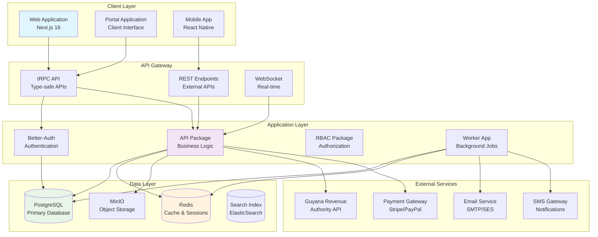

### Domain-Driven Design Architecture

```mermaid
graph TB
    subgraph "Client Domain"
        CLIENT_ENTITY[Client Entity]
        CLIENT_REPO[Client Repository]
        CLIENT_SERVICE[Client Service]
        CLIENT_EVENTS[Client Events]
    end

    subgraph "Document Domain"
        DOC_ENTITY[Document Entity]
        DOC_REPO[Document Repository]
        DOC_SERVICE[Document Service]
        DOC_EVENTS[Document Events]
    end

    subgraph "Filing Domain"
        FILING_ENTITY[Filing Entity]
        FILING_REPO[Filing Repository]
        FILING_SERVICE[Filing Service]
        FILING_EVENTS[Filing Events]
    end

    subgraph "Compliance Domain"
        COMP_ENTITY[Compliance Entity]
        COMP_REPO[Compliance Repository]
        COMP_SERVICE[Compliance Service]
        COMP_EVENTS[Compliance Events]
    end

    subgraph "Shared Kernel"
        DOMAIN_EVENTS[Domain Event Bus]
        VALUE_OBJECTS[Value Objects]
        SPECIFICATIONS[Business Rules]
        POLICIES[Domain Policies]
    end

    subgraph "Infrastructure"
        DATABASE[Database Layer]
        CACHE[Caching Layer]
        EXTERNAL[External APIs]
        MESSAGING[Message Queue]
    end

    CLIENT_SERVICE --> CLIENT_REPO
    CLIENT_SERVICE --> CLIENT_EVENTS
    CLIENT_EVENTS --> DOMAIN_EVENTS

    DOC_SERVICE --> DOC_REPO
    DOC_SERVICE --> DOC_EVENTS
    DOC_EVENTS --> DOMAIN_EVENTS

    FILING_SERVICE --> FILING_REPO
    FILING_SERVICE --> FILING_EVENTS
    FILING_EVENTS --> DOMAIN_EVENTS

    COMP_SERVICE --> COMP_REPO
    COMP_SERVICE --> COMP_EVENTS
    COMP_EVENTS --> DOMAIN_EVENTS

    CLIENT_REPO --> DATABASE
    DOC_REPO --> DATABASE
    FILING_REPO --> DATABASE
    COMP_REPO --> DATABASE

    DOMAIN_EVENTS --> MESSAGING

    style CLIENT_ENTITY fill:#e3f2fd
    style DOC_ENTITY fill:#f1f8e9
    style FILING_ENTITY fill:#fff3e0
    style COMP_ENTITY fill:#fce4ec
    style DOMAIN_EVENTS fill:#f3e5f5
```

## 🔒 Security Architecture

### Authentication & Authorization Flow

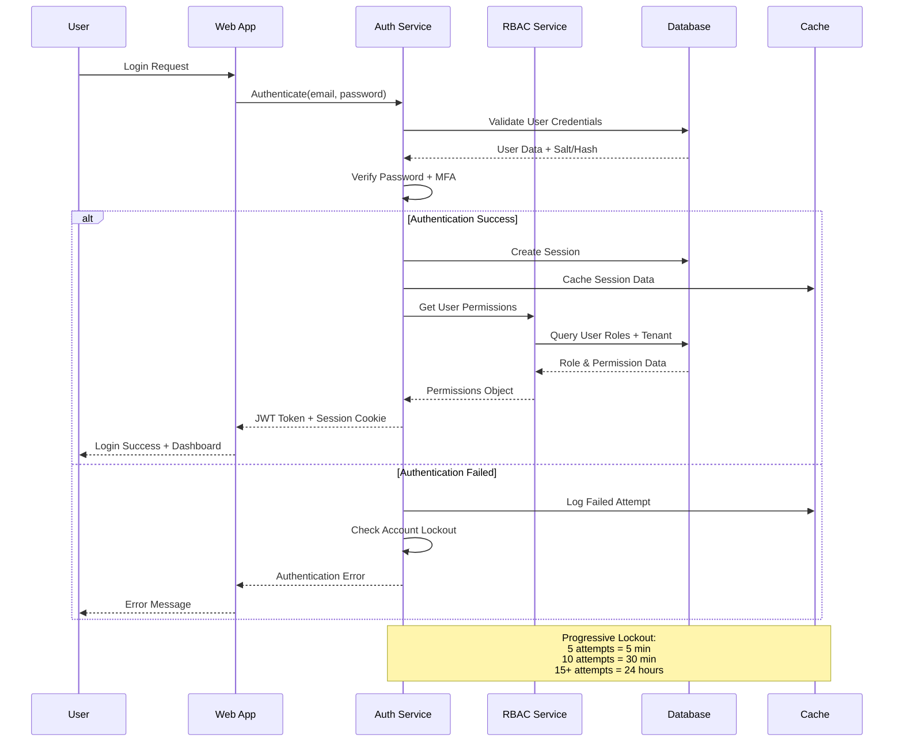

### Multi-Tenant Security Model

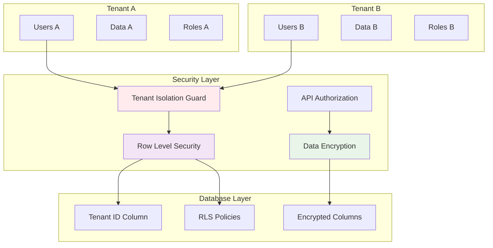

## 💾 Data Architecture

### Database Schema Overview

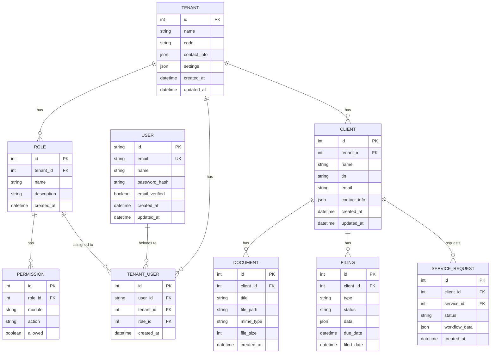

### Caching Strategy

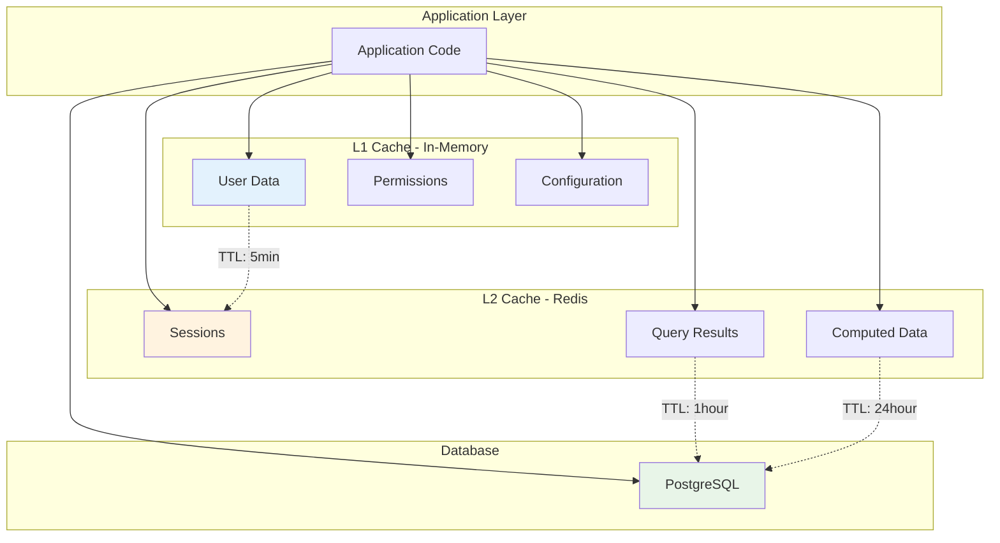

## 🔄 Business Process Flows

### Client Onboarding Workflow

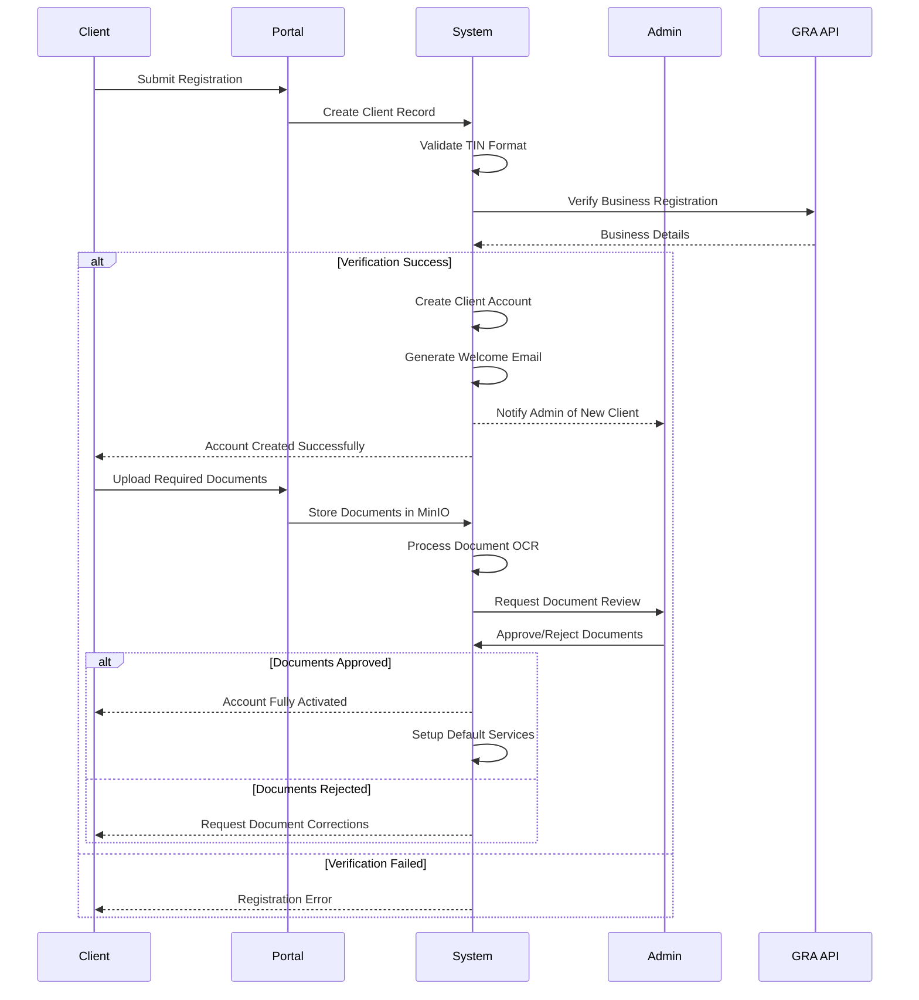

### Tax Filing Process

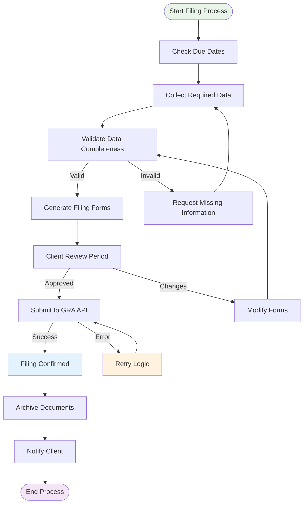

### Document Processing Pipeline

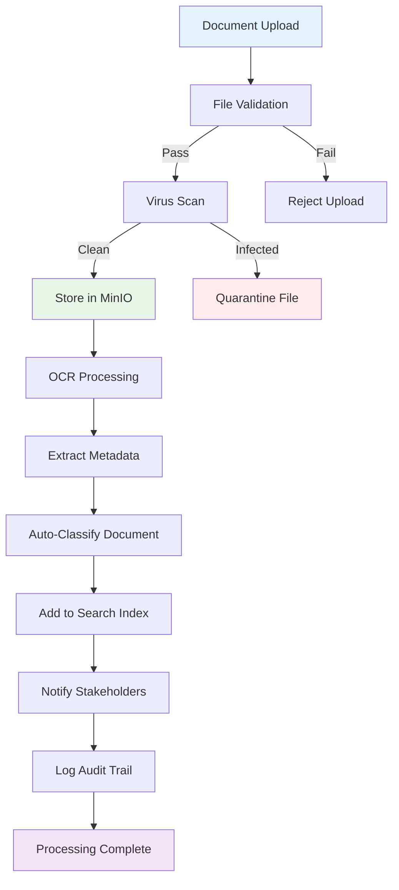

## 🚀 Deployment Architecture

### Production Infrastructure

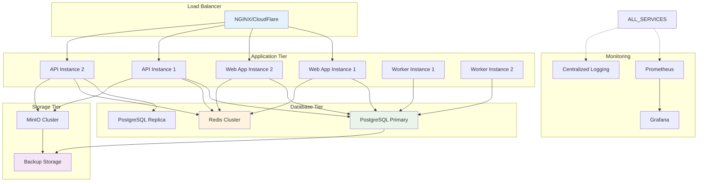

### CI/CD Pipeline

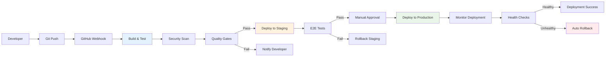

## 📊 Performance & Monitoring

### Application Metrics Dashboard

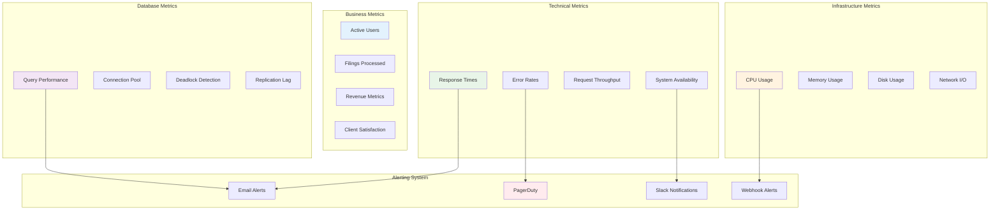

## 🔧 Development Guidelines

### Code Architecture Layers

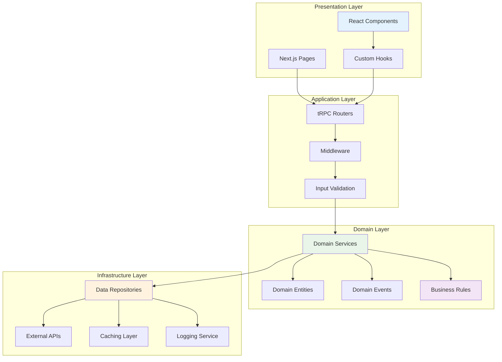

## 🛡️ Security Implementation

### Data Protection Strategy

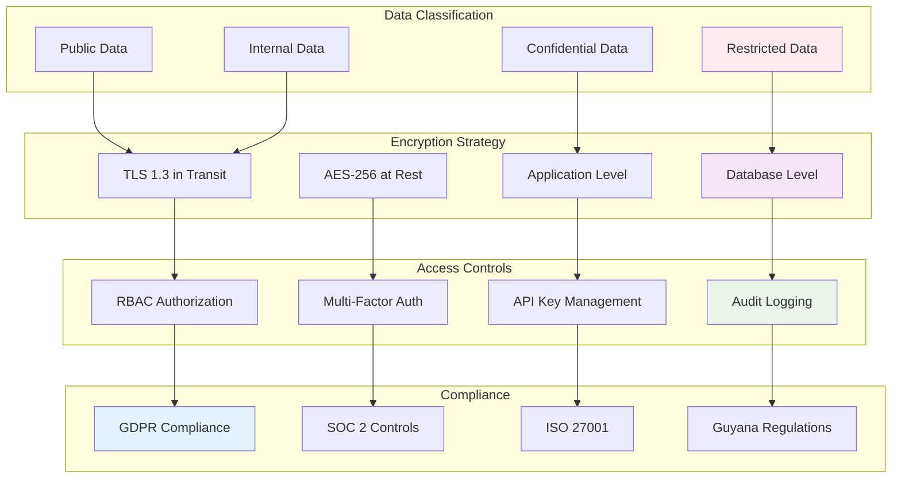

---

## 📚 Additional Resources

- [API Documentation](./api/README.md)
- [Security Guidelines](./docs/security.md)
- [Deployment Guide](./docs/deployment.md)
- [Contributing Guidelines](./CONTRIBUTING.md)
- [Architecture Decision Records](./docs/adr/)

---

*This documentation is automatically generated and updated as part of the enterprise platform upgrade.*