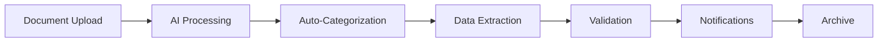

# GCMC-KAJ Digital Transformation Platform - User Guide

> **Version:** 1.2.0
> **For:** Accounting Practitioners in Guyana
> **Last Updated:** 2025-11-19
> **Status:** Production Ready

This comprehensive guide helps accounting practitioners transition from traditional file-based systems to the modern GCMC-KAJ Digital Transformation Platform, featuring complete GRA/NIS eServices integration and hybrid migration workflows.

---

## 📚 Table of Contents

- [Welcome to Digital Transformation](#welcome-to-digital-transformation)
- [Getting Started](#getting-started)
- [Migration from Physical Files](#migration-from-physical-files)
- [Client Management](#client-management)
- [GRA eServices Integration](#gra-eservices-integration)
- [NIS Electronic Schedule Submission](#nis-electronic-schedule-submission)
- [Document Management](#document-management)
- [Service Package Management](#service-package-management)
- [Compliance Automation](#compliance-automation)
- [Business Intelligence Dashboard](#business-intelligence-dashboard)
- [Mobile Access with "Padna"](#mobile-access-with-padna)
- [Best Practices](#best-practices)
- [Troubleshooting](#troubleshooting)
- [Training Resources](#training-resources)

---

## 🌟 Welcome to Digital Transformation

### What This Platform Does for You

The GCMC-KAJ Digital Transformation Platform revolutionizes how accounting practices operate in Guyana by:

- **Seamlessly integrating** with GRA's OPTIMAL system and NIS Electronic Schedule Submission
- **Converting physical file cabinets** into organized digital workflows
- **Automating compliance** with all 29 Guyanese regulatory agencies
- **Providing real-time insights** through business intelligence dashboards
- **Streamlining client service delivery** with dynamic service packages
- **Enabling mobile access** for you and your clients anywhere in Guyana

### Key Benefits for Your Practice

✅ **Reduce Filing Time by 80%** - Automated GRA/NIS submissions
✅ **Eliminate Paper Storage Costs** - Complete digital document management
✅ **Improve Client Satisfaction** - Real-time compliance status and mobile access
✅ **Increase Revenue** - Dynamic service packages and automated billing
✅ **Ensure Compliance** - Never miss a deadline with automated reminders
✅ **Scale Your Practice** - Serve more clients with the same staff

---

## 🚀 Getting Started

### First Login and Setup

1. **Access Your Platform**
   ```
   URL: https://your-practice.gcmc-kaj.com
   Email: [provided by administrator]
   Password: [temporary - change on first login]
   ```

2. **Complete Your Profile**
   - Navigate to Settings → Profile
   - Update your contact information
   - Set your preferred timezone and language
   - Upload your professional photo

3. **Understand Your Role and Permissions**

   | Role | What You Can Do |
   |------|-----------------|
   | **FirmAdmin** | Full access, manage users, create service packages |
   | **ComplianceManager** | Oversee compliance, manage client services |
   | **ComplianceOfficer** | Handle daily compliance tasks and filings |
   | **DocumentOfficer** | Manage document uploads and organization |
   | **FilingClerk** | Prepare and submit filings |
   | **Viewer** | Read-only access to reports and dashboards |

4. **Initial Platform Setup**
   - Go to Settings → Practice Setup
   - Configure your practice information
   - Set up standard service packages
   - Configure GRA/NIS integration credentials

### Dashboard Overview

Your main dashboard provides:

- **Client Overview**: Total clients, active services, compliance status
- **Today's Tasks**: Upcoming deadlines, pending approvals, urgent items
- **GRA/NIS Status**: Real-time submission status and account balances
- **Revenue Insights**: Monthly performance, service revenue, growth metrics
- **Quick Actions**: Common tasks you perform daily

---

## 📁 Migration from Physical Files

### Step 1: Assessment and Planning

**Before You Start:**
- Conduct a physical file audit
- Identify document types and volumes
- Map your current workflows
- Plan your migration timeline

**Using the Migration Wizard:**

1. Navigate to **Tools → Migration Wizard**
2. Complete the **Practice Assessment**:
   - Number of clients
   - Average documents per client
   - Current filing system organization
   - Staff availability for migration

3. Review the **Migration Plan**:
   - Recommended timeline (typically 4-6 weeks)
   - Resource requirements
   - Training schedule
   - Milestone checkpoints

### Step 2: Digital File Cabinet Setup

**Organize Your Digital Structure:**

```
Your Practice
├── Client Files
│   ├── [Client Name]
│   │   ├── Personal Documents
│   │   │   ├── Identification
│   │   │   ├── Addresses & Contact
│   │   │   └── Banking Information
│   │   ├── Business Documents
│   │   │   ├── Registration Certificates
│   │   │   ├── Licenses & Permits
│   │   │   └── Financial Records
│   │   ├── GRA Documents
│   │   │   ├── VAT Returns
│   │   │   ├── PAYE Returns
│   │   │   └── Income Tax Returns
│   │   ├── NIS Documents
│   │   │   ├── Monthly Schedules
│   │   │   ├── Annual Returns
│   │   │   └── Registration Forms
│   │   └── Correspondence
│   │       ├── Email Communications
│   │       ├── Official Letters
│   │       └── Meeting Notes
```

**Setting Up Document Types:**

1. Go to **Settings → Document Types**
2. Review pre-configured types for Guyanese agencies:
   - GRA VAT Certificate
   - NIS Registration Certificate
   - DCRA Certificate of Incorporation
   - Passport (Guyana)
   - Driver's License
   - Business License

3. Create custom document types if needed

### Step 3: Document Scanning and Digitization

**Recommended Scanning Process:**

1. **Prepare Documents**:
   - Remove staples and paper clips
   - Sort by client and document type
   - Check for damaged pages

2. **Use the Document Upload System**:
   - Navigate to **Documents → Upload**
   - Select client and document type
   - Use batch upload for multiple documents
   - The AI will automatically categorize based on content

3. **Quality Control**:
   - Review auto-categorization results
   - Verify all text is readable (OCR quality)
   - Add manual descriptions where needed
   - Check expiry dates are correct

**Mobile Scanning with "Padna" App:**

- Download the mobile app
- Use your phone camera for high-quality scans
- Auto-sync with your practice account
- Perfect for on-site client visits

### Step 4: Parallel Operations

**Running Both Systems Temporarily:**

During the transition (typically 2-4 weeks):
- Keep physical files as backup
- Enter new documents digitally only
- Use the platform for all new compliance tasks
- Gradually reduce reliance on paper files

**Validation Checklist:**
- ✅ All critical documents are digitized
- ✅ GRA/NIS submissions work correctly
- ✅ Staff are comfortable with the new system
- ✅ Client portal access is functioning
- ✅ Backup systems are in place

### Step 5: Complete Digital Cutover

**Go-Live Checklist:**
- Archive or securely dispose of physical files
- Update client communications about digital access
- Celebrate your digital transformation!

---

## 👥 Client Management

### Adding New Clients

**Complete Client Onboarding:**

1. **Navigate to Clients → Add New Client**

2. **Basic Information**:
   ```
   Client Name: ABC Manufacturing Ltd.
   Type: Company
   Email: info@abcmfg.gy
   Phone: +592-123-4567
   Address: 123 Industrial Estate, Georgetown
   ```

3. **Tax Information**:
   ```
   TIN: 123456789
   NIS Employer Number: EMP123456
   VAT Registration: VAT987654
   PAYE Registration: Yes
   ```

4. **Business Classification**:
   ```
   Sector: Manufacturing
   Risk Level: Medium
   Annual Turnover: $50M GYD
   Employee Count: 25
   ```

5. **Service Requirements**:
   - Select applicable service packages
   - Configure GRA services (VAT, PAYE, Income Tax)
   - Configure NIS services (Monthly/Annual Returns)
   - Set billing preferences

### Client Portal Setup

**Giving Clients Access:**

1. **Enable Portal Access**:
   - Go to client profile
   - Click "Enable Portal Access"
   - Set permissions (documents, communications, payments)

2. **Client Receives**:
   - Welcome email with login credentials
   - Portal orientation guide
   - Mobile app download links

3. **Client Portal Features**:
   - View compliance status
   - Download documents and reports
   - Communicate with your practice
   - Track service requests
   - View payment history

### Managing Client Relationships

**Communication Tools:**
- **Internal Notes**: Private notes visible only to your staff
- **Client Communications**: Messages visible in client portal
- **Email Integration**: All emails automatically filed
- **Meeting Scheduler**: Integrated calendar with reminders

**Service Delivery Tracking:**
- Monitor service request progress
- Track compliance milestones
- Generate performance reports
- Manage client satisfaction surveys

---

## 🏛 GRA eServices Integration

### Initial GRA Setup

**Connecting to GRA OPTIMAL System:**

1. **Obtain GRA API Credentials**:
   - Contact GRA eServices: eservices@gra.gov.gy
   - Request API access for your practice
   - Provide business registration details
   - Obtain client ID and API secret

2. **Configure in Platform**:
   - Go to **Settings → Government Integrations**
   - Select **GRA eServices**
   - Enter your credentials:
     ```
     GRA Client ID: [provided by GRA]
     GRA Client Secret: [secure token]
     Environment: Production
     ```
   - Test connection

### VAT Return Submissions

**Automated VAT Filing:**

1. **Prepare VAT Return**:
   - Navigate to **Filings → Create New Filing**
   - Select client and **VAT Return**
   - Choose period (Monthly/Quarterly)

2. **Enter VAT Data**:
   ```
   Sales (Standard Rate 14%): $1,000,000 GYD
   Output VAT: $140,000 GYD
   Purchases (with VAT): $600,000 GYD
   Input VAT: $84,000 GYD
   Net VAT Payable: $56,000 GYD
   ```

3. **Attach Supporting Documents**:
   - Sales invoices summary
   - Purchase receipts
   - Bank statements
   - Previous VAT certificates

4. **Submit to GRA**:
   - Review calculated amounts
   - Click **Submit to GRA**
   - Monitor submission status in real-time
   - Receive GRA confirmation number
   - Download official receipt

**VAT Submission Status Tracking:**
- **Submitted**: Successfully sent to GRA
- **Processing**: Under GRA review
- **Accepted**: VAT assessment complete
- **Paid**: Payment received by GRA
- **Rejected**: Requires correction and resubmission

### PAYE Return Submissions

**Monthly PAYE Processing:**

1. **Prepare Employee Data**:
   - Import from payroll system or enter manually
   - Verify employee NIN numbers
   - Calculate PAYE deductions

2. **Employee Schedule Example**:
   ```
   Employee: John Doe
   NIN: 123456789012
   Monthly Salary: $100,000 GYD
   Taxable Income: $100,000 GYD
   PAYE Deducted: $14,000 GYD
   ```

3. **Submit PAYE Return**:
   - Review totals and employee list
   - Generate PAYE schedule
   - Submit to GRA OPTIMAL system
   - Receive submission confirmation

4. **Generate PAYE Certificates**:
   - Individual employee certificates
   - Employer summary certificate
   - Annual PAYE certificate

### Income Tax and Corporate Tax

**Annual Tax Return Processing:**

1. **Individual Income Tax**:
   - Import from T4 statements
   - Calculate allowances and deductions
   - Submit directly to GRA
   - Track assessment status

2. **Corporate Tax Returns**:
   - Prepare financial statements
   - Calculate taxable income
   - Apply available allowances
   - Submit with supporting documents

### Real-Time GRA Account Management

**Monitor GRA Account Status:**
- Current account balance
- Payment due dates
- Penalty calculations
- Payment history
- Outstanding assessments

---

## 🛡 NIS Electronic Schedule Submission

### NIS Integration Setup

**Connecting to NIS eSchedule System:**

1. **Obtain NIS Credentials**:
   - Contact NIS: support@nis.org.gy
   - Request electronic submission access
   - Provide employer registration details
   - Obtain API access credentials

2. **Configure NIS Integration**:
   ```
   NIS API Endpoint: https://esched.nis.org.gy/api
   Employer Number: EMP123456
   API Key: [secure token]
   Submission Method: Electronic
   ```

### Monthly Schedule Submissions

**Preparing Monthly NIS Schedules:**

1. **Employee Contribution Calculation**:
   ```
   Employee: Jane Smith
   NIN: 987654321012
   Monthly Wages: $80,000 GYD
   Employee Contribution: $5,600 GYD (7%)
   Employer Contribution: $6,400 GYD (8%)
   Total Contribution: $12,000 GYD
   ```

2. **Generate NIS Schedule**:
   - Navigate to **NIS → Monthly Schedule**
   - Select reporting month
   - Import employee data
   - Verify contribution calculations
   - Generate schedule summary

3. **Submit to NIS**:
   - Review schedule for accuracy
   - Click **Submit to NIS**
   - Monitor submission status
   - Download confirmation receipt
   - Print schedule copy for records

### Annual NIS Returns

**Year-End NIS Processing:**

1. **Annual Return Preparation**:
   - Consolidate 12 months of contributions
   - Verify total wages and contributions
   - Reconcile with monthly submissions
   - Check for any corrections needed

2. **Submit Annual Return**:
   - Generate comprehensive annual summary
   - Submit to NIS electronic system
   - Receive annual return certificate
   - Update client records

### Employee NIS Management

**Individual Employee Tracking:**

1. **Employee Registration**:
   - New employee NIS registration
   - Update employee details
   - Track employee contribution history
   - Generate individual statements

2. **Compliance Monitoring**:
   - Monthly submission deadlines (15th)
   - Contribution rate changes
   - Penalty calculations for late submissions
   - Employee benefit status

---

## 📄 Document Management

### Organizing Digital Documents

**Document Categories for Guyanese Practices:**

**Personal Documents:**
- Guyanese Passport
- National ID Card
- Driver's License
- Birth Certificate
- Marriage Certificate
- Utility Bills (Address Proof)

**Business Documents:**
- Certificate of Incorporation (DCRA)
- Business License
- VAT Registration Certificate
- NIS Employer Registration
- Work Permit (Non-Guyanese)
- Environmental Permit (EPA)

**Financial Documents:**
- Bank Statements
- Audited Financial Statements
- Management Accounts
- Cash Flow Statements
- Asset Registers

### Document Upload and Processing

**Smart Upload System:**

1. **Batch Upload Process**:
   - Drag and drop multiple files
   - Auto-detection of document types
   - AI-powered categorization
   - Automatic expiry date extraction

2. **Document Validation**:
   ```
   Document: GRA VAT Certificate
   Client: ABC Manufacturing
   Issue Date: 2024-01-15
   Expiry Date: 2025-01-15
   Status: ✅ Valid
   ```

3. **Quality Assurance**:
   - OCR text extraction
   - Image quality assessment
   - Duplicate detection
   - Missing information alerts

### Document Workflows

**Automated Document Processing:**



**Document Expiry Management:**

- **90 Days Notice**: Email to practice and client
- **30 Days Notice**: Email and SMS alerts
- **7 Days Notice**: Daily reminders
- **Expired**: Red alert status, urgent action required

### Version Control and Audit Trail

**Document Versioning:**
- Automatic version numbering
- Track all changes with timestamps
- Maintain complete audit trail
- Compare document versions
- Restore previous versions if needed

**Access Control:**
- Role-based document access
- Client portal permissions
- Audit log of all document views
- Secure sharing links with expiration

---

## 📦 Service Package Management

### Understanding Service Packages

**Pre-Built Service Packages:**

1. **GRA Essentials Package**:
   - VAT return preparation and submission
   - PAYE processing and filing
   - Income tax compliance
   - **Monthly Fee**: $15,000 GYD
   - **Per Filing**: $2,000 GYD additional

2. **NIS Comprehensive Package**:
   - Monthly schedule preparation
   - Electronic submission to NIS
   - Annual return processing
   - Employee registration management
   - **Monthly Fee**: $10,000 GYD

3. **Complete Compliance Package**:
   - All GRA services
   - All NIS services
   - DCRA annual returns
   - Document management
   - Priority support
   - **Monthly Fee**: $35,000 GYD
   - **Setup Fee**: $25,000 GYD

### Creating Custom Service Packages

**Building Tailored Solutions:**

1. **Navigate to Services → Package Builder**

2. **Configure Service Components**:
   ```
   Package Name: "Large Business Premium"

   GRA Services:
   ✅ VAT (Monthly)
   ✅ PAYE (Monthly)
   ✅ Corporate Tax (Annual)
   ✅ Withholding Tax (Quarterly)

   NIS Services:
   ✅ Monthly Schedules (50+ employees)
   ✅ Annual Returns
   ✅ New Employee Registration

   Additional Services:
   ✅ Financial Statement Preparation
   ✅ Management Reporting
   ✅ Audit Support

   Pricing:
   Monthly Fee: $45,000 GYD
   Per Filing Fee: $3,000 GYD
   Setup Fee: $50,000 GYD
   Volume Discount: 15%
   ```

3. **Save and Activate Package**

### Client Subscription Management

**Assigning Services to Clients:**

1. **Subscription Setup**:
   - Go to client profile
   - Click **"Manage Services"**
   - Select appropriate package
   - Customize if needed
   - Set billing cycle
   - Activate subscription

2. **Service Delivery Tracking**:
   - Monitor monthly service delivery
   - Track compliance deadlines
   - Generate service reports
   - Measure client satisfaction
   - Calculate profitability

3. **Billing Integration**:
   - Automatic invoice generation
   - Payment tracking
   - Overdue account management
   - Revenue reporting
   - Client payment portal

### Performance Metrics

**Service Package Analytics:**
- Most popular packages
- Revenue per package
- Client satisfaction scores
- Service delivery times
- Profitability analysis
- Growth opportunities

---

## ⚖ Compliance Automation

### Automated Compliance Engine

**29 Guyanese Regulatory Agencies:**

**Tax and Revenue:**
- GRA (Guyana Revenue Authority)
- Customs and Excise Division

**Business Registration:**
- DCRA (Deeds and Commercial Registry Authority)
- Registrar of Companies

**Employment and Labor:**
- NIS (National Insurance Scheme)
- Ministry of Labour
- Occupational Safety and Health Department

**Environmental:**
- EPA (Environmental Protection Agency)
- Forestry Commission
- Maritime Administration

**Sectoral Regulation:**
- Bank of Guyana
- Public Utilities Commission
- Telecommunications Authority
- Tourism Authority

**Immigration and Security:**
- Immigration Department
- Customs Anti-Narcotics Unit

### Compliance Monitoring Dashboard

**Real-Time Compliance Status:**

```
Client: ABC Manufacturing Ltd.

GRA Compliance: ✅ COMPLIANT
├── VAT Returns: Current (Due: Dec 15)
├── PAYE Filings: Current (Due: Dec 15)
├── Corporate Tax: Filed (Next: Mar 31, 2025)
└── Account Status: No outstanding amounts

NIS Compliance: ⚠️ ACTION REQUIRED
├── November Schedule: Submitted ✅
├── December Schedule: Due in 5 days ⚠️
├── Annual Return: Due Jan 31, 2025
└── Account Status: Current

DCRA Compliance: ✅ COMPLIANT
├── Annual Return: Filed Sep 2024 ✅
├── Company Status: Active
└── Next Due: Sep 30, 2025

EPA Compliance: ✅ COMPLIANT
├── Environmental Permit: Valid until Dec 2025
└── Annual Report: Submitted Oct 2024

Overall Compliance Score: 92/100
Risk Level: LOW
```

### Automated Deadline Tracking

**Smart Reminder System:**

1. **90-Day Advance Notice**: Planning reminders
2. **30-Day Notice**: Preparation alerts
3. **7-Day Notice**: Urgent action required
4. **Day-Of Alerts**: Final reminders
5. **Overdue Notifications**: Immediate attention needed

**Escalation Process:**
- Email to assigned compliance officer
- SMS to practice manager
- Client portal notification
- Automatic task creation
- Management dashboard alert

### Compliance Reporting

**Monthly Compliance Reports:**

1. **Client Compliance Summary**:
   - Overall compliance scores
   - Agency-by-agency status
   - Upcoming deadlines
   - Action items
   - Risk assessments

2. **Practice Performance Report**:
   - Total clients managed
   - Compliance success rate
   - Revenue from compliance services
   - Staff productivity metrics
   - Growth opportunities

3. **Government Agency Status**:
   - Submission success rates
   - Processing times
   - Fee payments
   - Account standings
   - Penalty avoidance

---

## 📊 Business Intelligence Dashboard

### Key Performance Indicators (KPIs)

**Practice Metrics:**

```
Revenue Performance:
┌─────────────────────┬─────────────┬─────────────┐
│ Service Type        │ This Month  │ vs Last Month│
├─────────────────────┼─────────────┼─────────────┤
│ GRA Services        │ $875,000    │ +12.5%      │
│ NIS Services        │ $450,000    │ +8.3%       │
│ Document Services   │ $125,000    │ +5.7%       │
│ Consultation Fees   │ $300,000    │ +15.2%      │
│ TOTAL REVENUE       │ $1,750,000  │ +11.8%      │
└─────────────────────┴─────────────┴─────────────┘

Client Growth:
├── Total Clients: 248 (+8 this month)
├── Active Clients: 231 (93.1%)
├── New Acquisitions: 8
├── Client Retention: 97.2%
└── Average Revenue per Client: $7,056

Compliance Performance:
├── On-Time Submissions: 98.4%
├── Zero Penalties: 96.7%
├── Client Satisfaction: 94.2%
└── Staff Efficiency: 89.1%
```

### Real-Time Analytics

**Live Dashboard Features:**

1. **Revenue Tracking**:
   - Daily, weekly, monthly revenue
   - Service-wise breakdown
   - Client contribution analysis
   - Growth trend visualization

2. **Operational Metrics**:
   - Documents processed daily
   - Filings submitted
   - Client queries resolved
   - Staff productivity scores

3. **Compliance Analytics**:
   - Submission success rates
   - Deadline adherence
   - Penalty avoidance
   - Risk score trends

### Custom Reports and Analytics

**Available Report Types:**

1. **Client Performance Reports**:
   - Individual client profitability
   - Service usage patterns
   - Compliance history
   - Growth opportunities

2. **Financial Analysis**:
   - Monthly P&L by service line
   - Cash flow projections
   - Fee collection analytics
   - Cost per client served

3. **Operational Reports**:
   - Staff productivity analysis
   - Document processing efficiency
   - Client satisfaction surveys
   - System usage statistics

### Predictive Analytics

**AI-Powered Insights:**

- **Revenue Forecasting**: Predict next 3-6 months revenue
- **Client Churn Risk**: Identify clients at risk of leaving
- **Growth Opportunities**: Suggest new service offerings
- **Staff Optimization**: Recommend resource allocation
- **Seasonal Trends**: Plan for peak periods

---

## 📱 Mobile Access with "Padna"

### Download and Setup

**Getting the Mobile App:**

1. **Download "Padna" App**:
   - iOS: Search "Padna GCMC-KAJ" in App Store
   - Android: Search "Padna GCMC-KAJ" in Google Play
   - Direct links provided in platform

2. **Login Setup**:
   - Use same credentials as web platform
   - Enable biometric authentication
   - Allow push notifications
   - Sync contacts for quick access

### Mobile Features for Practitioners

**On-the-Go Practice Management:**

1. **Document Scanning**:
   - High-quality document capture
   - Auto-enhancement and cropping
   - AI-powered categorization
   - Instant upload to client files

2. **Client Interactions**:
   - Quick client lookup
   - View compliance status
   - Send messages and updates
   - Schedule appointments

3. **Compliance Monitoring**:
   - Deadline notifications
   - Submit urgent filings
   - Check GRA/NIS account status
   - Approve staff actions

4. **Business Intelligence**:
   - Key metrics dashboard
   - Revenue tracking
   - Client alerts
   - Performance summaries

### Client Portal Mobile Experience

**Client Self-Service Features:**

1. **Document Access**:
   - Download certificates and returns
   - Upload required documents
   - View document status
   - Receive expiry notifications

2. **Communication**:
   - Message their accounting team
   - Receive important updates
   - Schedule consultations
   - Access help resources

3. **Compliance Tracking**:
   - View compliance status
   - See upcoming deadlines
   - Track submission progress
   - Payment reminders

4. **Service Management**:
   - Request additional services
   - View service history
   - Update business information
   - Provide feedback

### Mobile Security

**Enterprise-Grade Security:**
- Biometric authentication
- End-to-end encryption
- Secure document transmission
- Remote wipe capability
- Session timeout controls

---

## 💡 Best Practices

### Document Management Best Practices

**Organizing for Success:**

1. **Consistent Naming Conventions**:
   ```
   Format: [CLIENT]_[DOCUMENT-TYPE]_[DATE]_[VERSION]
   Example: ABC-MFG_VAT-CERT_2024-01-15_v1.pdf
   ```

2. **Regular Document Audits**:
   - Monthly expiry date reviews
   - Quarterly document completeness checks
   - Annual archive maintenance
   - Client document verification

3. **Backup Strategies**:
   - Daily automated backups
   - Weekly backup verification
   - Monthly disaster recovery tests
   - Annual backup restoration drills

### GRA/NIS Submission Best Practices

**Ensuring Successful Submissions:**

1. **Pre-Submission Checklist**:
   ```
   VAT Return Submission:
   ☐ All sales invoices recorded
   ☐ Purchase receipts verified
   ☐ VAT calculations double-checked
   ☐ Supporting documents attached
   ☐ Previous period reconciled
   ☐ Client approval obtained
   ☐ GRA account status confirmed
   ```

2. **Timing Recommendations**:
   - Submit VAT returns by the 10th of the month
   - Submit PAYE returns by the 10th of the month
   - Submit NIS schedules by the 10th of the month
   - Allow buffer time for corrections

3. **Error Prevention**:
   - Use built-in validation rules
   - Cross-reference with previous submissions
   - Verify client information accuracy
   - Test submissions in staging first

### Client Communication Best Practices

**Professional Client Relations:**

1. **Regular Updates**:
   - Weekly compliance status summaries
   - Monthly performance reports
   - Quarterly business reviews
   - Annual planning sessions

2. **Proactive Communication**:
   - 30-day deadline reminders
   - New regulation notifications
   - Service opportunity alerts
   - Industry insight sharing

3. **Response Time Standards**:
   - Email responses: Within 4 hours
   - Portal messages: Within 2 hours
   - Urgent matters: Within 1 hour
   - Phone calls: Return same day

### Security Best Practices

**Protecting Sensitive Information:**

1. **Access Controls**:
   - Regular password updates (90 days)
   - Two-factor authentication for all users
   - Role-based permissions only
   - Regular access reviews

2. **Data Protection**:
   - Encrypt all sensitive documents
   - Secure transmission protocols
   - Regular security audits
   - Staff security training

3. **Compliance with Local Laws**:
   - Data Protection Act compliance
   - Professional confidentiality rules
   - Government reporting requirements
   - Audit trail maintenance

---

## 🔧 Troubleshooting

### Common Issues and Solutions

**Login and Access Problems:**

**Problem**: "Cannot login to platform"
**Solution**:
1. Verify internet connection
2. Check if Caps Lock is on
3. Try password reset
4. Clear browser cache
5. Contact system administrator

**Problem**: "GRA submission failed"
**Solution**:
1. Check GRA system status
2. Verify client credentials
3. Review submission data
4. Check file size limits
5. Try manual submission

**Problem**: "Documents not uploading"
**Solution**:
1. Check file format (PDF, JPG, PNG supported)
2. Verify file size (max 10MB per file)
3. Ensure stable internet connection
4. Try uploading one at a time
5. Clear browser cache

### GRA/NIS Integration Issues

**GRA Connection Problems:**

1. **Authentication Errors**:
   - Verify GRA credentials
   - Check credential expiry
   - Contact GRA support: eservices@gra.gov.gy
   - Test with manual GRA login

2. **Submission Timeouts**:
   - Check GRA system status
   - Submit during off-peak hours
   - Reduce file sizes
   - Retry submission

**NIS Submission Issues:**

1. **Schedule Rejection**:
   - Verify employee NIN numbers
   - Check contribution calculations
   - Ensure proper file format
   - Review NIS guidelines

2. **Connection Failures**:
   - Test NIS portal access directly
   - Verify employer registration
   - Check API credentials
   - Contact NIS support: support@nis.org.gy

### Performance Issues

**Slow System Response:**

1. **Browser Optimization**:
   - Use Chrome or Firefox (latest versions)
   - Clear cache and cookies
   - Disable unnecessary extensions
   - Close other browser tabs

2. **Network Optimization**:
   - Test internet speed (minimum 10 Mbps)
   - Use wired connection if possible
   - Avoid peak usage times
   - Contact ISP if issues persist

### Getting Help

**Support Channels:**

1. **In-Platform Help**:
   - Click "?" icon for contextual help
   - Use built-in chat support
   - Access video tutorials
   - Download user manuals

2. **External Support**:
   - Email: support@gcmc-kaj.com
   - Phone: +592-XXX-XXXX
   - WhatsApp: +592-XXX-XXXX
   - Emergency: +592-XXX-XXXX (24/7)

3. **Training Resources**:
   - Weekly webinars
   - Video tutorial library
   - Best practices guides
   - User community forum

---

## 📚 Training Resources

### Getting Started Training

**New User Onboarding:**

**Week 1: Platform Basics**
- [ ] Complete platform overview tour
- [ ] Set up user profile and preferences
- [ ] Learn basic navigation
- [ ] Practice document upload
- [ ] Test client portal access

**Week 2: Core Functions**
- [ ] Create your first client
- [ ] Upload and organize documents
- [ ] Set up service packages
- [ ] Practice GRA submission
- [ ] Learn compliance monitoring

**Week 3: Advanced Features**
- [ ] Configure automation rules
- [ ] Set up custom reports
- [ ] Practice mobile app usage
- [ ] Learn troubleshooting basics
- [ ] Join user community

### Ongoing Education

**Monthly Training Topics:**

1. **January**: "Advanced GRA Integration Features"
2. **February**: "Optimizing Document Workflows"
3. **March**: "Year-End Tax Processing"
4. **April**: "Client Portal Best Practices"
5. **May**: "Business Intelligence and Reporting"
6. **June**: "Mobile App Advanced Features"
7. **July**: "Security and Compliance Updates"
8. **August**: "NIS Processing Automation"
9. **September**: "Custom Service Package Design"
10. **October**: "Performance Optimization"
11. **November**: "Integration with Other Systems"
12. **December**: "Planning for Growth"

### Certification Program

**Professional Certification Levels:**

**Level 1: Platform User**
- Basic navigation and daily tasks
- Document management
- Client communications
- 10 hours online training + quiz

**Level 2: Compliance Specialist**
- GRA/NIS integration mastery
- Advanced compliance monitoring
- Automation configuration
- 20 hours training + practical exam

**Level 3: Practice Administrator**
- Full platform administration
- Staff training and management
- Custom reporting and analytics
- 30 hours training + capstone project

### Community Support

**User Community Resources:**

1. **Online Forum**: Connect with other users
2. **Best Practices Sharing**: Learn from successful practices
3. **Feature Requests**: Suggest improvements
4. **Bug Reports**: Help improve the platform
5. **Success Stories**: Share your transformation journey

---

## 📞 Getting Support

### Contact Information

**Technical Support:**
- Email: support@gcmc-kaj.com
- Phone: +592-225-GCMC (4262)
- WhatsApp: +592-600-GCMC
- Hours: Monday-Friday 8:00 AM - 6:00 PM
- Emergency: 24/7 for critical issues

**Training and Education:**
- Email: training@gcmc-kaj.com
- Phone: +592-225-TRAIN (87246)
- Webinar Registration: https://training.gcmc-kaj.com
- Resource Library: https://resources.gcmc-kaj.com

**Business Development:**
- Email: sales@gcmc-kaj.com
- Phone: +592-225-SALES (72537)
- Schedule Consultation: https://calendar.gcmc-kaj.com

### Service Level Agreements

**Support Response Times:**

| Priority | Response Time | Resolution Time |
|----------|---------------|-----------------|
| **Critical** | 1 hour | 4 hours |
| **High** | 4 hours | 24 hours |
| **Medium** | 24 hours | 3 business days |
| **Low** | 3 business days | 1 week |

**Critical Issues Include:**
- Platform completely inaccessible
- GRA/NIS submission failures on deadline day
- Data security breaches
- Payment processing failures

---

## 🎯 Success Metrics

Track your digital transformation success with these key indicators:

**Efficiency Gains:**
- [ ] 80% reduction in filing preparation time
- [ ] 95% reduction in paper storage costs
- [ ] 90% improvement in deadline adherence
- [ ] 75% faster document retrieval

**Revenue Growth:**
- [ ] 25% increase in client capacity
- [ ] 30% improvement in service profitability
- [ ] 50% growth in additional service sales
- [ ] 40% reduction in overtime costs

**Client Satisfaction:**
- [ ] 95% client satisfaction score
- [ ] 98% client retention rate
- [ ] 50% improvement in response times
- [ ] 85% client portal adoption

**Compliance Excellence:**
- [ ] Zero penalty fees from late submissions
- [ ] 100% on-time filing rate
- [ ] 98% first-time submission acceptance
- [ ] Complete audit readiness

---

**User Guide Version:** 1.2.0
**Last Updated:** 2025-11-19
**Status:** ✅ Production Ready

**Your success is our mission. Welcome to the future of accounting practice management in Guyana!**

For immediate assistance: [support@gcmc-kaj.com](mailto:support@gcmc-kaj.com) | +592-225-GCMC