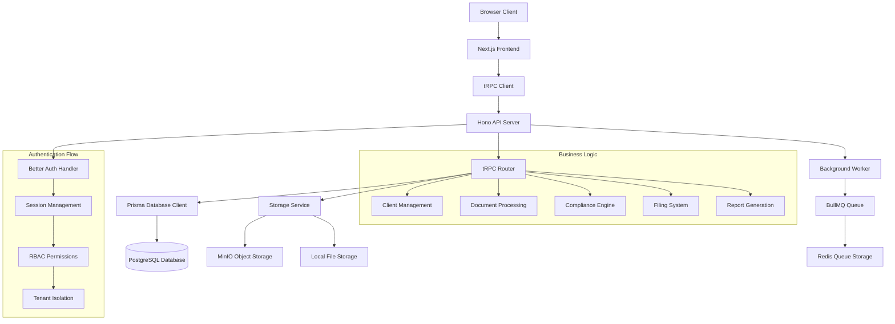

# Architecture Map

**Analysis Date:** 2025-11-19 04:36 UTC
**Project:** KAJ-GCMC Business Tax Services Platform
**Stack:** Better-T-Stack (Hono + Better Auth + tRPC + Prisma + Next.js)

## Directory Structure

```
kaj-gcmc-bts/
├── apps/
│   ├── web/               [Next.js 14 App Router - Main Frontend]
│   │   ├── src/
│   │   │   ├── app/       [App Router pages]
│   │   │   ├── components/[UI Components]
│   │   │   ├── lib/       [Client utilities]
│   │   │   └── styles/    [Tailwind CSS]
│   │   └── packages/      [Internal packages]
│   │       ├── compliance-engine/  [Guyana compliance logic]
│   │       └── security/           [Rate limiting & security]
│   ├── server/            [Hono + tRPC API Server]
│   │   ├── src/
│   │   │   ├── index.ts   [Main server with auth integration]
│   │   │   ├── middleware/[Security & CORS]
│   │   │   └── routes/    [Additional routes]
│   ├── portal/            [Secondary Frontend - Portal]
│   └── worker/            [BullMQ Background Jobs]
├── packages/
│   ├── api/               [tRPC Routers & Procedures]
│   ├── auth/              [Better-Auth Configuration]
│   ├── db/                [Prisma Schema & Client]
│   ├── rbac/              [Role-Based Access Control]
│   ├── storage/           [File Storage (MinIO/Local)]
│   ├── reports/           [PDF Generation]
│   ├── config/            [Shared Configuration]
│   └── types/             [TypeScript Definitions]
├── tests/                 [Testing Framework]
│   ├── e2e/               [Playwright End-to-End Tests]
│   ├── integration/       [API Integration Tests]
│   └── utils/             [Test Utilities]
└── docs/                  [Documentation]
```

## Data Flow Architecture



## Component Hierarchy

```
Frontend Components:
├── Layout Components
│   ├── RootLayout (main layout)
│   ├── LoginLayout (auth-specific)
│   └── DashboardLayout (authenticated)
├── Feature Components
│   ├── Authentication
│   │   ├── SignInForm (professional redesign ✅)
│   │   ├── SignUpForm
│   │   └── SessionProvider
│   ├── Dashboard
│   │   ├── DashboardCard (needs data visualization 🔄)
│   │   ├── ComplianceGauge (needs implementation 🔄)
│   │   └── ActivityFeed (needs implementation 🔄)
│   ├── Client Management
│   │   ├── ClientList (basic table, needs enhancement 🔄)
│   │   ├── ClientDetail (needs visualization 🔄)
│   │   └── ClientForm
│   ├── Document Management
│   │   ├── DocumentUpload (needs drag-drop 🔄)
│   │   ├── DocumentList (needs filters 🔄)
│   │   └── DocumentViewer
│   └── Compliance
│       ├── ComplianceScore (needs gauges 🔄)
│       ├── ComplianceTimeline (needs implementation 🔄)
│       └── FilingCalendar (needs heatmap 🔄)
└── UI Components (shadcn/ui)
    ├── Button, Input, Select
    ├── Card, Badge, Avatar
    ├── Table, Sheet, Dialog
    └── Chart components (needs implementation 🔄)
```

## API Surface (tRPC Routes)

### Current Implemented Routes:
```typescript
/trpc/auth.*         - Authentication procedures
/trpc/user.*         - User management
/trpc/tenant.*       - Tenant operations
/trpc/client.*       - Client CRUD operations
/trpc/document.*     - Document management
/trpc/filing.*       - Filing system
/trpc/compliance.*   - Compliance engine
/trpc/report.*       - PDF report generation
/trpc/storage.*      - File storage operations
```

### Missing Routes (Needed for Frontend):
```typescript
/trpc/analytics.*    - Business intelligence (🔄 needs implementation)
/trpc/audit.*        - Audit logging (🔄 needs implementation)
/trpc/dashboard.*    - Dashboard statistics (🔄 needs implementation)
/trpc/calendar.*     - Filing calendar data (🔄 needs implementation)
/trpc/notification.* - Real-time notifications (🔄 needs implementation)
```

## Database Schema Overview

### Core Entities:
- **User** → **TenantUser** → **Tenant** (Multi-tenancy)
- **Client** → **ClientContact** (Client management)
- **Document** → **DocumentVersion** (Document storage)
- **Filing** → **FilingRequirement** (Compliance system)
- **ComplianceScore** → **ComplianceEvent** (Compliance tracking)
- **Report** → **ReportGeneration** (PDF reports)

### Missing Tables (Per Ultimate Instructions):
- **AuditLog** (🔄 needs implementation)
- **Analytics** (🔄 needs implementation)
- **Notification** (🔄 needs implementation)
- **UserActivity** (🔄 needs implementation)

## Technology Stack Analysis

### Current Stack ✅:
- **Frontend**: Next.js 14 (App Router) + Tailwind CSS + shadcn/ui
- **Backend**: Hono + tRPC + Better-Auth
- **Database**: PostgreSQL + Prisma
- **Storage**: MinIO (Docker container)
- **Queue**: BullMQ + Redis
- **Testing**: Playwright + Vitest
- **DevOps**: Docker + Docker Compose

### Needs Adding (Per Ultimate Instructions):
- **Charts**: Recharts 📊
- **Animations**: Framer Motion ✨
- **Notifications**: React Hot Toast 🔔
- **Icons**: Lucide React (enhanced usage) 🎨
- **Analytics**: Custom business intelligence system 📈
- **Audit**: Comprehensive logging system 📝

## Critical Issues Identified

### 🔴 HIGH PRIORITY (P0)
1. **Frontend Navigation Timeout** - Web app not loading properly
2. **Missing Data Visualizations** - Dashboard is too sparse
3. **No Analytics System** - Backend has data but no BI
4. **No Audit Logging** - No activity tracking
5. **No Real-time Notifications** - Poor UX for deadlines

### 🟠 MEDIUM PRIORITY (P1)
1. **Storage Strategy Evaluation** - MinIO vs Local Files
2. **TypeScript Lint Errors** - Any types throughout compliance engine
3. **Component Enhancement** - Upload, filters, search missing
4. **Mobile Responsiveness** - Needs improvement
5. **Professional Branding** - Inconsistent design system

### 🟡 LOW PRIORITY (P2)
1. **Performance Optimization** - Bundle size analysis
2. **Test Coverage** - E2E tests need debugging
3. **Documentation** - API documentation
4. **Accessibility** - WCAG compliance improvements

---

## Transformation Roadmap

Following the **Ultimate Instructions**, the architecture will be enhanced with:

1. **Modern Data Visualization Dashboard** 📊
2. **Comprehensive Audit Logging System** 📝
3. **Business Intelligence Analytics** 📈
4. **Professional Branding & Design System** 🎨
5. **Enhanced User Experience** ✨
6. **Simplified Storage Strategy** 🗂️

**Target**: 100% Production-Ready + Modern Frontend + Enhanced Branding