# Role Assignment Issue Analysis

**Date:** 2025-11-16
**Status:** 🔴 CRITICAL - Users can register but have NO tenant access or role
**Impact:** Users cannot access the platform after registration

---

## Problem Statement

When users register through the web sign-up form (`/signup`), Better-Auth successfully creates a User and Account record, but **fails to assign them to a tenant and role**. This leaves users in a broken state where they can log in but cannot access any platform features.

### Symptoms

1. ✅ User account is created in `user` table
2. ✅ Password credential is created in `account` table
3. ❌ NO `tenant_users` record is created (user not linked to any tenant)
4. ❌ NO role is assigned (roleId is null/missing)
5. ❌ User cannot access dashboard or any features (no permissions)

---

## Current Flow (What Happens)

```mermaid
sequenceDiagram
    participant User
    participant SignUpForm
    participant BetterAuth
    participant Database

    User->>SignUpForm: Fill registration form
    SignUpForm->>BetterAuth: authClient.signUp.email()
    BetterAuth->>Database: INSERT INTO user
    BetterAuth->>Database: INSERT INTO account (with password)
    BetterAuth-->>SignUpForm: Success
    SignUpForm->>User: Redirect to /dashboard
    Note over User,Database: ❌ NO TenantUser created!
    Note over User,Database: ❌ NO Role assigned!
    Note over User: User has account but NO ACCESS
```



### Step-by-Step Breakdown

1. **User submits registration form** (`apps/web/src/components/sign-up-form.tsx`)
   - Name, email, password entered
   - Form calls `authClient.signUp.email()`

2. **Better-Auth processes sign-up** (`packages/auth/src/index.ts`)
   - Creates `User` record with email, name
   - Creates `Account` record with hashed password
   - Returns success

3. **User is redirected to dashboard**
   - Form redirects to `/dashboard` on success
   - User is technically logged in (has session)

4. **❌ PROBLEM: User cannot access anything**
   - No `TenantUser` record exists
   - Cannot determine which tenant user belongs to
   - Cannot load user's role
   - Cannot check permissions
   - All tRPC queries fail with "No tenant access"

---

## Database Schema Overview

### How Multi-Tenancy Works

```
User (Better-Auth)
  └─ TenantUser (links User to Tenant + Role)
       ├─ Tenant (the organization)
       └─ Role (permissions within that tenant)
```

### Key Models

**User** (`user` table)
```prisma
model User {
  id            String   @id @default(cuid())
  email         String   @unique
  name          String
  tenantUsers   TenantUser[]  // ← Links to tenants via TenantUser
}
```

**Tenant** (`tenants` table)
```prisma
model Tenant {
  id    Int      @id @default(autoincrement())
  name  String
  code  String   @unique
  tenantUsers TenantUser[]
  roles       Role[]
}
```

**TenantUser** (`tenant_users` table) - **THE MISSING PIECE**
```prisma
model TenantUser {
  id        Int      @id @default(autoincrement())
  tenantId  Int      // ← Which tenant
  userId    String   // ← Which user
  roleId    Int      // ← Which role (ADMIN, MEMBER, etc.)

  tenant Tenant @relation(...)
  user   User   @relation(...)
  role   Role   @relation(...)

  @@unique([tenantId, userId])  // User can only be in tenant once
}
```

**Role** (`roles` table) - **PER-TENANT**
```prisma
model Role {
  id          Int    @id @default(autoincrement())
  tenantId    Int    // ← Roles belong to specific tenants!
  name        String // "ADMIN", "MEMBER", "VIEWER", etc.
  permissions Permission[]
  tenantUsers TenantUser[]

  @@unique([tenantId, name])
}
```

### The Problem

When Better-Auth creates a user:
```sql
-- ✅ This happens
INSERT INTO user (id, email, name) VALUES (...);
INSERT INTO account (userId, password) VALUES (...);

-- ❌ This DOES NOT happen (but MUST happen!)
INSERT INTO tenant_users (tenantId, userId, roleId) VALUES (...);
```

---

## Missing Pieces

### 1. No Tenant Assignment Logic

There's **NO code** that:
- Determines which tenant a new user should be assigned to
- Creates the `TenantUser` linking record

### 2. No Default Role Assignment

There's **NO code** that:
- Selects a default role (e.g., "MEMBER" role)
- Gets the roleId for that tenant's default role
- Assigns it to the new user

### 3. No Better-Auth Hooks

Better-Auth supports lifecycle hooks, but **NONE are configured** in `/packages/auth/src/index.ts`:
- No `onCreate` hook to run custom logic after user creation
- No `beforeSignUp` hook to validate tenant requirements
- No `afterSignUp` hook to assign tenant/role

### 4. No Multi-Tenant Context

The sign-up form **doesn't capture** tenant information:
- Which organization is this user signing up for?
- Is this a new tenant (B2B SaaS) or joining existing tenant?
- Should we create a new tenant or use an existing one?

---

## Solution Approaches

### Option 1: Better-Auth Hooks (RECOMMENDED ✅)

**Use Better-Auth lifecycle hooks to auto-assign tenant and role after user creation.**

**Pros:**
- ✅ Centralized logic in auth layer
- ✅ Works for all sign-up methods (email, OAuth, etc.)
- ✅ Automatic - no form changes needed
- ✅ Type-safe with Better-Auth TypeScript support

**Cons:**
- ⚠️ Requires understanding Better-Auth plugin system
- ⚠️ Need to decide tenant assignment strategy

**Implementation:**
```typescript
// packages/auth/src/index.ts
export const auth = betterAuth({
  database: prismaAdapter(prisma, { provider: "postgresql" }),
  emailAndPassword: { enabled: true },

  // Add hooks!
  hooks: {
    after: [
      {
        matcher: () => true,
        handler: async ({ user, request }) => {
          if (request.url.includes('/sign-up')) {
            await assignUserToDefaultTenant(user.id);
          }
        }
      }
    ]
  }
});

async function assignUserToDefaultTenant(userId: string) {
  // 1. Find or create default tenant
  let tenant = await prisma.tenant.findFirst({
    where: { code: 'default-tenant' }
  });

  if (!tenant) {
    tenant = await prisma.tenant.create({
      data: {
        name: 'Default Organization',
        code: 'default-tenant',
        settings: {}
      }
    });
  }

  // 2. Find or create MEMBER role for this tenant
  let memberRole = await prisma.role.findFirst({
    where: { tenantId: tenant.id, name: 'MEMBER' }
  });

  if (!memberRole) {
    memberRole = await prisma.role.create({
      data: {
        tenantId: tenant.id,
        name: 'MEMBER',
        description: 'Standard platform member'
      }
    });
  }

  // 3. Link user to tenant with MEMBER role
  await prisma.tenantUser.create({
    data: {
      userId: userId,
      tenantId: tenant.id,
      roleId: memberRole.id
    }
  });

  console.log(`✅ Assigned user ${userId} to tenant ${tenant.code} with MEMBER role`);
}
```

---

### Option 2: tRPC Mutation (Custom Sign-Up Endpoint)

**Create a custom tRPC mutation that handles sign-up + tenant assignment.**

**Pros:**
- ✅ Full control over the flow
- ✅ Can add business logic validation
- ✅ Easy to add tenant selection UI later

**Cons:**
- ❌ Bypasses Better-Auth's built-in sign-up
- ❌ Need to handle password hashing manually
- ❌ More code to maintain
- ❌ Doesn't work with OAuth (if added later)

**Implementation:**
```typescript
// packages/api/src/routers/auth.ts
signUp: publicProcedure
  .input(z.object({
    email: z.string().email(),
    password: z.string().min(8),
    name: z.string(),
    tenantCode: z.string().optional()
  }))
  .mutation(async ({ input, ctx }) => {
    // 1. Hash password
    const hashedPassword = await hashPassword(input.password);

    // 2. Create user
    const user = await ctx.prisma.user.create({
      data: { email: input.email, name: input.name }
    });

    // 3. Create account
    await ctx.prisma.account.create({
      data: {
        userId: user.id,
        providerId: 'credential',
        accountId: user.id,
        password: hashedPassword
      }
    });

    // 4. Assign to tenant
    const tenant = await findOrCreateTenant(input.tenantCode);
    const memberRole = await getDefaultRole(tenant.id);

    await ctx.prisma.tenantUser.create({
      data: {
        userId: user.id,
        tenantId: tenant.id,
        roleId: memberRole.id
      }
    });

    return { user };
  })
```

---

### Option 3: Database Triggers (PostgreSQL)

**Use PostgreSQL trigger to auto-create TenantUser when User is created.**

**Pros:**
- ✅ Database-level enforcement (can't be bypassed)
- ✅ Works regardless of how user is created

**Cons:**
- ❌ Logic in database (harder to test/debug)
- ❌ Less flexible (hard to customize per tenant)
- ❌ Requires raw SQL migrations
- ❌ Doesn't work well with multi-tenant assignment logic

**Not Recommended** - Too rigid for SaaS platform.

---

### Option 4: Sign-Up Form Enhancement

**Modify sign-up form to call custom logic after Better-Auth sign-up.**

**Pros:**
- ✅ UI-driven approach
- ✅ Can add tenant selection dropdown

**Cons:**
- ❌ Only works for email/password sign-up
- ❌ Race condition risk (user created but assignment fails)
- ❌ Doesn't work for OAuth or other auth methods

**Implementation:**
```typescript
// apps/web/src/components/sign-up-form.tsx
onSubmit: async ({ value }) => {
  // 1. Create user with Better-Auth
  const result = await authClient.signUp.email({
    email: value.email,
    password: value.password,
    name: value.name,
  });

  // 2. Assign to tenant (custom tRPC call)
  if (result.data?.user) {
    await trpc.users.assignToDefaultTenant.mutate({
      userId: result.data.user.id
    });
  }

  router.push('/dashboard');
}
```

---

## Recommended Solution

**Use Option 1: Better-Auth Hooks** ✅

### Why This is Best

1. **Centralized**: All auth logic in one place
2. **Automatic**: Works for email/password, OAuth, magic links, etc.
3. **Consistent**: Every user gets assigned, no exceptions
4. **Maintainable**: Clear separation of concerns
5. **Scalable**: Easy to add multi-tenant logic later

### Implementation Plan

#### Step 1: Update Better-Auth Config

**File:** `packages/auth/src/index.ts`

```typescript
import prisma from "@GCMC-KAJ/db";
import { betterAuth } from "better-auth";
import { prismaAdapter } from "better-auth/adapters/prisma";

export const auth = betterAuth({
  database: prismaAdapter(prisma, { provider: "postgresql" }),
  trustedOrigins: [process.env.CORS_ORIGIN || ""],
  emailAndPassword: { enabled: true },

  // Add lifecycle hooks
  hooks: {
    after: [
      {
        matcher: () => true,
        handler: async (context) => {
          // Only run on sign-up
          if (context.request?.url?.includes('/sign-up')) {
            const userId = context.user?.id;
            if (userId) {
              await ensureUserHasTenantAndRole(userId);
            }
          }
        }
      }
    ]
  },

  advanced: {
    defaultCookieAttributes: {
      sameSite: "none",
      secure: true,
      httpOnly: true,
    },
  },
  session: {
    expiresIn: 60 * 60 * 24 * 7, // 7 days
    updateAge: 60 * 60 * 24, // 1 day
  },
});

// Helper function to assign user to default tenant with role
async function ensureUserHasTenantAndRole(userId: string) {
  try {
    // Check if user already has tenant assignment
    const existingAssignment = await prisma.tenantUser.findFirst({
      where: { userId }
    });

    if (existingAssignment) {
      console.log(`ℹ️ User ${userId} already assigned to tenant`);
      return;
    }

    // 1. Find or create default tenant
    let defaultTenant = await prisma.tenant.findUnique({
      where: { code: 'default-organization' }
    });

    if (!defaultTenant) {
      console.log('📝 Creating default tenant...');
      defaultTenant = await prisma.tenant.create({
        data: {
          name: 'Default Organization',
          code: 'default-organization',
          contactInfo: {},
          settings: {}
        }
      });
    }

    // 2. Find or create MEMBER role
    let memberRole = await prisma.role.findUnique({
      where: {
        tenantId_name: {
          tenantId: defaultTenant.id,
          name: 'MEMBER'
        }
      }
    });

    if (!memberRole) {
      console.log('📝 Creating MEMBER role...');
      memberRole = await prisma.role.create({
        data: {
          tenantId: defaultTenant.id,
          name: 'MEMBER',
          description: 'Standard platform member with basic access'
        }
      });

      // Create basic permissions for MEMBER role
      await prisma.permission.createMany({
        data: [
          { roleId: memberRole.id, module: 'dashboard', action: 'view', allowed: true },
          { roleId: memberRole.id, module: 'profile', action: 'view', allowed: true },
          { roleId: memberRole.id, module: 'profile', action: 'edit', allowed: true },
        ]
      });
    }

    // 3. Assign user to tenant with MEMBER role
    await prisma.tenantUser.create({
      data: {
        userId: userId,
        tenantId: defaultTenant.id,
        roleId: memberRole.id
      }
    });

    console.log(`✅ Assigned user ${userId} to tenant "${defaultTenant.code}" with MEMBER role`);

  } catch (error) {
    console.error(`❌ Failed to assign tenant/role to user ${userId}:`, error);
    // Don't throw - allow user creation to succeed even if assignment fails
    // This prevents broken auth state
  }
}
```

#### Step 2: Add Database Seed for Default Tenant

**Create:** `packages/db/prisma/seed/default-tenant.ts`

```typescript
import prisma from "../generated";

export async function seedDefaultTenant() {
  console.log('🌱 Seeding default tenant...');

  const tenant = await prisma.tenant.upsert({
    where: { code: 'default-organization' },
    update: {},
    create: {
      name: 'Default Organization',
      code: 'default-organization',
      contactInfo: {},
      settings: {}
    }
  });

  // Create standard roles
  const roles = ['ADMIN', 'MANAGER', 'MEMBER', 'VIEWER'];

  for (const roleName of roles) {
    await prisma.role.upsert({
      where: {
        tenantId_name: {
          tenantId: tenant.id,
          name: roleName
        }
      },
      update: {},
      create: {
        tenantId: tenant.id,
        name: roleName,
        description: `${roleName} role for ${tenant.name}`
      }
    });
  }

  console.log('✅ Default tenant and roles seeded');
}
```

#### Step 3: Update Existing Users (Migration)

**Create:** `scripts/migrate-existing-users.ts`

```typescript
#!/usr/bin/env bun
import prisma from "@GCMC-KAJ/db";

async function migrateExistingUsers() {
  console.log('🔄 Migrating existing users to default tenant...');

  // Find all users without tenant assignment
  const usersWithoutTenant = await prisma.user.findMany({
    where: {
      tenantUsers: {
        none: {}
      }
    }
  });

  console.log(`Found ${usersWithoutTenant.length} users without tenant assignment`);

  // Get default tenant and MEMBER role
  const defaultTenant = await prisma.tenant.findUnique({
    where: { code: 'default-organization' }
  });

  if (!defaultTenant) {
    throw new Error('Default tenant not found! Run seed first.');
  }

  const memberRole = await prisma.role.findUnique({
    where: {
      tenantId_name: {
        tenantId: defaultTenant.id,
        name: 'MEMBER'
      }
    }
  });

  if (!memberRole) {
    throw new Error('MEMBER role not found! Run seed first.');
  }

  // Assign all users to default tenant
  for (const user of usersWithoutTenant) {
    await prisma.tenantUser.create({
      data: {
        userId: user.id,
        tenantId: defaultTenant.id,
        roleId: memberRole.id
      }
    });
    console.log(`✅ Assigned ${user.email} to default tenant`);
  }

  console.log('🎉 Migration complete!');
}

migrateExistingUsers()
  .catch(console.error)
  .finally(() => prisma.$disconnect());
```

#### Step 4: Test the Flow

1. **Run seed:**
   ```bash
   bun run packages/db/prisma/seed/default-tenant.ts
   ```

2. **Migrate existing users:**
   ```bash
   bun run scripts/migrate-existing-users.ts
   ```

3. **Test sign-up:**
   - Go to `/signup`
   - Register a new user
   - Check database:
     ```sql
     SELECT u.email, tu.tenantId, r.name as role
     FROM user u
     JOIN tenant_users tu ON u.id = tu.userId
     JOIN roles r ON tu.roleId = r.id
     WHERE u.email = 'newuser@test.com';
     ```
   - Should show tenant assignment and MEMBER role

4. **Test dashboard access:**
   - Login with new user
   - Dashboard should load (user has tenant context)
   - Check permissions work

---

## Future Enhancements

### Multi-Tenant Sign-Up Flow

For true B2B SaaS, add tenant selection during sign-up:

1. **Invite-Based:**
   - Admin invites user with email
   - User clicks invite link with token
   - Token contains tenantId
   - User creates account linked to that tenant

2. **Tenant Registration:**
   - Sign-up form asks: "Are you joining an existing organization?"
   - If yes: Enter organization code
   - If no: Create new organization (becomes ADMIN)

3. **Domain-Based:**
   - Extract domain from email (`@company.com`)
   - Auto-assign to tenant with matching domain
   - Or prompt to create new tenant for this domain

---

## Testing Checklist

- [ ] Default tenant exists in database
- [ ] MEMBER role exists for default tenant
- [ ] Better-Auth hook is configured
- [ ] New user sign-up creates TenantUser record
- [ ] User can access dashboard after sign-up
- [ ] User has correct permissions (can view but not edit admin features)
- [ ] Existing users migrated successfully
- [ ] No errors in server logs during sign-up

---

## Documentation Updates Needed

- [ ] Update `docs/API_DOCUMENTATION.md` - Add user registration flow
- [ ] Update `docs/DATABASE_SCHEMA.md` - Document tenant assignment logic
- [ ] Create `docs/USER_ONBOARDING.md` - Document user lifecycle
- [ ] Update `README.md` - Add setup instructions for default tenant

---

## Related Files

- `packages/auth/src/index.ts` - Better-Auth configuration
- `packages/db/prisma/schema/schema.prisma` - Database schema
- `apps/web/src/components/sign-up-form.tsx` - Sign-up UI
- `apps/server/src/index.ts` - API server with auth endpoints

---

**Status:** Ready for implementation
**Priority:** 🔴 CRITICAL
**Estimated Time:** 2-3 hours
**Dependencies:** None
