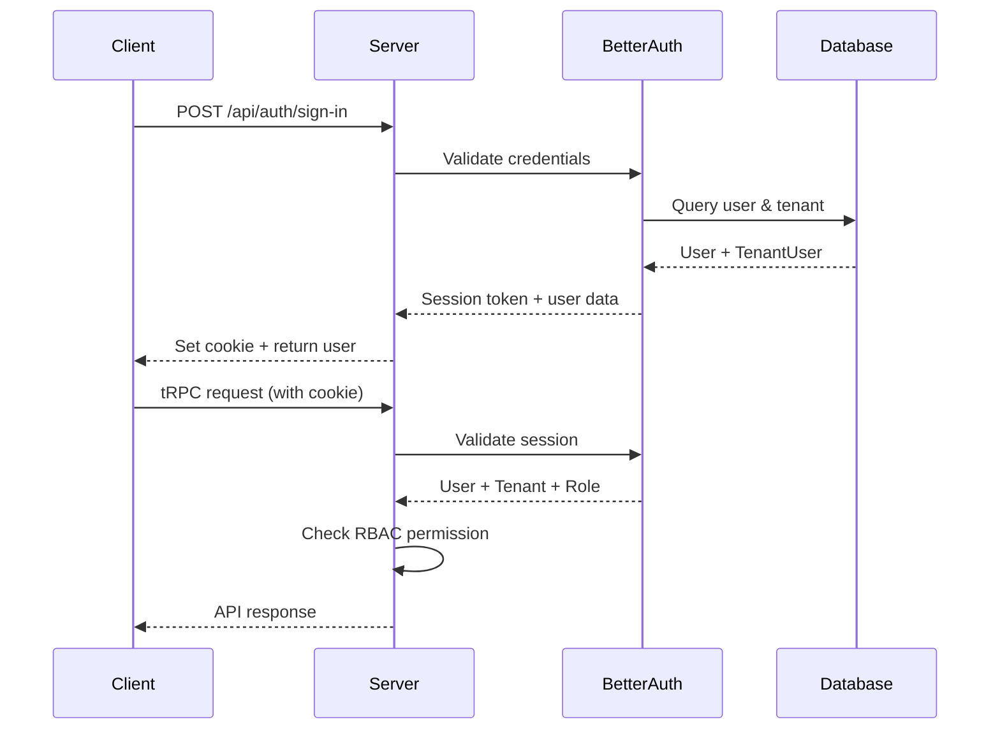

# GCMC-KAJ Platform API Documentation

**Last Updated:** 2025-11-16
**Version:** 1.0.0

## Table of Contents

- [Overview](#overview)
- [Authentication](#authentication)
- [Authorization (RBAC)](#authorization-rbac)
- [API Architecture](#api-architecture)
- [tRPC Routers](#trpc-routers)
- [Request/Response Patterns](#requestresponse-patterns)
- [Error Handling](#error-handling)
- [Rate Limiting & Caching](#rate-limiting--caching)
- [Code Examples](#code-examples)

## Overview

The GCMC-KAJ Platform API is built using **tRPC** (TypeScript Remote Procedure Call), providing end-to-end type-safe API communication between frontend and backend.

### Key Characteristics

- **Type-Safe:** Full TypeScript type inference from server to client
- **Multi-Tenant:** Automatic tenant isolation on all queries
- **RBAC Protected:** Role-based access control on all sensitive operations
- **Audit Logged:** All mutations are logged to audit trail
- **Schema Validated:** Input validation using Zod schemas

### API Endpoint

- **Base URL:** `http://localhost:3000` (development)
- **tRPC Endpoint:** `POST /api/trpc/*`
- **Health Check:** `GET /health`
- **Better-Auth:** `POST /api/auth/*`

## Authentication

### Authentication Provider: Better-Auth

The platform uses **Better-Auth 1.3.28** for authentication, providing:
- Email/password authentication
- Session-based auth with cookies
- JWT token generation
- Password reset flows
- OAuth provider support (configurable)

### Session Management

**Session Cookie:**
- **Name:** `better-auth.session_token`
- **HttpOnly:** Yes
- **Secure:** Yes (production)
- **SameSite:** Lax
- **Expiry:** Configurable (default: 7 days)

### Authentication Endpoints

All auth endpoints are handled by Better-Auth:

```
POST /api/auth/sign-in          # Sign in with email/password
POST /api/auth/sign-up          # Create new account
POST /api/auth/sign-out         # Sign out (invalidate session)
POST /api/auth/reset-password   # Request password reset
POST /api/auth/verify-email     # Verify email address
GET  /api/auth/session          # Get current session
```

### Authentication Flow



## Authorization (RBAC)

### Permission Model

The platform uses **module:action** permission format:

```
Format: module:action

Examples:
  clients:view
  clients:create
  clients:edit
  clients:delete
  documents:upload
  filings:submit
```

### Permission Modules

| Module | Actions | Description |
|--------|---------|-------------|
| `clients` | view, create, edit, delete | Client management |
| `clientBusinesses` | view, create, edit, delete | Business entity management |
| `documents` | view, create, edit, delete, upload | Document management |
| `documentTypes` | view, create, edit, delete | Document type configuration |
| `filings` | view, create, edit, delete, submit | Filing management |
| `filingTypes` | view, create, edit, delete | Filing type configuration |
| `services` | view, create, edit, delete | Service catalog |
| `serviceRequests` | view, create, edit, delete, assign | Service requests |
| `tasks` | view, create, edit, delete, assign | Task management |
| `users` | view, create, edit, delete | User management |
| `roles` | view, create, edit, delete | Role management |
| `tenants` | view, create, edit, delete | Tenant management |
| `reports` | view, generate, export | Reporting |
| `analytics` | view | Analytics dashboards |
| `compliance` | view, manage | Compliance rules |
| `notifications` | view, send | Notifications |

### RBAC Enforcement

**All protected procedures use RBAC:**

```typescript
// Procedure definition
rbacProcedure("clients", "view")
  .input(schema)
  .query(async ({ ctx, input }) => {
    // ctx.tenantId is automatically available
    // User must have clients:view permission
  });
```

### Tenant Isolation

**Every query is automatically scoped to tenant:**

```typescript
// All database queries include tenant filter
const where = { tenantId: ctx.tenantId };

// Example: Get clients for current tenant only
const clients = await prisma.client.findMany({
  where: { tenantId: ctx.tenantId },
});
```

## API Architecture

### Procedure Types

The API provides three procedure types:

| Procedure | Authentication | Authorization | Use Case |
|-----------|---------------|---------------|----------|
| `publicProcedure` | Not required | None | Health checks, public data |
| `protectedProcedure` | Required | Tenant membership | Authenticated operations |
| `rbacProcedure(module, action)` | Required | Specific permission | Protected business operations |

### Context Object

Every tRPC procedure receives a context object:

```typescript
interface Context {
  // Authentication
  session?: Session;          // Better-Auth session
  user?: User;               // Authenticated user

  // Multi-tenancy
  tenantId?: number;         // Current tenant ID
  tenant?: Tenant;           // Current tenant object
  role?: Role;               // User's role in tenant
}

// Protected procedures guarantee non-null values:
interface ProtectedContext {
  session: Session;
  user: User;
  tenantId: number;
  tenant: Tenant;
  role: Role;
}
```

## tRPC Routers

The API consists of **24 routers** organized by domain:

### Core Business Routers

#### 1. Users Router (`users`)

**Procedures:**
- `list` - List users (RBAC: users:view)
- `get` - Get single user (RBAC: users:view)
- `create` - Create user (RBAC: users:create)
- `update` - Update user (RBAC: users:edit)
- `delete` - Delete user (RBAC: users:delete)
- `inviteToTenant` - Invite user to tenant (RBAC: users:create)

**Input Schemas:**
```typescript
// Create/Update user
{
  name: string;
  email: string;
  phone?: string;
  avatarUrl?: string;
}

// Invite to tenant
{
  email: string;
  roleId: number;
}
```

#### 2. Tenants Router (`tenants`)

**Procedures:**
- `list` - List tenants (RBAC: tenants:view)
- `get` - Get tenant details (RBAC: tenants:view)
- `create` - Create tenant (RBAC: tenants:create)
- `update` - Update tenant (RBAC: tenants:edit)
- `delete` - Delete tenant (RBAC: tenants:delete)

**Input Schemas:**
```typescript
{
  name: string;
  code: string;          // Unique tenant code
  contactInfo?: {        // JSON object
    email?: string;
    phone?: string;
    address?: string;
  };
  settings?: {           // JSON object
    // Tenant-specific settings
  };
}
```

#### 3. Roles Router (`roles`)

**Procedures:**
- `list` - List roles (RBAC: roles:view)
- `get` - Get role with permissions (RBAC: roles:view)
- `create` - Create role (RBAC: roles:create)
- `update` - Update role (RBAC: roles:edit)
- `delete` - Delete role (RBAC: roles:delete)
- `updatePermissions` - Update role permissions (RBAC: roles:edit)

**Input Schemas:**
```typescript
// Create/Update role
{
  name: string;
  description?: string;
}

// Update permissions
{
  roleId: number;
  permissions: Array<{
    module: string;
    action: string;
    allowed: boolean;
  }>;
}
```

### Client Management Routers

#### 4. Clients Router (`clients`)

**Procedures:**
- `list` - List clients with filters (RBAC: clients:view)
- `get` - Get client details (RBAC: clients:view)
- `create` - Create client (RBAC: clients:create)
- `update` - Update client (RBAC: clients:edit)
- `delete` - Delete client (RBAC: clients:delete)
- `stats` - Get client statistics (RBAC: clients:view)

**Input Schemas:**
```typescript
{
  name: string;
  type: "individual" | "company" | "partnership";
  email?: string;
  phone?: string;
  address?: string;
  tin?: string;              // Tax Identification Number
  nisNumber?: string;        // National Insurance Scheme
  sector?: string;
  riskLevel?: "low" | "medium" | "high";
  notes?: string;
}
```

**List Filters:**
```typescript
{
  search?: string;           // Search name, email, TIN, NIS
  type?: string;             // Filter by client type
  sector?: string;           // Filter by sector
  riskLevel?: string;        // Filter by risk level
  page?: number;             // Page number (default: 1)
  pageSize?: number;         // Items per page (default: 20)
}
```

#### 5. Client Businesses Router (`clientBusinesses`)

**Procedures:**
- `list` - List businesses (RBAC: clientBusinesses:view)
- `get` - Get business details (RBAC: clientBusinesses:view)
- `create` - Create business (RBAC: clientBusinesses:create)
- `update` - Update business (RBAC: clientBusinesses:edit)
- `delete` - Delete business (RBAC: clientBusinesses:delete)

**Input Schemas:**
```typescript
{
  clientId: number;
  name: string;
  registrationNumber?: string;
  registrationType?: string;
  incorporationDate?: string;  // ISO datetime
  country?: string;
  sector?: string;
  status?: string;
}
```

### Document Management Routers

#### 6. Documents Router (`documents`)

**Procedures:**
- `list` - List documents (RBAC: documents:view)
- `get` - Get document with versions (RBAC: documents:view)
- `create` - Create document (RBAC: documents:create)
- `update` - Update document (RBAC: documents:edit)
- `delete` - Delete document (RBAC: documents:delete)
- `expiring` - Get expiring documents (RBAC: documents:view)
- `stats` - Get document statistics (RBAC: documents:view)

**Input Schemas:**
```typescript
{
  clientId: number;
  clientBusinessId?: number;
  documentTypeId: number;
  title: string;
  description?: string;
  status: "valid" | "expired" | "pending_review" | "rejected";
  authority?: string;
  tags?: string[];
}
```

#### 7. Document Types Router (`documentTypes`)

**Procedures:**
- `list` - List document types (RBAC: documentTypes:view)
- `get` - Get document type (RBAC: documentTypes:view)
- `create` - Create document type (RBAC: documentTypes:create)
- `update` - Update document type (RBAC: documentTypes:edit)
- `delete` - Delete document type (RBAC: documentTypes:delete)

**Input Schemas:**
```typescript
{
  name: string;
  category: string;          // e.g., "license", "permit", "certificate"
  description?: string;
  tags?: string[];
  authority?: string;        // Issuing authority
  metadata?: object;         // Custom metadata
}
```

#### 8. Document Upload Router (`documentUpload`)

**Procedures:**
- `generateUploadUrl` - Generate pre-signed URL (RBAC: documents:upload)
- `createDocumentVersion` - Create document version after upload (RBAC: documents:upload)

**Input Schemas:**
```typescript
// Generate upload URL
{
  fileName: string;
  fileType: string;
  fileSize: number;
}

// Create version
{
  documentId: number;
  fileUrl: string;
  storageProvider: string;
  fileSize?: number;
  mimeType?: string;
  issueDate?: string;
  expiryDate?: string;
  issuingAuthority?: string;
  metadata?: object;
}
```

### Filing Management Routers

#### 9. Filings Router (`filings`)

**Procedures:**
- `list` - List filings (RBAC: filings:view)
- `get` - Get filing details (RBAC: filings:view)
- `create` - Create filing (RBAC: filings:create)
- `update` - Update filing (RBAC: filings:edit)
- `delete` - Delete filing (RBAC: filings:delete)
- `submit` - Submit filing to authority (RBAC: filings:submit)
- `overdue` - Get overdue filings (RBAC: filings:view)

**Input Schemas:**
```typescript
{
  clientId: number;
  clientBusinessId?: number;
  filingTypeId: number;
  periodStart?: string;      // ISO datetime
  periodEnd?: string;        // ISO datetime
  periodLabel?: string;      // e.g., "Q1 2024"
  status: "draft" | "prepared" | "submitted" | "approved" | "rejected" | "overdue" | "archived";
  referenceNumber?: string;
  taxAmount?: number;
  penalties?: number;
  interest?: number;
  total?: number;
  submissionDate?: string;
  approvalDate?: string;
  internalNotes?: string;
}
```

#### 10. Filing Types Router (`filingTypes`)

**Procedures:**
- `list` - List filing types (RBAC: filingTypes:view)
- `get` - Get filing type (RBAC: filingTypes:view)
- `create` - Create filing type (RBAC: filingTypes:create)
- `update` - Update filing type (RBAC: filingTypes:edit)
- `delete` - Delete filing type (RBAC: filingTypes:delete)

**Input Schemas:**
```typescript
{
  name: string;
  code: string;              // Unique code (e.g., "GRA_VAT")
  authority: string;         // e.g., "GRA", "NIS", "DCRA"
  frequency: "monthly" | "quarterly" | "annual" | "one_off";
  defaultDueDay?: number;    // Day of month
  defaultDueMonth?: number;  // Month (1-12)
  description?: string;
}
```

#### 11. Recurring Filings Router (`recurringFilings`)

**Procedures:**
- `list` - List recurring filings (RBAC: filings:view)
- `get` - Get recurring filing (RBAC: filings:view)
- `create` - Create recurring filing (RBAC: filings:create)
- `update` - Update recurring filing (RBAC: filings:edit)
- `delete` - Delete recurring filing (RBAC: filings:delete)
- `activate` - Activate recurring filing (RBAC: filings:edit)
- `deactivate` - Deactivate recurring filing (RBAC: filings:edit)

### Service Management Routers

#### 12. Services Router (`services`)

**Procedures:**
- `list` - List services (RBAC: services:view)
- `get` - Get service (RBAC: services:view)
- `create` - Create service (RBAC: services:create)
- `update` - Update service (RBAC: services:edit)
- `delete` - Delete service (RBAC: services:delete)

**Input Schemas:**
```typescript
{
  name: string;
  category: string;          // e.g., "registration", "filing", "advisory"
  description?: string;
  basePrice?: number;
  estimatedDays?: number;
  active: boolean;
}
```

#### 13. Service Requests Router (`serviceRequests`)

**Procedures:**
- `list` - List service requests (RBAC: serviceRequests:view)
- `get` - Get service request with steps (RBAC: serviceRequests:view)
- `create` - Create service request (RBAC: serviceRequests:create)
- `update` - Update service request (RBAC: serviceRequests:edit)
- `delete` - Delete service request (RBAC: serviceRequests:delete)
- `updateStep` - Update service step (RBAC: serviceRequests:edit)

**Input Schemas:**
```typescript
{
  clientId: number;
  clientBusinessId?: number;
  serviceId: number;
  templateId?: number;
  status: "new" | "in_progress" | "awaiting_client" | "awaiting_authority" | "completed" | "cancelled";
  priority?: "low" | "medium" | "high";
  metadata?: object;
}
```

### Operational Routers

#### 14. Tasks Router (`tasks`)

**Procedures:**
- `list` - List tasks (RBAC: tasks:view)
- `get` - Get task (RBAC: tasks:view)
- `create` - Create task (RBAC: tasks:create)
- `update` - Update task (RBAC: tasks:edit)
- `delete` - Delete task (RBAC: tasks:delete)
- `assign` - Assign task to user (RBAC: tasks:assign)
- `myTasks` - Get current user's tasks (Protected)

**Input Schemas:**
```typescript
{
  clientId?: number;
  serviceRequestId?: number;
  filingId?: number;
  title: string;
  description?: string;
  status: "open" | "in_progress" | "blocked" | "completed";
  priority?: "low" | "medium" | "high";
  dueDate?: string;
  assignedToId?: string;
}
```

#### 15. Conversations Router (`conversations`)

**Procedures:**
- `list` - List conversations (RBAC: conversations:view)
- `get` - Get conversation with messages (RBAC: conversations:view)
- `create` - Create conversation (RBAC: conversations:create)
- `sendMessage` - Send message (RBAC: conversations:send)
- `markAsRead` - Mark messages as read (Protected)

#### 16. Notifications Router (`notifications`)

**Procedures:**
- `list` - List notifications (RBAC: notifications:view)
- `myNotifications` - Get current user's notifications (Protected)
- `markAsRead` - Mark notification as read (Protected)
- `send` - Send notification (RBAC: notifications:send)

### Compliance & Requirements Routers

#### 17. Compliance Rules Router (`complianceRules`)

**Procedures:**
- `listRuleSets` - List rule sets (RBAC: compliance:view)
- `getRuleSet` - Get rule set with rules (RBAC: compliance:view)
- `createRuleSet` - Create rule set (RBAC: compliance:manage)
- `updateRuleSet` - Update rule set (RBAC: compliance:manage)
- `deleteRuleSet` - Delete rule set (RBAC: compliance:manage)
- `calculateScore` - Calculate compliance score (RBAC: compliance:view)

#### 18. Requirement Bundles Router (`requirementBundles`)

**Procedures:**
- `list` - List requirement bundles (RBAC: compliance:view)
- `get` - Get bundle with items (RBAC: compliance:view)
- `create` - Create bundle (RBAC: compliance:manage)
- `update` - Update bundle (RBAC: compliance:manage)
- `delete` - Delete bundle (RBAC: compliance:manage)
- `checkCompliance` - Check client compliance (RBAC: compliance:view)

### Analytics & Reporting Routers

#### 19. Dashboard Router (`dashboard`)

**Procedures:**
- `overview` - Get dashboard overview (Protected)
- `recentActivity` - Get recent activity (Protected)
- `upcomingDeadlines` - Get upcoming deadlines (Protected)

#### 20. Analytics Router (`analytics`)

**Procedures:**
- `clientMetrics` - Client analytics (RBAC: analytics:view)
- `filingMetrics` - Filing analytics (RBAC: analytics:view)
- `documentMetrics` - Document analytics (RBAC: analytics:view)
- `revenueMetrics` - Revenue analytics (RBAC: analytics:view)

#### 21. Reports Router (`reports`)

**Procedures:**
- `generateClientReport` - Generate client PDF report (RBAC: reports:generate)
- `generateFilingReport` - Generate filing report (RBAC: reports:generate)
- `exportData` - Export data to CSV/Excel (RBAC: reports:export)

### Client-Facing & Wizards Routers

#### 22. Portal Router (`portal`)

**Procedures:**
- `getClientData` - Get client's own data (Protected)
- `getDocuments` - Get client's documents (Protected)
- `getFilings` - Get client's filings (Protected)
- `getTasks` - Get client's tasks (Protected)
- `submitTask` - Submit client task (Protected)

#### 23. Wizards Router (`wizards`)

**Procedures:**
- `businessRegistration` - Business registration wizard (RBAC: services:create)
- `documentCollection` - Document collection wizard (RBAC: documents:create)
- `filingPreparation` - Filing preparation wizard (RBAC: filings:create)

## Request/Response Patterns

### Pagination

**All list endpoints support pagination:**

```typescript
// Request
{
  page: 1,              // Page number (1-based)
  pageSize: 20          // Items per page
}

// Response
{
  items: [...],         // Array of items
  pagination: {
    page: 1,
    pageSize: 20,
    total: 150,
    totalPages: 8
  }
}
```

### Filtering & Search

**Common filter patterns:**

```typescript
{
  search: "keyword",          // Full-text search
  status: "active",           // Exact match
  startDate: "2024-01-01",   // Date range start
  endDate: "2024-12-31",     // Date range end
  clientId: 123,             // Foreign key filter
  page: 1,
  pageSize: 20
}
```

### Includes & Relations

**Responses include related data:**

```typescript
// Document response includes:
{
  id: 1,
  title: "Business License",
  client: {
    id: 5,
    name: "ABC Company"
  },
  documentType: {
    id: 3,
    name: "Business Registration"
  },
  latestVersion: {
    fileUrl: "...",
    expiryDate: "2025-12-31"
  },
  _count: {
    versions: 3
  }
}
```

### Tenant Isolation

**All responses are automatically scoped:**

```typescript
// Client A (tenantId: 1) only sees their data
// Client B (tenantId: 2) only sees their data
// Even if they query the same endpoint
```

## Error Handling

### tRPC Error Codes

| Code | HTTP Status | Description | When to Use |
|------|-------------|-------------|-------------|
| `UNAUTHORIZED` | 401 | Not authenticated | Missing/invalid session |
| `FORBIDDEN` | 403 | Not authorized | No permission or wrong tenant |
| `NOT_FOUND` | 404 | Resource not found | Entity doesn't exist |
| `BAD_REQUEST` | 400 | Invalid input | Validation errors |
| `CONFLICT` | 409 | Resource conflict | Duplicate key, constraint violation |
| `INTERNAL_SERVER_ERROR` | 500 | Server error | Unexpected errors |

### Error Response Format

```typescript
{
  error: {
    code: "NOT_FOUND",
    message: "Client not found",
    data: {
      code: "NOT_FOUND",
      httpStatus: 404,
      path: "clients.get",
      cause: "No client with ID 123 in tenant 1"
    }
  }
}
```

### Input Validation Errors

```typescript
{
  error: {
    code: "BAD_REQUEST",
    message: "Validation error",
    data: {
      zodError: {
        issues: [
          {
            code: "invalid_type",
            expected: "string",
            received: "undefined",
            path: ["name"],
            message: "Name is required"
          }
        ]
      }
    }
  }
}
```

## Rate Limiting & Caching

### Rate Limiting

**Currently not implemented.** Recommended for production:

- 100 requests per minute per IP
- 1000 requests per hour per user
- Use Redis for distributed rate limiting

### Caching Strategy

**TanStack Query (React Query) handles client-side caching:**

```typescript
// Default cache times
{
  staleTime: 5 * 60 * 1000,      // 5 minutes
  cacheTime: 30 * 60 * 1000,     // 30 minutes
}

// Queries are automatically cached by key
// Mutations invalidate related queries
```

**Server-side caching:**
- Not currently implemented
- Consider Redis caching for:
  - Dashboard statistics
  - Analytics aggregations
  - Frequently accessed reference data

## Code Examples

### Frontend Usage (React)

```typescript
import { api } from "@/lib/trpc";

// List clients
function ClientList() {
  const { data, isLoading } = api.clients.list.useQuery({
    search: "ABC",
    page: 1,
    pageSize: 20,
  });

  if (isLoading) return <div>Loading...</div>;

  return (
    <div>
      {data?.clients.map(client => (
        <div key={client.id}>{client.name}</div>
      ))}
    </div>
  );
}

// Create client
function CreateClientForm() {
  const createMutation = api.clients.create.useMutation({
    onSuccess: () => {
      // Invalidate clients list
      utils.clients.list.invalidate();
    },
  });

  const handleSubmit = (data) => {
    createMutation.mutate({
      name: data.name,
      type: "company",
      email: data.email,
    });
  };

  // ... form JSX
}

// Get single client
function ClientDetail({ id }: { id: number }) {
  const { data: client } = api.clients.get.useQuery({ id });

  return <div>{client?.name}</div>;
}
```

### Backend Router Definition

```typescript
import { rbacProcedure, router } from "../index";
import { z } from "zod";
import prisma from "@GCMC-KAJ/db";

export const clientsRouter = router({
  list: rbacProcedure("clients", "view")
    .input(z.object({
      search: z.string().optional(),
      page: z.number().default(1),
      pageSize: z.number().default(20),
    }))
    .query(async ({ ctx, input }) => {
      const where = { tenantId: ctx.tenantId };

      if (input.search) {
        where.OR = [
          { name: { contains: input.search, mode: "insensitive" } },
          { email: { contains: input.search, mode: "insensitive" } },
        ];
      }

      const [clients, total] = await Promise.all([
        prisma.client.findMany({ where }),
        prisma.client.count({ where }),
      ]);

      return { clients, pagination: { total } };
    }),

  create: rbacProcedure("clients", "create")
    .input(z.object({
      name: z.string(),
      type: z.enum(["individual", "company", "partnership"]),
      email: z.string().email().optional(),
    }))
    .mutation(async ({ ctx, input }) => {
      const client = await prisma.client.create({
        data: {
          ...input,
          tenantId: ctx.tenantId,
        },
      });

      // Audit log
      await prisma.auditLog.create({
        data: {
          tenantId: ctx.tenantId,
          actorUserId: ctx.user.id,
          entityType: "client",
          entityId: client.id,
          action: "create",
          changes: { created: input },
        },
      });

      return client;
    }),
});
```

### Middleware & Context

```typescript
// Context creation (apps/server)
export async function createContext({ req }: { req: Request }) {
  const session = await auth.api.getSession({ headers: req.headers });

  if (!session?.user) {
    return { session: null, user: null };
  }

  // Get tenant and role for user
  const tenantUser = await prisma.tenantUser.findFirst({
    where: { userId: session.user.id },
    include: { tenant: true, role: true },
  });

  return {
    session: session.session,
    user: session.user,
    tenantId: tenantUser?.tenantId,
    tenant: tenantUser?.tenant,
    role: tenantUser?.role,
  };
}
```

## Cross-References

- **Project Structure:** See [PROJECT_STRUCTURE.md](./PROJECT_STRUCTURE.md)
- **Technology Stack:** See [TECH_STACK.md](./TECH_STACK.md)
- **Database Schema:** See [DATABASE_SCHEMA.md](./DATABASE_SCHEMA.md)
- **Deployment Guide:** See [DEPLOYMENT.md](./DEPLOYMENT.md)
