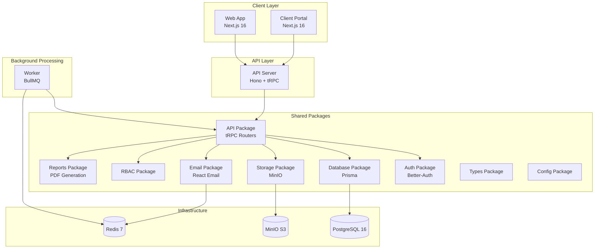
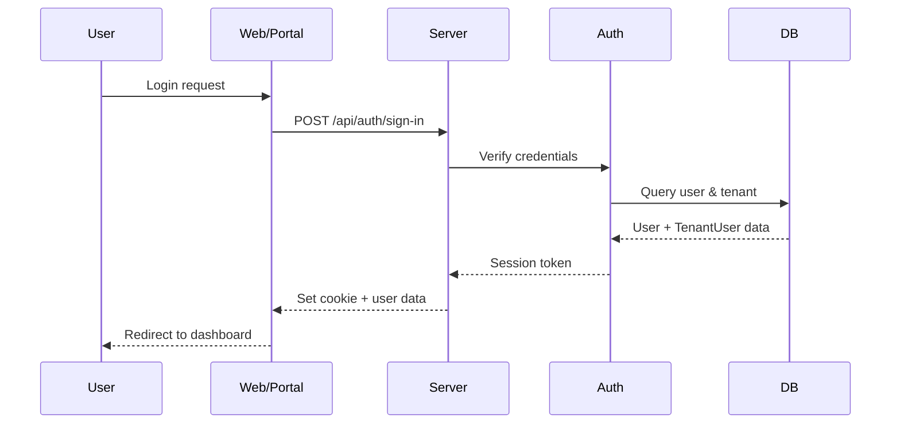
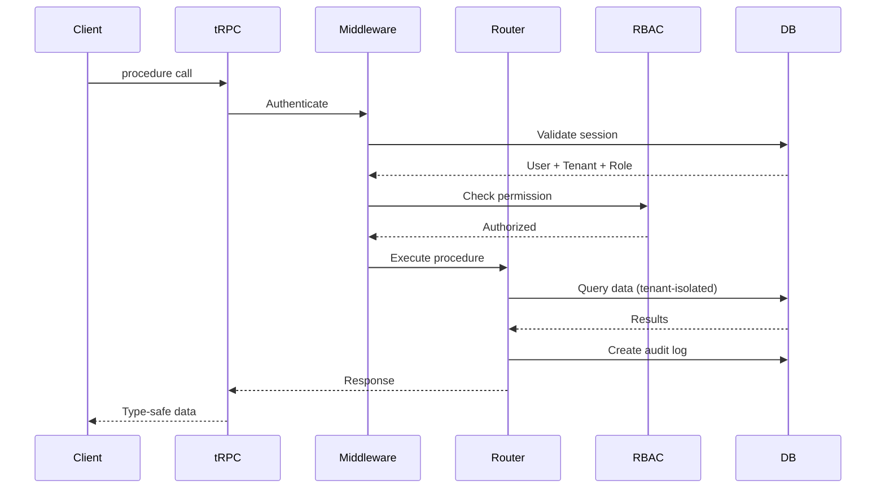
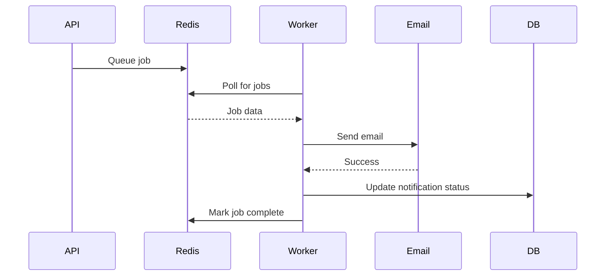

# GCMC-KAJ Platform Project Structure

**Last Updated:** 2025-11-16
**Version:** 1.0.0

## Table of Contents

- [Overview](#overview)
- [Architecture](#architecture)
- [Directory Structure](#directory-structure)
- [Applications](#applications)
- [Packages](#packages)
- [Data Flow](#data-flow)
- [Entry Points](#entry-points)

## Overview

The GCMC-KAJ Platform is a **multi-tenant SaaS platform** for compliance and business management, built using a **monorepo architecture** with **Turborepo**. The platform consists of 4 applications and 11 shared packages, all managed using Bun workspaces.

### Key Characteristics

- **Runtime:** Bun (v1.2.18+)
- **Build System:** Turborepo
- **Architecture:** Monorepo with workspace packages
- **Deployment:** Docker Compose (development & production)
- **Multi-Tenancy:** Tenant-isolated data with RBAC

## Architecture



## Directory Structure

```
kaj-gcmc-bts/
├── apps/                       # Application layer
│   ├── web/                   # Admin web application
│   ├── portal/                # Client-facing portal
│   ├── server/                # API server (Hono + tRPC)
│   └── worker/                # Background job processor
├── packages/                   # Shared packages
│   ├── api/                   # tRPC API routers & procedures
│   ├── auth/                  # Authentication (Better-Auth)
│   ├── db/                    # Database (Prisma)
│   ├── storage/               # File storage (MinIO)
│   ├── email/                 # Email templates & sender
│   ├── rbac/                  # Role-based access control
│   ├── reports/               # PDF report generation
│   ├── types/                 # Shared TypeScript types
│   └── config/                # Shared configuration
├── docs/                       # Documentation
│   ├── deployment/            # Deployment guides
│   └── development/           # Development guides
├── .github/                    # GitHub workflows
├── .husky/                     # Git hooks
├── docker-compose.yml         # Development docker setup
├── docker-compose.prod.yml    # Production docker setup
├── turbo.json                 # Turborepo configuration
├── package.json               # Root package.json
└── bun.lock                   # Bun lockfile
```

## Applications

### 1. Web (`apps/web`)

**Purpose:** Internal admin dashboard for managing clients, documents, filings, and compliance.

**Technology Stack:**
- **Framework:** Next.js 16 (App Router)
- **UI:** React 19.2, Tailwind CSS 4, Radix UI
- **State Management:** TanStack Query (React Query)
- **Forms:** TanStack React Form
- **Charts:** Recharts
- **PDF Export:** jsPDF, html2canvas

**Key Features:**
- Multi-tenant admin dashboard
- Client and business management
- Document management with versioning
- Filing tracking and submission
- Service request workflows
- Compliance monitoring
- Analytics and reporting
- RBAC-based access control

**Port:** 3001

**Entry Point:** `apps/web/src/app/layout.tsx`

**Key Directories:**
```
apps/web/
├── src/
│   ├── app/              # Next.js App Router pages
│   ├── components/       # React components
│   ├── lib/             # Utilities and helpers
│   └── styles/          # Global styles
├── public/              # Static assets
└── package.json
```

### 2. Portal (`apps/portal`)

**Purpose:** Client-facing portal for viewing documents, filings, and submitting requests.

**Technology Stack:**
- **Framework:** Next.js 16 (App Router)
- **UI:** React 19.2, Tailwind CSS 4, Radix UI
- **State Management:** TanStack Query (React Query)
- **Forms:** TanStack React Form

**Key Features:**
- Client self-service portal
- Document viewing and download
- Filing status tracking
- Service request submission
- Task management
- Notifications and messages

**Port:** 3002

**Entry Point:** `apps/portal/src/app/layout.tsx`

**Key Directories:**
```
apps/portal/
├── src/
│   ├── app/              # Next.js App Router pages
│   ├── components/       # React components
│   └── lib/             # Utilities and helpers
└── package.json
```

### 3. Server (`apps/server`)

**Purpose:** API server providing tRPC endpoints for web and portal applications.

**Technology Stack:**
- **Framework:** Hono 4.8.2 (lightweight web framework)
- **API:** tRPC 11.5.0 (type-safe API)
- **Runtime:** Bun
- **Authentication:** Better-Auth 1.3.28

**Key Features:**
- RESTful health check endpoints
- tRPC API with type-safe procedures
- JWT-based authentication
- Tenant isolation middleware
- RBAC authorization
- Request logging and error handling
- CORS configuration

**Port:** 3000

**Entry Point:** `apps/server/src/index.ts`

**Key Files:**
```
apps/server/
├── src/
│   ├── index.ts          # Server initialization
│   └── Dockerfile        # Production Docker build
└── package.json
```

**Example Routes:**
- `GET /health` - Health check
- `POST /api/trpc/*` - tRPC procedures
- `POST /api/auth/*` - Better-Auth endpoints

### 4. Worker (`apps/worker`)

**Purpose:** Background job processor for async tasks using BullMQ.

**Technology Stack:**
- **Queue:** BullMQ 5.34.2
- **Redis Client:** IORedis 5.4.1
- **Runtime:** Bun

**Key Features:**
- Email sending queue
- Document processing
- Scheduled compliance checks
- Report generation
- Notification dispatch
- Recurring filing automation

**Port:** 3002 (health check)

**Entry Point:** `apps/worker/src/index.ts`

**Job Queues:**
- `email-queue` - Email sending jobs
- `compliance-queue` - Compliance calculation jobs
- `document-queue` - Document processing jobs
- `notification-queue` - Notification dispatch

## Packages

### 1. API (`packages/api`)

**Purpose:** Centralized tRPC API routers and procedures.

**Key Features:**
- 24 tRPC routers covering all business domains
- RBAC-protected procedures
- Tenant-isolated queries
- Audit logging
- Input validation with Zod

**Router Categories:**
- **Core:** `users`, `tenants`, `roles`
- **Client Management:** `clients`, `clientBusinesses`
- **Documents:** `documents`, `documentTypes`, `documentUpload`
- **Filings:** `filings`, `filingTypes`, `recurringFilings`
- **Services:** `services`, `serviceRequests`
- **Operations:** `tasks`, `conversations`, `notifications`
- **Compliance:** `complianceRules`, `requirementBundles`
- **Analytics:** `dashboard`, `analytics`, `reports`
- **Wizards:** `wizards`, `portal`

**Exports:**
```typescript
export { appRouter, type AppRouter } from './routers';
export { protectedProcedure, rbacProcedure, publicProcedure, router } from './index';
```

### 2. Auth (`packages/auth`)

**Purpose:** Authentication and authorization using Better-Auth.

**Key Features:**
- Email/password authentication
- Session management
- OAuth providers (configurable)
- Multi-tenant user management
- JWT token generation
- Password reset flows

**Key Files:**
```
packages/auth/
├── src/
│   ├── index.ts          # Auth instance
│   └── config.ts         # Auth configuration
└── package.json
```

### 3. Database (`packages/db`)

**Purpose:** Database access layer using Prisma ORM.

**Key Features:**
- PostgreSQL database connection
- Prisma schema with 30+ models
- Multi-tenant data isolation
- Migrations and seeding
- Type-safe database queries

**Key Files:**
```
packages/db/
├── prisma/
│   └── schema/
│       └── schema.prisma  # Database schema
├── src/
│   └── index.ts           # Prisma client export
└── package.json
```

**Database Scripts:**
- `db:push` - Push schema changes
- `db:studio` - Open Prisma Studio
- `db:generate` - Generate Prisma Client
- `db:migrate` - Run migrations

### 4. Storage (`packages/storage`)

**Purpose:** File storage abstraction for MinIO (S3-compatible).

**Key Features:**
- S3-compatible object storage
- Multi-tenant bucket isolation
- Pre-signed URL generation
- File upload/download
- Metadata management

**Storage Structure:**
```
MinIO Buckets:
├── tenant-1-documents/
├── tenant-2-documents/
└── tenant-N-documents/
```

### 5. Email (`packages/email`)

**Purpose:** Email template rendering and sending.

**Technology:**
- **Templates:** React Email
- **Rendering:** @react-email/render
- **Provider:** Resend (or SMTP)

**Email Templates:**
- Welcome emails
- Password reset
- Document expiry alerts
- Filing reminders
- Task assignments
- Service request updates

### 6. RBAC (`packages/rbac`)

**Purpose:** Role-based access control utilities.

**Key Features:**
- Permission checking
- Role validation
- Module-action mapping
- Tenant-aware permissions

**Permission Format:**
```
module:action
Examples:
- clients:view
- clients:create
- clients:edit
- clients:delete
- documents:view
- filings:submit
```

### 7. Reports (`packages/reports`)

**Purpose:** PDF report generation using React PDF.

**Key Features:**
- Client compliance reports
- Filing summary reports
- Document inventory reports
- Analytics exports
- Custom report templates

### 8. Types (`packages/types`)

**Purpose:** Shared TypeScript type definitions.

**Exports:**
- API types
- Database types
- Common interfaces
- Utility types

### 9. Config (`packages/config`)

**Purpose:** Shared configuration and build tooling.

**Includes:**
- TypeScript configuration
- Biome configuration
- Build configs

## Data Flow

### Authentication Flow



### API Request Flow



### Background Job Flow



## Entry Points

### Development

```bash
# Start all services
bun dev

# Start specific services
bun dev:web       # Web app on :3001
bun dev:server    # API server on :3000
bun dev:worker    # Worker process
```

### Production (Docker)

```bash
# Build and start all services
docker compose -f docker-compose.prod.yml up -d

# Services:
# - postgres:5432    (PostgreSQL)
# - redis:6379       (Redis)
# - minio:9000       (MinIO API)
# - minio:9001       (MinIO Console)
# - api:3000         (API Server)
# - web:3001         (Web App)
# - worker:3002      (Worker + Health)
```

### Key Files

| File | Purpose |
|------|---------|
| `apps/server/src/index.ts` | API server entry point |
| `apps/web/src/app/layout.tsx` | Web app root layout |
| `apps/portal/src/app/layout.tsx` | Portal app root layout |
| `apps/worker/src/index.ts` | Worker process entry point |
| `packages/api/src/routers/index.ts` | tRPC router aggregation |
| `packages/db/prisma/schema/schema.prisma` | Database schema |
| `packages/auth/src/index.ts` | Auth configuration |

## Cross-References

- **Technology Stack:** See [TECH_STACK.md](./TECH_STACK.md)
- **API Documentation:** See [API_DOCUMENTATION.md](./API_DOCUMENTATION.md)
- **Database Schema:** See [DATABASE_SCHEMA.md](./DATABASE_SCHEMA.md)
- **Deployment Guide:** See [DEPLOYMENT.md](./DEPLOYMENT.md)
