# Technical Architecture Guide

## 🏗️ System Architecture Deep Dive

### Turborepo Monorepo Structure

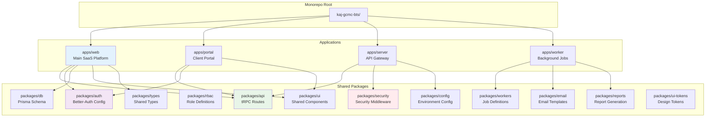

### tRPC API Architecture

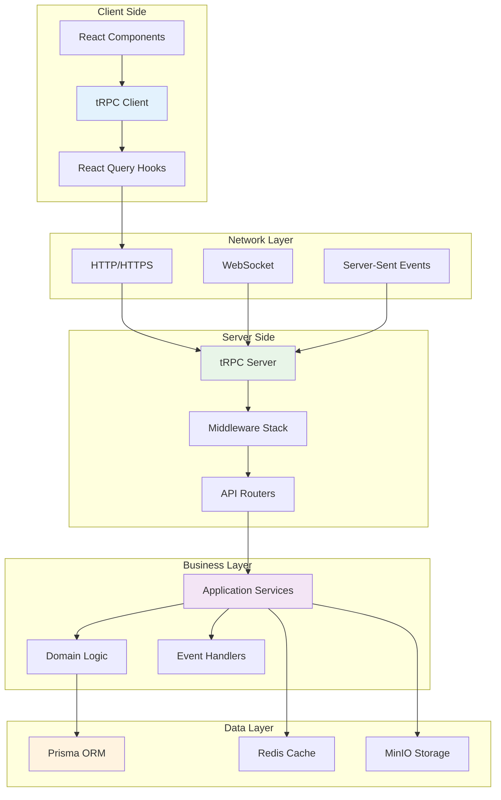

### Authentication & Session Management

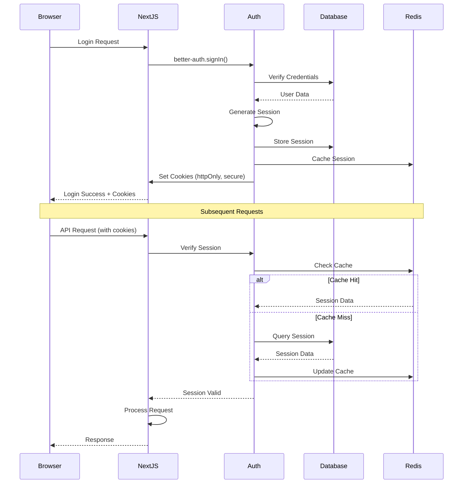

### Background Job Processing

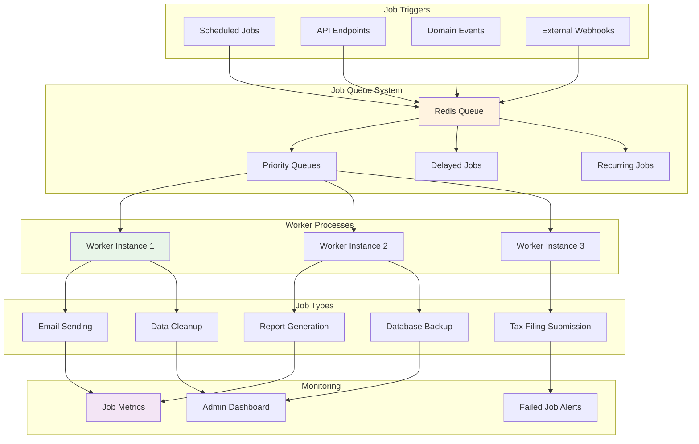

### Document Management System

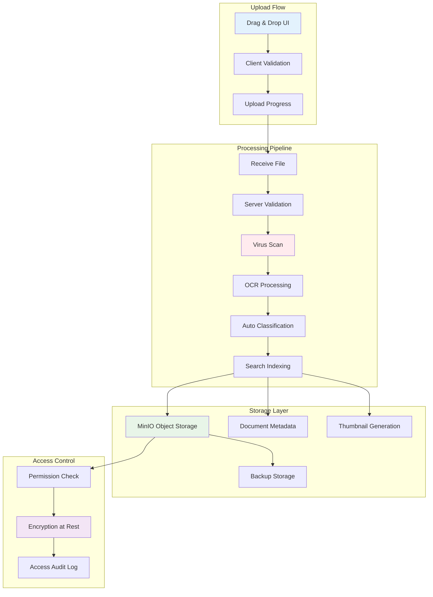

## 🗄️ Database Design Patterns

### Multi-Tenant Data Isolation

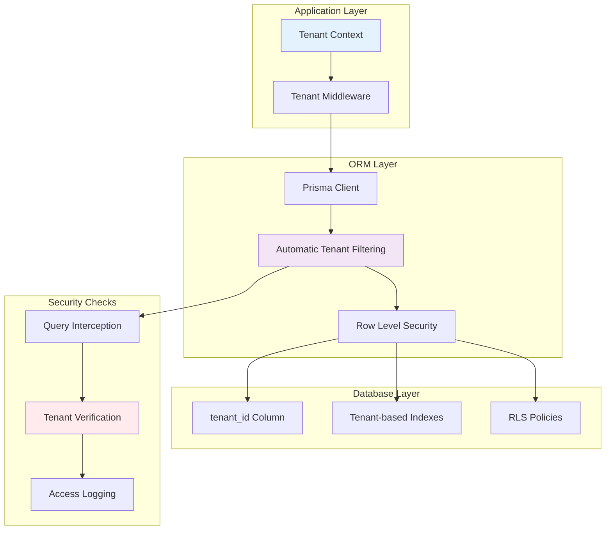

### Database Connection Management

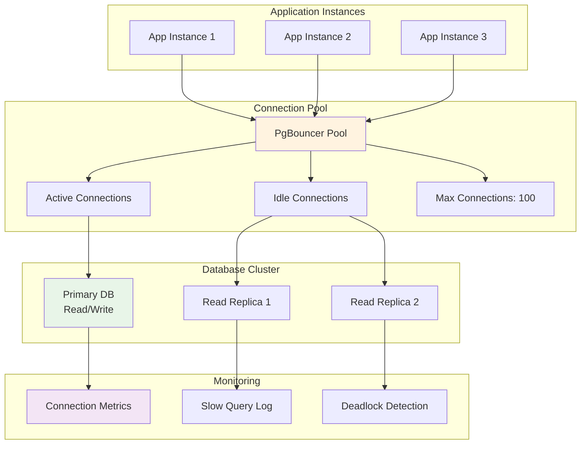

## 🔄 API Design Patterns

### Request/Response Flow

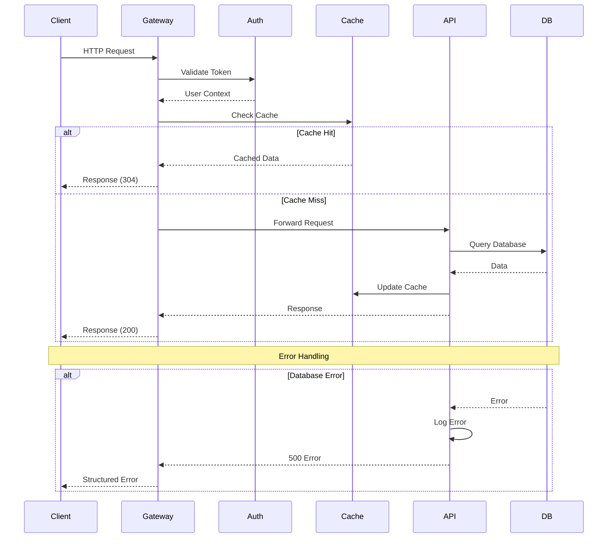

### Error Handling Strategy

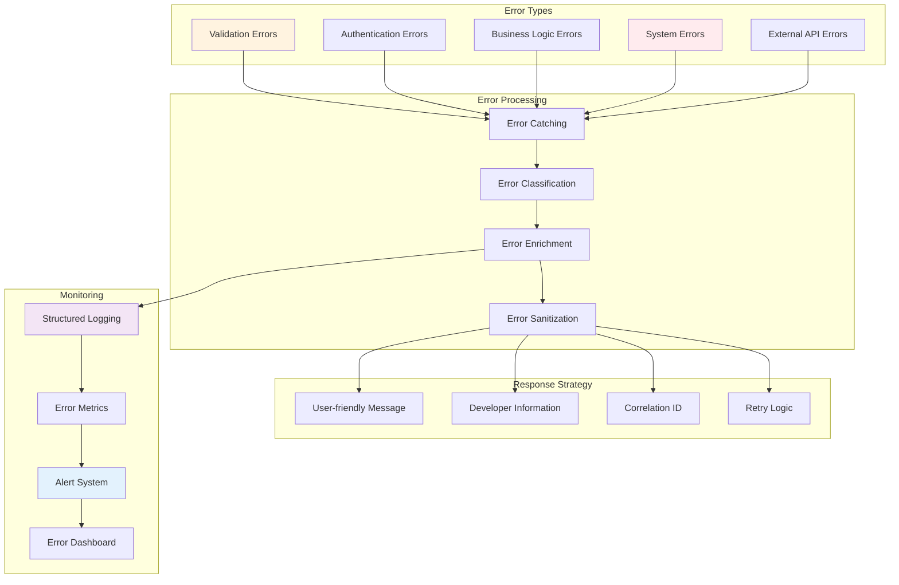

## 📊 Performance Optimization

### Caching Hierarchy

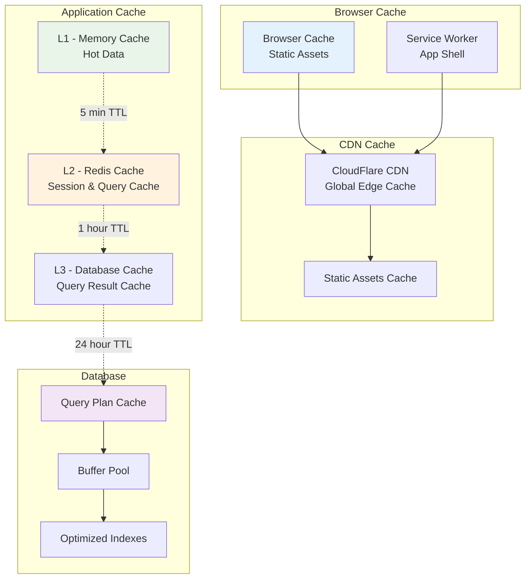

### Load Balancing Strategy

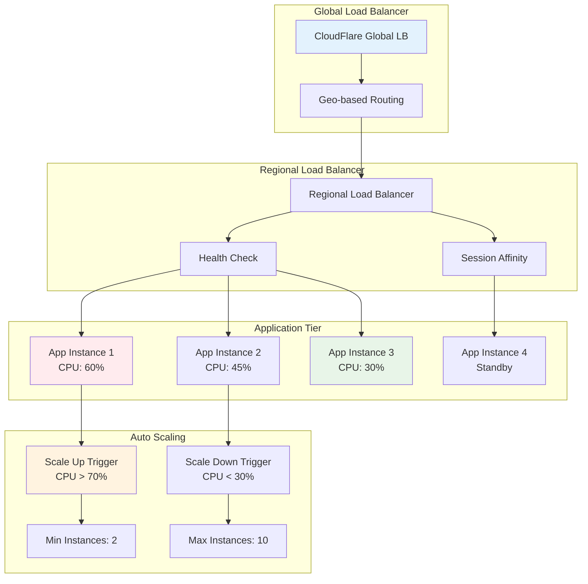

## 🔐 Security Implementation

### OAuth 2.1 & OIDC Flow

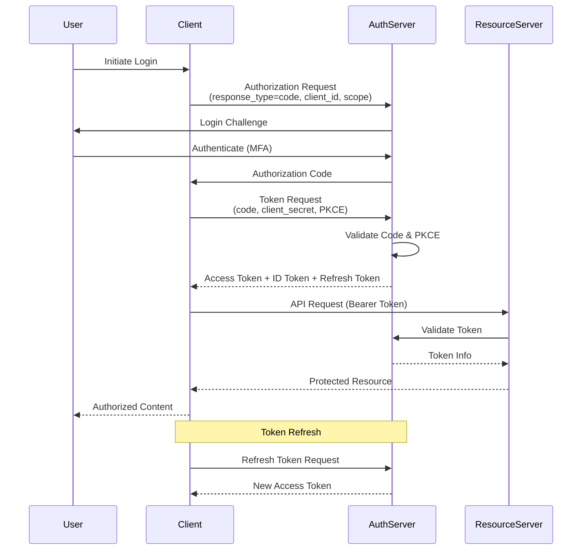

### Encryption Strategy

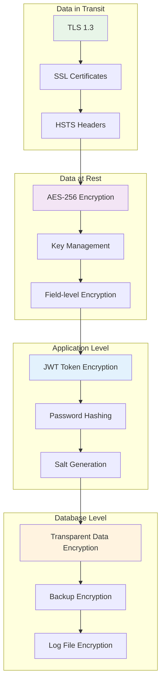

## 🎛️ Monitoring & Observability

### Application Monitoring Stack

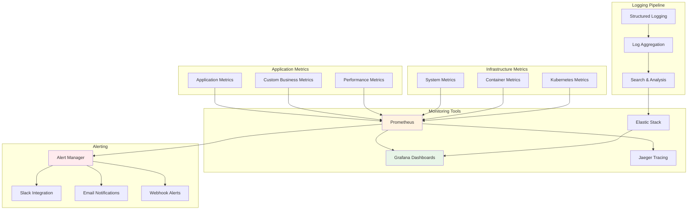

### Distributed Tracing

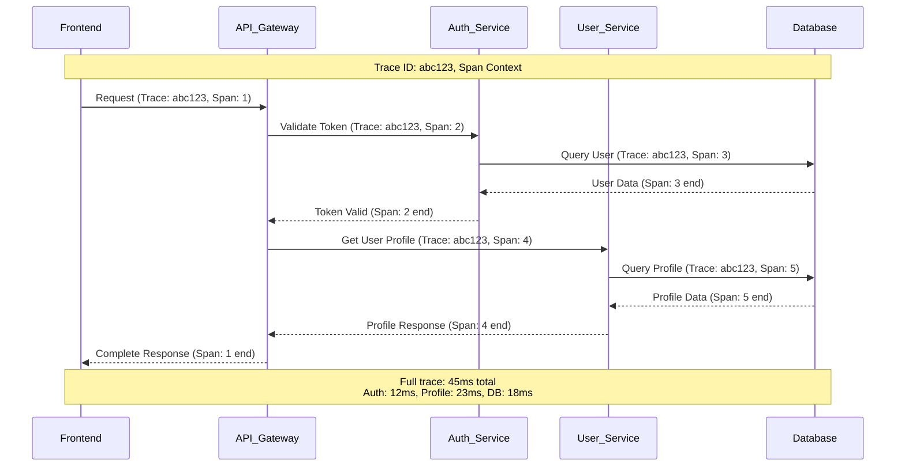

---

## 📚 Implementation Notes

### Development Environment Setup

```bash
# Clone repository
git clone https://github.com/kareemschultz/kaj-gcmc-bts.git

# Install dependencies
bun install

# Setup environment
cp .env.example .env

# Database setup
bunx prisma generate
bunx prisma db push

# Start development servers
bun dev

# Run tests
bun test
bun test:e2e
```

### Production Deployment Checklist

- [ ] Environment variables configured
- [ ] Database migrations applied
- [ ] SSL certificates installed
- [ ] Monitoring dashboards configured
- [ ] Backup strategy implemented
- [ ] Security audit completed
- [ ] Performance testing passed
- [ ] Health checks configured
- [ ] Rollback plan documented
- [ ] Team training completed

---

*This technical architecture documentation is part of the KAJ-GCMC BTS Platform enterprise upgrade.*