# System Architecture Documentation

> **KAJ-GCMC BTS Platform - Complete System Architecture Guide**
> **Version:** 1.0.0
> **Last Updated:** 2025-11-18

This document provides comprehensive documentation of the KAJ-GCMC Business Tax Services platform architecture, including system design, data flow, security architecture, and deployment patterns.

---

## 📚 Table of Contents

- [Architecture Overview](#architecture-overview)
- [System Components](#system-components)
- [Data Architecture](#data-architecture)
- [Security Architecture](#security-architecture)
- [Network Architecture](#network-architecture)
- [Deployment Architecture](#deployment-architecture)
- [Integration Architecture](#integration-architecture)
- [Performance Architecture](#performance-architecture)
- [Monitoring Architecture](#monitoring-architecture)

---

## 🏗 Architecture Overview

### Design Principles

The KAJ-GCMC BTS platform follows these core architectural principles:

1. **Modularity**: Loosely coupled, highly cohesive components
2. **Scalability**: Horizontal and vertical scaling capabilities
3. **Security**: Defense-in-depth security strategy
4. **Reliability**: High availability and fault tolerance
5. **Maintainability**: Clear separation of concerns and clean code
6. **Performance**: Optimized for speed and efficiency

### High-Level Architecture

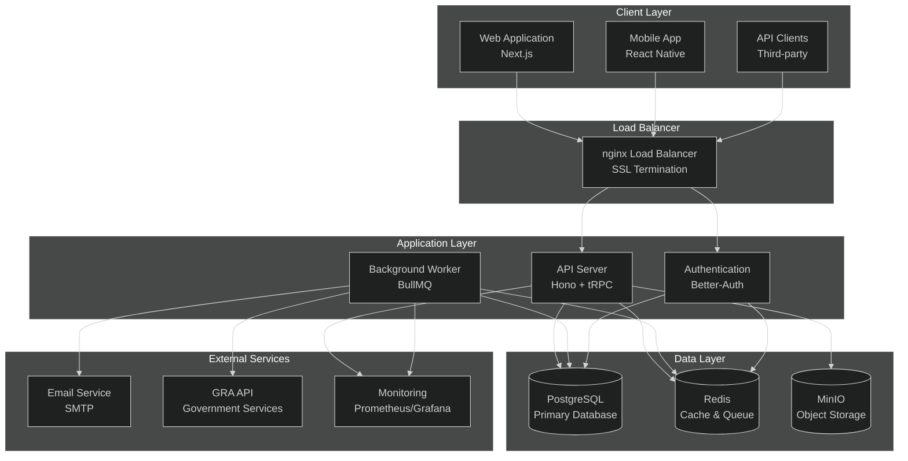

### Technology Stack

| Layer | Technology | Purpose |
|-------|------------|---------|
| **Frontend** | Next.js 14, React 18, TypeScript | User interface and client-side logic |
| **API** | Hono, tRPC, TypeScript | Type-safe API layer with runtime validation |
| **Authentication** | Better-Auth, Prisma | Session-based authentication with RBAC |
| **Database** | PostgreSQL 15+, Prisma ORM | Primary data storage with type-safe queries |
| **Cache** | Redis 7+, BullMQ | Caching layer and background job processing |
| **Storage** | MinIO (S3-compatible) | File storage for documents and reports |
| **Runtime** | Bun | High-performance JavaScript runtime |
| **Monitoring** | Prometheus, Grafana, Sentry | Application performance monitoring |

---

## 🧩 System Components

### Web Application (Frontend)

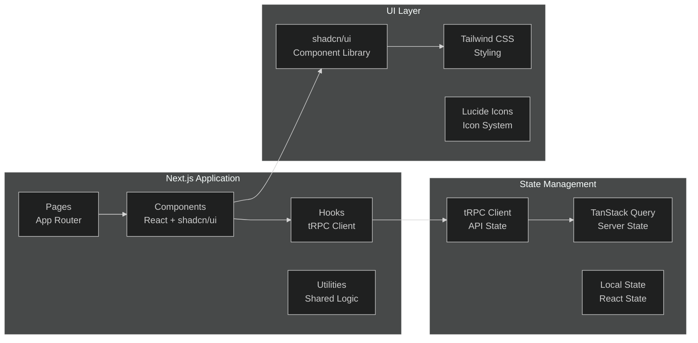

#### Key Features
- **Server-Side Rendering (SSR)**: Optimal performance and SEO
- **Type Safety**: End-to-end TypeScript integration
- **Component Reusability**: Modular component architecture
- **Responsive Design**: Mobile-first design approach
- **Accessibility**: WCAG 2.1 AA compliance

### API Server (Backend)

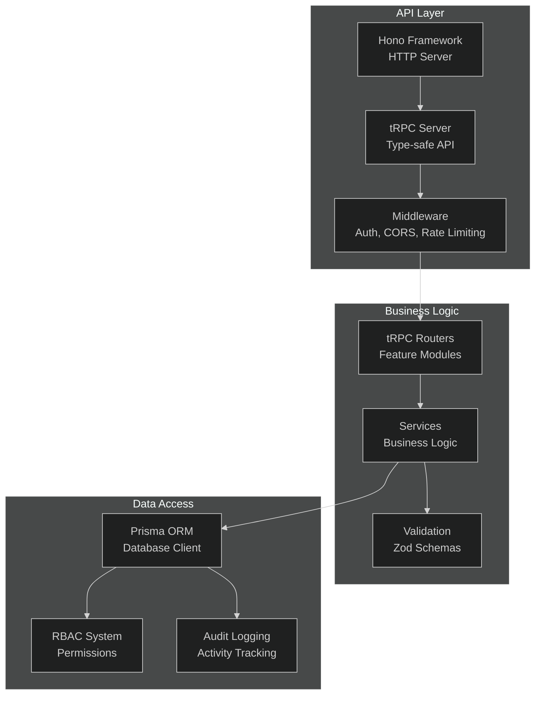

#### API Architecture Patterns
- **tRPC Router Pattern**: Type-safe procedure definitions
- **Middleware Chain**: Request/response processing pipeline
- **Service Layer**: Business logic abstraction
- **Repository Pattern**: Data access abstraction
- **Event-Driven Architecture**: Asynchronous processing

### Background Worker System

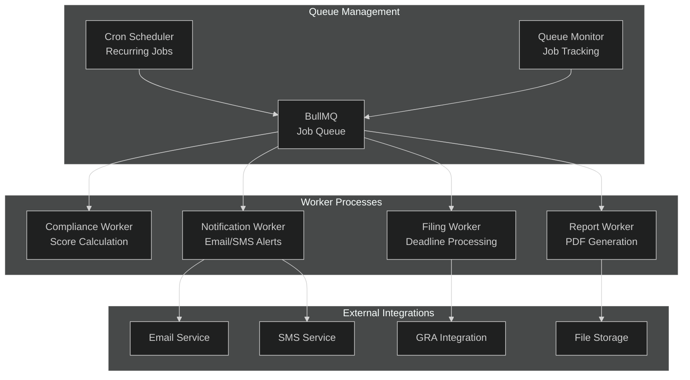

---

## 🗄 Data Architecture

### Database Schema Overview

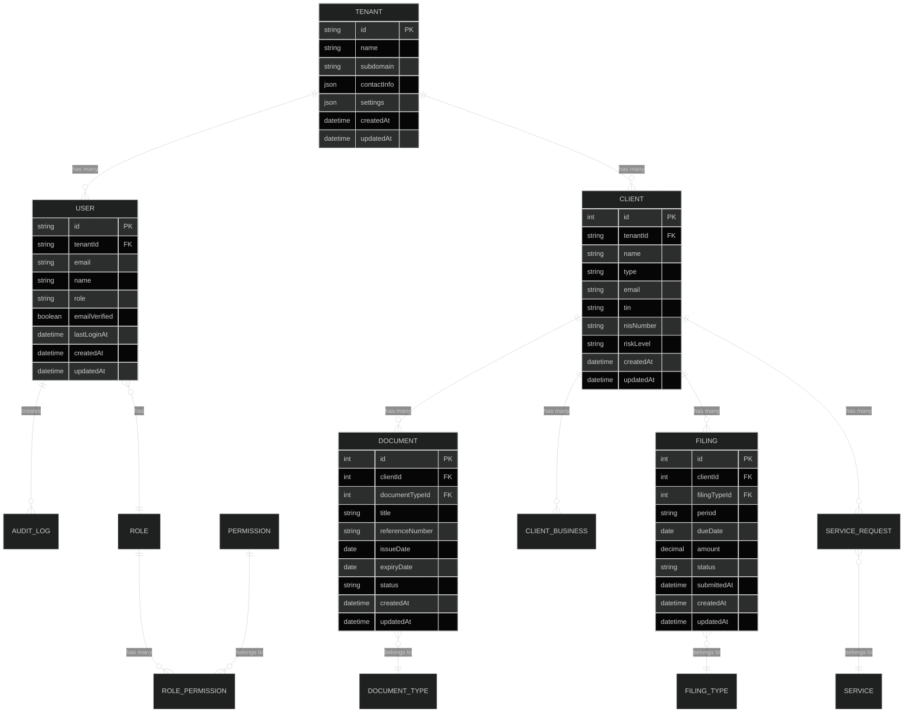

### Data Flow Architecture

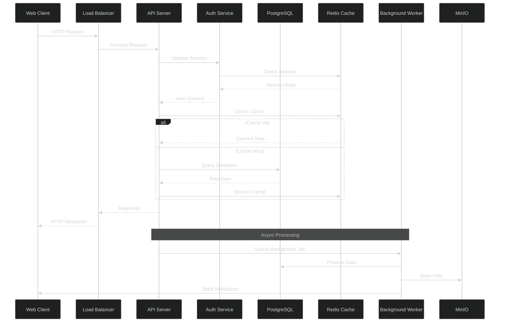

### Data Consistency Patterns

#### Multi-Tenant Data Isolation

```sql
-- All queries automatically include tenant isolation
SELECT * FROM clients
WHERE tenant_id = $1 AND id = $2;

-- Prisma middleware ensures tenant isolation
prisma.client.findMany({
  where: {
    tenantId: ctx.tenantId, // Automatically injected
    // other filters...
  }
});
```

#### Audit Trail Pattern

```typescript
// Automatic audit logging for all mutations
await prisma.$transaction(async (tx) => {
  const client = await tx.client.update({
    where: { id: clientId },
    data: updateData,
  });

  await tx.auditLog.create({
    data: {
      tenantId: ctx.tenantId,
      actorUserId: ctx.user.id,
      entityType: 'client',
      entityId: client.id,
      action: 'update',
      changes: { from: originalData, to: client },
    },
  });

  return client;
});
```

---

## 🔐 Security Architecture

### Defense in Depth Strategy

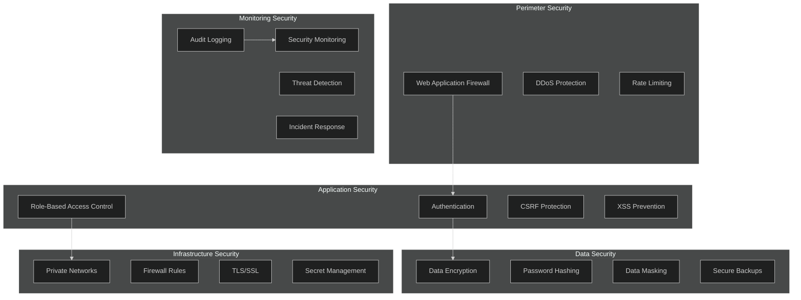

### Authentication Flow

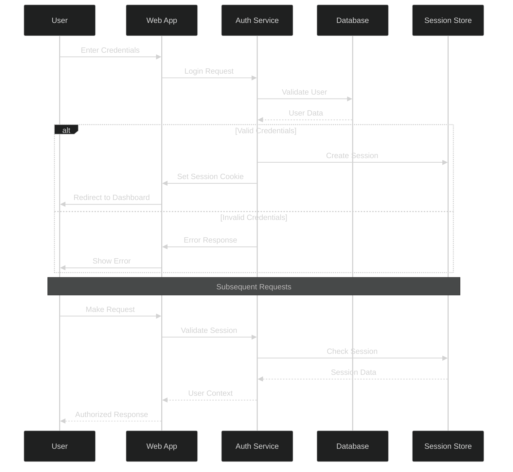

### Role-Based Access Control (RBAC)

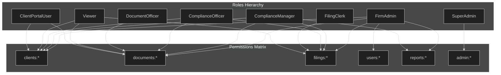

### Data Protection Measures

#### Encryption at Rest

```typescript
// Database encryption configuration
const encryptedFields = {
  tin: encrypt(plainText, encryptionKey),
  nisNumber: encrypt(plainText, encryptionKey),
  bankAccount: encrypt(plainText, encryptionKey),
};

// Automatic encryption/decryption middleware
prisma.$use(async (params, next) => {
  if (params.action === 'create' || params.action === 'update') {
    if (params.args?.data) {
      params.args.data = encryptSensitiveFields(params.args.data);
    }
  }

  const result = await next(params);

  if (params.action === 'findMany' || params.action === 'findUnique') {
    return decryptSensitiveFields(result);
  }

  return result;
});
```

#### Data Masking

```typescript
// Sensitive data masking for logs and non-production environments
const maskSensitiveData = (data: any): any => {
  const sensitiveFields = ['tin', 'nisNumber', 'email', 'phone'];

  return Object.fromEntries(
    Object.entries(data).map(([key, value]) => [
      key,
      sensitiveFields.includes(key) ? maskString(String(value)) : value
    ])
  );
};

// Usage in logging
logger.info('Client created', maskSensitiveData(clientData));
```

---

## 🌐 Network Architecture

### Production Network Topology

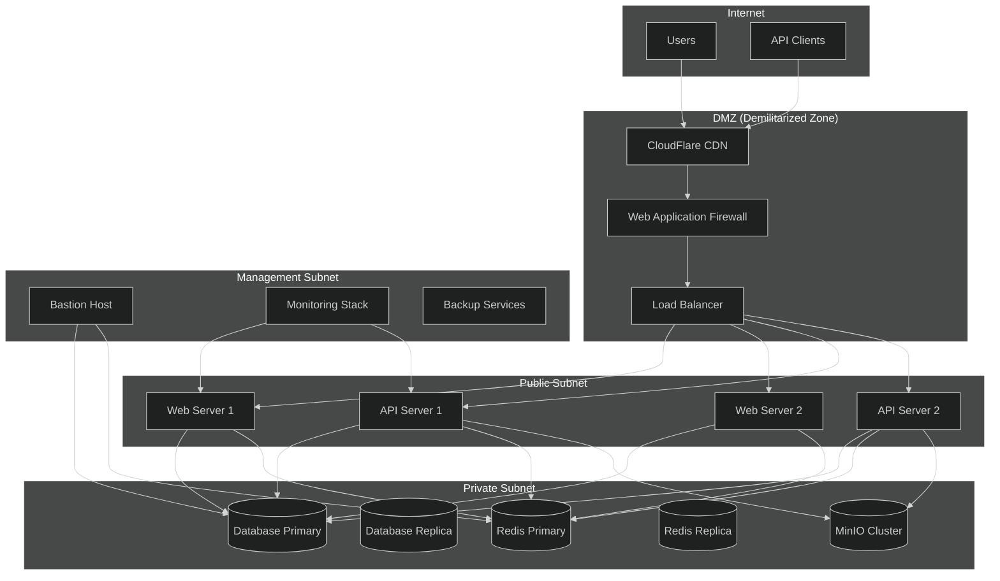

### Security Groups and Firewall Rules

```yaml
Security Groups:
  web-tier:
    inbound:
      - port: 443 (HTTPS) from load-balancer
      - port: 80 (HTTP) from load-balancer
    outbound:
      - port: 5432 (PostgreSQL) to database-tier
      - port: 6379 (Redis) to cache-tier
      - port: 9000 (MinIO) to storage-tier

  api-tier:
    inbound:
      - port: 3000 (API) from load-balancer
      - port: 3001 (Web) from web-tier
    outbound:
      - port: 5432 (PostgreSQL) to database-tier
      - port: 6379 (Redis) to cache-tier
      - port: 9000 (MinIO) to storage-tier

  database-tier:
    inbound:
      - port: 5432 (PostgreSQL) from api-tier
      - port: 5432 (PostgreSQL) from bastion-host
    outbound:
      - port: 443 (HTTPS) for replication

  cache-tier:
    inbound:
      - port: 6379 (Redis) from api-tier
      - port: 6379 (Redis) from bastion-host
    outbound:
      - port: 6379 (Redis) for replication

  storage-tier:
    inbound:
      - port: 9000 (MinIO) from api-tier
      - port: 9001 (Console) from bastion-host
    outbound:
      - port: 9000 (MinIO) for replication
```

---

## 🚀 Deployment Architecture

### Container Architecture

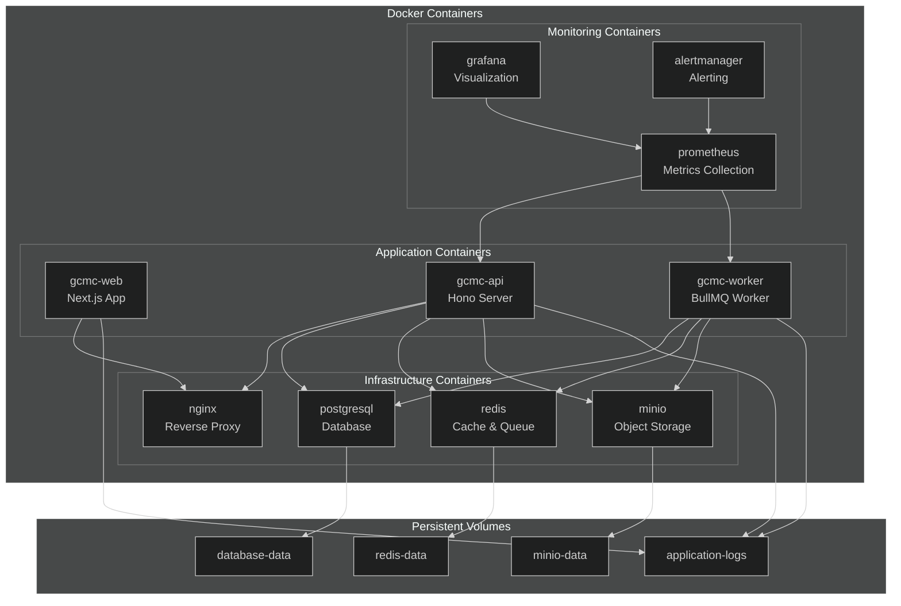

### Kubernetes Deployment (Alternative)

```yaml
# Kubernetes deployment architecture
apiVersion: v1
kind: Namespace
metadata:
  name: gcmc-kaj

---
apiVersion: apps/v1
kind: Deployment
metadata:
  name: api-deployment
spec:
  replicas: 3
  selector:
    matchLabels:
      app: gcmc-api
  template:
    metadata:
      labels:
        app: gcmc-api
    spec:
      containers:
      - name: api
        image: gcmc-kaj/api:latest
        ports:
        - containerPort: 3000
        env:
        - name: DATABASE_URL
          valueFrom:
            secretKeyRef:
              name: database-secret
              key: url
        resources:
          requests:
            memory: "512Mi"
            cpu: "250m"
          limits:
            memory: "1Gi"
            cpu: "500m"
        livenessProbe:
          httpGet:
            path: /health
            port: 3000
          initialDelaySeconds: 30
          periodSeconds: 10
        readinessProbe:
          httpGet:
            path: /health
            port: 3000
          initialDelaySeconds: 5
          periodSeconds: 5

---
apiVersion: v1
kind: Service
metadata:
  name: api-service
spec:
  selector:
    app: gcmc-api
  ports:
  - port: 3000
    targetPort: 3000
  type: ClusterIP
```

### High Availability Setup

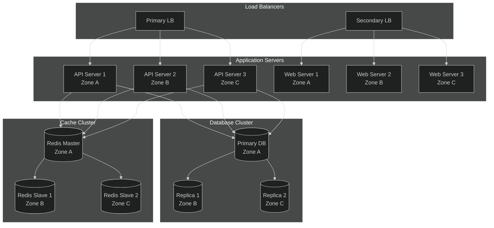

---

## 🔌 Integration Architecture

### External Service Integrations

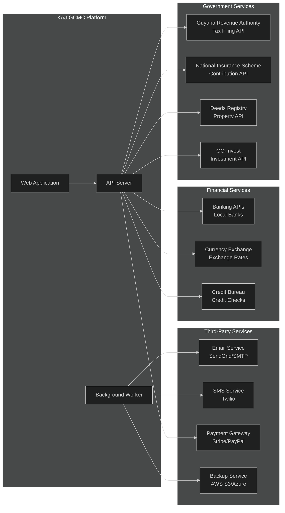

### Integration Patterns

#### Circuit Breaker Pattern

```typescript
class CircuitBreaker {
  private failureCount = 0;
  private lastFailureTime = 0;
  private state: 'CLOSED' | 'OPEN' | 'HALF_OPEN' = 'CLOSED';

  async execute<T>(operation: () => Promise<T>): Promise<T> {
    if (this.state === 'OPEN') {
      if (Date.now() - this.lastFailureTime > this.timeout) {
        this.state = 'HALF_OPEN';
      } else {
        throw new Error('Circuit breaker is OPEN');
      }
    }

    try {
      const result = await operation();
      this.onSuccess();
      return result;
    } catch (error) {
      this.onFailure();
      throw error;
    }
  }

  private onSuccess() {
    this.failureCount = 0;
    this.state = 'CLOSED';
  }

  private onFailure() {
    this.failureCount++;
    this.lastFailureTime = Date.now();

    if (this.failureCount >= this.threshold) {
      this.state = 'OPEN';
    }
  }
}

// Usage
const graCircuitBreaker = new CircuitBreaker();

export async function submitToGRA(filingData: any) {
  return graCircuitBreaker.execute(async () => {
    return await graApi.submitFiling(filingData);
  });
}
```

#### Retry Pattern with Exponential Backoff

```typescript
async function retryWithBackoff<T>(
  operation: () => Promise<T>,
  maxRetries: number = 3,
  baseDelay: number = 1000
): Promise<T> {
  for (let attempt = 1; attempt <= maxRetries; attempt++) {
    try {
      return await operation();
    } catch (error) {
      if (attempt === maxRetries) {
        throw error;
      }

      const delay = baseDelay * Math.pow(2, attempt - 1);
      await new Promise(resolve => setTimeout(resolve, delay));
    }
  }

  throw new Error('Maximum retries exceeded');
}
```

---

## ⚡ Performance Architecture

### Caching Strategy

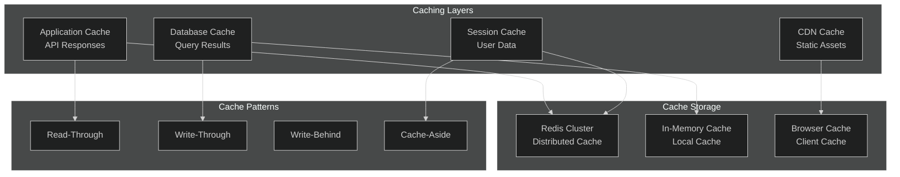

### Database Optimization

```sql
-- Performance optimization strategies

-- Indexing strategy
CREATE INDEX CONCURRENTLY idx_clients_tenant_id ON clients(tenant_id);
CREATE INDEX CONCURRENTLY idx_documents_client_expiry ON documents(client_id, expiry_date);
CREATE INDEX CONCURRENTLY idx_filings_due_date ON filings(due_date) WHERE status = 'pending';

-- Partitioning for large tables
CREATE TABLE audit_logs_2024 PARTITION OF audit_logs
FOR VALUES FROM ('2024-01-01') TO ('2025-01-01');

-- Connection pooling configuration
-- max_connections = 200
-- shared_buffers = 256MB
-- effective_cache_size = 4GB
-- work_mem = 8MB
-- maintenance_work_mem = 128MB
```

### Load Balancing Strategy

```nginx
upstream api_backend {
    least_conn;
    server api-1.internal:3000 max_fails=3 fail_timeout=30s weight=3;
    server api-2.internal:3000 max_fails=3 fail_timeout=30s weight=2;
    server api-3.internal:3000 max_fails=3 fail_timeout=30s weight=1;

    keepalive 32;
    keepalive_requests 100;
    keepalive_timeout 60s;
}

# Health check configuration
location /health {
    access_log off;
    proxy_pass http://api_backend;
    proxy_next_upstream error timeout http_502 http_503 http_504;
}
```

---

## 📊 Monitoring Architecture

### Observability Stack

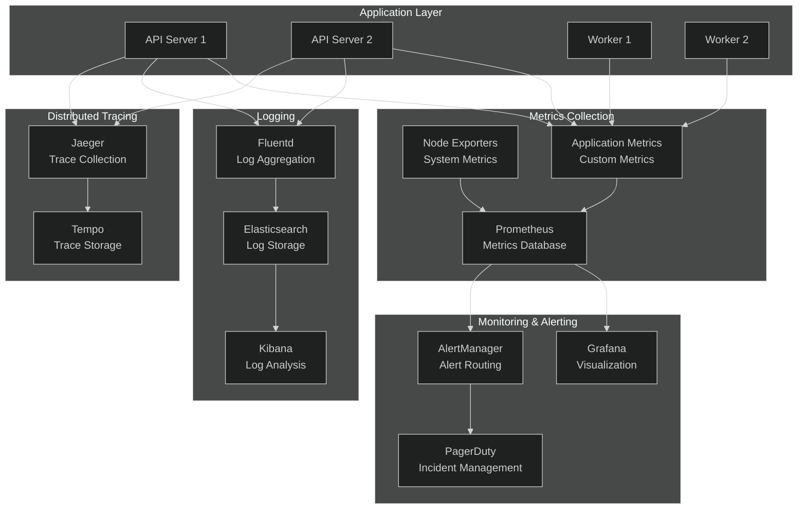

### Custom Metrics

```typescript
// Application metrics implementation
import { createPrometheusMetrics } from '@prometheus/client';

export const metrics = {
  // HTTP request metrics
  httpRequests: new promClient.Counter({
    name: 'http_requests_total',
    help: 'Total number of HTTP requests',
    labelNames: ['method', 'route', 'status_code', 'tenant_id'],
  }),

  httpRequestDuration: new promClient.Histogram({
    name: 'http_request_duration_seconds',
    help: 'HTTP request duration in seconds',
    labelNames: ['method', 'route', 'tenant_id'],
    buckets: [0.1, 0.5, 1, 2, 5, 10],
  }),

  // Business metrics
  clientsTotal: new promClient.Gauge({
    name: 'clients_total',
    help: 'Total number of clients',
    labelNames: ['tenant_id', 'risk_level'],
  }),

  documentsExpiring: new promClient.Gauge({
    name: 'documents_expiring_total',
    help: 'Number of documents expiring soon',
    labelNames: ['tenant_id', 'document_type'],
  }),

  filingsDue: new promClient.Gauge({
    name: 'filings_due_total',
    help: 'Number of filings due',
    labelNames: ['tenant_id', 'filing_type'],
  }),

  // Queue metrics
  jobsProcessed: new promClient.Counter({
    name: 'jobs_processed_total',
    help: 'Total number of background jobs processed',
    labelNames: ['job_type', 'status'],
  }),

  queueSize: new promClient.Gauge({
    name: 'queue_size',
    help: 'Current queue size',
    labelNames: ['queue_name'],
  }),
};

// Middleware to collect HTTP metrics
export function metricsMiddleware() {
  return async (c: Context, next: Next) => {
    const start = Date.now();

    await next();

    const duration = (Date.now() - start) / 1000;
    const route = c.req.routePath || 'unknown';
    const method = c.req.method;
    const statusCode = c.res.status;
    const tenantId = c.get('tenantId') || 'unknown';

    metrics.httpRequests.inc({
      method,
      route,
      status_code: statusCode.toString(),
      tenant_id: tenantId,
    });

    metrics.httpRequestDuration.observe(
      { method, route, tenant_id: tenantId },
      duration
    );
  };
}
```

---

## 📋 Architecture Decision Records (ADRs)

### ADR-001: Technology Stack Selection

**Status:** Accepted
**Date:** 2025-11-18

**Decision:** Use Bun + Hono + tRPC + Prisma + PostgreSQL + Redis + MinIO

**Rationale:**
- **Performance**: Bun provides superior JavaScript runtime performance
- **Type Safety**: tRPC ensures end-to-end type safety
- **Developer Experience**: Prisma provides excellent TypeScript integration
- **Scalability**: PostgreSQL handles complex queries and high transaction volumes
- **Caching**: Redis provides high-performance caching and queue management

### ADR-002: Multi-Tenant Architecture

**Status:** Accepted
**Date:** 2025-11-18

**Decision:** Implement multi-tenancy using tenant ID in all data models

**Rationale:**
- **Data Isolation**: Strong tenant data separation for compliance
- **Scalability**: Single application instance serves multiple organizations
- **Cost Efficiency**: Reduced infrastructure costs compared to separate instances
- **Maintenance**: Single codebase for all tenants

### ADR-003: Authentication Strategy

**Status:** Accepted
**Date:** 2025-11-18

**Decision:** Use Better-Auth with session-based authentication and RBAC

**Rationale:**
- **Security**: Session-based auth is more secure for web applications
- **Integration**: Better-Auth integrates well with Prisma and tRPC
- **Flexibility**: RBAC provides fine-grained permission control
- **Compliance**: Meets regulatory requirements for audit trails

---

**Architecture Documentation Version:** 1.0.0
**Platform Version:** 1.0.0
**Last Updated:** 2025-11-18
**Next Review:** 2025-12-18

For architecture questions: [architecture@gcmc-kaj.com](mailto:architecture@gcmc-kaj.com)