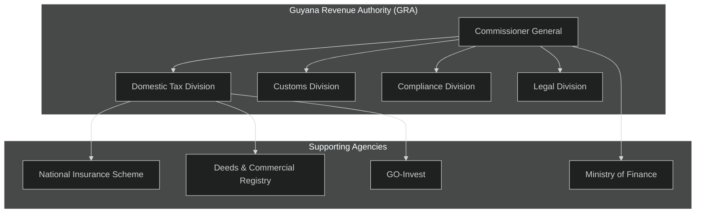
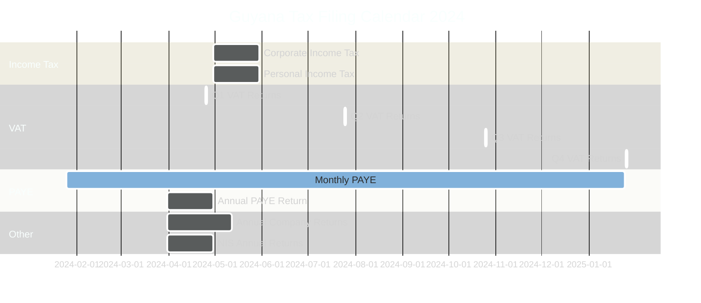

# Guyana Tax Compliance Guide

> **KAJ-GCMC BTS Platform - Complete Guyana Tax Compliance Documentation**
> **Version:** 1.0.0
> **Last Updated:** 2025-11-18

This comprehensive guide covers all aspects of Guyana's tax compliance requirements, business processes, and regulatory obligations for the KAJ-GCMC BTS platform.

---

## 📚 Table of Contents

- [Guyana Tax System Overview](#guyana-tax-system-overview)
- [Key Tax Authorities](#key-tax-authorities)
- [Business Registration Requirements](#business-registration-requirements)
- [Tax Types and Obligations](#tax-types-and-obligations)
- [Filing Requirements and Deadlines](#filing-requirements-and-deadlines)
- [Compliance Documentation](#compliance-documentation)
- [Penalties and Enforcement](#penalties-and-enforcement)
- [Digital Filing Processes](#digital-filing-processes)
- [Platform Compliance Features](#platform-compliance-features)
- [Best Practices](#best-practices)

---

## 🏛 Guyana Tax System Overview

### Regulatory Framework

Guyana's tax system operates under several key pieces of legislation:

- **Income Tax Act (Cap. 81:01)**: Governs personal and corporate income tax
- **Value-Added Tax Act (Cap. 81:05)**: Regulates VAT collection and administration
- **Tax Administration Act**: Provides framework for tax administration
- **Customs Act**: Governs import/export duties and procedures
- **Excise Tax Act**: Covers excise duties on specific goods

### Tax Administration Structure

### Key Principles

1. **Self-Assessment**: Taxpayers assess their own tax liability
2. **Voluntary Compliance**: Emphasis on voluntary disclosure and payment
3. **Risk-Based Approach**: Compliance activities focus on high-risk areas
4. **Fairness and Transparency**: Equal treatment under the law
5. **Efficiency**: Streamlined processes and digital services

---

## 🏢 Key Tax Authorities

### Guyana Revenue Authority (GRA)

**Primary Functions:**
- Tax collection and administration
- Customs and excise duties
- Compliance monitoring and enforcement
- Taxpayer services and education
- Revenue policy advice

**Contact Information:**
- **Address**: 210 Camp & South Roads, Lacytown, Georgetown
- **Phone**: +592-227-8222
- **Email**: info@gra.gov.gy
- **Website**: [www.gra.gov.gy](https://www.gra.gov.gy)
- **Taxpayer Services**: +592-227-8310

**Key Departments:**

#### Domestic Tax Division
- **Income Tax Department**: Personal and corporate income tax
- **VAT Department**: Value-added tax administration
- **Large Taxpayer Unit**: Major taxpayer management
- **Audit Department**: Tax audit and verification

#### Compliance Division
- **Investigation Unit**: Tax fraud and evasion
- **Collection Enforcement**: Debt recovery
- **Risk Assessment**: Compliance risk analysis
- **Appeals Unit**: Tax dispute resolution

### National Insurance Scheme (NIS)

**Functions:**
- Social security contributions
- Employment-related benefits
- Employer compliance monitoring
- Benefit administration

**Contact Information:**
- **Address**: Brickdam & Winter Place, Stabroek, Georgetown
- **Phone**: +592-227-3461
- **Website**: [www.nis.org.gy](https://www.nis.org.gy)

### Deeds & Commercial Registry

**Functions:**
- Business registration and incorporation
- Property registration and transfers
- Commercial document filing
- Corporate compliance monitoring

**Contact Information:**
- **Address**: 26 Camp Street, Georgetown
- **Phone**: +592-226-7530
- **Website**: [deedregistry.gov.gy](https://deedregistry.gov.gy)

---

## 📋 Business Registration Requirements

### Company Registration Process

#### Step 1: Name Reservation

**Requirements:**
- Company name must be unique
- Cannot conflict with existing trademarks
- Must include appropriate suffix (Ltd., Inc., Corp.)
- Reserve for 30 days (renewable)

**Documents Required:**
- Name Reservation Application
- Proof of fee payment (GYD 2,000)
- Alternative name options

#### Step 2: Incorporation Documents

**Articles of Incorporation Must Include:**
- Company name and registered office
- Objects and purposes of the company
- Authorized share capital structure
- Directors' and shareholders' details
- Company secretary information

**Required Documents:**
- **Articles of Incorporation**: Company constitution
- **Form 1**: Application for incorporation
- **Form 18A**: Appointment of directors
- **Form 32**: Registered office address
- **Memorandum of Association**: Company objectives

#### Step 3: Registration Fees

| Registration Type | Fee (GYD) | Processing Time |
|------------------|-----------|-----------------|
| **Private Company** | 15,000 | 3-5 business days |
| **Public Company** | 30,000 | 5-7 business days |
| **Foreign Company** | 50,000 | 7-10 business days |
| **Non-Profit Organization** | 5,000 | 3-5 business days |

### Business License Requirements

#### General Business License

**Application Process:**
1. Complete Business License Application
2. Submit required supporting documents
3. Pay application fee (GYD 5,000)
4. Undergo inspection if required
5. Receive license certificate

**Required Documents:**
- Completed application form
- Certificate of incorporation
- Tax compliance certificate
- NIS compliance certificate
- Fire service certificate (if applicable)
- Environmental permit (if applicable)

#### Sector-Specific Licenses

**Financial Services:**
- Banking license (Bank of Guyana)
- Insurance license (Bank of Guyana)
- Cambio license (Bank of Guyana)
- Investment license (Securities Council)

**Professional Services:**
- Legal practice certificate
- Accounting practice license
- Engineering registration
- Medical practice license

**Manufacturing/Import:**
- Import/export license
- Manufacturing license
- Food handling permit
- Pharmaceutical license

---

## 💰 Tax Types and Obligations

### Value-Added Tax (VAT)

#### VAT Registration Requirements

**Mandatory Registration:**
- Annual taxable supplies exceed GYD 15 million
- Taxable imports exceed GYD 15 million
- Provide taxable supplies as principal business

**Voluntary Registration:**
- Annual supplies below threshold
- Making zero-rated supplies
- Starting new business

**Registration Process:**
1. Complete VAT Registration Form
2. Submit supporting documents
3. GRA review and inspection
4. Issue VAT Certificate
5. Allocate VAT number

**Required Documents:**
- VAT registration application
- Certificate of incorporation
- Business license
- Bank account details
- Previous financial statements
- List of goods/services

#### VAT Rates

| Category | Rate | Examples |
|----------|------|----------|
| **Standard Rate** | 14% | Most goods and services |
| **Zero Rate** | 0% | Basic food items, medicines, exports |
| **Exempt** | N/A | Financial services, education, healthcare |

#### VAT Return Filing

**Filing Frequency:**
- **Monthly**: Large taxpayers (turnover > GYD 60M)
- **Quarterly**: Standard taxpayers
- **Annually**: Small taxpayers (with approval)

**Filing Deadlines:**
- **Monthly returns**: 25th of following month
- **Quarterly returns**: 25th of month following quarter
- **Annual returns**: March 31st

### Income Tax

#### Corporate Income Tax

**Tax Rates:**
- **Standard rate**: 25%
- **Small company rate**: 25% (no differentiation currently)
- **Mining companies**: Special rates apply
- **Manufacturing incentives**: Reduced rates available

**Taxable Income Components:**
- Trading profits
- Investment income
- Capital gains (specific circumstances)
- Foreign income (for resident companies)

**Allowable Deductions:**
- Business expenses wholly and exclusively for trade
- Depreciation allowances
- Interest on business loans
- Professional fees
- Employee costs

#### Personal Income Tax

**Tax Rates (2024):**
| Income Range (GYD) | Rate |
|-------------------|------|
| 0 - 780,000 | 0% |
| 780,001 - 1,560,000 | 28% |
| 1,560,001 - 2,340,000 | 30% |
| Over 2,340,000 | 40% |

**Employment Tax (PAYE):**
- Deducted by employer
- Monthly remittance to GRA
- Annual reconciliation required

### Pay-As-You-Earn (PAYE)

#### Employer Obligations

**Registration Requirements:**
- Register as employer with GRA
- Obtain PAYE reference number
- Maintain employee records
- Calculate and deduct tax

**Monthly Returns:**
- File by 25th of following month
- Pay deducted amounts
- Submit employee details
- Reconcile payments

**Annual Obligations:**
- Issue P60 certificates to employees
- File annual return of employees
- Provide annual reconciliation
- Submit payroll summaries

### Withholding Tax

#### Withholding Rates

| Payment Type | Rate | Applicable To |
|--------------|------|---------------|
| **Dividends** | 20% | Non-resident shareholders |
| **Interest** | 20% | Non-resident recipients |
| **Royalties** | 15% | Non-resident recipients |
| **Management Fees** | 20% | Non-resident companies |
| **Rent** | 10% | Non-resident landlords |
| **Professional Fees** | 10% | Non-resident service providers |

#### Filing Requirements

**Monthly Withholding Returns:**
- Due 25th of following month
- Include details of all payments
- Remit withheld amounts
- Provide recipient information

### Property Tax

#### Assessment and Payment

**Annual Assessment:**
- Based on property value
- Assessed by municipal authorities
- Rates vary by location and property type
- Payment due in quarterly installments

**Rates:**
- **Residential**: 0.75% of assessed value
- **Commercial**: 1.25% of assessed value
- **Industrial**: 1.00% of assessed value

---

## 📅 Filing Requirements and Deadlines

### Annual Filing Calendar

### Critical Deadlines

#### Corporate Income Tax
**Filing Deadline:** 4 months after year-end
- **March 31 year-end**: July 31 filing
- **December 31 year-end**: April 30 filing
- **Extension available**: Additional 3 months with application

**Payment Deadlines:**
- **First installment**: 3 months after year-end
- **Second installment**: 6 months after year-end
- **Final balance**: With return filing

#### VAT Returns
**Monthly Filers:**
- **Filing deadline**: 25th of following month
- **Payment deadline**: Same as filing
- **Late filing penalty**: 10% of tax due (minimum GYD 10,000)

**Quarterly Filers:**
- **Q1 (Jan-Mar)**: Due April 25
- **Q2 (Apr-Jun)**: Due July 25
- **Q3 (Jul-Sep)**: Due October 25
- **Q4 (Oct-Dec)**: Due January 25

#### PAYE Returns
**Monthly Obligations:**
- **Filing deadline**: 25th of following month
- **Payment deadline**: Same as filing
- **Employee certificates**: Within 45 days of year-end

#### Annual Company Returns
**Deeds Registry Requirements:**
- **Filing deadline**: 42 days after AGM
- **AGM deadline**: 15 months after incorporation
- **Annual filing fee**: GYD 5,000
- **Late filing penalty**: GYD 1,000 per month

### Extension Procedures

#### Income Tax Extensions
**Application Process:**
1. Submit extension request before original deadline
2. Provide valid reason for extension
3. Pay any estimated tax due
4. Receive approval from GRA
5. File return by extended deadline

**Valid Reasons:**
- Awaiting third-party documentation
- Complex business transactions
- Professional advisor unavailability
- Genuine hardship circumstances

#### VAT Extensions
**Limited circumstances:**
- Technical system failures
- Force majeure events
- Prior approval required
- Must maintain payment obligations

---

## 📁 Compliance Documentation

### Required Business Records

#### Accounting Records
**Minimum Retention Period: 7 years**

**Financial Records:**
- General ledger and journals
- Trial balances and financial statements
- Bank statements and reconciliations
- Cash books and petty cash records
- Accounts receivable and payable ledgers

**Supporting Documentation:**
- Invoices and receipts
- Purchase orders and delivery notes
- Contracts and agreements
- Import/export documentation
- Employee records and payroll

#### VAT Records
**Documentation Requirements:**

**Input Tax Claims:**
- Original tax invoices
- Import documentation
- Payment evidence
- Business purpose documentation

**Output Tax Accounting:**
- Sales invoices issued
- Cash register records
- Credit and debit notes
- Zero-rated supply documentation

**VAT Invoice Requirements:**
- Supplier's name and VAT number
- Tax invoice number
- Issue date
- Customer details
- Description of goods/services
- VAT amount separately shown

### Audit and Compliance Documentation

#### Corporate Income Tax Documentation

**Financial Statements:**
- Audited financial statements (public companies)
- Management accounts
- Director's report
- Notes to financial statements
- Auditor's report

**Tax Computations:**
- Corporate income tax computation
- Capital allowances schedule
- Depreciation schedules
- Provision calculations
- Comparative analysis

**Supporting Schedules:**
- Fixed asset register
- Loan and borrowing schedules
- Investment portfolios
- Foreign exchange transactions
- Related party transactions

#### Employment Tax Documentation

**Employee Records:**
- Employment contracts
- Salary and wage records
- Benefits and allowances
- Pension contributions
- Termination payments

**PAYE Calculations:**
- Monthly PAYE computations
- Tax deduction certificates
- Annual summaries
- Reconciliation statements
- Payment evidence

### Digital Record Keeping

#### Electronic Records Acceptance
**GRA Requirements:**
- Electronic records acceptable
- Must be readily accessible
- Backup and recovery procedures
- Audit trail maintenance
- Data integrity measures

**Platform Compliance:**
The KAJ-GCMC platform ensures:
- Automatic backup systems
- Complete audit trails
- Document version control
- Digital signature support
- Export capabilities for audits

---

## ⚠️ Penalties and Enforcement

### Penalty Structure

#### Late Filing Penalties

| Tax Type | Penalty | Maximum |
|----------|---------|---------|
| **Income Tax** | 25% of tax due | No maximum |
| **VAT** | 10% of tax due | Minimum GYD 10,000 |
| **PAYE** | 25% of tax due | No maximum |
| **Withholding Tax** | 100% of tax due | No maximum |

#### Late Payment Penalties

**Interest Charges:**
- **Rate**: 2% per month (24% annually)
- **Calculation**: On outstanding balance
- **Compounding**: Monthly
- **Minimum**: GYD 1,000

**Additional Penalties:**
- **Failure to register**: 100% of tax due
- **Failure to keep records**: GYD 500,000
- **Obstruction of officers**: GYD 1,000,000
- **False statements**: 200% of tax evaded

### Enforcement Actions

#### Collection Procedures

**Administrative Actions:**
1. **Demand notices**: 30-day payment demand
2. **Third-party notices**: Bank account seizure
3. **Distress warrants**: Asset seizure
4. **Business closure**: Temporary closure orders
5. **Director liability**: Personal liability for company debts

**Legal Proceedings:**
- Civil recovery actions
- Criminal prosecution for fraud
- Asset forfeiture proceedings
- Imprisonment for serious offenses

#### Dispute Resolution

**Administrative Review:**
1. Internal review request
2. 30-day response timeframe
3. Independent review officer
4. Written decision provided

**Tax Appeal Tribunal:**
- Independent judicial body
- 30 days to lodge appeal
- Formal hearing process
- Binding decisions

**High Court Appeal:**
- Questions of law only
- 30 days from tribunal decision
- Legal representation required
- Final judicial review

---

## 💻 Digital Filing Processes

### GRA Online Services

#### Available Online Services

**Tax Registration:**
- VAT registration
- Income tax registration
- PAYE registration
- Amendment of registrations

**Returns Filing:**
- VAT returns
- Income tax returns
- PAYE returns
- Withholding tax returns

**Payment Services:**
- Online tax payments
- Payment history
- Outstanding balance enquiries
- Payment plan applications

#### System Requirements

**Technical Specifications:**
- Modern web browser (Chrome, Firefox, Safari, Edge)
- JavaScript enabled
- PDF reader installed
- Secure internet connection

**User Requirements:**
- Valid tax registration
- Digital certificate (for large taxpayers)
- Bank account for online payments
- Email address for notifications

### Platform Integration

#### KAJ-GCMC Platform Features

**Automated Compliance:**
- Automatic deadline tracking
- Pre-populated return forms
- Validation and error checking
- Submission status monitoring

**Document Management:**
- Secure document storage
- Version control
- Audit trail maintenance
- Digital signature support

**Reporting Capabilities:**
- Compliance dashboards
- Performance analytics
- Risk assessment
- Custom reporting

---

## 🏆 Best Practices

### Compliance Management

#### Proactive Compliance Strategy

**Monthly Procedures:**
- Review all filing deadlines
- Prepare and file required returns
- Reconcile all tax accounts
- Monitor compliance scores
- Address any issues immediately

**Quarterly Reviews:**
- Comprehensive compliance assessment
- Review of internal controls
- Update of compliance procedures
- Staff training on new requirements
- Management reporting

**Annual Planning:**
- Tax planning strategies
- Compliance calendar preparation
- Resource allocation
- System upgrades and improvements
- Professional development

#### Technology Utilization

**Digital Transformation:**
- Implement cloud-based systems
- Automate routine processes
- Use data analytics for insights
- Maintain digital records
- Ensure cybersecurity measures

**Platform Optimization:**
- Regular system updates
- User training programs
- Performance monitoring
- Backup and recovery testing
- Integration with third-party systems

### Risk Management

#### Compliance Risk Assessment

**High-Risk Areas:**
- Complex business transactions
- International dealings
- Cash-intensive businesses
- Frequent regulatory changes
- Multiple tax jurisdictions

**Mitigation Strategies:**
- Regular professional advice
- Comprehensive documentation
- Automated compliance monitoring
- Continuous staff training
- Proactive GRA communication

#### Internal Controls

**Segregation of Duties:**
- Separate preparation and review functions
- Independent authorization processes
- Regular management oversight
- External professional review
- Continuous monitoring systems

**Documentation Standards:**
- Comprehensive record keeping
- Version control procedures
- Audit trail maintenance
- Regular backup procedures
- Access control measures

### Professional Development

#### Continuing Education

**Tax Updates:**
- Regular GRA communications
- Professional association membership
- Continuing professional development
- Industry conferences and seminars
- Peer networking and collaboration

**System Training:**
- Platform feature updates
- New regulatory requirements
- Best practice sharing
- Performance optimization
- Security awareness

---

## 📞 Support and Resources

### Official Resources

**Guyana Revenue Authority:**
- Website: [www.gra.gov.gy](https://www.gra.gov.gy)
- Taxpayer Services: +592-227-8310
- Email: info@gra.gov.gy

**Professional Bodies:**
- Institute of Chartered Accountants of Guyana (ICAG)
- Guyana Association of Professional Engineers
- Georgetown Chamber of Commerce

### Platform Support

**KAJ-GCMC Support:**
- Help Desk: Available through platform
- Email: [support@gcmc-kaj.com](mailto:support@gcmc-kaj.com)
- Phone: +592-XXX-XXXX
- Training: Comprehensive training programs

**Documentation:**
- User manual
- Video tutorials
- Best practices guide
- FAQ section
- Regular updates

---

**Compliance Guide Version:** 1.0.0
**Platform Version:** 1.0.0
**Last Updated:** 2025-11-18
**Next Review:** 2025-12-18

**Disclaimer:** This guide provides general information about Guyana tax compliance requirements. For specific situations, consult with qualified tax professionals or the Guyana Revenue Authority. Tax laws and regulations are subject to change.

---

*© 2025 KAJ-GCMC Business Tax Services. All rights reserved.*