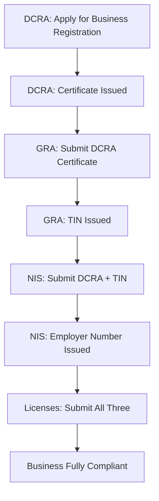
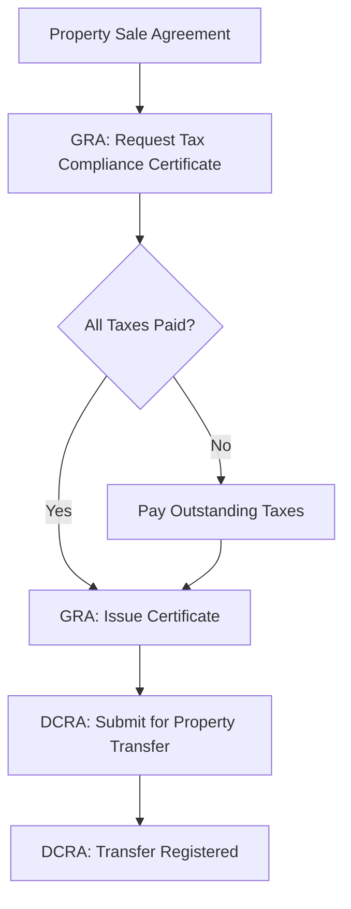
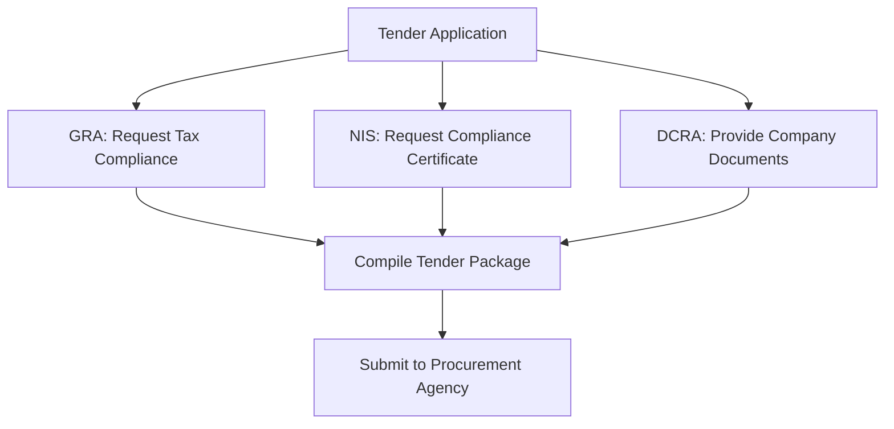

# Multi-Agency Compliance Flows - Guyana Business Compliance

## Overview

Business compliance in Guyana requires coordinated interaction with multiple government agencies. This document outlines the dependencies, workflows, and interconnections between the Deeds and Commercial Registries Authority (DCRA), Guyana Revenue Authority (GRA), and National Insurance Scheme (NIS), along with municipal and sector-specific requirements.

---

## Table of Contents

1. [The Three Core Agencies](#1-the-three-core-agencies)
2. [Standard Business Startup Workflow](#2-standard-business-startup-workflow)
3. [Dependencies and Prerequisites](#3-dependencies-and-prerequisites)
4. [Ongoing Compliance Workflows](#4-ongoing-compliance-workflows)
5. [Cross-Agency Requirements](#5-cross-agency-requirements)
6. [Document Flow Between Agencies](#6-document-flow-between-agencies)
7. [Compliance Timeline](#7-compliance-timeline)
8. [Failure Scenarios and Recovery](#8-failure-scenarios-and-recovery)
9. [Municipal and Sector-Specific Add-Ons](#9-municipal-and-sector-specific-add-ons)
10. [Annual Compliance Cycle](#10-annual-compliance-cycle)

---

## 1. The Three Core Agencies

### DCRA (Deeds and Commercial Registries Authority)
**Role:** Business formation and corporate governance
**Website:** dcra.gov.gy

**Key Services:**
- Business name registration
- Company incorporation
- Annual return filing
- Beneficial ownership declarations
- Property/deeds registration

### GRA (Guyana Revenue Authority)
**Role:** Tax administration and revenue collection
**Website:** www.gra.gov.gy

**Key Services:**
- Tax Identification Number (TIN)
- VAT registration and filing
- PAYE administration
- Income/corporate tax filing
- Trade licenses
- Tax compliance certificates

### NIS (National Insurance Scheme)
**Role:** Social security and employee benefits
**Website:** www.nis.org.gy

**Key Services:**
- Employer registration
- Contribution collection
- Employee social security
- Benefit administration

---

## 2. Standard Business Startup Workflow

### Phase 1: Legal Entity Formation (DCRA)

```
┌─────────────────────────────────────────┐
│  DCRA - Business Entity Creation       │
├─────────────────────────────────────────┤
│  Duration: 3 working days               │
│  Output: Certificate of Business        │
│          Registration                   │
└─────────────────────────────────────────┘
              │
              │ Certificate issued
              ▼
```

**Steps:**
1. Conduct business name search
2. Submit business name/company registration application
3. Provide identification and business address
4. Pay registration fee ($6,000 GYD for business name)
5. Receive Certificate of Business Registration

**Output Document:**
- Certificate of Business Registration (REQUIRED for next phase)

---

### Phase 2: Tax Registration (GRA)

```
┌─────────────────────────────────────────┐
│  DCRA Certificate                       │
└─────────────────────────────────────────┘
              │
              │ Present to GRA
              ▼
┌─────────────────────────────────────────┐
│  GRA - Tax Registration                 │
├─────────────────────────────────────────┤
│  Duration: 1 day (same day at main      │
│  branch)                                │
│  Output: TIN, VAT Registration (if      │
│          applicable)                    │
└─────────────────────────────────────────┘
              │
              │ TIN issued
              ▼
```

**Steps:**
1. **Present:** DCRA Certificate of Business Registration
2. Apply for Tax Identification Number (TIN)
3. Register for VAT (if turnover ≥ $15M GYD or voluntary)
4. Register for PAYE (if hiring employees)
5. Receive TIN certificate

**Output Documents:**
- TIN Certificate (REQUIRED for NIS and licenses)
- VAT Registration Certificate (if applicable)

---

### Phase 3: Social Security Registration (NIS)

```
┌─────────────────────────────────────────┐
│  DCRA Certificate + TIN                 │
└─────────────────────────────────────────┘
              │
              │ Submit to NIS
              ▼
┌─────────────────────────────────────────┐
│  NIS - Employer Registration            │
├─────────────────────────────────────────┤
│  Duration: ~1 week                      │
│  Output: NIS Employer Number            │
└─────────────────────────────────────────┘
              │
              │ Employer number issued
              ▼
```

**Steps:**
1. **Present:** DCRA Certificate + GRA TIN
2. Complete Form R1 (Employer Registration)
3. Provide business details and expected employee count
4. Submit to NIS office
5. Receive NIS employer registration number

**Output Document:**
- NIS Employer Registration Certificate

---

### Phase 4: Licenses and Permits

```
┌─────────────────────────────────────────┐
│  DCRA + GRA + NIS Documents             │
└─────────────────────────────────────────┘
              │
              │ Required for licenses
              ▼
┌─────────────────────────────────────────┐
│  Municipal & Sector Licenses            │
├─────────────────────────────────────────┤
│  Duration: Varies (1-4 weeks)           │
│  Output: Trade License, Business        │
│          Permit, Sector Permits         │
└─────────────────────────────────────────┘
              │
              │ All licenses obtained
              ▼
         READY FOR OPERATION
```

**Steps:**
1. **Present:** DCRA Certificate, GRA TIN, NIS Registration
2. Apply for trade license (GRA Licence Revenue Office)
3. Apply for municipal business permit (City Council)
4. Obtain building/fire safety certificates
5. Apply for sector-specific licenses (if applicable)

---

## 3. Dependencies and Prerequisites

### Dependency Chain

```
DCRA (Business Registration)
  ↓ (Certificate required)
GRA (TIN Application)
  ↓ (TIN required)
NIS (Employer Registration)
  ↓ (All three required)
Licenses (Trade, Municipal, Sector-Specific)
  ↓
Full Compliance Achieved
```

### What You Cannot Do Without Each Document

**Without DCRA Certificate:**
- ❌ Cannot apply for TIN at GRA
- ❌ Cannot register with NIS
- ❌ Cannot open business bank account
- ❌ Cannot apply for any business licenses
- ❌ Cannot legally operate business

**Without GRA TIN:**
- ❌ Cannot register with NIS
- ❌ Cannot apply for trade licenses
- ❌ Cannot apply for government contracts/tenders
- ❌ Cannot obtain tax compliance certificate
- ❌ Cannot legally conduct taxable activities

**Without NIS Registration (if employer):**
- ❌ Cannot legally hire employees
- ❌ Cannot obtain compliance certificate for tenders
- ❌ Employees cannot claim NIS benefits
- ❌ May face penalties for non-compliance

**Without Licenses:**
- ❌ Cannot legally operate in regulated sectors
- ❌ May face fines and closure orders
- ❌ Cannot obtain certain contracts

---

## 4. Ongoing Compliance Workflows

### Monthly Compliance Cycle

```
┌──────────────── MONTH END ─────────────────┐
│                                             │
│  Day 1-10: Prepare Returns                 │
│  ├─ Compile VAT data                       │
│  ├─ Calculate PAYE deductions              │
│  ├─ Calculate NIS contributions            │
│  └─ Prepare withholding tax summary        │
│                                             │
│  Day 14: DEADLINES                         │
│  ├─ GRA: PAYE Return (Form 2)              │
│  └─ GRA: Withholding Tax Return            │
│                                             │
│  Day 15-20: Prepare NIS & VAT              │
│  ├─ Finalize NIS contribution schedule     │
│  └─ Complete VAT return                    │
│                                             │
│  Day 21: DEADLINE                          │
│  └─ GRA: VAT Return                        │
│                                             │
│  Day 21-30: NIS Submission                 │
│  └─ NIS: Monthly Contribution Schedule     │
│                                             │
└─────────────────────────────────────────────┘
```

### Quarterly Tasks (If Applicable)

- Estimated tax payments (GRA)
- Quarterly management reports
- Review compliance status

### Annual Compliance Cycle

```
┌───────────── YEAR END: December 31 ─────────────┐
│                                                  │
│  January - March: Preparation Phase              │
│  ├─ Prepare financial statements                │
│  ├─ Complete tax computations                   │
│  ├─ Reconcile NIS contributions                 │
│  └─ Update beneficial ownership (if changes)    │
│                                                  │
│  By January 31: NIS ANNUAL RETURN               │
│  └─ NIS: Submit annual return                   │
│                                                  │
│  By April 30: TAX FILINGS                       │
│  ├─ GRA: Individual Income Tax Return           │
│  ├─ GRA: Corporate Tax Return                   │
│  ├─ GRA: PAYE Annual Return (Form 5)            │
│  └─ GRA: Capital Gains Tax (if applicable)      │
│                                                  │
│  By [DCRA Deadline]: ANNUAL RETURN              │
│  ├─ DCRA: Company Annual Return                 │
│  ├─ DCRA: Financial Statements                  │
│  └─ DCRA: Beneficial Ownership Update           │
│                                                  │
│  Throughout Year: License Renewals              │
│  ├─ Trade license renewal (check dates)         │
│  ├─ Business name renewal ($2,500 GYD)          │
│  └─ Sector-specific license renewals            │
│                                                  │
└──────────────────────────────────────────────────┘
```

---

## 5. Cross-Agency Requirements

### Tax Compliance Certificate (GRA)

**When Required:**
- Property transactions (required by DCRA Deeds Registry)
- Government tenders and contracts
- Business loan applications
- Some business license applications

**Eligibility Requirements:**
1. ✅ Must have valid TIN
2. ✅ Filed returns for past 3 years
3. ✅ All taxes paid or payment arrangement made

**Involves:**
- GRA (issues certificate)
- DCRA (requires certificate for property transactions)
- Procurement agencies (requires for tenders)

---

### NIS Compliance Certificate

**When Required:**
- Government contracts/tenders
- Mining and sector-specific licenses
- Business permit applications (certain municipalities)

**Eligibility Requirements:**
1. ✅ Employer registration up to date
2. ✅ All contributions paid
3. ✅ No outstanding arrears

**Involves:**
- NIS (issues certificate)
- GRA (may require for certain trade licenses)
- Licensing authorities

---

### Beneficial Ownership Declaration (DCRA)

**Triggers Across Agencies:**
- Required for DCRA annual return compliance
- May be requested by GRA for tax investigations
- May be required for banking (AML/KYC compliance)
- Required for foreign investment approvals

---

## 6. Document Flow Between Agencies

### Business Startup Document Flow



### Property Transaction Document Flow



### Government Tender Document Flow



---

## 7. Compliance Timeline

### Complete Startup Timeline (No Delays)

| Week | Activity | Agency | Output |
|------|----------|--------|--------|
| **Week 1** | Name search & business registration | DCRA | Certificate (Day 3) |
| **Week 1** | TIN application | GRA | TIN (Day 4, same day) |
| **Week 2** | NIS employer registration | NIS | Employer number (processing) |
| **Week 3** | License applications | GRA/Municipal | Trade license, permits |
| **Week 3-4** | Final approvals | Various | All licenses issued |

**Total Time: 3-4 weeks**

### First Year Compliance Events

```
┌─────────────────────── YEAR 1 ──────────────────────┐
│                                                      │
│  Week 1-4: Business Startup                         │
│  ├─ DCRA registration                               │
│  ├─ GRA TIN                                         │
│  ├─ NIS registration                                │
│  └─ Licenses obtained                               │
│                                                      │
│  Month 1-12: Monthly Filings                        │
│  ├─ VAT returns (21st monthly)                      │
│  ├─ PAYE returns (14th monthly)                     │
│  ├─ NIS schedules (monthly)                         │
│  └─ Withholding tax (14th monthly)                  │
│                                                      │
│  Month 13 (January next year):                      │
│  └─ NIS Annual Return (by Jan 31)                   │
│                                                      │
│  Month 16 (April next year):                        │
│  ├─ Corporate Tax Return (by Apr 30)                │
│  ├─ PAYE Annual Return (by Apr 30)                  │
│  └─ Individual Income Tax (if applicable)           │
│                                                      │
│  Month 12-16: Annual Return                         │
│  └─ DCRA Annual Return (verify deadline)            │
│                                                      │
└──────────────────────────────────────────────────────┘
```

---

## 8. Failure Scenarios and Recovery

### Scenario 1: Missed VAT Filing Deadline (GRA)

**Consequences:**
- Penalty: $1,000/day or 10% of tax (whichever greater)
- Late payment: 2% per month interest
- Non-compliance status

**Recovery Steps:**
1. File VAT return immediately (even if late)
2. Pay tax owed plus penalties
3. Contact GRA to arrange payment plan if unable to pay in full
4. Submit explanation letter if extenuating circumstances

**Cross-Agency Impact:**
- Cannot obtain GRA tax compliance certificate
- May affect license renewals
- May block government tender applications

---

### Scenario 2: Missed NIS Contributions (NIS)

**Consequences:**
- Penalties and interest charges
- Employees cannot claim benefits
- Non-compliance status
- Potential legal action

**Recovery Steps:**
1. Calculate all outstanding contributions
2. Submit backdated contribution schedules
3. Pay contributions plus penalties
4. Contact NIS to arrange payment plan

**Cross-Agency Impact:**
- Cannot obtain NIS compliance certificate
- May affect business permits/licenses
- Blocks government contracts

---

### Scenario 3: Missed DCRA Annual Return

**Consequences:**
- Notice of Default issued
- Company may be struck off register
- Loss of good standing
- Difficulty conducting business transactions

**Recovery Steps:**
1. Prepare overdue annual return immediately
2. File with DCRA along with penalty fees
3. Update all company information
4. Pay any outstanding annual fees

**Cross-Agency Impact:**
- May affect GRA compliance status
- Difficulty opening bank accounts or obtaining loans
- May block property transactions

---

## 9. Municipal and Sector-Specific Add-Ons

### Municipal Business Permits

**Georgetown City Council:**
- Business permit application
- Requires: DCRA certificate, GRA TIN, NIS card
- Fees vary by business type and location

**Other Municipalities:**
- Bartica, Linden, New Amsterdam, etc.
- Similar requirements but different fee structures

### Sector-Specific Licenses

#### Food and Beverage
```
DCRA + GRA + NIS
  ↓
Ministry of Health: Food Handler Permit
Ministry of Health: Health Certificate
Fire Service: Fire Safety Certificate
  ↓
GRA Licence Revenue Office: Trade License
  ↓
Municipal Council: Business Permit
```

#### Construction/Contracting
```
DCRA + GRA + NIS
  ↓
Central Housing & Planning Authority: Building Permits
Professional Engineer Registration (if applicable)
  ↓
GRA: Trade License
Municipal Council: Business Permit
```

#### Financial Services
```
DCRA (Company Incorporation)
  ↓
Bank of Guyana: Licensing Application
  ├─ Fit and Proper Test for Directors
  ├─ Capital requirements
  └─ Compliance framework
  ↓
GRA: TIN and Tax Registration
NIS: Employer Registration
```

#### Import/Export
```
DCRA + GRA + NIS
  ↓
Guyana Revenue Authority (Customs Division)
  ├─ Importer Registration
  └─ Customs Broker License (if applicable)
  ↓
Sector-Specific Import Licenses (if applicable)
  ├─ Firearms, pharmaceuticals, etc.
```

---

## 10. Annual Compliance Cycle

### January
- **By Jan 31:** NIS Annual Return submission
- Start preparing financial statements for tax season

### February - March
- Finalize financial statements
- Prepare tax computations
- Gather documents for DCRA annual return

### April
- **By Apr 30:** All GRA tax returns (Corporate, Income, PAYE Form 5, Capital Gains)
- Continue monthly VAT, PAYE, NIS filings

### May - December
- Monthly compliance continues
- DCRA Annual Return (verify specific deadline)
- License renewals as they come due
- Update beneficial ownership if changes occur

---

## Summary: The Three-Agency Model

### Foundational Sequence
1. **DCRA:** Establishes legal entity
2. **GRA:** Enables taxation and business transactions
3. **NIS:** Provides employee social security

### Ongoing Relationship
- **DCRA:** Annual governance and corporate updates
- **GRA:** Monthly/quarterly/annual tax compliance
- **NIS:** Monthly contribution and annual reconciliation

### Interconnection Points
- Tax Compliance Certificate (GRA → required by DCRA, Procurement)
- NIS Compliance (NIS → required by GRA Licenses, Tenders)
- Business Registration (DCRA → required by GRA, NIS)

---

## Best Practices for Multi-Agency Compliance

### 1. Maintain a Compliance Calendar
Use a centralized calendar tracking:
- Monthly filing deadlines (GRA VAT, PAYE, Withholding; NIS Contributions)
- Quarterly obligations
- Annual return deadlines
- License renewal dates

### 2. Keep Organized Records
Maintain separate folders for:
- DCRA: Annual returns, beneficial ownership, company documents
- GRA: Tax returns, VAT records, PAYE summaries, correspondence
- NIS: Contribution schedules, payment receipts, annual returns
- Licenses: Applications, renewals, certificates

### 3. Use Electronic Filing When Available
- GRA eServices: [eservices.gra.gov.gy](https://eservices.gra.gov.gy)
- NIS eSchedule: [esched.nis.org.gy](https://esched.nis.org.gy)
- Faster processing and confirmation

### 4. Plan Ahead for Compliance Certificates
- Request Tax Compliance Certificate 2-3 weeks before needed
- Request NIS Compliance Certificate in advance of deadlines
- Ensure no outstanding returns or payments blocking issuance

### 5. Engage Professional Services
Consider hiring:
- Accountant for tax and financial statement preparation
- Company secretary for DCRA annual returns and corporate governance
- Payroll service for PAYE and NIS calculation and filing

---

## Document Version

**Last Updated:** Phase 0 Audit - 2025
**Source:** Web research and analysis of DCRA, GRA, and NIS requirements
**Status:** Research documentation

**Disclaimer:** This document is based on publicly available information. Requirements and workflows may change. Always verify current procedures with respective agencies before proceeding with compliance activities.
